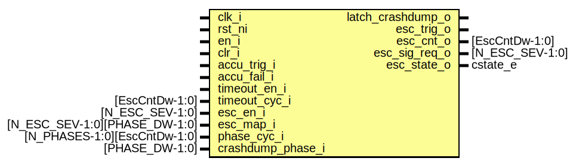

# Entity: alert_handler_esc_timer_fpv

## Diagram

## Description

Copyright lowRISC contributors.
 Licensed under the Apache License, Version 2.0, see LICENSE for details.
 SPDX-License-Identifier: Apache-2.0
 Testbench module for alert_handler_esc_timer.
 Intended to be used with a formal tool.
 
## Ports

| Port name     | Direction | Type                          | Description |
| ------------- | --------- | ----------------------------- | ----------- |
| clk_i         | input     |                               |             |
| rst_ni        | input     |                               |             |
| en_i          | input     |                               |             |
| clr_i         | input     |                               |             |
| accu_trig_i   | input     |                               |             |
| accu_fail_i   | input     |                               |             |
| timeout_en_i  | input     |                               |             |
| timeout_cyc_i | input     | [EscCntDw-1:0]                |             |
| esc_en_i      | input     | [N_ESC_SEV-1:0]               |             |
| esc_map_i     | input     | [N_ESC_SEV-1:0][PHASE_DW-1:0] |             |
| phase_cyc_i   | input     | [N_PHASES-1:0][EscCntDw-1:0]  |             |
| esc_trig_o    | output    |                               |             |
| esc_cnt_o     | output    | [EscCntDw-1:0]                |             |
| esc_sig_req_o | output    | [N_ESC_SEV-1:0]               |             |
| esc_state_o   | output    | cstate_e                      |             |
## Instantiations

- i_alert_handler_esc_timer: alert_handler_esc_timer
