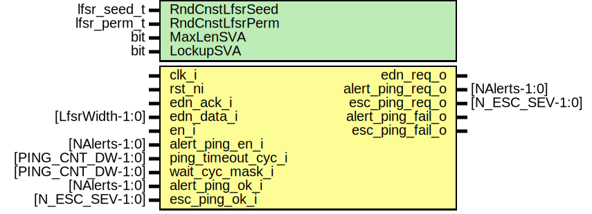

# Entity: alert_handler_ping_timer

## Diagram

## Description

Copyright lowRISC contributors.
 Licensed under the Apache License, Version 2.0, see LICENSE for details.
 SPDX-License-Identifier: Apache-2.0
 This module implements the ping mechanism. Once enabled, this module uses an
 LFSR-based PRNG to
 a) determine the next peripheral index to be pinged (can be an alert receiver or an
    escalation sender). it it is detected that this particular peripheral is disabled,
    another index will be drawn from the PRNG.
 b) determine the amount of pause cycles to wait before pinging the peripheral selected in a).
 Once the ping timer waited for the amount of pause cycles determined in b), it asserts
 the ping enable signal of the peripheral determined in a). If that peripheral does
 not respond within the ping timeout window, an internal alert will be raised.
 Further, if a spurious ping_ok signal is detected (i.e., a ping ok that has not been
 requested), the ping timer will also raise an internal alert.
 
## Generics

| Generic name    | Type        | Value                  | Description                                                                                                                            |
| --------------- | ----------- | ---------------------- | -------------------------------------------------------------------------------------------------------------------------------------- |
| RndCnstLfsrSeed | lfsr_seed_t | RndCnstLfsrSeedDefault | Compile time random constants, to be overriden by topgen.                                                                              |
| RndCnstLfsrPerm | lfsr_perm_t | RndCnstLfsrPermDefault |                                                                                                                                        |
| MaxLenSVA       | bit         | 1'b1                   | Enable this for DV, disable this for long LFSRs in FPV                                                                                 |
| LockupSVA       | bit         | 1'b1                   | Can be disabled in cases where entropy inputs are unused in order to not distort coverage (the SVA will be unreachable in such cases)  |
## Ports

| Port name          | Direction | Type              | Description                              |
| ------------------ | --------- | ----------------- | ---------------------------------------- |
| clk_i              | input     |                   |                                          |
| rst_ni             | input     |                   |                                          |
| edn_req_o          | output    |                   | request to EDN                           |
| edn_ack_i          | input     |                   | ack from EDN                             |
| edn_data_i         | input     | [LfsrWidth-1:0]   | from EDN                                 |
| en_i               | input     |                   | enable ping testing                      |
| alert_ping_en_i    | input     | [NAlerts-1:0]     | determines which alerts to ping          |
| ping_timeout_cyc_i | input     | [PING_CNT_DW-1:0] | timeout in cycles                        |
| wait_cyc_mask_i    | input     | [PING_CNT_DW-1:0] | mask to shorten the counters in DV / FPV |
| alert_ping_req_o   | output    | [NAlerts-1:0]     | request to alert receivers               |
| esc_ping_req_o     | output    | [N_ESC_SEV-1:0]   | enable to esc senders                    |
| alert_ping_ok_i    | input     | [NAlerts-1:0]     | response from alert receivers            |
| esc_ping_ok_i      | input     | [N_ESC_SEV-1:0]   | response from esc senders                |
| alert_ping_fail_o  | output    |                   | any of the alert receivers failed        |
| esc_ping_fail_o    | output    |                   | any of the esc senders failed            |
## Signals

| Name                | Type                         | Description                                                                                                                                                                                                                                                             |
| ------------------- | ---------------------------- | ----------------------------------------------------------------------------------------------------------------------------------------------------------------------------------------------------------------------------------------------------------------------- |
| reseed_en           | logic                        |                                                                                                                                                                                                                                                                         |
| reseed_timer_d      | logic [ReseedLfsrWidth-1:0]  |                                                                                                                                                                                                                                                                         |
| reseed_timer_q      | logic [ReseedLfsrWidth-1:0]  |                                                                                                                                                                                                                                                                         |
| lfsr_en             | logic                        |                                                                                                                                                                                                                                                                         |
| lfsr_en_unbuf       | logic                        |                                                                                                                                                                                                                                                                         |
| entropy_unbuf       | logic [LfsrWidth-1:0]        |                                                                                                                                                                                                                                                                         |
| lfsr_state          | logic [1:0][LfsrWidth-1:0]   |                                                                                                                                                                                                                                                                         |
| id_to_ping          | logic [IdDw-1:0]             |                                                                                                                                                                                                                                                                         |
| enable_mask         | logic [2**IdDw-1:0]          | align the enable mask with powers of two for the indexing operation below.                                                                                                                                                                                              |
| id_vld              | logic                        | check if the randomly drawn alert ID is actually valid and the alert is enabled                                                                                                                                                                                         |
| esc_cnt_en          | logic                        | In order to have enough margin, the escalation receiver timeout counters use a threshold that is 4x higher than the value calculated above. With N_ESC_SEV = 4, PING_CNT_DW = 16 and NUM_WAIT_COUNT = NUM_TIMEOUT_COUNT = 2 this amounts to a 22bit timeout threshold.  |
| esc_cnt_q           | logic [1:0][PING_CNT_DW-1:0] |                                                                                                                                                                                                                                                                         |
| cnt_q               | logic [1:0][PING_CNT_DW-1:0] |                                                                                                                                                                                                                                                                         |
| wait_cnt_load       | logic                        |                                                                                                                                                                                                                                                                         |
| timeout_cnt_load    | logic                        |                                                                                                                                                                                                                                                                         |
| timer_expired       | logic                        |                                                                                                                                                                                                                                                                         |
| alert_ping_en       | logic                        |                                                                                                                                                                                                                                                                         |
| esc_ping_en         | logic                        |                                                                                                                                                                                                                                                                         |
| spurious_alert_ping | logic                        |                                                                                                                                                                                                                                                                         |
| spurious_esc_ping   | logic                        |                                                                                                                                                                                                                                                                         |
| state_d             | state_e                      |                                                                                                                                                                                                                                                                         |
| state_q             | state_e                      |                                                                                                                                                                                                                                                                         |
| state_raw_q         | logic [StateWidth-1:0]       | This primitive is used to place a size-only constraint on the flops in order to prevent FSM state encoding optimizations.                                                                                                                                               |
## Constants

| Name                | Type         | Value                             | Description                                                                                                                                                                                                                                                                       |
| ------------------- | ------------ | --------------------------------- | --------------------------------------------------------------------------------------------------------------------------------------------------------------------------------------------------------------------------------------------------------------------------------- |
| IdDw                | int unsigned | $clog2(NAlerts)                   |                                                                                                                                                                                                                                                                                   |
| ReseedLfsrExtraBits | int unsigned | 3                                 | Entropy reseeding is triggered every time this counter expires. The expected wait time between pings is 2**(PING_CNT_DW-1) on average. We do not need to reseed the LFSR very often, and the constant below is chosen such that on average the LFSR is reseeded every 16th ping.  |
| ReseedLfsrWidth     | int unsigned | PING_CNT_DW + ReseedLfsrExtraBits |                                                                                                                                                                                                                                                                                   |
| StateWidth          | int          | 9                                 |                                                                                                                                                                                                                                                                                   |
## Types

| Name    | Type                                                                                                                                                                                                                                                                                                                                                                                                                                                     | Description |
| ------- | -------------------------------------------------------------------------------------------------------------------------------------------------------------------------------------------------------------------------------------------------------------------------------------------------------------------------------------------------------------------------------------------------------------------------------------------------------- | ----------- |
| state_e | enum logic [StateWidth-1:0] {      InitSt      = 9'b000101100,      AlertWaitSt = 9'b011001011,      AlertPingSt = 9'b110000000,      EscWaitSt   = 9'b101110001,      EscPingSt   = 9'b011110110,      FsmErrorSt  = 9'b100011111   } |             |
## Processes
- p_regs: ( @(posedge clk_i or negedge rst_ni) )
- p_fsm: (  )
## Instantiations

- u_prim_buf_spurious_alert_ping: prim_buf
**Description**
under normal operation, these signals should never be asserted.
we place hand instantiated buffers here such that these signals are not
optimized away during synthesis (these buffers will receive a keep or size_only
attribute in our Vivado and DC synthesis flows).

- u_prim_buf_spurious_esc_ping: prim_buf
- u_state_regs: prim_flop
