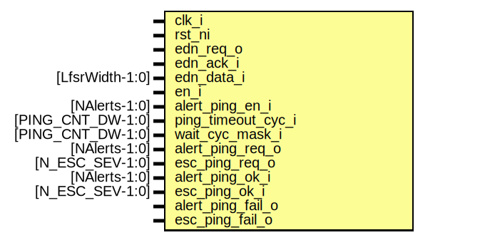

# Entity: alert_handler_ping_timer_assert_fpv

- **File**: alert_handler_ping_timer_assert_fpv.sv
## Diagram

## Description

 Copyright lowRISC contributors.
 Licensed under the Apache License, Version 2.0, see LICENSE for details.
 SPDX-License-Identifier: Apache-2.0

 Assertions for ping timer in alert handler. Intended to use with
 a formal tool.

## Ports

| Port name          | Direction | Type              | Description |
| ------------------ | --------- | ----------------- | ----------- |
| clk_i              | input     |                   |             |
| rst_ni             | input     |                   |             |
| edn_req_o          | input     |                   |             |
| edn_ack_i          | input     |                   |             |
| edn_data_i         | input     | [LfsrWidth-1:0]   |             |
| en_i               | input     |                   |             |
| alert_ping_en_i    | input     | [NAlerts-1:0]     |             |
| ping_timeout_cyc_i | input     | [PING_CNT_DW-1:0] |             |
| wait_cyc_mask_i    | input     | [PING_CNT_DW-1:0] |             |
| alert_ping_req_o   | input     | [NAlerts-1:0]     |             |
| esc_ping_req_o     | input     | [N_ESC_SEV-1:0]   |             |
| alert_ping_ok_i    | input     | [NAlerts-1:0]     |             |
| esc_ping_ok_i      | input     | [N_ESC_SEV-1:0]   |             |
| alert_ping_fail_o  | input     |                   |             |
| esc_ping_fail_o    | input     |                   |             |
## Signals

| Name              | Type                          | Description                                               |
| ----------------- | ----------------------------- | --------------------------------------------------------- |
| ping_en_vector    | logic [PingEnDw-1:0]          |                                                           |
| ping_en_mask      | logic [PingEnDw-1:0]          |                                                           |
| ping_ok_vector    | logic [PingEnDw-1:0]          |                                                           |
| ping_en_sel       | logic [$clog2(PingEnDw)-1:0]  |  symbolic variables. we want to assess all valid indices  |
| esc_idx           | logic [$clog2(N_ESC_SEV)-1:0] |                                                           |
| alert_ping_fail_o | esc_ping_fail_o               |                                                           |
## Constants

| Name             | Type         | Value                          | Description                                      |
| ---------------- | ------------ | ------------------------------ | ------------------------------------------------ |
| PingEnDw         | int unsigned | N_ESC_SEV + NAlerts            |                                                  |
| MaxWaitCntDw     | int          | 3                              | ///////////////  Assumptions // ///////////////  |
| MarginFactor     | int          | 2                              |                                                  |
| NumWaitCounts    | int          | 2                              |                                                  |
| NumTimeoutCounts | int          | 2                              |                                                  |
| PingPeriodBound  | int          | $rose(esc_ping_req_o[esc_idx]) | margin to apply                                  |
