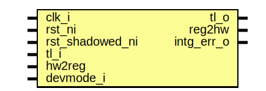

# Entity: alert_handler_reg_top

- **File**: alert_handler_reg_top.sv
## Diagram

## Description

 Copyright lowRISC contributors.
 Licensed under the Apache License, Version 2.0, see LICENSE for details.
 SPDX-License-Identifier: Apache-2.0

 Register Top module auto-generated by `reggen`

## Ports

| Port name       | Direction | Type | Description                                              |
| --------------- | --------- | ---- | -------------------------------------------------------- |
| clk_i           | input     |      |                                                          |
| rst_ni          | input     |      |                                                          |
| rst_shadowed_ni | input     |      |                                                          |
| tl_i            | input     |      |                                                          |
| tl_o            | output    |      |                                                          |
| reg2hw          | output    |      | Write                                                    |
| hw2reg          | input     |      | Read                                                     |
| intg_err_o      | output    |      |  Integrity check errors                                  |
| devmode_i       | input     |      | If 1, explicit error return for unmapped register access |
## Signals

| Name                                 | Type               | Description                                                                                                                  |
| ------------------------------------ | ------------------ | ---------------------------------------------------------------------------------------------------------------------------- |
| reg_we                               | logic              |  register signals                                                                                                            |
| reg_re                               | logic              |                                                                                                                              |
| reg_addr                             | logic [AW-1:0]     |                                                                                                                              |
| reg_wdata                            | logic [DW-1:0]     |                                                                                                                              |
| reg_be                               | logic [DBW-1:0]    |                                                                                                                              |
| reg_rdata                            | logic [DW-1:0]     |                                                                                                                              |
| reg_error                            | logic              |                                                                                                                              |
| addrmiss                             | logic              |                                                                                                                              |
| wr_err                               | logic              |                                                                                                                              |
| reg_rdata_next                       | logic [DW-1:0]     |                                                                                                                              |
| reg_busy                             | logic              |                                                                                                                              |
| tl_reg_h2d                           | tlul_pkg::tl_h2d_t |                                                                                                                              |
| tl_reg_d2h                           | tlul_pkg::tl_d2h_t |                                                                                                                              |
| intg_err                             | logic              |  incoming payload check                                                                                                      |
| intg_err_q                           | logic              |                                                                                                                              |
| tl_o_pre                             | tlul_pkg::tl_d2h_t |  outgoing integrity generation                                                                                               |
| intr_state_we                        | logic              |  Define SW related signals  Format: <reg>_<field>_{wd|we|qs}         or <reg>_{wd|we|qs} if field == 1 or 0                  |
| intr_state_classa_qs                 | logic              |                                                                                                                              |
| intr_state_classa_wd                 | logic              |                                                                                                                              |
| intr_state_classb_qs                 | logic              |                                                                                                                              |
| intr_state_classb_wd                 | logic              |                                                                                                                              |
| intr_state_classc_qs                 | logic              |                                                                                                                              |
| intr_state_classc_wd                 | logic              |                                                                                                                              |
| intr_state_classd_qs                 | logic              |                                                                                                                              |
| intr_state_classd_wd                 | logic              |                                                                                                                              |
| intr_enable_we                       | logic              |                                                                                                                              |
| intr_enable_classa_qs                | logic              |                                                                                                                              |
| intr_enable_classa_wd                | logic              |                                                                                                                              |
| intr_enable_classb_qs                | logic              |                                                                                                                              |
| intr_enable_classb_wd                | logic              |                                                                                                                              |
| intr_enable_classc_qs                | logic              |                                                                                                                              |
| intr_enable_classc_wd                | logic              |                                                                                                                              |
| intr_enable_classd_qs                | logic              |                                                                                                                              |
| intr_enable_classd_wd                | logic              |                                                                                                                              |
| intr_test_we                         | logic              |                                                                                                                              |
| intr_test_classa_wd                  | logic              |                                                                                                                              |
| intr_test_classb_wd                  | logic              |                                                                                                                              |
| intr_test_classc_wd                  | logic              |                                                                                                                              |
| intr_test_classd_wd                  | logic              |                                                                                                                              |
| ping_timer_regwen_we                 | logic              |                                                                                                                              |
| ping_timer_regwen_qs                 | logic              |                                                                                                                              |
| ping_timer_regwen_wd                 | logic              |                                                                                                                              |
| ping_timeout_cyc_shadowed_re         | logic              |                                                                                                                              |
| ping_timeout_cyc_shadowed_we         | logic              |                                                                                                                              |
| ping_timeout_cyc_shadowed_qs         | logic [15:0]       |                                                                                                                              |
| ping_timeout_cyc_shadowed_wd         | logic [15:0]       |                                                                                                                              |
| ping_timer_en_shadowed_re            | logic              |                                                                                                                              |
| ping_timer_en_shadowed_we            | logic              |                                                                                                                              |
| ping_timer_en_shadowed_qs            | logic              |                                                                                                                              |
| ping_timer_en_shadowed_wd            | logic              |                                                                                                                              |
| alert_regwen_0_we                    | logic              |                                                                                                                              |
| alert_regwen_0_qs                    | logic              |                                                                                                                              |
| alert_regwen_0_wd                    | logic              |                                                                                                                              |
| alert_regwen_1_we                    | logic              |                                                                                                                              |
| alert_regwen_1_qs                    | logic              |                                                                                                                              |
| alert_regwen_1_wd                    | logic              |                                                                                                                              |
| alert_regwen_2_we                    | logic              |                                                                                                                              |
| alert_regwen_2_qs                    | logic              |                                                                                                                              |
| alert_regwen_2_wd                    | logic              |                                                                                                                              |
| alert_regwen_3_we                    | logic              |                                                                                                                              |
| alert_regwen_3_qs                    | logic              |                                                                                                                              |
| alert_regwen_3_wd                    | logic              |                                                                                                                              |
| alert_en_shadowed_0_re               | logic              |                                                                                                                              |
| alert_en_shadowed_0_we               | logic              |                                                                                                                              |
| alert_en_shadowed_0_qs               | logic              |                                                                                                                              |
| alert_en_shadowed_0_wd               | logic              |                                                                                                                              |
| alert_en_shadowed_1_re               | logic              |                                                                                                                              |
| alert_en_shadowed_1_we               | logic              |                                                                                                                              |
| alert_en_shadowed_1_qs               | logic              |                                                                                                                              |
| alert_en_shadowed_1_wd               | logic              |                                                                                                                              |
| alert_en_shadowed_2_re               | logic              |                                                                                                                              |
| alert_en_shadowed_2_we               | logic              |                                                                                                                              |
| alert_en_shadowed_2_qs               | logic              |                                                                                                                              |
| alert_en_shadowed_2_wd               | logic              |                                                                                                                              |
| alert_en_shadowed_3_re               | logic              |                                                                                                                              |
| alert_en_shadowed_3_we               | logic              |                                                                                                                              |
| alert_en_shadowed_3_qs               | logic              |                                                                                                                              |
| alert_en_shadowed_3_wd               | logic              |                                                                                                                              |
| alert_class_shadowed_0_re            | logic              |                                                                                                                              |
| alert_class_shadowed_0_we            | logic              |                                                                                                                              |
| alert_class_shadowed_0_qs            | logic [1:0]        |                                                                                                                              |
| alert_class_shadowed_0_wd            | logic [1:0]        |                                                                                                                              |
| alert_class_shadowed_1_re            | logic              |                                                                                                                              |
| alert_class_shadowed_1_we            | logic              |                                                                                                                              |
| alert_class_shadowed_1_qs            | logic [1:0]        |                                                                                                                              |
| alert_class_shadowed_1_wd            | logic [1:0]        |                                                                                                                              |
| alert_class_shadowed_2_re            | logic              |                                                                                                                              |
| alert_class_shadowed_2_we            | logic              |                                                                                                                              |
| alert_class_shadowed_2_qs            | logic [1:0]        |                                                                                                                              |
| alert_class_shadowed_2_wd            | logic [1:0]        |                                                                                                                              |
| alert_class_shadowed_3_re            | logic              |                                                                                                                              |
| alert_class_shadowed_3_we            | logic              |                                                                                                                              |
| alert_class_shadowed_3_qs            | logic [1:0]        |                                                                                                                              |
| alert_class_shadowed_3_wd            | logic [1:0]        |                                                                                                                              |
| alert_cause_0_we                     | logic              |                                                                                                                              |
| alert_cause_0_qs                     | logic              |                                                                                                                              |
| alert_cause_0_wd                     | logic              |                                                                                                                              |
| alert_cause_1_we                     | logic              |                                                                                                                              |
| alert_cause_1_qs                     | logic              |                                                                                                                              |
| alert_cause_1_wd                     | logic              |                                                                                                                              |
| alert_cause_2_we                     | logic              |                                                                                                                              |
| alert_cause_2_qs                     | logic              |                                                                                                                              |
| alert_cause_2_wd                     | logic              |                                                                                                                              |
| alert_cause_3_we                     | logic              |                                                                                                                              |
| alert_cause_3_qs                     | logic              |                                                                                                                              |
| alert_cause_3_wd                     | logic              |                                                                                                                              |
| loc_alert_regwen_0_we                | logic              |                                                                                                                              |
| loc_alert_regwen_0_qs                | logic              |                                                                                                                              |
| loc_alert_regwen_0_wd                | logic              |                                                                                                                              |
| loc_alert_regwen_1_we                | logic              |                                                                                                                              |
| loc_alert_regwen_1_qs                | logic              |                                                                                                                              |
| loc_alert_regwen_1_wd                | logic              |                                                                                                                              |
| loc_alert_regwen_2_we                | logic              |                                                                                                                              |
| loc_alert_regwen_2_qs                | logic              |                                                                                                                              |
| loc_alert_regwen_2_wd                | logic              |                                                                                                                              |
| loc_alert_regwen_3_we                | logic              |                                                                                                                              |
| loc_alert_regwen_3_qs                | logic              |                                                                                                                              |
| loc_alert_regwen_3_wd                | logic              |                                                                                                                              |
| loc_alert_regwen_4_we                | logic              |                                                                                                                              |
| loc_alert_regwen_4_qs                | logic              |                                                                                                                              |
| loc_alert_regwen_4_wd                | logic              |                                                                                                                              |
| loc_alert_regwen_5_we                | logic              |                                                                                                                              |
| loc_alert_regwen_5_qs                | logic              |                                                                                                                              |
| loc_alert_regwen_5_wd                | logic              |                                                                                                                              |
| loc_alert_regwen_6_we                | logic              |                                                                                                                              |
| loc_alert_regwen_6_qs                | logic              |                                                                                                                              |
| loc_alert_regwen_6_wd                | logic              |                                                                                                                              |
| loc_alert_en_shadowed_0_re           | logic              |                                                                                                                              |
| loc_alert_en_shadowed_0_we           | logic              |                                                                                                                              |
| loc_alert_en_shadowed_0_qs           | logic              |                                                                                                                              |
| loc_alert_en_shadowed_0_wd           | logic              |                                                                                                                              |
| loc_alert_en_shadowed_1_re           | logic              |                                                                                                                              |
| loc_alert_en_shadowed_1_we           | logic              |                                                                                                                              |
| loc_alert_en_shadowed_1_qs           | logic              |                                                                                                                              |
| loc_alert_en_shadowed_1_wd           | logic              |                                                                                                                              |
| loc_alert_en_shadowed_2_re           | logic              |                                                                                                                              |
| loc_alert_en_shadowed_2_we           | logic              |                                                                                                                              |
| loc_alert_en_shadowed_2_qs           | logic              |                                                                                                                              |
| loc_alert_en_shadowed_2_wd           | logic              |                                                                                                                              |
| loc_alert_en_shadowed_3_re           | logic              |                                                                                                                              |
| loc_alert_en_shadowed_3_we           | logic              |                                                                                                                              |
| loc_alert_en_shadowed_3_qs           | logic              |                                                                                                                              |
| loc_alert_en_shadowed_3_wd           | logic              |                                                                                                                              |
| loc_alert_en_shadowed_4_re           | logic              |                                                                                                                              |
| loc_alert_en_shadowed_4_we           | logic              |                                                                                                                              |
| loc_alert_en_shadowed_4_qs           | logic              |                                                                                                                              |
| loc_alert_en_shadowed_4_wd           | logic              |                                                                                                                              |
| loc_alert_en_shadowed_5_re           | logic              |                                                                                                                              |
| loc_alert_en_shadowed_5_we           | logic              |                                                                                                                              |
| loc_alert_en_shadowed_5_qs           | logic              |                                                                                                                              |
| loc_alert_en_shadowed_5_wd           | logic              |                                                                                                                              |
| loc_alert_en_shadowed_6_re           | logic              |                                                                                                                              |
| loc_alert_en_shadowed_6_we           | logic              |                                                                                                                              |
| loc_alert_en_shadowed_6_qs           | logic              |                                                                                                                              |
| loc_alert_en_shadowed_6_wd           | logic              |                                                                                                                              |
| loc_alert_class_shadowed_0_re        | logic              |                                                                                                                              |
| loc_alert_class_shadowed_0_we        | logic              |                                                                                                                              |
| loc_alert_class_shadowed_0_qs        | logic [1:0]        |                                                                                                                              |
| loc_alert_class_shadowed_0_wd        | logic [1:0]        |                                                                                                                              |
| loc_alert_class_shadowed_1_re        | logic              |                                                                                                                              |
| loc_alert_class_shadowed_1_we        | logic              |                                                                                                                              |
| loc_alert_class_shadowed_1_qs        | logic [1:0]        |                                                                                                                              |
| loc_alert_class_shadowed_1_wd        | logic [1:0]        |                                                                                                                              |
| loc_alert_class_shadowed_2_re        | logic              |                                                                                                                              |
| loc_alert_class_shadowed_2_we        | logic              |                                                                                                                              |
| loc_alert_class_shadowed_2_qs        | logic [1:0]        |                                                                                                                              |
| loc_alert_class_shadowed_2_wd        | logic [1:0]        |                                                                                                                              |
| loc_alert_class_shadowed_3_re        | logic              |                                                                                                                              |
| loc_alert_class_shadowed_3_we        | logic              |                                                                                                                              |
| loc_alert_class_shadowed_3_qs        | logic [1:0]        |                                                                                                                              |
| loc_alert_class_shadowed_3_wd        | logic [1:0]        |                                                                                                                              |
| loc_alert_class_shadowed_4_re        | logic              |                                                                                                                              |
| loc_alert_class_shadowed_4_we        | logic              |                                                                                                                              |
| loc_alert_class_shadowed_4_qs        | logic [1:0]        |                                                                                                                              |
| loc_alert_class_shadowed_4_wd        | logic [1:0]        |                                                                                                                              |
| loc_alert_class_shadowed_5_re        | logic              |                                                                                                                              |
| loc_alert_class_shadowed_5_we        | logic              |                                                                                                                              |
| loc_alert_class_shadowed_5_qs        | logic [1:0]        |                                                                                                                              |
| loc_alert_class_shadowed_5_wd        | logic [1:0]        |                                                                                                                              |
| loc_alert_class_shadowed_6_re        | logic              |                                                                                                                              |
| loc_alert_class_shadowed_6_we        | logic              |                                                                                                                              |
| loc_alert_class_shadowed_6_qs        | logic [1:0]        |                                                                                                                              |
| loc_alert_class_shadowed_6_wd        | logic [1:0]        |                                                                                                                              |
| loc_alert_cause_0_we                 | logic              |                                                                                                                              |
| loc_alert_cause_0_qs                 | logic              |                                                                                                                              |
| loc_alert_cause_0_wd                 | logic              |                                                                                                                              |
| loc_alert_cause_1_we                 | logic              |                                                                                                                              |
| loc_alert_cause_1_qs                 | logic              |                                                                                                                              |
| loc_alert_cause_1_wd                 | logic              |                                                                                                                              |
| loc_alert_cause_2_we                 | logic              |                                                                                                                              |
| loc_alert_cause_2_qs                 | logic              |                                                                                                                              |
| loc_alert_cause_2_wd                 | logic              |                                                                                                                              |
| loc_alert_cause_3_we                 | logic              |                                                                                                                              |
| loc_alert_cause_3_qs                 | logic              |                                                                                                                              |
| loc_alert_cause_3_wd                 | logic              |                                                                                                                              |
| loc_alert_cause_4_we                 | logic              |                                                                                                                              |
| loc_alert_cause_4_qs                 | logic              |                                                                                                                              |
| loc_alert_cause_4_wd                 | logic              |                                                                                                                              |
| loc_alert_cause_5_we                 | logic              |                                                                                                                              |
| loc_alert_cause_5_qs                 | logic              |                                                                                                                              |
| loc_alert_cause_5_wd                 | logic              |                                                                                                                              |
| loc_alert_cause_6_we                 | logic              |                                                                                                                              |
| loc_alert_cause_6_qs                 | logic              |                                                                                                                              |
| loc_alert_cause_6_wd                 | logic              |                                                                                                                              |
| classa_regwen_we                     | logic              |                                                                                                                              |
| classa_regwen_qs                     | logic              |                                                                                                                              |
| classa_regwen_wd                     | logic              |                                                                                                                              |
| classa_ctrl_shadowed_re              | logic              |                                                                                                                              |
| classa_ctrl_shadowed_we              | logic              |                                                                                                                              |
| classa_ctrl_shadowed_en_qs           | logic              |                                                                                                                              |
| classa_ctrl_shadowed_en_wd           | logic              |                                                                                                                              |
| classa_ctrl_shadowed_lock_qs         | logic              |                                                                                                                              |
| classa_ctrl_shadowed_lock_wd         | logic              |                                                                                                                              |
| classa_ctrl_shadowed_en_e0_qs        | logic              |                                                                                                                              |
| classa_ctrl_shadowed_en_e0_wd        | logic              |                                                                                                                              |
| classa_ctrl_shadowed_en_e1_qs        | logic              |                                                                                                                              |
| classa_ctrl_shadowed_en_e1_wd        | logic              |                                                                                                                              |
| classa_ctrl_shadowed_en_e2_qs        | logic              |                                                                                                                              |
| classa_ctrl_shadowed_en_e2_wd        | logic              |                                                                                                                              |
| classa_ctrl_shadowed_en_e3_qs        | logic              |                                                                                                                              |
| classa_ctrl_shadowed_en_e3_wd        | logic              |                                                                                                                              |
| classa_ctrl_shadowed_map_e0_qs       | logic [1:0]        |                                                                                                                              |
| classa_ctrl_shadowed_map_e0_wd       | logic [1:0]        |                                                                                                                              |
| classa_ctrl_shadowed_map_e1_qs       | logic [1:0]        |                                                                                                                              |
| classa_ctrl_shadowed_map_e1_wd       | logic [1:0]        |                                                                                                                              |
| classa_ctrl_shadowed_map_e2_qs       | logic [1:0]        |                                                                                                                              |
| classa_ctrl_shadowed_map_e2_wd       | logic [1:0]        |                                                                                                                              |
| classa_ctrl_shadowed_map_e3_qs       | logic [1:0]        |                                                                                                                              |
| classa_ctrl_shadowed_map_e3_wd       | logic [1:0]        |                                                                                                                              |
| classa_clr_regwen_we                 | logic              |                                                                                                                              |
| classa_clr_regwen_qs                 | logic              |                                                                                                                              |
| classa_clr_regwen_wd                 | logic              |                                                                                                                              |
| classa_clr_shadowed_re               | logic              |                                                                                                                              |
| classa_clr_shadowed_we               | logic              |                                                                                                                              |
| classa_clr_shadowed_qs               | logic              |                                                                                                                              |
| classa_clr_shadowed_wd               | logic              |                                                                                                                              |
| classa_accum_cnt_re                  | logic              |                                                                                                                              |
| classa_accum_cnt_qs                  | logic [15:0]       |                                                                                                                              |
| classa_accum_thresh_shadowed_re      | logic              |                                                                                                                              |
| classa_accum_thresh_shadowed_we      | logic              |                                                                                                                              |
| classa_accum_thresh_shadowed_qs      | logic [15:0]       |                                                                                                                              |
| classa_accum_thresh_shadowed_wd      | logic [15:0]       |                                                                                                                              |
| classa_timeout_cyc_shadowed_re       | logic              |                                                                                                                              |
| classa_timeout_cyc_shadowed_we       | logic              |                                                                                                                              |
| classa_timeout_cyc_shadowed_qs       | logic [31:0]       |                                                                                                                              |
| classa_timeout_cyc_shadowed_wd       | logic [31:0]       |                                                                                                                              |
| classa_crashdump_trigger_shadowed_re | logic              |                                                                                                                              |
| classa_crashdump_trigger_shadowed_we | logic              |                                                                                                                              |
| classa_crashdump_trigger_shadowed_qs | logic [1:0]        |                                                                                                                              |
| classa_crashdump_trigger_shadowed_wd | logic [1:0]        |                                                                                                                              |
| classa_phase0_cyc_shadowed_re        | logic              |                                                                                                                              |
| classa_phase0_cyc_shadowed_we        | logic              |                                                                                                                              |
| classa_phase0_cyc_shadowed_qs        | logic [31:0]       |                                                                                                                              |
| classa_phase0_cyc_shadowed_wd        | logic [31:0]       |                                                                                                                              |
| classa_phase1_cyc_shadowed_re        | logic              |                                                                                                                              |
| classa_phase1_cyc_shadowed_we        | logic              |                                                                                                                              |
| classa_phase1_cyc_shadowed_qs        | logic [31:0]       |                                                                                                                              |
| classa_phase1_cyc_shadowed_wd        | logic [31:0]       |                                                                                                                              |
| classa_phase2_cyc_shadowed_re        | logic              |                                                                                                                              |
| classa_phase2_cyc_shadowed_we        | logic              |                                                                                                                              |
| classa_phase2_cyc_shadowed_qs        | logic [31:0]       |                                                                                                                              |
| classa_phase2_cyc_shadowed_wd        | logic [31:0]       |                                                                                                                              |
| classa_phase3_cyc_shadowed_re        | logic              |                                                                                                                              |
| classa_phase3_cyc_shadowed_we        | logic              |                                                                                                                              |
| classa_phase3_cyc_shadowed_qs        | logic [31:0]       |                                                                                                                              |
| classa_phase3_cyc_shadowed_wd        | logic [31:0]       |                                                                                                                              |
| classa_esc_cnt_re                    | logic              |                                                                                                                              |
| classa_esc_cnt_qs                    | logic [31:0]       |                                                                                                                              |
| classa_state_re                      | logic              |                                                                                                                              |
| classa_state_qs                      | logic [2:0]        |                                                                                                                              |
| classb_regwen_we                     | logic              |                                                                                                                              |
| classb_regwen_qs                     | logic              |                                                                                                                              |
| classb_regwen_wd                     | logic              |                                                                                                                              |
| classb_ctrl_shadowed_re              | logic              |                                                                                                                              |
| classb_ctrl_shadowed_we              | logic              |                                                                                                                              |
| classb_ctrl_shadowed_en_qs           | logic              |                                                                                                                              |
| classb_ctrl_shadowed_en_wd           | logic              |                                                                                                                              |
| classb_ctrl_shadowed_lock_qs         | logic              |                                                                                                                              |
| classb_ctrl_shadowed_lock_wd         | logic              |                                                                                                                              |
| classb_ctrl_shadowed_en_e0_qs        | logic              |                                                                                                                              |
| classb_ctrl_shadowed_en_e0_wd        | logic              |                                                                                                                              |
| classb_ctrl_shadowed_en_e1_qs        | logic              |                                                                                                                              |
| classb_ctrl_shadowed_en_e1_wd        | logic              |                                                                                                                              |
| classb_ctrl_shadowed_en_e2_qs        | logic              |                                                                                                                              |
| classb_ctrl_shadowed_en_e2_wd        | logic              |                                                                                                                              |
| classb_ctrl_shadowed_en_e3_qs        | logic              |                                                                                                                              |
| classb_ctrl_shadowed_en_e3_wd        | logic              |                                                                                                                              |
| classb_ctrl_shadowed_map_e0_qs       | logic [1:0]        |                                                                                                                              |
| classb_ctrl_shadowed_map_e0_wd       | logic [1:0]        |                                                                                                                              |
| classb_ctrl_shadowed_map_e1_qs       | logic [1:0]        |                                                                                                                              |
| classb_ctrl_shadowed_map_e1_wd       | logic [1:0]        |                                                                                                                              |
| classb_ctrl_shadowed_map_e2_qs       | logic [1:0]        |                                                                                                                              |
| classb_ctrl_shadowed_map_e2_wd       | logic [1:0]        |                                                                                                                              |
| classb_ctrl_shadowed_map_e3_qs       | logic [1:0]        |                                                                                                                              |
| classb_ctrl_shadowed_map_e3_wd       | logic [1:0]        |                                                                                                                              |
| classb_clr_regwen_we                 | logic              |                                                                                                                              |
| classb_clr_regwen_qs                 | logic              |                                                                                                                              |
| classb_clr_regwen_wd                 | logic              |                                                                                                                              |
| classb_clr_shadowed_re               | logic              |                                                                                                                              |
| classb_clr_shadowed_we               | logic              |                                                                                                                              |
| classb_clr_shadowed_qs               | logic              |                                                                                                                              |
| classb_clr_shadowed_wd               | logic              |                                                                                                                              |
| classb_accum_cnt_re                  | logic              |                                                                                                                              |
| classb_accum_cnt_qs                  | logic [15:0]       |                                                                                                                              |
| classb_accum_thresh_shadowed_re      | logic              |                                                                                                                              |
| classb_accum_thresh_shadowed_we      | logic              |                                                                                                                              |
| classb_accum_thresh_shadowed_qs      | logic [15:0]       |                                                                                                                              |
| classb_accum_thresh_shadowed_wd      | logic [15:0]       |                                                                                                                              |
| classb_timeout_cyc_shadowed_re       | logic              |                                                                                                                              |
| classb_timeout_cyc_shadowed_we       | logic              |                                                                                                                              |
| classb_timeout_cyc_shadowed_qs       | logic [31:0]       |                                                                                                                              |
| classb_timeout_cyc_shadowed_wd       | logic [31:0]       |                                                                                                                              |
| classb_crashdump_trigger_shadowed_re | logic              |                                                                                                                              |
| classb_crashdump_trigger_shadowed_we | logic              |                                                                                                                              |
| classb_crashdump_trigger_shadowed_qs | logic [1:0]        |                                                                                                                              |
| classb_crashdump_trigger_shadowed_wd | logic [1:0]        |                                                                                                                              |
| classb_phase0_cyc_shadowed_re        | logic              |                                                                                                                              |
| classb_phase0_cyc_shadowed_we        | logic              |                                                                                                                              |
| classb_phase0_cyc_shadowed_qs        | logic [31:0]       |                                                                                                                              |
| classb_phase0_cyc_shadowed_wd        | logic [31:0]       |                                                                                                                              |
| classb_phase1_cyc_shadowed_re        | logic              |                                                                                                                              |
| classb_phase1_cyc_shadowed_we        | logic              |                                                                                                                              |
| classb_phase1_cyc_shadowed_qs        | logic [31:0]       |                                                                                                                              |
| classb_phase1_cyc_shadowed_wd        | logic [31:0]       |                                                                                                                              |
| classb_phase2_cyc_shadowed_re        | logic              |                                                                                                                              |
| classb_phase2_cyc_shadowed_we        | logic              |                                                                                                                              |
| classb_phase2_cyc_shadowed_qs        | logic [31:0]       |                                                                                                                              |
| classb_phase2_cyc_shadowed_wd        | logic [31:0]       |                                                                                                                              |
| classb_phase3_cyc_shadowed_re        | logic              |                                                                                                                              |
| classb_phase3_cyc_shadowed_we        | logic              |                                                                                                                              |
| classb_phase3_cyc_shadowed_qs        | logic [31:0]       |                                                                                                                              |
| classb_phase3_cyc_shadowed_wd        | logic [31:0]       |                                                                                                                              |
| classb_esc_cnt_re                    | logic              |                                                                                                                              |
| classb_esc_cnt_qs                    | logic [31:0]       |                                                                                                                              |
| classb_state_re                      | logic              |                                                                                                                              |
| classb_state_qs                      | logic [2:0]        |                                                                                                                              |
| classc_regwen_we                     | logic              |                                                                                                                              |
| classc_regwen_qs                     | logic              |                                                                                                                              |
| classc_regwen_wd                     | logic              |                                                                                                                              |
| classc_ctrl_shadowed_re              | logic              |                                                                                                                              |
| classc_ctrl_shadowed_we              | logic              |                                                                                                                              |
| classc_ctrl_shadowed_en_qs           | logic              |                                                                                                                              |
| classc_ctrl_shadowed_en_wd           | logic              |                                                                                                                              |
| classc_ctrl_shadowed_lock_qs         | logic              |                                                                                                                              |
| classc_ctrl_shadowed_lock_wd         | logic              |                                                                                                                              |
| classc_ctrl_shadowed_en_e0_qs        | logic              |                                                                                                                              |
| classc_ctrl_shadowed_en_e0_wd        | logic              |                                                                                                                              |
| classc_ctrl_shadowed_en_e1_qs        | logic              |                                                                                                                              |
| classc_ctrl_shadowed_en_e1_wd        | logic              |                                                                                                                              |
| classc_ctrl_shadowed_en_e2_qs        | logic              |                                                                                                                              |
| classc_ctrl_shadowed_en_e2_wd        | logic              |                                                                                                                              |
| classc_ctrl_shadowed_en_e3_qs        | logic              |                                                                                                                              |
| classc_ctrl_shadowed_en_e3_wd        | logic              |                                                                                                                              |
| classc_ctrl_shadowed_map_e0_qs       | logic [1:0]        |                                                                                                                              |
| classc_ctrl_shadowed_map_e0_wd       | logic [1:0]        |                                                                                                                              |
| classc_ctrl_shadowed_map_e1_qs       | logic [1:0]        |                                                                                                                              |
| classc_ctrl_shadowed_map_e1_wd       | logic [1:0]        |                                                                                                                              |
| classc_ctrl_shadowed_map_e2_qs       | logic [1:0]        |                                                                                                                              |
| classc_ctrl_shadowed_map_e2_wd       | logic [1:0]        |                                                                                                                              |
| classc_ctrl_shadowed_map_e3_qs       | logic [1:0]        |                                                                                                                              |
| classc_ctrl_shadowed_map_e3_wd       | logic [1:0]        |                                                                                                                              |
| classc_clr_regwen_we                 | logic              |                                                                                                                              |
| classc_clr_regwen_qs                 | logic              |                                                                                                                              |
| classc_clr_regwen_wd                 | logic              |                                                                                                                              |
| classc_clr_shadowed_re               | logic              |                                                                                                                              |
| classc_clr_shadowed_we               | logic              |                                                                                                                              |
| classc_clr_shadowed_qs               | logic              |                                                                                                                              |
| classc_clr_shadowed_wd               | logic              |                                                                                                                              |
| classc_accum_cnt_re                  | logic              |                                                                                                                              |
| classc_accum_cnt_qs                  | logic [15:0]       |                                                                                                                              |
| classc_accum_thresh_shadowed_re      | logic              |                                                                                                                              |
| classc_accum_thresh_shadowed_we      | logic              |                                                                                                                              |
| classc_accum_thresh_shadowed_qs      | logic [15:0]       |                                                                                                                              |
| classc_accum_thresh_shadowed_wd      | logic [15:0]       |                                                                                                                              |
| classc_timeout_cyc_shadowed_re       | logic              |                                                                                                                              |
| classc_timeout_cyc_shadowed_we       | logic              |                                                                                                                              |
| classc_timeout_cyc_shadowed_qs       | logic [31:0]       |                                                                                                                              |
| classc_timeout_cyc_shadowed_wd       | logic [31:0]       |                                                                                                                              |
| classc_crashdump_trigger_shadowed_re | logic              |                                                                                                                              |
| classc_crashdump_trigger_shadowed_we | logic              |                                                                                                                              |
| classc_crashdump_trigger_shadowed_qs | logic [1:0]        |                                                                                                                              |
| classc_crashdump_trigger_shadowed_wd | logic [1:0]        |                                                                                                                              |
| classc_phase0_cyc_shadowed_re        | logic              |                                                                                                                              |
| classc_phase0_cyc_shadowed_we        | logic              |                                                                                                                              |
| classc_phase0_cyc_shadowed_qs        | logic [31:0]       |                                                                                                                              |
| classc_phase0_cyc_shadowed_wd        | logic [31:0]       |                                                                                                                              |
| classc_phase1_cyc_shadowed_re        | logic              |                                                                                                                              |
| classc_phase1_cyc_shadowed_we        | logic              |                                                                                                                              |
| classc_phase1_cyc_shadowed_qs        | logic [31:0]       |                                                                                                                              |
| classc_phase1_cyc_shadowed_wd        | logic [31:0]       |                                                                                                                              |
| classc_phase2_cyc_shadowed_re        | logic              |                                                                                                                              |
| classc_phase2_cyc_shadowed_we        | logic              |                                                                                                                              |
| classc_phase2_cyc_shadowed_qs        | logic [31:0]       |                                                                                                                              |
| classc_phase2_cyc_shadowed_wd        | logic [31:0]       |                                                                                                                              |
| classc_phase3_cyc_shadowed_re        | logic              |                                                                                                                              |
| classc_phase3_cyc_shadowed_we        | logic              |                                                                                                                              |
| classc_phase3_cyc_shadowed_qs        | logic [31:0]       |                                                                                                                              |
| classc_phase3_cyc_shadowed_wd        | logic [31:0]       |                                                                                                                              |
| classc_esc_cnt_re                    | logic              |                                                                                                                              |
| classc_esc_cnt_qs                    | logic [31:0]       |                                                                                                                              |
| classc_state_re                      | logic              |                                                                                                                              |
| classc_state_qs                      | logic [2:0]        |                                                                                                                              |
| classd_regwen_we                     | logic              |                                                                                                                              |
| classd_regwen_qs                     | logic              |                                                                                                                              |
| classd_regwen_wd                     | logic              |                                                                                                                              |
| classd_ctrl_shadowed_re              | logic              |                                                                                                                              |
| classd_ctrl_shadowed_we              | logic              |                                                                                                                              |
| classd_ctrl_shadowed_en_qs           | logic              |                                                                                                                              |
| classd_ctrl_shadowed_en_wd           | logic              |                                                                                                                              |
| classd_ctrl_shadowed_lock_qs         | logic              |                                                                                                                              |
| classd_ctrl_shadowed_lock_wd         | logic              |                                                                                                                              |
| classd_ctrl_shadowed_en_e0_qs        | logic              |                                                                                                                              |
| classd_ctrl_shadowed_en_e0_wd        | logic              |                                                                                                                              |
| classd_ctrl_shadowed_en_e1_qs        | logic              |                                                                                                                              |
| classd_ctrl_shadowed_en_e1_wd        | logic              |                                                                                                                              |
| classd_ctrl_shadowed_en_e2_qs        | logic              |                                                                                                                              |
| classd_ctrl_shadowed_en_e2_wd        | logic              |                                                                                                                              |
| classd_ctrl_shadowed_en_e3_qs        | logic              |                                                                                                                              |
| classd_ctrl_shadowed_en_e3_wd        | logic              |                                                                                                                              |
| classd_ctrl_shadowed_map_e0_qs       | logic [1:0]        |                                                                                                                              |
| classd_ctrl_shadowed_map_e0_wd       | logic [1:0]        |                                                                                                                              |
| classd_ctrl_shadowed_map_e1_qs       | logic [1:0]        |                                                                                                                              |
| classd_ctrl_shadowed_map_e1_wd       | logic [1:0]        |                                                                                                                              |
| classd_ctrl_shadowed_map_e2_qs       | logic [1:0]        |                                                                                                                              |
| classd_ctrl_shadowed_map_e2_wd       | logic [1:0]        |                                                                                                                              |
| classd_ctrl_shadowed_map_e3_qs       | logic [1:0]        |                                                                                                                              |
| classd_ctrl_shadowed_map_e3_wd       | logic [1:0]        |                                                                                                                              |
| classd_clr_regwen_we                 | logic              |                                                                                                                              |
| classd_clr_regwen_qs                 | logic              |                                                                                                                              |
| classd_clr_regwen_wd                 | logic              |                                                                                                                              |
| classd_clr_shadowed_re               | logic              |                                                                                                                              |
| classd_clr_shadowed_we               | logic              |                                                                                                                              |
| classd_clr_shadowed_qs               | logic              |                                                                                                                              |
| classd_clr_shadowed_wd               | logic              |                                                                                                                              |
| classd_accum_cnt_re                  | logic              |                                                                                                                              |
| classd_accum_cnt_qs                  | logic [15:0]       |                                                                                                                              |
| classd_accum_thresh_shadowed_re      | logic              |                                                                                                                              |
| classd_accum_thresh_shadowed_we      | logic              |                                                                                                                              |
| classd_accum_thresh_shadowed_qs      | logic [15:0]       |                                                                                                                              |
| classd_accum_thresh_shadowed_wd      | logic [15:0]       |                                                                                                                              |
| classd_timeout_cyc_shadowed_re       | logic              |                                                                                                                              |
| classd_timeout_cyc_shadowed_we       | logic              |                                                                                                                              |
| classd_timeout_cyc_shadowed_qs       | logic [31:0]       |                                                                                                                              |
| classd_timeout_cyc_shadowed_wd       | logic [31:0]       |                                                                                                                              |
| classd_crashdump_trigger_shadowed_re | logic              |                                                                                                                              |
| classd_crashdump_trigger_shadowed_we | logic              |                                                                                                                              |
| classd_crashdump_trigger_shadowed_qs | logic [1:0]        |                                                                                                                              |
| classd_crashdump_trigger_shadowed_wd | logic [1:0]        |                                                                                                                              |
| classd_phase0_cyc_shadowed_re        | logic              |                                                                                                                              |
| classd_phase0_cyc_shadowed_we        | logic              |                                                                                                                              |
| classd_phase0_cyc_shadowed_qs        | logic [31:0]       |                                                                                                                              |
| classd_phase0_cyc_shadowed_wd        | logic [31:0]       |                                                                                                                              |
| classd_phase1_cyc_shadowed_re        | logic              |                                                                                                                              |
| classd_phase1_cyc_shadowed_we        | logic              |                                                                                                                              |
| classd_phase1_cyc_shadowed_qs        | logic [31:0]       |                                                                                                                              |
| classd_phase1_cyc_shadowed_wd        | logic [31:0]       |                                                                                                                              |
| classd_phase2_cyc_shadowed_re        | logic              |                                                                                                                              |
| classd_phase2_cyc_shadowed_we        | logic              |                                                                                                                              |
| classd_phase2_cyc_shadowed_qs        | logic [31:0]       |                                                                                                                              |
| classd_phase2_cyc_shadowed_wd        | logic [31:0]       |                                                                                                                              |
| classd_phase3_cyc_shadowed_re        | logic              |                                                                                                                              |
| classd_phase3_cyc_shadowed_we        | logic              |                                                                                                                              |
| classd_phase3_cyc_shadowed_qs        | logic [31:0]       |                                                                                                                              |
| classd_phase3_cyc_shadowed_wd        | logic [31:0]       |                                                                                                                              |
| classd_esc_cnt_re                    | logic              |                                                                                                                              |
| classd_esc_cnt_qs                    | logic [31:0]       |                                                                                                                              |
| classd_state_re                      | logic              |                                                                                                                              |
| classd_state_qs                      | logic [2:0]        |                                                                                                                              |
| addr_hit                             | logic [105:0]      |                                                                                                                              |
| shadow_busy                          | logic              |  shadow busy                                                                                                                 |
| rst_done                             | logic              |                                                                                                                              |
| shadow_rst_done                      | logic              |                                                                                                                              |
| reg_busy_sel                         | logic              |  register busy                                                                                                               |
| unused_wdata                         | logic              |  Unused signal tieoff  wdata / byte enable are not always fully used  add a blanket unused statement to handle lint waivers  |
| unused_be                            | logic              |                                                                                                                              |
## Constants

| Name | Type | Value | Description |
| ---- | ---- | ----- | ----------- |
| AW   | int  | 9     |             |
| DW   | int  | 32    |             |
| DBW  | int  | DW/8  | Byte Width  |
## Processes
- unnamed: ( @(posedge clk_i or negedge rst_ni) )
  - **Type:** always_ff
- unnamed: (  )
  - **Type:** always_comb
- unnamed: (  )
  - **Type:** always_comb
 **Description**
 Check sub-word write is permitted 
- unnamed: (  )
  - **Type:** always_comb
 **Description**
 Read data return 
- unnamed: ( @(posedge clk_i or negedge rst_ni) )
  - **Type:** always_ff
- unnamed: ( @(posedge clk_i or negedge rst_shadowed_ni) )
  - **Type:** always_ff
- unnamed: (  )
  - **Type:** always_comb
## Instantiations

- u_chk: tlul_cmd_intg_chk
- u_rsp_intg_gen: tlul_rsp_intg_gen
- u_reg_if: tlul_adapter_reg
- u_intr_state_classa: prim_subreg
 **Description**
 Register instances
 R[intr_state]: V(False)
   F[classa]: 0:0

- u_intr_state_classb: prim_subreg
 **Description**
   F[classb]: 1:1

- u_intr_state_classc: prim_subreg
 **Description**
   F[classc]: 2:2

- u_intr_state_classd: prim_subreg
 **Description**
   F[classd]: 3:3

- u_intr_enable_classa: prim_subreg
 **Description**
 R[intr_enable]: V(False)
   F[classa]: 0:0

- u_intr_enable_classb: prim_subreg
 **Description**
   F[classb]: 1:1

- u_intr_enable_classc: prim_subreg
 **Description**
   F[classc]: 2:2

- u_intr_enable_classd: prim_subreg
 **Description**
   F[classd]: 3:3

- u_intr_test_classa: prim_subreg_ext
 **Description**
 R[intr_test]: V(True)
   F[classa]: 0:0

- u_intr_test_classb: prim_subreg_ext
 **Description**
   F[classb]: 1:1

- u_intr_test_classc: prim_subreg_ext
 **Description**
   F[classc]: 2:2

- u_intr_test_classd: prim_subreg_ext
 **Description**
   F[classd]: 3:3

- u_ping_timer_regwen: prim_subreg
 **Description**
 R[ping_timer_regwen]: V(False)

- u_ping_timeout_cyc_shadowed: prim_subreg_shadow
 **Description**
 R[ping_timeout_cyc_shadowed]: V(False)

- u_ping_timer_en_shadowed: prim_subreg_shadow
 **Description**
 R[ping_timer_en_shadowed]: V(False)

- u_loc_alert_regwen_0: prim_subreg
 **Description**
 Subregister 0 of Multireg loc_alert_regwen
 R[loc_alert_regwen_0]: V(False)

- u_loc_alert_regwen_1: prim_subreg
 **Description**
 Subregister 1 of Multireg loc_alert_regwen
 R[loc_alert_regwen_1]: V(False)

- u_loc_alert_regwen_2: prim_subreg
 **Description**
 Subregister 2 of Multireg loc_alert_regwen
 R[loc_alert_regwen_2]: V(False)

- u_loc_alert_regwen_3: prim_subreg
 **Description**
 Subregister 3 of Multireg loc_alert_regwen
 R[loc_alert_regwen_3]: V(False)

- u_loc_alert_regwen_4: prim_subreg
 **Description**
 Subregister 4 of Multireg loc_alert_regwen
 R[loc_alert_regwen_4]: V(False)

- u_loc_alert_regwen_5: prim_subreg
 **Description**
 Subregister 5 of Multireg loc_alert_regwen
 R[loc_alert_regwen_5]: V(False)

- u_loc_alert_regwen_6: prim_subreg
 **Description**
 Subregister 6 of Multireg loc_alert_regwen
 R[loc_alert_regwen_6]: V(False)

- u_classa_regwen: prim_subreg
 **Description**
 R[classa_regwen]: V(False)

- u_classa_ctrl_shadowed_en: prim_subreg_shadow
 **Description**
 R[classa_ctrl_shadowed]: V(False)
   F[en]: 0:0

- u_classa_ctrl_shadowed_lock: prim_subreg_shadow
 **Description**
   F[lock]: 1:1

- u_classa_ctrl_shadowed_en_e0: prim_subreg_shadow
 **Description**
   F[en_e0]: 2:2

- u_classa_ctrl_shadowed_en_e1: prim_subreg_shadow
 **Description**
   F[en_e1]: 3:3

- u_classa_ctrl_shadowed_en_e2: prim_subreg_shadow
 **Description**
   F[en_e2]: 4:4

- u_classa_ctrl_shadowed_en_e3: prim_subreg_shadow
 **Description**
   F[en_e3]: 5:5

- u_classa_ctrl_shadowed_map_e0: prim_subreg_shadow
 **Description**
   F[map_e0]: 7:6

- u_classa_ctrl_shadowed_map_e1: prim_subreg_shadow
 **Description**
   F[map_e1]: 9:8

- u_classa_ctrl_shadowed_map_e2: prim_subreg_shadow
 **Description**
   F[map_e2]: 11:10

- u_classa_ctrl_shadowed_map_e3: prim_subreg_shadow
 **Description**
   F[map_e3]: 13:12

- u_classa_clr_regwen: prim_subreg
 **Description**
 R[classa_clr_regwen]: V(False)

- u_classa_clr_shadowed: prim_subreg_shadow
 **Description**
 R[classa_clr_shadowed]: V(False)

- u_classa_accum_cnt: prim_subreg_ext
 **Description**
 R[classa_accum_cnt]: V(True)

- u_classa_accum_thresh_shadowed: prim_subreg_shadow
 **Description**
 R[classa_accum_thresh_shadowed]: V(False)

- u_classa_timeout_cyc_shadowed: prim_subreg_shadow
 **Description**
 R[classa_timeout_cyc_shadowed]: V(False)

- u_classa_crashdump_trigger_shadowed: prim_subreg_shadow
 **Description**
 R[classa_crashdump_trigger_shadowed]: V(False)

- u_classa_phase0_cyc_shadowed: prim_subreg_shadow
 **Description**
 R[classa_phase0_cyc_shadowed]: V(False)

- u_classa_phase1_cyc_shadowed: prim_subreg_shadow
 **Description**
 R[classa_phase1_cyc_shadowed]: V(False)

- u_classa_phase2_cyc_shadowed: prim_subreg_shadow
 **Description**
 R[classa_phase2_cyc_shadowed]: V(False)

- u_classa_phase3_cyc_shadowed: prim_subreg_shadow
 **Description**
 R[classa_phase3_cyc_shadowed]: V(False)

- u_classa_esc_cnt: prim_subreg_ext
 **Description**
 R[classa_esc_cnt]: V(True)

- u_classa_state: prim_subreg_ext
 **Description**
 R[classa_state]: V(True)

- u_classb_regwen: prim_subreg
 **Description**
 R[classb_regwen]: V(False)

- u_classb_ctrl_shadowed_en: prim_subreg_shadow
 **Description**
 R[classb_ctrl_shadowed]: V(False)
   F[en]: 0:0

- u_classb_ctrl_shadowed_lock: prim_subreg_shadow
 **Description**
   F[lock]: 1:1

- u_classb_ctrl_shadowed_en_e0: prim_subreg_shadow
 **Description**
   F[en_e0]: 2:2

- u_classb_ctrl_shadowed_en_e1: prim_subreg_shadow
 **Description**
   F[en_e1]: 3:3

- u_classb_ctrl_shadowed_en_e2: prim_subreg_shadow
 **Description**
   F[en_e2]: 4:4

- u_classb_ctrl_shadowed_en_e3: prim_subreg_shadow
 **Description**
   F[en_e3]: 5:5

- u_classb_ctrl_shadowed_map_e0: prim_subreg_shadow
 **Description**
   F[map_e0]: 7:6

- u_classb_ctrl_shadowed_map_e1: prim_subreg_shadow
 **Description**
   F[map_e1]: 9:8

- u_classb_ctrl_shadowed_map_e2: prim_subreg_shadow
 **Description**
   F[map_e2]: 11:10

- u_classb_ctrl_shadowed_map_e3: prim_subreg_shadow
 **Description**
   F[map_e3]: 13:12

- u_classb_clr_regwen: prim_subreg
 **Description**
 R[classb_clr_regwen]: V(False)

- u_classb_clr_shadowed: prim_subreg_shadow
 **Description**
 R[classb_clr_shadowed]: V(False)

- u_classb_accum_cnt: prim_subreg_ext
 **Description**
 R[classb_accum_cnt]: V(True)

- u_classb_accum_thresh_shadowed: prim_subreg_shadow
 **Description**
 R[classb_accum_thresh_shadowed]: V(False)

- u_classb_timeout_cyc_shadowed: prim_subreg_shadow
 **Description**
 R[classb_timeout_cyc_shadowed]: V(False)

- u_classb_crashdump_trigger_shadowed: prim_subreg_shadow
 **Description**
 R[classb_crashdump_trigger_shadowed]: V(False)

- u_classb_phase0_cyc_shadowed: prim_subreg_shadow
 **Description**
 R[classb_phase0_cyc_shadowed]: V(False)

- u_classb_phase1_cyc_shadowed: prim_subreg_shadow
 **Description**
 R[classb_phase1_cyc_shadowed]: V(False)

- u_classb_phase2_cyc_shadowed: prim_subreg_shadow
 **Description**
 R[classb_phase2_cyc_shadowed]: V(False)

- u_classb_phase3_cyc_shadowed: prim_subreg_shadow
 **Description**
 R[classb_phase3_cyc_shadowed]: V(False)

- u_classb_esc_cnt: prim_subreg_ext
 **Description**
 R[classb_esc_cnt]: V(True)

- u_classb_state: prim_subreg_ext
 **Description**
 R[classb_state]: V(True)

- u_classc_regwen: prim_subreg
 **Description**
 R[classc_regwen]: V(False)

- u_classc_ctrl_shadowed_en: prim_subreg_shadow
 **Description**
 R[classc_ctrl_shadowed]: V(False)
   F[en]: 0:0

- u_classc_ctrl_shadowed_lock: prim_subreg_shadow
 **Description**
   F[lock]: 1:1

- u_classc_ctrl_shadowed_en_e0: prim_subreg_shadow
 **Description**
   F[en_e0]: 2:2

- u_classc_ctrl_shadowed_en_e1: prim_subreg_shadow
 **Description**
   F[en_e1]: 3:3

- u_classc_ctrl_shadowed_en_e2: prim_subreg_shadow
 **Description**
   F[en_e2]: 4:4

- u_classc_ctrl_shadowed_en_e3: prim_subreg_shadow
 **Description**
   F[en_e3]: 5:5

- u_classc_ctrl_shadowed_map_e0: prim_subreg_shadow
 **Description**
   F[map_e0]: 7:6

- u_classc_ctrl_shadowed_map_e1: prim_subreg_shadow
 **Description**
   F[map_e1]: 9:8

- u_classc_ctrl_shadowed_map_e2: prim_subreg_shadow
 **Description**
   F[map_e2]: 11:10

- u_classc_ctrl_shadowed_map_e3: prim_subreg_shadow
 **Description**
   F[map_e3]: 13:12

- u_classc_clr_regwen: prim_subreg
 **Description**
 R[classc_clr_regwen]: V(False)

- u_classc_clr_shadowed: prim_subreg_shadow
 **Description**
 R[classc_clr_shadowed]: V(False)

- u_classc_accum_cnt: prim_subreg_ext
 **Description**
 R[classc_accum_cnt]: V(True)

- u_classc_accum_thresh_shadowed: prim_subreg_shadow
 **Description**
 R[classc_accum_thresh_shadowed]: V(False)

- u_classc_timeout_cyc_shadowed: prim_subreg_shadow
 **Description**
 R[classc_timeout_cyc_shadowed]: V(False)

- u_classc_crashdump_trigger_shadowed: prim_subreg_shadow
 **Description**
 R[classc_crashdump_trigger_shadowed]: V(False)

- u_classc_phase0_cyc_shadowed: prim_subreg_shadow
 **Description**
 R[classc_phase0_cyc_shadowed]: V(False)

- u_classc_phase1_cyc_shadowed: prim_subreg_shadow
 **Description**
 R[classc_phase1_cyc_shadowed]: V(False)

- u_classc_phase2_cyc_shadowed: prim_subreg_shadow
 **Description**
 R[classc_phase2_cyc_shadowed]: V(False)

- u_classc_phase3_cyc_shadowed: prim_subreg_shadow
 **Description**
 R[classc_phase3_cyc_shadowed]: V(False)

- u_classc_esc_cnt: prim_subreg_ext
 **Description**
 R[classc_esc_cnt]: V(True)

- u_classc_state: prim_subreg_ext
 **Description**
 R[classc_state]: V(True)

- u_classd_regwen: prim_subreg
 **Description**
 R[classd_regwen]: V(False)

- u_classd_ctrl_shadowed_en: prim_subreg_shadow
 **Description**
 R[classd_ctrl_shadowed]: V(False)
   F[en]: 0:0

- u_classd_ctrl_shadowed_lock: prim_subreg_shadow
 **Description**
   F[lock]: 1:1

- u_classd_ctrl_shadowed_en_e0: prim_subreg_shadow
 **Description**
   F[en_e0]: 2:2

- u_classd_ctrl_shadowed_en_e1: prim_subreg_shadow
 **Description**
   F[en_e1]: 3:3

- u_classd_ctrl_shadowed_en_e2: prim_subreg_shadow
 **Description**
   F[en_e2]: 4:4

- u_classd_ctrl_shadowed_en_e3: prim_subreg_shadow
 **Description**
   F[en_e3]: 5:5

- u_classd_ctrl_shadowed_map_e0: prim_subreg_shadow
 **Description**
   F[map_e0]: 7:6

- u_classd_ctrl_shadowed_map_e1: prim_subreg_shadow
 **Description**
   F[map_e1]: 9:8

- u_classd_ctrl_shadowed_map_e2: prim_subreg_shadow
 **Description**
   F[map_e2]: 11:10

- u_classd_ctrl_shadowed_map_e3: prim_subreg_shadow
 **Description**
   F[map_e3]: 13:12

- u_classd_clr_regwen: prim_subreg
 **Description**
 R[classd_clr_regwen]: V(False)

- u_classd_clr_shadowed: prim_subreg_shadow
 **Description**
 R[classd_clr_shadowed]: V(False)

- u_classd_accum_cnt: prim_subreg_ext
 **Description**
 R[classd_accum_cnt]: V(True)

- u_classd_accum_thresh_shadowed: prim_subreg_shadow
 **Description**
 R[classd_accum_thresh_shadowed]: V(False)

- u_classd_timeout_cyc_shadowed: prim_subreg_shadow
 **Description**
 R[classd_timeout_cyc_shadowed]: V(False)

- u_classd_crashdump_trigger_shadowed: prim_subreg_shadow
 **Description**
 R[classd_crashdump_trigger_shadowed]: V(False)

- u_classd_phase0_cyc_shadowed: prim_subreg_shadow
 **Description**
 R[classd_phase0_cyc_shadowed]: V(False)

- u_classd_phase1_cyc_shadowed: prim_subreg_shadow
 **Description**
 R[classd_phase1_cyc_shadowed]: V(False)

- u_classd_phase2_cyc_shadowed: prim_subreg_shadow
 **Description**
 R[classd_phase2_cyc_shadowed]: V(False)

- u_classd_phase3_cyc_shadowed: prim_subreg_shadow
 **Description**
 R[classd_phase3_cyc_shadowed]: V(False)

- u_classd_esc_cnt: prim_subreg_ext
 **Description**
 R[classd_esc_cnt]: V(True)

- u_classd_state: prim_subreg_ext
 **Description**
 R[classd_state]: V(True)

