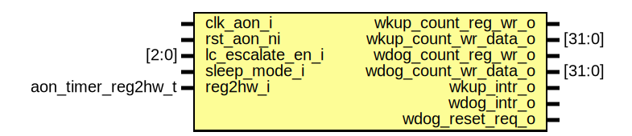

# Entity: aon_timer_core

- **File**: aon_timer_core.sv
## Diagram

## Description

 Copyright lowRISC contributors.
 Licensed under the Apache License, Version 2.0, see LICENSE for details.
 SPDX-License-Identifier: Apache-2.0

## Ports

| Port name            | Direction | Type               | Description         |
| -------------------- | --------- | ------------------ | ------------------- |
| clk_aon_i            | input     |                    |                     |
| rst_aon_ni           | input     |                    |                     |
| lc_escalate_en_i     | input     | [2:0]              |                     |
| sleep_mode_i         | input     |                    |                     |
| reg2hw_i             | input     | aon_timer_reg2hw_t |  Register interface |
| wkup_count_reg_wr_o  | output    |                    |                     |
| wkup_count_wr_data_o | output    | [31:0]             |                     |
| wdog_count_reg_wr_o  | output    |                    |                     |
| wdog_count_wr_data_o | output    | [31:0]             |                     |
| wkup_intr_o          | output    |                    |                     |
| wdog_intr_o          | output    |                    |                     |
| wdog_reset_req_o     | output    |                    |                     |
## Signals

| Name             | Type         | Description        |
| ---------------- | ------------ | ------------------ |
| unused_reg2hw    | logic        |                    |
| prescale_count_d | logic [11:0] |  Wakeup signals    |
| prescale_count_q | logic [11:0] |  Wakeup signals    |
| prescale_en      | logic        |                    |
| wkup_incr        | logic        |                    |
| wdog_incr        | logic        |  Watchdog signals  |
## Processes
- unnamed: ( @(posedge clk_aon_i or negedge rst_aon_ni) )
  - **Type:** always_ff
