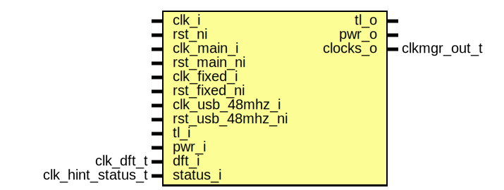

# Entity: clkmgr

- **File**: clkmgr.sv
## Diagram

## Description

 Copyright lowRISC contributors.
 Licensed under the Apache License, Version 2.0, see LICENSE for details.
 SPDX-License-Identifier: Apache-2.0

 The overall clock manager

## Ports

| Port name        | Direction | Type              | Description             |
| ---------------- | --------- | ----------------- | ----------------------- |
| clk_i            | input     |                   |  Primary module clocks  |
| rst_ni           | input     |                   |                         |
| clk_main_i       | input     |                   |                         |
| rst_main_ni      | input     |                   |                         |
| clk_fixed_i      | input     |                   |                         |
| rst_fixed_ni     | input     |                   |                         |
| clk_usb_48mhz_i  | input     |                   |                         |
| rst_usb_48mhz_ni | input     |                   |                         |
| tl_i             | input     |                   |  Bus Interface          |
| tl_o             | output    |                   |                         |
| pwr_i            | input     |                   |  pwrmgr interface       |
| pwr_o            | output    |                   |                         |
| dft_i            | input     | clk_dft_t         |  dft interface          |
| status_i         | input     | clk_hint_status_t |  idle hints             |
| clocks_o         | output    | clkmgr_out_t      |  clock output interface |
## Signals

| Name                     | Type                            | Description                                                                                                                                                                                                                                                                                                                                                                                                           |
| ------------------------ | ------------------------------- | --------------------------------------------------------------------------------------------------------------------------------------------------------------------------------------------------------------------------------------------------------------------------------------------------------------------------------------------------------------------------------------------------------------------- |
| reg2hw                   | clkmgr_reg_pkg::clkmgr_reg2hw_t | //////////////////////////////////////////////////  Register Interface //////////////////////////////////////////////////                                                                                                                                                                                                                                                                                             |
| hw2reg                   | clkmgr_reg_pkg::clkmgr_hw2reg_t |                                                                                                                                                                                                                                                                                                                                                                                                                       |
| async_roots_en           | logic                           | //////////////////////////////////////////////////  Root gating //////////////////////////////////////////////////  the rst_ni connection below is incorrect, need to find a proper reset in the sequence to use  if the clkmgr is always on, can use por synced directly  if not, then need to generate something ahead of lc/sys                                                                                    |
| roots_en_q2              | logic                           |                                                                                                                                                                                                                                                                                                                                                                                                                       |
| roots_en_q1              | logic                           |                                                                                                                                                                                                                                                                                                                                                                                                                       |
| roots_en_d               | logic                           |                                                                                                                                                                                                                                                                                                                                                                                                                       |
| clk_main_root            | logic                           |                                                                                                                                                                                                                                                                                                                                                                                                                       |
| clk_main_en              | logic                           |                                                                                                                                                                                                                                                                                                                                                                                                                       |
| clk_fixed_root           | logic                           |                                                                                                                                                                                                                                                                                                                                                                                                                       |
| clk_fixed_en             | logic                           |                                                                                                                                                                                                                                                                                                                                                                                                                       |
| clk_usb_48mhz_root       | logic                           |                                                                                                                                                                                                                                                                                                                                                                                                                       |
| clk_usb_48mhz_en         | logic                           |                                                                                                                                                                                                                                                                                                                                                                                                                       |
| clk_fixed_peri_sw_en     | logic                           | //////////////////////////////////////////////////  Software direct control group //////////////////////////////////////////////////  the rst_ni connection below is incorrect, need to find a proper reset in the sequence to use  if the clkmgr is always on, can use por synced directly  if not, then need to generate something ahead of lc/sys                                                                  |
| clk_usb_48mhz_peri_sw_en | logic                           |                                                                                                                                                                                                                                                                                                                                                                                                                       |
| clk_main_aes_hint        | logic                           | //////////////////////////////////////////////////  Software hint group  The idle hint feedback is assumed to be synchronous to the  clock target //////////////////////////////////////////////////  the rst_ni connection below is incorrect, need to find a proper reset in the sequence to use  if the clkmgr is always on, can use por synced directly  if not, then need to generate something ahead of lc/sys  |
| clk_main_aes_en          | logic                           |                                                                                                                                                                                                                                                                                                                                                                                                                       |
| clk_main_hmac_hint       | logic                           |                                                                                                                                                                                                                                                                                                                                                                                                                       |
| clk_main_hmac_en         | logic                           |                                                                                                                                                                                                                                                                                                                                                                                                                       |
## Processes
- unnamed: ( @(posedge clk_i or negedge rst_ni) )
  - **Type:** always_ff
## Instantiations

- u_reg: clkmgr_reg_top
- i_main_cg: prim_clock_gating_sync
- i_fixed_cg: prim_clock_gating_sync
- i_usb_48mhz_cg: prim_clock_gating_sync
- i_roots_en_sync: prim_flop_2sync
**Description**
 Sync the OR back into clkmgr domain for feedback to pwrmgr.
 Since the signal is combo / converged on the other side, de-bounce
 the signal prior to output

- i_clk_fixed_peri_sw_en_sync: prim_flop_2sync
- i_clk_fixed_peri_cg: prim_clock_gating
- i_clk_usb_48mhz_peri_sw_en_sync: prim_flop_2sync
- i_clk_usb_48mhz_peri_cg: prim_clock_gating
- i_clk_main_aes_hint_sync: prim_flop_2sync
- i_clk_main_aes_cg: prim_clock_gating
- i_clk_main_hmac_hint_sync: prim_flop_2sync
- i_clk_main_hmac_cg: prim_clock_gating
