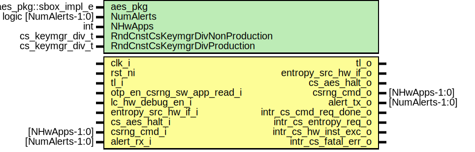

# Entity: csrng

- **File**: csrng.sv
## Diagram

## Description

Copyright lowRISC contributors.
 Licensed under the Apache License, Version 2.0, see LICENSE for details.
 SPDX-License-Identifier: Apache-2.0
 Description: csrng top level wrapper file
 
## Generics

| Generic name                    | Type                  | Value                     | Description |
| ------------------------------- | --------------------- | ------------------------- | ----------- |
| aes_pkg                         | aes_pkg::sbox_impl_e  | aes_pkg::SBoxImplCanright |             |
| NumAlerts                       | logic [NumAlerts-1:0] | undefined                 |             |
| NHwApps                         | int                   | 2                         |             |
| RndCnstCsKeymgrDivNonProduction | cs_keymgr_div_t       | CsKeymgrDivWidth'(0)      |             |
| RndCnstCsKeymgrDivProduction    | cs_keymgr_div_t       | CsKeymgrDivWidth'(0)      |             |
## Ports

| Port name                  | Direction | Type            | Description                |
| -------------------------- | --------- | --------------- | -------------------------- |
| clk_i                      | input     |                 |                            |
| rst_ni                     | input     |                 |                            |
| tl_i                       | input     |                 | Tilelink Bus Interface     |
| tl_o                       | output    |                 |                            |
| otp_en_csrng_sw_app_read_i | input     |                 | OTP Interface              |
| lc_hw_debug_en_i           | input     |                 | Lifecycle broadcast inputs |
| entropy_src_hw_if_o        | output    |                 | Entropy Interface          |
| entropy_src_hw_if_i        | input     |                 |                            |
| cs_aes_halt_i              | input     |                 | Entropy Interface          |
| cs_aes_halt_o              | output    |                 |                            |
| csrng_cmd_i                | input     | [NHwApps-1:0]   | Application Interfaces     |
| csrng_cmd_o                | output    | [NHwApps-1:0]   |                            |
| alert_rx_i                 | input     | [NumAlerts-1:0] | Alerts                     |
| alert_tx_o                 | output    | [NumAlerts-1:0] |                            |
| intr_cs_cmd_req_done_o     | output    |                 | Interrupts                 |
| intr_cs_entropy_req_o      | output    |                 |                            |
| intr_cs_hw_inst_exc_o      | output    |                 |                            |
| intr_cs_fatal_err_o        | output    |                 |                            |
## Signals

| Name                | Type           | Description |
| ------------------- | -------------- | ----------- |
| efuse_sw_app_enable | logic          |             |
| reg2hw              | csrng_reg2hw_t |             |
| hw2reg              | csrng_hw2reg_t |             |
| alert               | logic          |             |
| alert_test          | logic          |             |
| intg_err_alert      | logic          |             |
## Instantiations

- u_reg: csrng_reg_top
- u_csrng_core: csrng_core
- u_prim_alert_sender: prim_alert_sender
