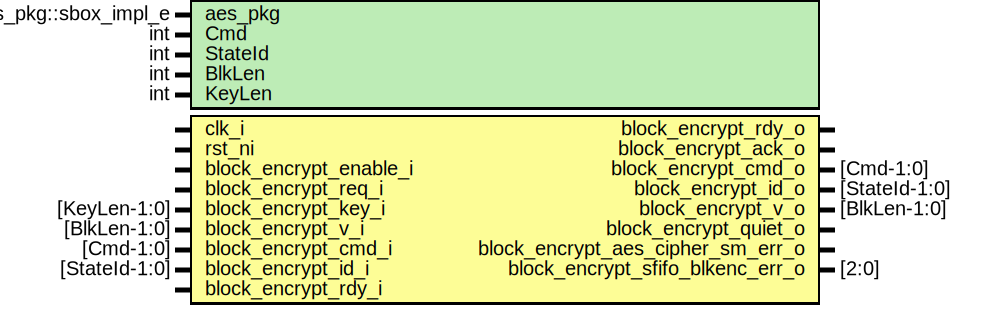

# Entity: csrng_block_encrypt

- **File**: csrng_block_encrypt.sv
## Diagram

## Description

Copyright lowRISC contributors.
 Licensed under the Apache License, Version 2.0, see LICENSE for details.
 SPDX-License-Identifier: Apache-2.0
 Description: csrng block encrypt module
 
## Generics

| Generic name | Type                 | Value                | Description |
| ------------ | -------------------- | -------------------- | ----------- |
| aes_pkg      | aes_pkg::sbox_impl_e | aes_pkg::SBoxImplLut |             |
| Cmd          | int                  | 3                    |             |
| StateId      | int                  | 4                    |             |
| BlkLen       | int                  | 128                  |             |
| KeyLen       | int                  | 256                  |             |
## Ports

| Port name                          | Direction | Type          | Description      |
| ---------------------------------- | --------- | ------------- | ---------------- |
| clk_i                              | input     |               |                  |
| rst_ni                             | input     |               |                  |
| block_encrypt_bypass_i             | input     |               | update interface |
| block_encrypt_enable_i             | input     |               |                  |
| block_encrypt_lc_hw_debug_not_on_i | input     |               |                  |
| block_encrypt_req_i                | input     |               |                  |
| block_encrypt_rdy_o                | output    |               |                  |
| block_encrypt_key_i                | input     | [KeyLen-1:0]  |                  |
| block_encrypt_v_i                  | input     | [BlkLen-1:0]  |                  |
| block_encrypt_cmd_i                | input     | [Cmd-1:0]     |                  |
| block_encrypt_id_i                 | input     | [StateId-1:0] |                  |
| block_encrypt_ack_o                | output    |               |                  |
| block_encrypt_rdy_i                | input     |               |                  |
| block_encrypt_cmd_o                | output    | [Cmd-1:0]     |                  |
| block_encrypt_id_o                 | output    | [StateId-1:0] |                  |
| block_encrypt_v_o                  | output    | [BlkLen-1:0]  |                  |
| block_encrypt_quiet_o              | output    |               |                  |
| block_encrypt_aes_cipher_sm_err_o  | output    |               |                  |
| block_encrypt_sfifo_blkenc_err_o   | output    | [2:0]         |                  |
## Signals

| Name                   | Type                                  | Description                  |
| ---------------------- | ------------------------------------- | ---------------------------- |
| sfifo_blkenc_rdata     | logic [BlkEncFifoWidth-1:0]           | signals blk_encrypt_in fifo  |
| sfifo_blkenc_push      | logic                                 |                              |
| sfifo_blkenc_wdata     | logic [BlkEncFifoWidth-1:0]           |                              |
| sfifo_blkenc_pop       | logic                                 |                              |
| sfifo_blkenc_full      | logic                                 |                              |
| sfifo_blkenc_not_empty | logic                                 |                              |
| sfifo_blkenc_cmd       | logic [Cmd-1:0]                       | breakout                     |
| sfifo_blkenc_id        | logic [StateId-1:0]                   |                              |
| sfifo_blkenc_v         | logic [BlkLen-1:0]                    |                              |
| cipher_in_valid        | aes_pkg::sp2v_e                       |                              |
| cipher_in_ready        | aes_pkg::sp2v_e                       |                              |
| cipher_out_valid       | aes_pkg::sp2v_e                       |                              |
| cipher_out_ready       | aes_pkg::sp2v_e                       |                              |
| cipher_crypt_busy      | aes_pkg::sp2v_e                       |                              |
| cipher_data_out        | logic [BlkLen-1:0]                    |                              |
| aes_cipher_core_enable | logic                                 |                              |
| prd_clearing           | logic [aes_pkg::WidthPRDClearing-1:0] |                              |
| state_init             | logic [3:0][3:0][7:0]                 |                              |
| key_init               | logic [7:0][31:0]                     |                              |
| state_done             | logic [3:0][3:0][7:0]                 |                              |
| state_out              | logic [3:0][3:0][7:0]                 |                              |
## Constants

| Name            | Type | Value              | Description |
| --------------- | ---- | ------------------ | ----------- |
| BlkEncFifoDepth | int  | 1                  |             |
| BlkEncFifoWidth | int  | BlkLen+StateId+Cmd |             |
| NumShares       | int  | 1                  |             |
## Instantiations

- u_aes_cipher_core: aes_cipher_core
**Description**
Cipher core

- u_prim_fifo_sync_blkenc: prim_fifo_sync
