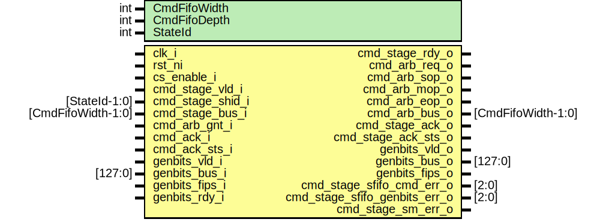

# Entity: csrng_cmd_stage

## Diagram

## Description

Copyright lowRISC contributors.
 Licensed under the Apache License, Version 2.0, see LICENSE for details.
 SPDX-License-Identifier: Apache-2.0
 Description: csrng command staging module
 
## Generics

| Generic name | Type | Value | Description |
| ------------ | ---- | ----- | ----------- |
| CmdFifoWidth | int  | 32    |             |
| CmdFifoDepth | int  | 16    |             |
| StateId      | int  | 4     |             |
## Ports

| Port name                     | Direction | Type               | Description        |
| ----------------------------- | --------- | ------------------ | ------------------ |
| clk_i                         | input     |                    |                    |
| rst_ni                        | input     |                    |                    |
| cs_enable_i                   | input     |                    | command in         |
| cmd_stage_vld_i               | input     |                    |                    |
| cmd_stage_shid_i              | input     | [StateId-1:0]      |                    |
| cmd_stage_bus_i               | input     | [CmdFifoWidth-1:0] |                    |
| cmd_stage_rdy_o               | output    |                    |                    |
| cmd_arb_req_o                 | output    |                    | command to arbiter |
| cmd_arb_sop_o                 | output    |                    |                    |
| cmd_arb_mop_o                 | output    |                    |                    |
| cmd_arb_eop_o                 | output    |                    |                    |
| cmd_arb_gnt_i                 | input     |                    |                    |
| cmd_arb_bus_o                 | output    | [CmdFifoWidth-1:0] |                    |
| cmd_ack_i                     | input     |                    | ack from core      |
| cmd_ack_sts_i                 | input     |                    |                    |
| cmd_stage_ack_o               | output    |                    | ack to app i/f     |
| cmd_stage_ack_sts_o           | output    |                    |                    |
| genbits_vld_i                 | input     |                    | genbits from core  |
| genbits_bus_i                 | input     | [127:0]            |                    |
| genbits_fips_i                | input     |                    |                    |
| genbits_vld_o                 | output    |                    | genbits to app i/f |
| genbits_rdy_i                 | input     |                    |                    |
| genbits_bus_o                 | output    | [127:0]            |                    |
| genbits_fips_o                | output    |                    |                    |
| cmd_stage_sfifo_cmd_err_o     | output    | [2:0]              | error indication   |
| cmd_stage_sfifo_genbits_err_o | output    | [2:0]              |                    |
| cmd_stage_sm_err_o            | output    |                    |                    |
## Signals

| Name                    | Type                           | Description                          |
| ----------------------- | ------------------------------ | ------------------------------------ |
| sfifo_cmd_rdata         | logic [CmdFifoWidth-1:0]       | signals command fifo                 |
| sfifo_cmd_depth         | logic [$clog2(CmdFifoDepth):0] |                                      |
| sfifo_cmd_push          | logic                          |                                      |
| sfifo_cmd_wdata         | logic [CmdFifoWidth-1:0]       |                                      |
| sfifo_cmd_pop           | logic                          |                                      |
| sfifo_cmd_err           | logic [2:0]                    |                                      |
| sfifo_cmd_full          | logic                          |                                      |
| sfifo_cmd_not_empty     | logic                          |                                      |
| sfifo_genbits_rdata     | logic [GenBitsFifoWidth-1:0]   | genbits fifo                         |
| sfifo_genbits_push      | logic                          |                                      |
| sfifo_genbits_wdata     | logic [GenBitsFifoWidth-1:0]   |                                      |
| sfifo_genbits_pop       | logic                          |                                      |
| sfifo_genbits_err       | logic [2:0]                    |                                      |
| sfifo_genbits_full      | logic                          |                                      |
| sfifo_genbits_not_empty | logic                          |                                      |
| cmd_len                 | logic [3:0]                    |                                      |
| cmd_fifo_zero           | logic                          |                                      |
| cmd_fifo_pop            | logic                          |                                      |
| cmd_len_dec             | logic                          |                                      |
| cmd_gen_cnt_dec         | logic                          |                                      |
| cmd_gen_1st_req         | logic                          |                                      |
| cmd_gen_inc_req         | logic                          |                                      |
| cmd_gen_cnt_last        | logic                          |                                      |
| cmd_final_ack           | logic                          |                                      |
| cmd_ack_q               | logic                          | flops                                |
| cmd_ack_d               | logic                          | flops                                |
| cmd_ack_sts_q           | logic                          |                                      |
| cmd_ack_sts_d           | logic                          |                                      |
| cmd_len_q               | logic [3:0]                    |                                      |
| cmd_len_d               | logic [3:0]                    |                                      |
| cmd_gen_flag_q          | logic                          |                                      |
| cmd_gen_flag_d          | logic                          |                                      |
| cmd_gen_cnt_q           | logic [GenBitsCntrWidth-1:0]   | max_nuber_of_bits_per_request = 2^19 |
| cmd_gen_cnt_d           | logic [GenBitsCntrWidth-1:0]   | max_nuber_of_bits_per_request = 2^19 |
| cmd_gen_cmd_q           | logic [11:0]                   |                                      |
| cmd_gen_cmd_d           | logic [11:0]                   |                                      |
| state_d                 | state_e                        |                                      |
| state_q                 | state_e                        |                                      |
| state_raw_q             | logic [StateWidth-1:0]         |                                      |
## Constants

| Name             | Type | Value | Description |
| ---------------- | ---- | ----- | ----------- |
| GenBitsFifoWidth | int  | 1+128 |             |
| GenBitsFifoDepth | int  | 1     |             |
| GenBitsCntrWidth | int  | 19    |             |
| StateWidth       | int  | 6     |             |
## Types

| Name    | Type                                                                                                                                                                                                                                  | Description |
| ------- | ------------------------------------------------------------------------------------------------------------------------------------------------------------------------------------------------------------------------------------- | ----------- |
| state_e | enum logic [StateWidth-1:0] {     Idle      = 6'b001010,      SendSOP   = 6'b000111,      SendMOP   = 6'b010000,      GenCmdChk = 6'b011101,      CmdAck    = 6'b111011,      GenReq    = 6'b110110,      Error     = 6'b101100     } |             |
## Processes
- unnamed: ( @(posedge clk_i or negedge rst_ni) )
- unnamed: (  )
## Instantiations

- u_prim_fifo_cmd: prim_fifo_sync
- u_state_regs: prim_flop
**Description**
This primitive is used to place a size-only constraint on the
flops in order to prevent FSM state encoding optimizations.

- u_prim_fifo_genbits: prim_fifo_sync
