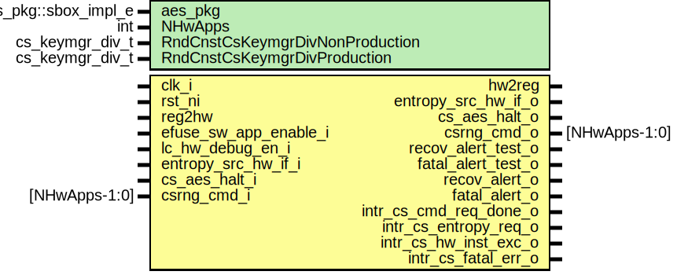

# Entity: csrng_core

- **File**: csrng_core.sv
## Diagram

## Description

 Copyright lowRISC contributors.
 Licensed under the Apache License, Version 2.0, see LICENSE for details.
 SPDX-License-Identifier: Apache-2.0

 Description: csrng core module

## Generics

| Generic name                    | Type                 | Value                | Description |
| ------------------------------- | -------------------- | -------------------- | ----------- |
| aes_pkg                         | aes_pkg::sbox_impl_e | aes_pkg::SBoxImplLut |             |
| NHwApps                         | int                  | 2                    |             |
| RndCnstCsKeymgrDivNonProduction | cs_keymgr_div_t      | CsKeymgrDivWidth'(0) |             |
| RndCnstCsKeymgrDivProduction    | cs_keymgr_div_t      | CsKeymgrDivWidth'(0) |             |
## Ports

| Port name              | Direction | Type          | Description                 |
| ---------------------- | --------- | ------------- | --------------------------- |
| clk_i                  | input     |               |                             |
| rst_ni                 | input     |               |                             |
| reg2hw                 | input     |               |                             |
| hw2reg                 | output    |               |                             |
| efuse_sw_app_enable_i  | input     |               |  Efuse Interface            |
| lc_hw_debug_en_i       | input     |               |  Lifecycle broadcast inputs |
| entropy_src_hw_if_o    | output    |               |  Entropy Interface          |
| entropy_src_hw_if_i    | input     |               |                             |
| cs_aes_halt_i          | input     |               |  Entropy Interface          |
| cs_aes_halt_o          | output    |               |                             |
| csrng_cmd_i            | input     | [NHwApps-1:0] |  Application Interfaces     |
| csrng_cmd_o            | output    | [NHwApps-1:0] |                             |
| recov_alert_test_o     | output    |               |  Alerts                     |
| fatal_alert_test_o     | output    |               |                             |
| recov_alert_o          | output    |               |                             |
| fatal_alert_o          | output    |               |                             |
| intr_cs_cmd_req_done_o | output    |               |                             |
| intr_cs_entropy_req_o  | output    |               |                             |
| intr_cs_hw_inst_exc_o  | output    |               |                             |
| intr_cs_fatal_err_o    | output    |               |                             |
## Signals

| Name                                | Type                       | Description                                                                                                                                                                                                       |
| ----------------------------------- | -------------------------- | ----------------------------------------------------------------------------------------------------------------------------------------------------------------------------------------------------------------- |
| event_cs_cmd_req_done               | logic                      |  signals  interrupt signals                                                                                                                                                                                       |
| event_cs_entropy_req                | logic                      |                                                                                                                                                                                                                   |
| event_cs_hw_inst_exc                | logic                      |                                                                                                                                                                                                                   |
| event_cs_fatal_err                  | logic                      |                                                                                                                                                                                                                   |
| cs_enable                           | logic                      |                                                                                                                                                                                                                   |
| cs_enable_pfe                       | logic                      |                                                                                                                                                                                                                   |
| cs_enable_pfd                       | logic                      |                                                                                                                                                                                                                   |
| cs_enable_pfa                       | logic                      |                                                                                                                                                                                                                   |
| sw_app_enable                       | logic                      |                                                                                                                                                                                                                   |
| sw_app_enable_pfe                   | logic                      |                                                                                                                                                                                                                   |
| sw_app_enable_pfd                   | logic                      |                                                                                                                                                                                                                   |
| sw_app_enable_pfa                   | logic                      |                                                                                                                                                                                                                   |
| read_int_state                      | logic                      |                                                                                                                                                                                                                   |
| read_int_state_pfe                  | logic                      |                                                                                                                                                                                                                   |
| read_int_state_pfd                  | logic                      |                                                                                                                                                                                                                   |
| read_int_state_pfa                  | logic                      |                                                                                                                                                                                                                   |
| recov_alert_event                   | logic                      |                                                                                                                                                                                                                   |
| acmd_avail                          | logic                      |                                                                                                                                                                                                                   |
| acmd_sop                            | logic                      |                                                                                                                                                                                                                   |
| acmd_mop                            | logic                      |                                                                                                                                                                                                                   |
| acmd_eop                            | logic                      |                                                                                                                                                                                                                   |
| cmd_blk_select                      | logic                      |                                                                                                                                                                                                                   |
| gen_blk_select                      | logic                      |                                                                                                                                                                                                                   |
| state_db_wr_req_rdy                 | logic                      |                                                                                                                                                                                                                   |
| state_db_wr_req                     | logic                      |                                                                                                                                                                                                                   |
| state_db_wr_inst_id                 | logic [StateId-1:0]        |                                                                                                                                                                                                                   |
| state_db_wr_key                     | logic [KeyLen-1:0]         |                                                                                                                                                                                                                   |
| state_db_wr_v                       | logic [BlkLen-1:0]         |                                                                                                                                                                                                                   |
| state_db_wr_rc                      | logic [CtrLen-1:0]         |                                                                                                                                                                                                                   |
| state_db_wr_sts                     | logic                      |                                                                                                                                                                                                                   |
| state_db_wr_fips                    | logic                      |                                                                                                                                                                                                                   |
| state_db_wr_ccmd                    | logic [Cmd-1:0]            |                                                                                                                                                                                                                   |
| acmd_bus                            | logic [AppCmdWidth-1:0]    |                                                                                                                                                                                                                   |
| packer_adata                        | logic [SeedLen-1:0]        |                                                                                                                                                                                                                   |
| packer_adata_depth                  | logic [ADataDepthClog-1:0] |                                                                                                                                                                                                                   |
| packer_adata_pop                    | logic                      |                                                                                                                                                                                                                   |
| packer_adata_clr                    | logic                      |                                                                                                                                                                                                                   |
| seed_diversification                | logic [SeedLen-1:0]        |                                                                                                                                                                                                                   |
| cmd_entropy_req                     | logic                      |                                                                                                                                                                                                                   |
| cmd_entropy_avail                   | logic                      |                                                                                                                                                                                                                   |
| cmd_entropy_fips                    | logic                      |                                                                                                                                                                                                                   |
| cmd_entropy                         | logic [SeedLen-1:0]        |                                                                                                                                                                                                                   |
| cmd_result_wr_req                   | logic                      |                                                                                                                                                                                                                   |
| cmd_result_ack                      | logic                      |                                                                                                                                                                                                                   |
| cmd_result_ack_sts                  | logic                      |                                                                                                                                                                                                                   |
| cmd_result_ccmd                     | logic [Cmd-1:0]            |                                                                                                                                                                                                                   |
| cmd_result_ack_rdy                  | logic                      |                                                                                                                                                                                                                   |
| cmd_result_inst_id                  | logic [StateId-1:0]        |                                                                                                                                                                                                                   |
| cmd_result_glast                    | logic                      |                                                                                                                                                                                                                   |
| cmd_result_fips                     | logic                      |                                                                                                                                                                                                                   |
| cmd_result_adata                    | logic [SeedLen-1:0]        |                                                                                                                                                                                                                   |
| cmd_result_key                      | logic [KeyLen-1:0]         |                                                                                                                                                                                                                   |
| cmd_result_v                        | logic [BlkLen-1:0]         |                                                                                                                                                                                                                   |
| cmd_result_rc                       | logic [CtrLen-1:0]         |                                                                                                                                                                                                                   |
| state_db_sts_ack                    | logic                      |                                                                                                                                                                                                                   |
| state_db_sts_sts                    | logic                      |                                                                                                                                                                                                                   |
| state_db_sts_id                     | logic [StateId-1:0]        |                                                                                                                                                                                                                   |
| gen_result_wr_req                   | logic                      |                                                                                                                                                                                                                   |
| gen_result_ack_sts                  | logic                      |                                                                                                                                                                                                                   |
| gen_result_ack_rdy                  | logic                      |                                                                                                                                                                                                                   |
| gen_result_ccmd                     | logic [Cmd-1:0]            |                                                                                                                                                                                                                   |
| gen_result_inst_id                  | logic [StateId-1:0]        |                                                                                                                                                                                                                   |
| gen_result_fips                     | logic                      |                                                                                                                                                                                                                   |
| gen_result_key                      | logic [KeyLen-1:0]         |                                                                                                                                                                                                                   |
| gen_result_v                        | logic [BlkLen-1:0]         |                                                                                                                                                                                                                   |
| gen_result_rc                       | logic [CtrLen-1:0]         |                                                                                                                                                                                                                   |
| gen_result_bits                     | logic [BlkLen-1:0]         |                                                                                                                                                                                                                   |
| acmd_accept                         | logic                      |                                                                                                                                                                                                                   |
| acmd_hdr_capt                       | logic                      |                                                                                                                                                                                                                   |
| instant_req                         | logic                      |                                                                                                                                                                                                                   |
| reseed_req                          | logic                      |                                                                                                                                                                                                                   |
| generate_req                        | logic                      |                                                                                                                                                                                                                   |
| update_req                          | logic                      |                                                                                                                                                                                                                   |
| uninstant_req                       | logic                      |                                                                                                                                                                                                                   |
| clr_adata_packer                    | logic                      |                                                                                                                                                                                                                   |
| ctr_drbg_cmd_ccmd                   | logic [Cmd-1:0]            |                                                                                                                                                                                                                   |
| ctr_drbg_cmd_req                    | logic                      |                                                                                                                                                                                                                   |
| ctr_drbg_gen_req                    | logic                      |                                                                                                                                                                                                                   |
| ctr_drbg_gen_req_rdy                | logic                      |                                                                                                                                                                                                                   |
| ctr_drbg_cmd_req_rdy                | logic                      |                                                                                                                                                                                                                   |
| ctr_drbg_cmd_sfifo_cmdreq_err_sum   | logic                      |                                                                                                                                                                                                                   |
| ctr_drbg_cmd_sfifo_cmdreq_err       | logic [2:0]                |                                                                                                                                                                                                                   |
| ctr_drbg_cmd_sfifo_rcstage_err_sum  | logic                      |                                                                                                                                                                                                                   |
| ctr_drbg_cmd_sfifo_rcstage_err      | logic [2:0]                |                                                                                                                                                                                                                   |
| ctr_drbg_cmd_sfifo_keyvrc_err_sum   | logic                      |                                                                                                                                                                                                                   |
| ctr_drbg_cmd_sfifo_keyvrc_err       | logic [2:0]                |                                                                                                                                                                                                                   |
| ctr_drbg_upd_sfifo_updreq_err_sum   | logic                      |                                                                                                                                                                                                                   |
| ctr_drbg_upd_sfifo_updreq_err       | logic [2:0]                |                                                                                                                                                                                                                   |
| ctr_drbg_upd_sfifo_bencreq_err_sum  | logic                      |                                                                                                                                                                                                                   |
| ctr_drbg_upd_sfifo_bencreq_err      | logic [2:0]                |                                                                                                                                                                                                                   |
| ctr_drbg_upd_sfifo_bencack_err_sum  | logic                      |                                                                                                                                                                                                                   |
| ctr_drbg_upd_sfifo_bencack_err      | logic [2:0]                |                                                                                                                                                                                                                   |
| ctr_drbg_upd_sfifo_pdata_err_sum    | logic                      |                                                                                                                                                                                                                   |
| ctr_drbg_upd_sfifo_pdata_err        | logic [2:0]                |                                                                                                                                                                                                                   |
| ctr_drbg_upd_sfifo_final_err_sum    | logic                      |                                                                                                                                                                                                                   |
| ctr_drbg_upd_sfifo_final_err        | logic [2:0]                |                                                                                                                                                                                                                   |
| ctr_drbg_gen_sfifo_gbencack_err_sum | logic                      |                                                                                                                                                                                                                   |
| ctr_drbg_gen_sfifo_gbencack_err     | logic [2:0]                |                                                                                                                                                                                                                   |
| ctr_drbg_gen_sfifo_grcstage_err_sum | logic                      |                                                                                                                                                                                                                   |
| ctr_drbg_gen_sfifo_grcstage_err     | logic [2:0]                |                                                                                                                                                                                                                   |
| ctr_drbg_gen_sfifo_ggenreq_err_sum  | logic                      |                                                                                                                                                                                                                   |
| ctr_drbg_gen_sfifo_ggenreq_err      | logic [2:0]                |                                                                                                                                                                                                                   |
| ctr_drbg_gen_sfifo_gadstage_err_sum | logic                      |                                                                                                                                                                                                                   |
| ctr_drbg_gen_sfifo_gadstage_err     | logic [2:0]                |                                                                                                                                                                                                                   |
| ctr_drbg_gen_sfifo_ggenbits_err_sum | logic                      |                                                                                                                                                                                                                   |
| ctr_drbg_gen_sfifo_ggenbits_err     | logic [2:0]                |                                                                                                                                                                                                                   |
| block_encrypt_sfifo_blkenc_err_sum  | logic                      |                                                                                                                                                                                                                   |
| block_encrypt_sfifo_blkenc_err      | logic [2:0]                |                                                                                                                                                                                                                   |
| cmd_stage_sm_err_sum                | logic                      |                                                                                                                                                                                                                   |
| main_sm_err_sum                     | logic                      |                                                                                                                                                                                                                   |
| main_sm_err                         | logic                      |                                                                                                                                                                                                                   |
| drbg_gen_sm_err_sum                 | logic                      |                                                                                                                                                                                                                   |
| drbg_gen_sm_err                     | logic                      |                                                                                                                                                                                                                   |
| drbg_updbe_sm_err_sum               | logic                      |                                                                                                                                                                                                                   |
| drbg_updbe_sm_err                   | logic                      |                                                                                                                                                                                                                   |
| drbg_updob_sm_err_sum               | logic                      |                                                                                                                                                                                                                   |
| drbg_updob_sm_err                   | logic                      |                                                                                                                                                                                                                   |
| aes_cipher_sm_err_sum               | logic                      |                                                                                                                                                                                                                   |
| aes_cipher_sm_err                   | logic                      |                                                                                                                                                                                                                   |
| fifo_write_err_sum                  | logic                      |                                                                                                                                                                                                                   |
| fifo_read_err_sum                   | logic                      |                                                                                                                                                                                                                   |
| fifo_status_err_sum                 | logic                      |                                                                                                                                                                                                                   |
| state_db_rd_key                     | logic [KeyLen-1:0]         |                                                                                                                                                                                                                   |
| state_db_rd_v                       | logic [BlkLen-1:0]         |                                                                                                                                                                                                                   |
| state_db_rd_rc                      | logic [CtrLen-1:0]         |                                                                                                                                                                                                                   |
| state_db_rd_fips                    | logic                      |                                                                                                                                                                                                                   |
| acmd_hold                           | logic [2:0]                |                                                                                                                                                                                                                   |
| shid                                | logic [3:0]                |                                                                                                                                                                                                                   |
| gen_last                            | logic                      |                                                                                                                                                                                                                   |
| flag0                               | logic                      |                                                                                                                                                                                                                   |
| updblk_benblk_cmd_arb_din           | logic [Cmd-1:0]            |  blk encrypt arbiter                                                                                                                                                                                              |
| updblk_benblk_id_arb_din            | logic [StateId-1:0]        |                                                                                                                                                                                                                   |
| updblk_benblk_v_arb_din             | logic [BlkLen-1:0]         |                                                                                                                                                                                                                   |
| updblk_benblk_key_arb_din           | logic [KeyLen-1:0]         |                                                                                                                                                                                                                   |
| updblk_benblk_arb_req               | logic                      |                                                                                                                                                                                                                   |
| updblk_benblk_arb_req_rdy           | logic                      |                                                                                                                                                                                                                   |
| benblk_updblk_ack                   | logic                      |                                                                                                                                                                                                                   |
| updblk_benblk_ack_rdy               | logic                      |                                                                                                                                                                                                                   |
| genblk_benblk_cmd_arb_din           | logic [Cmd-1:0]            |                                                                                                                                                                                                                   |
| genblk_benblk_id_arb_din            | logic [StateId-1:0]        |                                                                                                                                                                                                                   |
| genblk_benblk_v_arb_din             | logic [BlkLen-1:0]         |                                                                                                                                                                                                                   |
| genblk_benblk_key_arb_din           | logic [KeyLen-1:0]         |                                                                                                                                                                                                                   |
| genblk_benblk_arb_req               | logic                      |                                                                                                                                                                                                                   |
| genblk_benblk_arb_req_rdy           | logic                      |                                                                                                                                                                                                                   |
| benblk_genblk_ack                   | logic                      |                                                                                                                                                                                                                   |
| genblk_benblk_ack_rdy               | logic                      |                                                                                                                                                                                                                   |
| benblk_arb_din                      | logic [BlkEncArbWidth-1:0] |                                                                                                                                                                                                                   |
| benblk_arb_data                     | logic [BlkEncArbWidth-1:0] |                                                                                                                                                                                                                   |
| benblk_arb_key                      | logic [KeyLen-1:0]         |                                                                                                                                                                                                                   |
| benblk_arb_v                        | logic [BlkLen-1:0]         |                                                                                                                                                                                                                   |
| benblk_arb_inst_id                  | logic [StateId-1:0]        |                                                                                                                                                                                                                   |
| benblk_arb_cmd                      | logic [Cmd-1:0]            |                                                                                                                                                                                                                   |
| benblk_arb_vld                      | logic                      |                                                                                                                                                                                                                   |
| benblk_ack                          | logic                      |                                                                                                                                                                                                                   |
| benblk_ack_rdy                      | logic                      |                                                                                                                                                                                                                   |
| benblk_arb_rdy                      | logic                      |                                                                                                                                                                                                                   |
| benblk_cmd                          | logic [Cmd-1:0]            |                                                                                                                                                                                                                   |
| benblk_inst_id                      | logic [StateId-1:0]        |                                                                                                                                                                                                                   |
| benblk_v                            | logic [BlkLen-1:0]         |                                                                                                                                                                                                                   |
| cmdblk_updblk_ccmd_arb_din          | logic [Cmd-1:0]            |  update arbiter                                                                                                                                                                                                   |
| cmdblk_updblk_id_arb_din            | logic [StateId-1:0]        |                                                                                                                                                                                                                   |
| cmdblk_updblk_v_arb_din             | logic [BlkLen-1:0]         |                                                                                                                                                                                                                   |
| cmdblk_updblk_key_arb_din           | logic [KeyLen-1:0]         |                                                                                                                                                                                                                   |
| cmdblk_updblk_pdata_arb_din         | logic [SeedLen-1:0]        |                                                                                                                                                                                                                   |
| cmdblk_updblk_arb_req               | logic                      |                                                                                                                                                                                                                   |
| updblk_cmdblk_arb_req_rdy           | logic                      |                                                                                                                                                                                                                   |
| updblk_cmdblk_ack                   | logic                      |                                                                                                                                                                                                                   |
| cmdblk_updblk_ack_rdy               | logic                      |                                                                                                                                                                                                                   |
| genblk_updblk_ccmd_arb_din          | logic [Cmd-1:0]            |                                                                                                                                                                                                                   |
| genblk_updblk_id_arb_din            | logic [StateId-1:0]        |                                                                                                                                                                                                                   |
| genblk_updblk_v_arb_din             | logic [BlkLen-1:0]         |                                                                                                                                                                                                                   |
| genblk_updblk_key_arb_din           | logic [KeyLen-1:0]         |                                                                                                                                                                                                                   |
| genblk_updblk_pdata_arb_din         | logic [SeedLen-1:0]        |                                                                                                                                                                                                                   |
| genblk_updblk_arb_req               | logic                      |                                                                                                                                                                                                                   |
| updblk_genblk_arb_req_rdy           | logic                      |                                                                                                                                                                                                                   |
| updblk_genblk_ack                   | logic                      |                                                                                                                                                                                                                   |
| genblk_updblk_ack_rdy               | logic                      |                                                                                                                                                                                                                   |
| updblk_arb_din                      | logic [UpdateArbWidth-1:0] |                                                                                                                                                                                                                   |
| updblk_arb_data                     | logic [UpdateArbWidth-1:0] |                                                                                                                                                                                                                   |
| updblk_arb_key                      | logic [KeyLen-1:0]         |                                                                                                                                                                                                                   |
| updblk_arb_v                        | logic [BlkLen-1:0]         |                                                                                                                                                                                                                   |
| updblk_arb_pdata                    | logic [SeedLen-1:0]        |                                                                                                                                                                                                                   |
| updblk_arb_inst_id                  | logic [StateId-1:0]        |                                                                                                                                                                                                                   |
| updblk_arb_ccmd                     | logic [Cmd-1:0]            |                                                                                                                                                                                                                   |
| updblk_arb_vld                      | logic                      |                                                                                                                                                                                                                   |
| updblk_ack                          | logic                      |                                                                                                                                                                                                                   |
| updblk_ack_rdy                      | logic                      |                                                                                                                                                                                                                   |
| updblk_arb_rdy                      | logic                      |                                                                                                                                                                                                                   |
| updblk_ccmd                         | logic [Cmd-1:0]            |                                                                                                                                                                                                                   |
| updblk_inst_id                      | logic [StateId-1:0]        |                                                                                                                                                                                                                   |
| updblk_key                          | logic [KeyLen-1:0]         |                                                                                                                                                                                                                   |
| updblk_v                            | logic [BlkLen-1:0]         |                                                                                                                                                                                                                   |
| cmd_stage_sfifo_cmd_err             | logic [2:0]                |                                                                                                                                                                                                                   |
| cmd_stage_sfifo_cmd_err_sum         | logic [NApps-1:0]          |                                                                                                                                                                                                                   |
| cmd_stage_sfifo_cmd_err_wr          | logic [NApps-1:0]          |                                                                                                                                                                                                                   |
| cmd_stage_sfifo_cmd_err_rd          | logic [NApps-1:0]          |                                                                                                                                                                                                                   |
| cmd_stage_sfifo_cmd_err_st          | logic [NApps-1:0]          |                                                                                                                                                                                                                   |
| cmd_stage_sfifo_genbits_err         | logic [2:0]                |                                                                                                                                                                                                                   |
| cmd_stage_sfifo_genbits_err_sum     | logic [NApps-1:0]          |                                                                                                                                                                                                                   |
| cmd_stage_sfifo_genbits_err_wr      | logic [NApps-1:0]          |                                                                                                                                                                                                                   |
| cmd_stage_sfifo_genbits_err_rd      | logic [NApps-1:0]          |                                                                                                                                                                                                                   |
| cmd_stage_sfifo_genbits_err_st      | logic [NApps-1:0]          |                                                                                                                                                                                                                   |
| cmd_stage_sm_err                    | logic [NApps-1:0]          |                                                                                                                                                                                                                   |
| cmd_stage_vld                       | logic [NApps-1:0]          |                                                                                                                                                                                                                   |
| cmd_stage_shid                      | logic [StateId-1:0]        |                                                                                                                                                                                                                   |
| cmd_stage_bus                       | logic [AppCmdWidth-1:0]    |                                                                                                                                                                                                                   |
| cmd_stage_rdy                       | logic [NApps-1:0]          |                                                                                                                                                                                                                   |
| cmd_arb_req                         | logic [NApps-1:0]          |                                                                                                                                                                                                                   |
| cmd_arb_gnt                         | logic [NApps-1:0]          |                                                                                                                                                                                                                   |
| cmd_arb_idx                         | logic [$clog2(NApps)-1:0]  |                                                                                                                                                                                                                   |
| cmd_arb_sop                         | logic [NApps-1:0]          |                                                                                                                                                                                                                   |
| cmd_arb_mop                         | logic [NApps-1:0]          |                                                                                                                                                                                                                   |
| cmd_arb_eop                         | logic [NApps-1:0]          |                                                                                                                                                                                                                   |
| cmd_arb_bus                         | logic [AppCmdWidth-1:0]    |                                                                                                                                                                                                                   |
| cmd_core_ack                        | logic [NApps-1:0]          |                                                                                                                                                                                                                   |
| cmd_core_ack_sts                    | logic [NApps-1:0]          |                                                                                                                                                                                                                   |
| cmd_stage_ack                       | logic [NApps-1:0]          |                                                                                                                                                                                                                   |
| cmd_stage_ack_sts                   | logic [NApps-1:0]          |                                                                                                                                                                                                                   |
| genbits_core_vld                    | logic [NApps-1:0]          |                                                                                                                                                                                                                   |
| genbits_core_bus                    | logic [GenBitsWidth-1:0]   |                                                                                                                                                                                                                   |
| genbits_core_fips                   | logic [NApps-1:0]          |                                                                                                                                                                                                                   |
| genbits_stage_vld                   | logic [NApps-1:0]          |                                                                                                                                                                                                                   |
| genbits_stage_fips                  | logic [NApps-1:0]          |                                                                                                                                                                                                                   |
| genbits_stage_bus                   | logic [GenBitsWidth-1:0]   |                                                                                                                                                                                                                   |
| genbits_stage_rdy                   | logic [NApps-1:0]          |                                                                                                                                                                                                                   |
| genbits_stage_vldo_sw               | logic                      |                                                                                                                                                                                                                   |
| genbits_stage_bus_rd_sw             | logic                      |                                                                                                                                                                                                                   |
| genbits_stage_bus_sw                | logic [31:0]               |                                                                                                                                                                                                                   |
| genbits_stage_fips_sw               | logic                      |                                                                                                                                                                                                                   |
| hw_exception_sts                    | logic [14:0]               |                                                                                                                                                                                                                   |
| lc_hw_debug_on                      | logic                      |                                                                                                                                                                                                                   |
| state_db_is_dump_en                 | logic                      |                                                                                                                                                                                                                   |
| state_db_reg_rd_sel                 | logic                      |                                                                                                                                                                                                                   |
| state_db_reg_rd_id_pulse            | logic                      |                                                                                                                                                                                                                   |
| state_db_reg_rd_id                  | logic [StateId-1:0]        |                                                                                                                                                                                                                   |
| state_db_reg_rd_val                 | logic [31:0]               |                                                                                                                                                                                                                   |
| err_code_test_bit                   | logic [30:0]               |                                                                                                                                                                                                                   |
| ctr_drbg_upd_es_ack                 | logic                      |                                                                                                                                                                                                                   |
| ctr_drbg_gen_es_ack                 | logic                      |                                                                                                                                                                                                                   |
| block_encrypt_quiet                 | logic                      |                                                                                                                                                                                                                   |
| track_inst_id                       | logic [StateId-1:0]        |                                                                                                                                                                                                                   |
| track_sm                            | logic [7:0]                |                                                                                                                                                                                                                   |
| sel_track_sm_grp                    | logic [1:0]                |                                                                                                                                                                                                                   |
| unused_err_code_test_bit            | logic                      |                                                                                                                                                                                                                   |
| unused_reg2hw_genbits               | logic                      |                                                                                                                                                                                                                   |
| unused_int_state_val                | logic                      |                                                                                                                                                                                                                   |
| acmd_q                              | logic [2:0]                |  flops                                                                                                                                                                                                            |
| acmd_d                              | logic [2:0]                |  flops                                                                                                                                                                                                            |
| shid_q                              | logic [3:0]                |                                                                                                                                                                                                                   |
| shid_d                              | logic [3:0]                |                                                                                                                                                                                                                   |
| gen_last_q                          | logic                      |                                                                                                                                                                                                                   |
| gen_last_d                          | logic                      |                                                                                                                                                                                                                   |
| flag0_q                             | logic                      |                                                                                                                                                                                                                   |
| flag0_d                             | logic                      |                                                                                                                                                                                                                   |
| cmd_arb_idx_q                       | logic [$clog2(NApps)-1:0]  |                                                                                                                                                                                                                   |
| cmd_arb_idx_d                       | logic [$clog2(NApps)-1:0]  |                                                                                                                                                                                                                   |
| statedb_wr_select_q                 | logic                      |                                                                                                                                                                                                                   |
| statedb_wr_select_d                 | logic                      |                                                                                                                                                                                                                   |
| genbits_stage_fips_sw_q             | logic                      |                                                                                                                                                                                                                   |
| genbits_stage_fips_sw_d             | logic                      |                                                                                                                                                                                                                   |
| cmd_req_dly_q                       | logic                      |                                                                                                                                                                                                                   |
| cmd_req_dly_d                       | logic                      |                                                                                                                                                                                                                   |
| cmd_req_ccmd_dly_q                  | logic [Cmd-1:0]            |                                                                                                                                                                                                                   |
| cmd_req_ccmd_dly_d                  | logic [Cmd-1:0]            |                                                                                                                                                                                                                   |
| cs_aes_halt_q                       | logic                      |                                                                                                                                                                                                                   |
| cs_aes_halt_d                       | logic                      |                                                                                                                                                                                                                   |
| entropy_src_seed_q                  | logic [SeedLen-1:0]        |                                                                                                                                                                                                                   |
| entropy_src_seed_d                  | logic [SeedLen-1:0]        |                                                                                                                                                                                                                   |
| entropy_src_fips_q                  | logic                      |                                                                                                                                                                                                                   |
| entropy_src_fips_d                  | logic                      |                                                                                                                                                                                                                   |
| lc_hw_debug_en_out                  | lc_ctrl_pkg::lc_tx_t       | -------------------------------------  life cycle logic -------------------------------------  The chip level life cycle control  provide control logic to determine  how certain debug features are controlled.  |
## Constants

| Name            | Type     | Value                             | Description |
| --------------- | -------- | --------------------------------- | ----------- |
| NApps           | int      | NHwApps + 1                       |             |
| AppCmdWidth     | int      | 32                                |             |
| AppCmdFifoDepth | int      | 2                                 |             |
| GenBitsWidth    | int      | 128                               |             |
| Cmd             | int      | 3                                 |             |
| StateId         | int      | 4                                 |             |
| KeyLen          | int      | 256                               |             |
| BlkLen          | int      | 128                               |             |
| SeedLen         | int      | 384                               |             |
| CtrLen          | int      | 32                                |             |
| NBlkEncArbReqs  | int      | 2                                 |             |
| BlkEncArbWidth  | int      | KeyLen+BlkLen+StateId+Cmd         |             |
| NUpdateArbReqs  | int      | 2                                 |             |
| UpdateArbWidth  | int      | KeyLen+BlkLen+SeedLen+StateId+Cmd |             |
| MaxClen         | int      | 12                                |             |
| ADataDepthWidth | int      | SeedLen/AppCmdWidth               |             |
| ADataDepthClog  | unsigned | $clog2(ADataDepthWidth)+1         |             |
## Processes
- unnamed: ( @(posedge clk_i or negedge rst_ni) )
  - **Type:** always_ff
## Instantiations

- u_intr_hw_cs_cmd_req_done: prim_intr_hw
**Description**
--------------------------------------------
 instantiate interrupt hardware primitives
--------------------------------------------
 All TLUL interrupts are collect in the section.

- u_intr_hw_cs_entropy_req: prim_intr_hw
- u_intr_hw_cs_hw_inst_exc: prim_intr_hw
- u_intr_hw_cs_fatal_err: prim_intr_hw
- u_prim_packer_fifo_sw_genbits: prim_packer_fifo
**Description**
 pack the gen bits into a 32 bit register sized word

- u_prim_arbiter_ppc_acmd: prim_arbiter_ppc
- u_csrng_main_sm: csrng_main_sm
**Description**
 sm to process all instantiation requests

- u_prim_packer_fifo_adata: prim_packer_fifo
- u_csrng_state_db: csrng_state_db
- u_csrng_ctr_drbg_cmd: csrng_ctr_drbg_cmd
- u_csrng_ctr_drbg_upd: csrng_ctr_drbg_upd
**Description**
-------------------------------------
 csrng_ctr_drbg_upd instantiation
-------------------------------------
 The csrng_ctr_drbg_upd is shared
 between the csrng_ctr_drbg_cmd block
 and the csrng_ctr_drbg_gen block.
 The arbiter in this section will
 route requests and responses between
 these two blocks.

- u_prim_arbiter_ppc_updblk_arb: prim_arbiter_ppc
**Description**
 update block  arbiter

- u_prim_lc_sync: prim_lc_sync
- u_csrng_block_encrypt: csrng_block_encrypt
**Description**
-------------------------------------
 csrng_block_encrypt instantiation
-------------------------------------
 The csrng_block_encrypt is shared
 between the csrng_ctr_drbg_cmd block
 and the csrng_ctr_drbg_gen block.
 The arbiter in this section will
 route requests and responses between
 these two blocks.

- u_prim_arbiter_ppc_benblk_arb: prim_arbiter_ppc
- u_csrng_ctr_drbg_gen: csrng_ctr_drbg_gen
