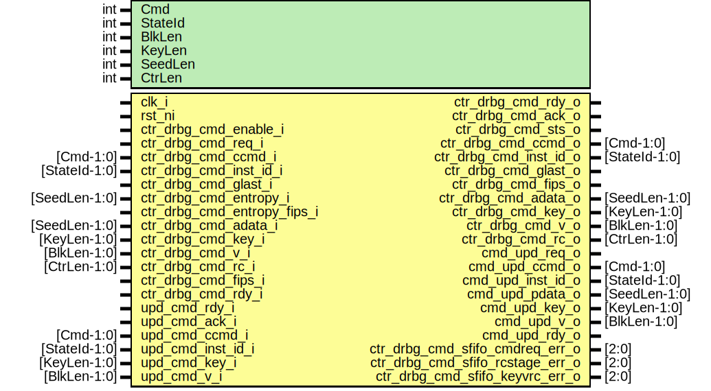

# Entity: csrng_ctr_drbg_cmd

- **File**: csrng_ctr_drbg_cmd.sv
## Diagram

## Description

 Copyright lowRISC contributors.
 Licensed under the Apache License, Version 2.0, see LICENSE for details.
 SPDX-License-Identifier: Apache-2.0

 Description: csrng ctr_drbg commands module

 Accepts all csrng commands

## Generics

| Generic name | Type | Value | Description |
| ------------ | ---- | ----- | ----------- |
| Cmd          | int  | 3     |             |
| StateId      | int  | 4     |             |
| BlkLen       | int  | 128   |             |
| KeyLen       | int  | 256   |             |
| SeedLen      | int  | 384   |             |
| CtrLen       | int  | 32    |             |
## Ports

| Port name                        | Direction | Type          | Description                                      |
| -------------------------------- | --------- | ------------- | ------------------------------------------------ |
| clk_i                            | input     |               |                                                  |
| rst_ni                           | input     |               |                                                  |
| ctr_drbg_cmd_enable_i            | input     |               |  command interface                               |
| ctr_drbg_cmd_req_i               | input     |               |                                                  |
| ctr_drbg_cmd_rdy_o               | output    |               | ready to process the req above                   |
| ctr_drbg_cmd_ccmd_i              | input     | [Cmd-1:0]     | current command                                  |
| ctr_drbg_cmd_inst_id_i           | input     | [StateId-1:0] | instantance id                                   |
| ctr_drbg_cmd_glast_i             | input     |               | gen cmd last beat                                |
| ctr_drbg_cmd_entropy_i           | input     | [SeedLen-1:0] | es entropy                                       |
| ctr_drbg_cmd_entropy_fips_i      | input     |               | es entropy)fips                                  |
| ctr_drbg_cmd_adata_i             | input     | [SeedLen-1:0] | additional data                                  |
| ctr_drbg_cmd_key_i               | input     | [KeyLen-1:0]  |                                                  |
| ctr_drbg_cmd_v_i                 | input     | [BlkLen-1:0]  |                                                  |
| ctr_drbg_cmd_rc_i                | input     | [CtrLen-1:0]  |                                                  |
| ctr_drbg_cmd_fips_i              | input     |               |                                                  |
| ctr_drbg_cmd_ack_o               | output    |               | final ack when update process has been completed |
| ctr_drbg_cmd_sts_o               | output    |               | final ack status                                 |
| ctr_drbg_cmd_rdy_i               | input     |               | ready to process the ack above                   |
| ctr_drbg_cmd_ccmd_o              | output    | [Cmd-1:0]     |                                                  |
| ctr_drbg_cmd_inst_id_o           | output    | [StateId-1:0] |                                                  |
| ctr_drbg_cmd_glast_o             | output    |               |                                                  |
| ctr_drbg_cmd_fips_o              | output    |               |                                                  |
| ctr_drbg_cmd_adata_o             | output    | [SeedLen-1:0] |                                                  |
| ctr_drbg_cmd_key_o               | output    | [KeyLen-1:0]  |                                                  |
| ctr_drbg_cmd_v_o                 | output    | [BlkLen-1:0]  |                                                  |
| ctr_drbg_cmd_rc_o                | output    | [CtrLen-1:0]  |                                                  |
| cmd_upd_req_o                    | output    |               |  update interface                                |
| upd_cmd_rdy_i                    | input     |               |                                                  |
| cmd_upd_ccmd_o                   | output    | [Cmd-1:0]     |                                                  |
| cmd_upd_inst_id_o                | output    | [StateId-1:0] |                                                  |
| cmd_upd_pdata_o                  | output    | [SeedLen-1:0] |                                                  |
| cmd_upd_key_o                    | output    | [KeyLen-1:0]  |                                                  |
| cmd_upd_v_o                      | output    | [BlkLen-1:0]  |                                                  |
| upd_cmd_ack_i                    | input     |               |                                                  |
| cmd_upd_rdy_o                    | output    |               |                                                  |
| upd_cmd_ccmd_i                   | input     | [Cmd-1:0]     |                                                  |
| upd_cmd_inst_id_i                | input     | [StateId-1:0] |                                                  |
| upd_cmd_key_i                    | input     | [KeyLen-1:0]  |                                                  |
| upd_cmd_v_i                      | input     | [BlkLen-1:0]  |                                                  |
| ctr_drbg_cmd_sfifo_cmdreq_err_o  | output    | [2:0]         |  misc                                            |
| ctr_drbg_cmd_sfifo_rcstage_err_o | output    | [2:0]         |                                                  |
| ctr_drbg_cmd_sfifo_keyvrc_err_o  | output    | [2:0]         |                                                  |
## Signals

| Name                    | Type                         | Description    |
| ----------------------- | ---------------------------- | -------------- |
| cmdreq_ccmd             | logic [Cmd-1:0]              |  signals       |
| cmdreq_id               | logic [StateId-1:0]          |                |
| cmdreq_glast            | logic                        |                |
| cmdreq_entropy          | logic [SeedLen-1:0]          |                |
| cmdreq_entropy_fips     | logic                        |                |
| cmdreq_adata            | logic [SeedLen-1:0]          |                |
| cmdreq_key              | logic [KeyLen-1:0]           |                |
| cmdreq_v                | logic [BlkLen-1:0]           |                |
| cmdreq_rc               | logic [CtrLen-1:0]           |                |
| prep_seed_material      | logic [SeedLen-1:0]          |                |
| prep_key                | logic [KeyLen-1:0]           |                |
| prep_v                  | logic [BlkLen-1:0]           |                |
| prep_rc                 | logic [CtrLen-1:0]           |                |
| prep_gen_adata_null     | logic                        |                |
| rcstage_key             | logic [KeyLen-1:0]           |                |
| rcstage_v               | logic [BlkLen-1:0]           |                |
| rcstage_id              | logic [StateId-1:0]          |                |
| rcstage_rc              | logic [CtrLen-1:0]           |                |
| rcstage_ccmd            | logic [Cmd-1:0]              |                |
| rcstage_glast           | logic                        |                |
| rcstage_adata           | logic [SeedLen-1:0]          |                |
| rcstage_fips            | logic                        |                |
| fips_modified           | logic                        |                |
| sfifo_cmdreq_rdata      | logic [CmdreqFifoWidth-1:0]  |  cmdreq fifo   |
| sfifo_cmdreq_push       | logic                        |                |
| sfifo_cmdreq_wdata      | logic [CmdreqFifoWidth-1:0]  |                |
| sfifo_cmdreq_pop        | logic                        |                |
| sfifo_cmdreq_full       | logic                        |                |
| sfifo_cmdreq_not_empty  | logic                        |                |
| sfifo_rcstage_rdata     | logic [RCStageFifoWidth-1:0] |  rcstage fifo  |
| sfifo_rcstage_push      | logic                        |                |
| sfifo_rcstage_wdata     | logic [RCStageFifoWidth-1:0] |                |
| sfifo_rcstage_pop       | logic                        |                |
| sfifo_rcstage_full      | logic                        |                |
| sfifo_rcstage_not_empty | logic                        |                |
| sfifo_keyvrc_rdata      | logic [KeyVRCFifoWidth-1:0]  |  keyvrc fifo   |
| sfifo_keyvrc_push       | logic                        |                |
| sfifo_keyvrc_wdata      | logic [KeyVRCFifoWidth-1:0]  |                |
| sfifo_keyvrc_pop        | logic                        |                |
| sfifo_keyvrc_full       | logic                        |                |
| sfifo_keyvrc_not_empty  | logic                        |                |
| gen_adata_null_q        | logic                        |  flops         |
| gen_adata_null_d        | logic                        |  flops         |
## Constants

| Name             | Type | Value                                          | Description |
| ---------------- | ---- | ---------------------------------------------- | ----------- |
| CmdreqFifoDepth  | int  | 1                                              |             |
| CmdreqFifoWidth  | int  | KeyLen+BlkLen+CtrLen+1+2*SeedLen+1+StateId+Cmd |             |
| RCStageFifoDepth | int  | 1                                              |             |
| RCStageFifoWidth | int  | KeyLen+BlkLen+StateId+CtrLen+1+SeedLen+1+Cmd   |             |
| KeyVRCFifoDepth  | int  | 1                                              |             |
| KeyVRCFifoWidth  | int  | KeyLen+BlkLen+CtrLen+1+SeedLen+1+StateId+Cmd   |             |
## Processes
- unnamed: ( @(posedge clk_i or negedge rst_ni) )
  - **Type:** always_ff
## Instantiations

- u_prim_fifo_sync_cmdreq: prim_fifo_sync
 **Description**
--------------------------------------------
 input request fifo for staging cmd request
--------------------------------------------

- u_prim_fifo_sync_rcstage: prim_fifo_sync
 **Description**
--------------------------------------------
 fifo to stage rc and command, waiting for update block to ack
--------------------------------------------

- u_prim_fifo_sync_keyvrc: prim_fifo_sync
 **Description**
--------------------------------------------
 final cmd block processing
--------------------------------------------

