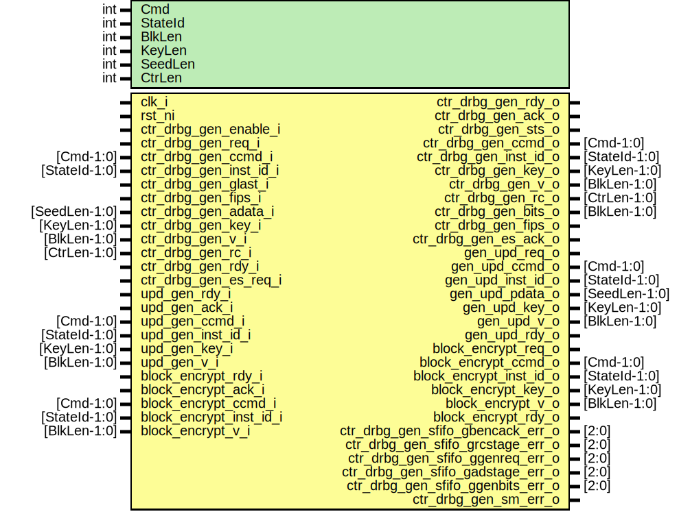

# Entity: csrng_ctr_drbg_gen
## Diagram

## Description
Copyright lowRISC contributors.
 Licensed under the Apache License, Version 2.0, see LICENSE for details.
 SPDX-License-Identifier: Apache-2.0
 Description: csrng ctr_drbg generate module
 This module will process the second half of the generate function.
 It takes in the key, v, and reseed counter values processed by the
 ctr_drbg cmd module.
 
## Generics
| Generic name | Type | Value | Description |
| ------------ | ---- | ----- | ----------- |
| Cmd          | int  | 3     |             |
| StateId      | int  | 4     |             |
| BlkLen       | int  | 128   |             |
| KeyLen       | int  | 256   |             |
| SeedLen      | int  | 384   |             |
| CtrLen       | int  | 32    |             |
## Ports
| Port name                         | Direction | Type          | Description                                      |
| --------------------------------- | --------- | ------------- | ------------------------------------------------ |
| clk_i                             | input     |               |                                                  |
| rst_ni                            | input     |               |                                                  |
| ctr_drbg_gen_enable_i             | input     |               | command interface                                |
| ctr_drbg_gen_req_i                | input     |               |                                                  |
| ctr_drbg_gen_rdy_o                | output    |               | ready to process the req above                   |
| ctr_drbg_gen_ccmd_i               | input     | [Cmd-1:0]     | current command                                  |
| ctr_drbg_gen_inst_id_i            | input     | [StateId-1:0] | instantance id                                   |
| ctr_drbg_gen_glast_i              | input     |               | gen cmd last beat                                |
| ctr_drbg_gen_fips_i               | input     |               | fips                                             |
| ctr_drbg_gen_adata_i              | input     | [SeedLen-1:0] | additional data                                  |
| ctr_drbg_gen_key_i                | input     | [KeyLen-1:0]  |                                                  |
| ctr_drbg_gen_v_i                  | input     | [BlkLen-1:0]  |                                                  |
| ctr_drbg_gen_rc_i                 | input     | [CtrLen-1:0]  |                                                  |
| ctr_drbg_gen_ack_o                | output    |               | final ack when update process has been completed |
| ctr_drbg_gen_sts_o                | output    |               | final ack status                                 |
| ctr_drbg_gen_rdy_i                | input     |               | ready to process the ack above                   |
| ctr_drbg_gen_ccmd_o               | output    | [Cmd-1:0]     |                                                  |
| ctr_drbg_gen_inst_id_o            | output    | [StateId-1:0] |                                                  |
| ctr_drbg_gen_key_o                | output    | [KeyLen-1:0]  |                                                  |
| ctr_drbg_gen_v_o                  | output    | [BlkLen-1:0]  |                                                  |
| ctr_drbg_gen_rc_o                 | output    | [CtrLen-1:0]  |                                                  |
| ctr_drbg_gen_bits_o               | output    | [BlkLen-1:0]  |                                                  |
| ctr_drbg_gen_fips_o               | output    |               |                                                  |
| ctr_drbg_gen_es_req_i             | input     |               | es_req/ack                                       |
| ctr_drbg_gen_es_ack_o             | output    |               |                                                  |
| gen_upd_req_o                     | output    |               | update interface                                 |
| upd_gen_rdy_i                     | input     |               |                                                  |
| gen_upd_ccmd_o                    | output    | [Cmd-1:0]     |                                                  |
| gen_upd_inst_id_o                 | output    | [StateId-1:0] |                                                  |
| gen_upd_pdata_o                   | output    | [SeedLen-1:0] |                                                  |
| gen_upd_key_o                     | output    | [KeyLen-1:0]  |                                                  |
| gen_upd_v_o                       | output    | [BlkLen-1:0]  |                                                  |
| upd_gen_ack_i                     | input     |               |                                                  |
| gen_upd_rdy_o                     | output    |               |                                                  |
| upd_gen_ccmd_i                    | input     | [Cmd-1:0]     |                                                  |
| upd_gen_inst_id_i                 | input     | [StateId-1:0] |                                                  |
| upd_gen_key_i                     | input     | [KeyLen-1:0]  |                                                  |
| upd_gen_v_i                       | input     | [BlkLen-1:0]  |                                                  |
| block_encrypt_req_o               | output    |               | block encrypt interface                          |
| block_encrypt_rdy_i               | input     |               |                                                  |
| block_encrypt_ccmd_o              | output    | [Cmd-1:0]     |                                                  |
| block_encrypt_inst_id_o           | output    | [StateId-1:0] |                                                  |
| block_encrypt_key_o               | output    | [KeyLen-1:0]  |                                                  |
| block_encrypt_v_o                 | output    | [BlkLen-1:0]  |                                                  |
| block_encrypt_ack_i               | input     |               |                                                  |
| block_encrypt_rdy_o               | output    |               |                                                  |
| block_encrypt_ccmd_i              | input     | [Cmd-1:0]     |                                                  |
| block_encrypt_inst_id_i           | input     | [StateId-1:0] |                                                  |
| block_encrypt_v_i                 | input     | [BlkLen-1:0]  |                                                  |
| ctr_drbg_gen_sfifo_gbencack_err_o | output    | [2:0]         | misc                                             |
| ctr_drbg_gen_sfifo_grcstage_err_o | output    | [2:0]         |                                                  |
| ctr_drbg_gen_sfifo_ggenreq_err_o  | output    | [2:0]         |                                                  |
| ctr_drbg_gen_sfifo_gadstage_err_o | output    | [2:0]         |                                                  |
| ctr_drbg_gen_sfifo_ggenbits_err_o | output    | [2:0]         |                                                  |
| ctr_drbg_gen_sm_err_o             | output    |               |                                                  |
## Signals
| Name                    | Type                           | Description                                                        |
| ----------------------- | ------------------------------ | ------------------------------------------------------------------ |
| genreq_ccmd             | logic [Cmd-1:0]                | signals                                                            |
| genreq_id               | logic [StateId-1:0]            |                                                                    |
| genreq_glast            | logic                          |                                                                    |
| genreq_adata            | logic [SeedLen-1:0]            |                                                                    |
| genreq_fips             | logic                          |                                                                    |
| genreq_key              | logic [KeyLen-1:0]             |                                                                    |
| genreq_v                | logic [BlkLen-1:0]             |                                                                    |
| genreq_rc               | logic [CtrLen-1:0]             |                                                                    |
| adstage_key             | logic [KeyLen-1:0]             |                                                                    |
| adstage_v               | logic [BlkLen-1:0]             |                                                                    |
| adstage_rc              | logic [CtrLen-1:0]             |                                                                    |
| adstage_fips            | logic                          |                                                                    |
| adstage_glast           | logic                          |                                                                    |
| adstage_adata           | logic [SeedLen-1:0]            |                                                                    |
| rcstage_key             | logic [KeyLen-1:0]             |                                                                    |
| rcstage_v               | logic [BlkLen-1:0]             |                                                                    |
| rcstage_bits            | logic [BlkLen-1:0]             |                                                                    |
| rcstage_rc              | logic [CtrLen-1:0]             |                                                                    |
| rcstage_glast           | logic                          |                                                                    |
| rcstage_fips            | logic                          |                                                                    |
| rcstage_rc_plus1        | logic [CtrLen-1:0]             |                                                                    |
| rcstage_ccmd            | logic [Cmd-1:0]                |                                                                    |
| rcstage_inst_id         | logic [StateId-1:0]            |                                                                    |
| genreq_ccmd_modified    | logic [Cmd-1:0]                |                                                                    |
| bencack_ccmd_modified   | logic [Cmd-1:0]                |                                                                    |
| sfifo_genreq_rdata      | logic [GenreqFifoWidth-1:0]    | cmdreq fifo logic [$clog2(CmdreqFifoDepth):0] sfifo_cmdreq_depth;  |
| sfifo_genreq_push       | logic                          |                                                                    |
| sfifo_genreq_wdata      | logic [GenreqFifoWidth-1:0]    |                                                                    |
| sfifo_genreq_pop        | logic                          |                                                                    |
| sfifo_genreq_full       | logic                          |                                                                    |
| sfifo_genreq_not_empty  | logic                          |                                                                    |
| sfifo_adstage_rdata     | logic [AdstageFifoWidth-1:0]   | adstage fifo                                                       |
| sfifo_adstage_push      | logic                          |                                                                    |
| sfifo_adstage_wdata     | logic [AdstageFifoWidth-1:0]   |                                                                    |
| sfifo_adstage_pop       | logic                          |                                                                    |
| sfifo_adstage_full      | logic                          |                                                                    |
| sfifo_adstage_not_empty | logic                          |                                                                    |
| sfifo_bencack_rdata     | logic [BlkEncAckFifoWidth-1:0] | blk_encrypt_ack fifo                                               |
| sfifo_bencack_push      | logic                          |                                                                    |
| sfifo_bencack_wdata     | logic [BlkEncAckFifoWidth-1:0] |                                                                    |
| sfifo_bencack_pop       | logic                          |                                                                    |
| sfifo_bencack_full      | logic                          |                                                                    |
| sfifo_bencack_not_empty | logic                          |                                                                    |
| sfifo_bencack_ccmd      | logic [Cmd-1:0]                | breakout                                                           |
| sfifo_bencack_inst_id   | logic [StateId-1:0]            |                                                                    |
| sfifo_bencack_bits      | logic [BlkLen-1:0]             |                                                                    |
| sfifo_rcstage_rdata     | logic [RCStageFifoWidth-1:0]   | rcstage fifo                                                       |
| sfifo_rcstage_push      | logic                          |                                                                    |
| sfifo_rcstage_wdata     | logic [RCStageFifoWidth-1:0]   |                                                                    |
| sfifo_rcstage_pop       | logic                          |                                                                    |
| sfifo_rcstage_full      | logic                          |                                                                    |
| sfifo_rcstage_not_empty | logic                          |                                                                    |
| sfifo_genbits_rdata     | logic [GenbitsFifoWidth-1:0]   | genbits fifo                                                       |
| sfifo_genbits_push      | logic                          |                                                                    |
| sfifo_genbits_wdata     | logic [GenbitsFifoWidth-1:0]   |                                                                    |
| sfifo_genbits_pop       | logic                          |                                                                    |
| sfifo_genbits_full      | logic                          |                                                                    |
| sfifo_genbits_not_empty | logic                          |                                                                    |
| v_inc                   | logic [CtrLen-1:0]             |                                                                    |
| v_first                 | logic [BlkLen-1:0]             |                                                                    |
| v_sized                 | logic [BlkLen-1:0]             |                                                                    |
| v_ctr_load              | logic                          |                                                                    |
| v_ctr_inc               | logic                          |                                                                    |
| interate_ctr_done       | logic                          |                                                                    |
| interate_ctr_inc        | logic                          |                                                                    |
| v_ctr_q                 | logic [CtrLen-1:0]             | flops                                                              |
| v_ctr_d                 | logic [CtrLen-1:0]             | flops                                                              |
| interate_ctr_q          | logic [1:0]                    |                                                                    |
| interate_ctr_d          | logic [1:0]                    |                                                                    |
| state_d                 | state_e                        |                                                                    |
| state_q                 | state_e                        |                                                                    |
| state_raw_q             | logic [StateWidth-1:0]         |                                                                    |
## Constants
| Name               | Type | Value                                        | Description |
| ------------------ | ---- | -------------------------------------------- | ----------- |
| GenreqFifoDepth    | int  | 1                                            |             |
| GenreqFifoWidth    | int  | KeyLen+BlkLen+CtrLen+1+SeedLen+1+StateId+Cmd |             |
| BlkEncAckFifoDepth | int  | 1                                            |             |
| BlkEncAckFifoWidth | int  | BlkLen+StateId+Cmd                           |             |
| AdstageFifoDepth   | int  | 1                                            |             |
| AdstageFifoWidth   | int  | KeyLen+BlkLen+CtrLen+1+SeedLen+1             |             |
| RCStageFifoDepth   | int  | 1                                            |             |
| RCStageFifoWidth   | int  | KeyLen+BlkLen+BlkLen+CtrLen+1+1+StateId+Cmd  |             |
| GenbitsFifoDepth   | int  | 1                                            |             |
| GenbitsFifoWidth   | int  | 1+BlkLen+KeyLen+BlkLen+CtrLen+StateId+Cmd    |             |
| StateWidth         | int  | 5                                            |             |
## Types
| Name    | Type                                                                                                                               | Description |
| ------- | ---------------------------------------------------------------------------------------------------------------------------------- | ----------- |
| state_e | enum logic [StateWidth-1:0] {     ReqIdle  = 5'b01101,     ReqSend  = 5'b00011,     ESHalt   = 5'b11000,     ReqError = 5'b10110 } |             |
## Processes
- unnamed: _( @(posedge clk_i or negedge rst_ni) )_

- unnamed: _(  )_

## Instantiations
- u_state_regs: prim_flop
**Description**
This primitive is used to place a size-only constraint on the
flops in order to prevent FSM state encoding optimizations.

- u_prim_fifo_sync_genreq: prim_fifo_sync
- u_prim_fifo_sync_adstage: prim_fifo_sync
- u_prim_fifo_sync_bencack: prim_fifo_sync
- u_prim_fifo_sync_rcstage: prim_fifo_sync
- u_prim_fifo_sync_genbits: prim_fifo_sync
