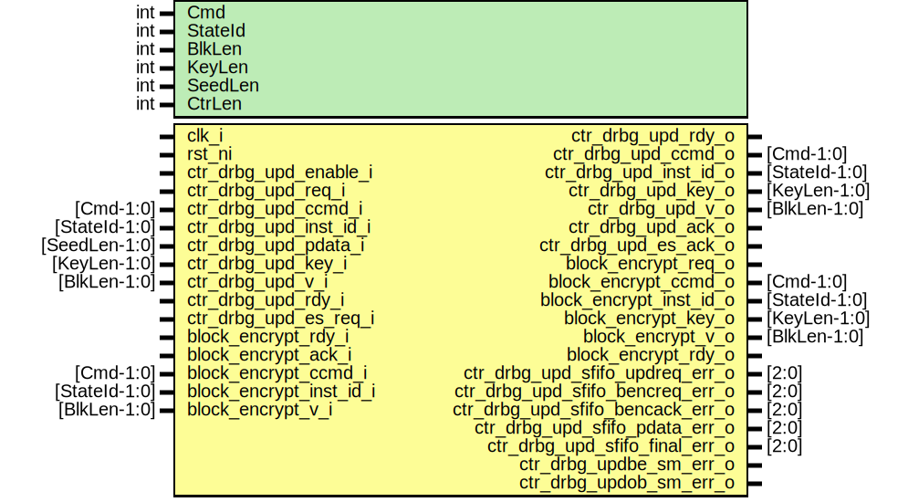

# Entity: csrng_ctr_drbg_upd

- **File**: csrng_ctr_drbg_upd.sv
## Diagram

## Description

 Copyright lowRISC contributors.
 Licensed under the Apache License, Version 2.0, see LICENSE for details.
 SPDX-License-Identifier: Apache-2.0

 Description: csrng ctr_drbg_update module

 implementation using security_strength = 256

## Generics

| Generic name | Type | Value | Description |
| ------------ | ---- | ----- | ----------- |
| Cmd          | int  | 3     |             |
| StateId      | int  | 4     |             |
| BlkLen       | int  | 128   |             |
| KeyLen       | int  | 256   |             |
| SeedLen      | int  | 384   |             |
| CtrLen       | int  | 32    |             |
## Ports

| Port name                        | Direction | Type          | Description                                      |
| -------------------------------- | --------- | ------------- | ------------------------------------------------ |
| clk_i                            | input     |               |                                                  |
| rst_ni                           | input     |               |                                                  |
| ctr_drbg_upd_enable_i            | input     |               |  update interface                                |
| ctr_drbg_upd_req_i               | input     |               |                                                  |
| ctr_drbg_upd_rdy_o               | output    |               | ready to process the req above                   |
| ctr_drbg_upd_ccmd_i              | input     | [Cmd-1:0]     |                                                  |
| ctr_drbg_upd_inst_id_i           | input     | [StateId-1:0] | instantance id                                   |
| ctr_drbg_upd_pdata_i             | input     | [SeedLen-1:0] | provided_data                                    |
| ctr_drbg_upd_key_i               | input     | [KeyLen-1:0]  |                                                  |
| ctr_drbg_upd_v_i                 | input     | [BlkLen-1:0]  |                                                  |
| ctr_drbg_upd_ccmd_o              | output    | [Cmd-1:0]     |                                                  |
| ctr_drbg_upd_inst_id_o           | output    | [StateId-1:0] |                                                  |
| ctr_drbg_upd_key_o               | output    | [KeyLen-1:0]  |                                                  |
| ctr_drbg_upd_v_o                 | output    | [BlkLen-1:0]  |                                                  |
| ctr_drbg_upd_ack_o               | output    |               | final ack when update process has been completed |
| ctr_drbg_upd_rdy_i               | input     |               | readu to process the ack above                   |
| ctr_drbg_upd_es_req_i            | input     |               |  es_req/ack                                      |
| ctr_drbg_upd_es_ack_o            | output    |               |                                                  |
| block_encrypt_req_o              | output    |               |  block encrypt interface                         |
| block_encrypt_rdy_i              | input     |               |                                                  |
| block_encrypt_ccmd_o             | output    | [Cmd-1:0]     |                                                  |
| block_encrypt_inst_id_o          | output    | [StateId-1:0] |                                                  |
| block_encrypt_key_o              | output    | [KeyLen-1:0]  |                                                  |
| block_encrypt_v_o                | output    | [BlkLen-1:0]  |                                                  |
| block_encrypt_ack_i              | input     |               |                                                  |
| block_encrypt_rdy_o              | output    |               |                                                  |
| block_encrypt_ccmd_i             | input     | [Cmd-1:0]     |                                                  |
| block_encrypt_inst_id_i          | input     | [StateId-1:0] |                                                  |
| block_encrypt_v_i                | input     | [BlkLen-1:0]  |                                                  |
| ctr_drbg_upd_sfifo_updreq_err_o  | output    | [2:0]         |                                                  |
| ctr_drbg_upd_sfifo_bencreq_err_o | output    | [2:0]         |                                                  |
| ctr_drbg_upd_sfifo_bencack_err_o | output    | [2:0]         |                                                  |
| ctr_drbg_upd_sfifo_pdata_err_o   | output    | [2:0]         |                                                  |
| ctr_drbg_upd_sfifo_final_err_o   | output    | [2:0]         |                                                  |
| ctr_drbg_updbe_sm_err_o          | output    |               |                                                  |
| ctr_drbg_updob_sm_err_o          | output    |               |                                                  |
## Signals

| Name                               | Type                           | Description                                                   |
| ---------------------------------- | ------------------------------ | ------------------------------------------------------------- |
| updated_key_and_v                  | logic [SeedLen-1:0]            |  signals                                                      |
| v_inc                              | logic [CtrLen-1:0]             |                                                               |
| v_first                            | logic [BlkLen-1:0]             |                                                               |
| v_sized                            | logic [BlkLen-1:0]             |                                                               |
| sfifo_updreq_rdata                 | logic [UpdReqFifoWidth-1:0]    |  upd_req fifo                                                 |
| sfifo_updreq_push                  | logic                          |                                                               |
| sfifo_updreq_wdata                 | logic [UpdReqFifoWidth-1:0]    |                                                               |
| sfifo_updreq_pop                   | logic                          |                                                               |
| sfifo_updreq_full                  | logic                          |                                                               |
| sfifo_updreq_not_empty             | logic                          |                                                               |
| sfifo_updreq_ccmd                  | logic [Cmd-1:0]                |  breakout                                                     |
| sfifo_updreq_inst_id               | logic [StateId-1:0]            |                                                               |
| sfifo_updreq_pdata                 | logic [SeedLen-1:0]            |                                                               |
| sfifo_updreq_key                   | logic [KeyLen-1:0]             |                                                               |
| sfifo_updreq_v                     | logic [BlkLen-1:0]             |                                                               |
| sfifo_bencreq_rdata                | logic [BlkEncReqFifoWidth-1:0] |  blk_encrypt_req fifo                                         |
| sfifo_bencreq_push                 | logic                          |                                                               |
| sfifo_bencreq_wdata                | logic [BlkEncReqFifoWidth-1:0] |                                                               |
| sfifo_bencreq_pop                  | logic                          |                                                               |
| sfifo_bencreq_full                 | logic                          |                                                               |
| sfifo_bencreq_not_empty            | logic                          |                                                               |
| sfifo_bencreq_ccmd                 | logic [Cmd-1:0]                |  breakout                                                     |
| sfifo_bencreq_inst_id              | logic [StateId-1:0]            |                                                               |
| sfifo_bencreq_key                  | logic [KeyLen-1:0]             |                                                               |
| sfifo_bencreq_v                    | logic [BlkLen-1:0]             |                                                               |
| sfifo_bencack_rdata                | logic [BlkEncAckFifoWidth-1:0] |  blk_encrypt_ack fifo                                         |
| sfifo_bencack_push                 | logic                          |                                                               |
| sfifo_bencack_wdata                | logic [BlkEncAckFifoWidth-1:0] |                                                               |
| sfifo_bencack_pop                  | logic                          |                                                               |
| sfifo_bencack_full                 | logic                          |                                                               |
| sfifo_bencack_not_empty            | logic                          |                                                               |
| sfifo_bencack_ccmd                 | logic [Cmd-1:0]                |  breakout                                                     |
| sfifo_bencack_inst_id              | logic [StateId-1:0]            |                                                               |
| sfifo_bencack_v                    | logic [BlkLen-1:0]             |                                                               |
| sfifo_pdata_rdata                  | logic [PDataFifoWidth-1:0]     |  pdata_stage fifo                                             |
| sfifo_pdata_push                   | logic                          |                                                               |
| sfifo_pdata_wdata                  | logic [PDataFifoWidth-1:0]     |                                                               |
| sfifo_pdata_pop                    | logic                          |                                                               |
| sfifo_pdata_full                   | logic                          |                                                               |
| sfifo_pdata_not_empty              | logic                          |                                                               |
| sfifo_pdata_v                      | logic [SeedLen-1:0]            |                                                               |
| sfifo_final_rdata                  | logic [FinalFifoWidth-1:0]     |  key_v fifo                                                   |
| sfifo_final_push                   | logic                          |                                                               |
| sfifo_final_wdata                  | logic [FinalFifoWidth-1:0]     |                                                               |
| sfifo_final_pop                    | logic                          |                                                               |
| sfifo_final_full                   | logic                          |                                                               |
| sfifo_final_not_empty              | logic                          |                                                               |
| sfifo_final_ccmd                   | logic [Cmd-1:0]                |  breakout                                                     |
| sfifo_final_inst_id                | logic [StateId-1:0]            |                                                               |
| sfifo_final_key                    | logic [KeyLen-1:0]             |                                                               |
| sfifo_final_v                      | logic [BlkLen-1:0]             |                                                               |
| v_ctr_load                         | logic                          |                                                               |
| v_ctr_inc                          | logic                          |                                                               |
| interate_ctr_done                  | logic                          |                                                               |
| interate_ctr_inc                   | logic                          |                                                               |
| concat_outblk_shift                | logic                          |                                                               |
| concat_ctr_done                    | logic                          |                                                               |
| concat_ctr_inc                     | logic                          |                                                               |
| concat_outblk_shifted_value        | logic [SeedLen+BlkLen-1:0]     |                                                               |
| v_ctr_q                            | logic [CtrLen-1:0]             |  flops                                                        |
| v_ctr_d                            | logic [CtrLen-1:0]             |  flops                                                        |
| interate_ctr_q                     | logic [1:0]                    |                                                               |
| interate_ctr_d                     | logic [1:0]                    |                                                               |
| concat_ctr_q                       | logic [1:0]                    |                                                               |
| concat_ctr_d                       | logic [1:0]                    |                                                               |
| concat_outblk_q                    | logic [SeedLen-1:0]            |                                                               |
| concat_outblk_d                    | logic [SeedLen-1:0]            |                                                               |
| concat_ccmd_q                      | logic [Cmd-1:0]                |                                                               |
| concat_ccmd_d                      | logic [Cmd-1:0]                |                                                               |
| concat_inst_id_q                   | logic [StateId-1:0]            |                                                               |
| concat_inst_id_d                   | logic [StateId-1:0]            |                                                               |
| blk_enc_state_d                    | blk_enc_state_e                |                                                               |
| blk_enc_state_q                    | blk_enc_state_e                |                                                               |
| blk_enc_state_raw_q                | logic [BlkEncStateWidth-1:0]   |                                                               |
| outblk_state_d                     | outblk_state_e                 |                                                               |
| outblk_state_q                     | outblk_state_e                 |                                                               |
| outblk_state_raw_q                 | logic [OutBlkStateWidth-1:0]   |                                                               |
| unused_concat_outblk_shifted_value | logic [BlkLen-1:0]             |  The following signal is used to avoid possible lint errors.  |
## Constants

| Name               | Type | Value                             | Description                                                                                                                                                                                                                                                                                                                                                                                |
| ------------------ | ---- | --------------------------------- | ------------------------------------------------------------------------------------------------------------------------------------------------------------------------------------------------------------------------------------------------------------------------------------------------------------------------------------------------------------------------------------------ |
| UpdReqFifoDepth    | int  | 1                                 |                                                                                                                                                                                                                                                                                                                                                                                            |
| UpdReqFifoWidth    | int  | KeyLen+BlkLen+SeedLen+StateId+Cmd |                                                                                                                                                                                                                                                                                                                                                                                            |
| BlkEncReqFifoDepth | int  | 1                                 |                                                                                                                                                                                                                                                                                                                                                                                            |
| BlkEncReqFifoWidth | int  | KeyLen+BlkLen+StateId+Cmd         |                                                                                                                                                                                                                                                                                                                                                                                            |
| BlkEncAckFifoDepth | int  | 1                                 |                                                                                                                                                                                                                                                                                                                                                                                            |
| BlkEncAckFifoWidth | int  | BlkLen+StateId+Cmd                |                                                                                                                                                                                                                                                                                                                                                                                            |
| PDataFifoDepth     | int  | 1                                 |                                                                                                                                                                                                                                                                                                                                                                                            |
| PDataFifoWidth     | int  | SeedLen                           |                                                                                                                                                                                                                                                                                                                                                                                            |
| FinalFifoDepth     | int  | 1                                 |                                                                                                                                                                                                                                                                                                                                                                                            |
| FinalFifoWidth     | int  | KeyLen+BlkLen+StateId+Cmd         |                                                                                                                                                                                                                                                                                                                                                                                            |
| BlkEncStateWidth   | int  | 5                                 |  Encoding generated with:  $ ./util/design/sparse-fsm-encode.py -d 3 -m 4 -n 5 \       -s 47328894 --language=sv   Hamming distance histogram:    0: --   1: --   2: --   3: |||||||||||||||||||| (66.67%)   4: |||||||||| (33.33%)   5: --   Minimum Hamming distance: 3  Maximum Hamming distance: 4  Minimum Hamming weight: 2  Maximum Hamming weight: 3                   |
| OutBlkStateWidth   | int  | 6                                 |  Encoding generated with:  $ ./util/design/sparse-fsm-encode.py -d 3 -m 4 -n 6 \       -s 400877681 --language=sv   Hamming distance histogram:    0: --   1: --   2: --   3: |||||||||||||||||||| (66.67%)   4: ||||| (16.67%)   5: --   6: ||||| (16.67%)   Minimum Hamming distance: 3  Maximum Hamming distance: 6  Minimum Hamming weight: 2  Maximum Hamming weight: 4   |
## Types

| Name            | Type                                                                                                                                                                                                                                                                                       | Description |
| --------------- | ------------------------------------------------------------------------------------------------------------------------------------------------------------------------------------------------------------------------------------------------------------------------------------------ | ----------- |
| blk_enc_state_e | enum logic [BlkEncStateWidth-1:0] {      ReqIdle = 5'b11000,      ReqSend = 5'b10011,      ESHalt  = 5'b01110,      BEError = 5'b00101   }     |             |
| outblk_state_e  | enum logic [OutBlkStateWidth-1:0] {      AckIdle = 6'b110110,      Load    = 6'b110001,      Shift   = 6'b001001,      OBError = 6'b011100   } |             |
## Processes
- unnamed: ( @(posedge clk_i or negedge rst_ni) )
  - **Type:** always_ff
- unnamed: (  )
  - **Type:** always_comb
**Description**
--------------------------------------------  state machine to send values to block_encrypt -------------------------------------------- 
- unnamed: (  )
  - **Type:** always_comb
**Description**
--------------------------------------------  state machine to receive values from block_encrypt -------------------------------------------- 
## Instantiations

- u_blk_enc_state_regs: prim_flop
**Description**
 This primitive is used to place a size-only constraint on the
 flops in order to prevent FSM state encoding optimizations.

- u_outblk_state_regs: prim_flop
**Description**
 This primitive is used to place a size-only constraint on the
 flops in order to prevent FSM state encoding optimizations.

- u_prim_fifo_sync_updreq: prim_fifo_sync
**Description**
 else: !if(!rst_ni)
--------------------------------------------
 input request fifo for staging update requests
--------------------------------------------

- u_prim_fifo_sync_bencreq: prim_fifo_sync
**Description**
--------------------------------------------
 block_encrypt request fifo for staging aes requests
--------------------------------------------

- u_prim_fifo_sync_bencack: prim_fifo_sync
**Description**
--------------------------------------------
 block_encrypt response fifo from block encrypt
--------------------------------------------

- u_prim_fifo_sync_pdata: prim_fifo_sync
**Description**
--------------------------------------------
 fifo to stage provided_data, waiting for blk_encrypt to ack
--------------------------------------------

- u_prim_fifo_sync_final: prim_fifo_sync
