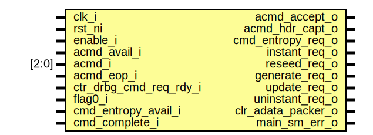

# Entity: csrng_main_sm

- **File**: csrng_main_sm.sv
## Diagram

## Description

Copyright lowRISC contributors.
 Licensed under the Apache License, Version 2.0, see LICENSE for details.
 SPDX-License-Identifier: Apache-2.0
 Description: csrng app cmd request state machine module
  - handles all app cmd requests from all requesting interfaces
 
## Ports

| Port name              | Direction | Type  | Description |
| ---------------------- | --------- | ----- | ----------- |
| clk_i                  | input     |       |             |
| rst_ni                 | input     |       |             |
| enable_i               | input     |       |             |
| acmd_avail_i           | input     |       |             |
| acmd_accept_o          | output    |       |             |
| acmd_hdr_capt_o        | output    |       |             |
| acmd_i                 | input     | [2:0] |             |
| acmd_eop_i             | input     |       |             |
| ctr_drbg_cmd_req_rdy_i | input     |       |             |
| flag0_i                | input     |       |             |
| cmd_entropy_req_o      | output    |       |             |
| cmd_entropy_avail_i    | input     |       |             |
| instant_req_o          | output    |       |             |
| reseed_req_o           | output    |       |             |
| generate_req_o         | output    |       |             |
| update_req_o           | output    |       |             |
| uninstant_req_o        | output    |       |             |
| cmd_complete_i         | input     |       |             |
| main_sm_err_o          | output    |       |             |
## Signals

| Name        | Type                   | Description |
| ----------- | ---------------------- | ----------- |
| state_d     | state_e                |             |
| state_q     | state_e                |             |
| state_raw_q | logic [StateWidth-1:0] |             |
## Constants

| Name       | Type | Value | Description |
| ---------- | ---- | ----- | ----------- |
| StateWidth | int  | 8     |             |
## Types

| Name    | Type                                                                                                                                                                                                                                                                                                                                                                                                                                                                                                                                                                                                                                                                                                                                                                                                                     | Description |
| ------- | ------------------------------------------------------------------------------------------------------------------------------------------------------------------------------------------------------------------------------------------------------------------------------------------------------------------------------------------------------------------------------------------------------------------------------------------------------------------------------------------------------------------------------------------------------------------------------------------------------------------------------------------------------------------------------------------------------------------------------------------------------------------------------------------------------------------------ | ----------- |
| state_e | enum logic [StateWidth-1:0] {      Idle    =      8'b01110011,       InstantPrep  = 8'b11010010,       InstantReq   = 8'b01010100,       ReseedPrep   = 8'b10101111,       ReseedReq    = 8'b00101010,       GenerateReq  = 8'b00100101,       UpdatePrep   = 8'b11001011,       UpdateReq    = 8'b00010111,       UninstantReq = 8'b10000110,       CmdCompWait  = 8'b10011100,       Error        = 8'b11000101     } |             |
## Processes
- unnamed: (  )
## Instantiations

- u_state_regs: prim_flop
**Description**
This primitive is used to place a size-only constraint on the
flops in order to prevent FSM state encoding optimizations.

