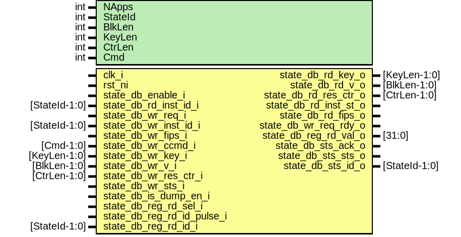

# Entity: csrng_state_db

- **File**: csrng_state_db.sv
## Diagram

## Description

Copyright lowRISC contributors.
 Licensed under the Apache License, Version 2.0, see LICENSE for details.
 SPDX-License-Identifier: Apache-2.0
 Description: csrng state data base module
 This is the container for accessing the current
    working state for a given drbg instance.
 
## Generics

| Generic name | Type | Value | Description |
| ------------ | ---- | ----- | ----------- |
| NApps        | int  | 4     |             |
| StateId      | int  | 4     |             |
| BlkLen       | int  | 128   |             |
| KeyLen       | int  | 256   |             |
| CtrLen       | int  | 32    |             |
| Cmd          | int  | 3     |             |
## Ports

| Port name                  | Direction | Type          | Description      |
| -------------------------- | --------- | ------------- | ---------------- |
| clk_i                      | input     |               |                  |
| rst_ni                     | input     |               |                  |
| state_db_enable_i          | input     |               | read interface   |
| state_db_rd_inst_id_i      | input     | [StateId-1:0] |                  |
| state_db_rd_key_o          | output    | [KeyLen-1:0]  |                  |
| state_db_rd_v_o            | output    | [BlkLen-1:0]  |                  |
| state_db_rd_res_ctr_o      | output    | [CtrLen-1:0]  |                  |
| state_db_rd_inst_st_o      | output    |               |                  |
| state_db_rd_fips_o         | output    |               |                  |
| state_db_wr_req_i          | input     |               | write interface  |
| state_db_wr_req_rdy_o      | output    |               |                  |
| state_db_wr_inst_id_i      | input     | [StateId-1:0] |                  |
| state_db_wr_fips_i         | input     |               |                  |
| state_db_wr_ccmd_i         | input     | [Cmd-1:0]     |                  |
| state_db_wr_key_i          | input     | [KeyLen-1:0]  |                  |
| state_db_wr_v_i            | input     | [BlkLen-1:0]  |                  |
| state_db_wr_res_ctr_i      | input     | [CtrLen-1:0]  |                  |
| state_db_wr_sts_i          | input     |               |                  |
| state_db_is_dump_en_i      | input     |               | status interface |
| state_db_reg_rd_sel_i      | input     |               |                  |
| state_db_reg_rd_id_pulse_i | input     |               |                  |
| state_db_reg_rd_id_i       | input     | [StateId-1:0] |                  |
| state_db_reg_rd_val_o      | output    | [31:0]        |                  |
| state_db_sts_ack_o         | output    |               |                  |
| state_db_sts_sts_o         | output    |               |                  |
| state_db_sts_id_o          | output    | [StateId-1:0] |                  |
## Signals

| Name                     | Type                              | Description       |
| ------------------------ | --------------------------------- | ----------------- |
| state_db_id              | logic [StateId-1:0]               |                   |
| state_db_key             | logic [KeyLen-1:0]                |                   |
| state_db_v               | logic [BlkLen-1:0]                |                   |
| state_db_rc              | logic [CtrLen-1:0]                |                   |
| state_db_fips            | logic                             |                   |
| state_db_inst_st         | logic                             |                   |
| state_db_sts             | logic                             |                   |
| state_db_write           | logic                             |                   |
| instance_status          | logic                             |                   |
| int_st_out_sel           | logic [NApps-1:0]                 |                   |
| int_st_dump_sel          | logic [NApps-1:0]                 |                   |
| internal_states_out      | logic [InternalStateWidth-1:0]    |                   |
| internal_states_dump     | logic [InternalStateWidth-1:0]    |                   |
| internal_state_diag      | logic [RegInternalStateWidth-1:0] |                   |
| reg_rd_ptr_inc           | logic                             |                   |
| state_db_sts_ack_q       | logic                             | flops             |
| state_db_sts_ack_d       | logic                             | flops             |
| state_db_sts_sts_q       | logic                             |                   |
| state_db_sts_sts_d       | logic                             |                   |
| state_db_sts_id_q        | logic [StateId-1:0]               |                   |
| state_db_sts_id_d        | logic [StateId-1:0]               |                   |
| reg_rd_ptr_q             | logic [StateId-1:0]               |                   |
| reg_rd_ptr_d             | logic [StateId-1:0]               |                   |
| int_st_dump_id_q         | logic [StateId-1:0]               |                   |
| int_st_dump_id_d         | logic [StateId-1:0]               |                   |
| internal_states_q        | logic [InternalStateWidth-1:0]    | flops - no reset  |
| internal_states_d        | logic [InternalStateWidth-1:0]    | flops - no reset  |
| internal_state_pl_q      | logic [InternalStateWidth-1:0]    |                   |
| internal_state_pl_d      | logic [InternalStateWidth-1:0]    |                   |
| internal_state_pl_dump_q | logic [InternalStateWidth-1:0]    |                   |
| internal_state_pl_dump_d | logic [InternalStateWidth-1:0]    |                   |
## Constants

| Name                  | Type | Value                              | Description |
| --------------------- | ---- | ---------------------------------- | ----------- |
| InternalStateWidth    | int  | 2+KeyLen+BlkLen+CtrLen             |             |
| RegInternalStateWidth | int  | 30+InternalStateWidth              |             |
| RegW                  | int  | 32                                 |             |
| StateWidth            | int  | 1+1+KeyLen+BlkLen+CtrLen+StateId+1 |             |
## Processes
- unnamed: ( @(posedge clk_i or negedge rst_ni) )
- unnamed: ( @(posedge clk_i) )
**Description**
no reset on state

- unnamed: (  )
**Description**
since only one of the internal states is active at a time, a
logical "or" is made of all of the buses into one

