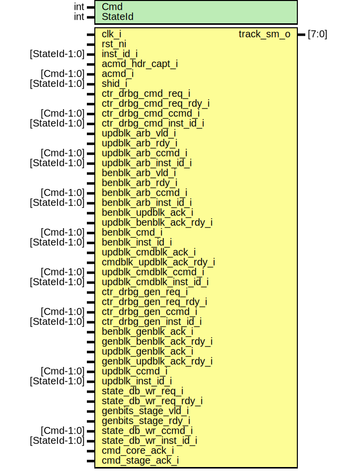

# Entity: csrng_track_sm
## Diagram

## Description
Copyright lowRISC contributors.
 Licensed under the Apache License, Version 2.0, see LICENSE for details.
 SPDX-License-Identifier: Apache-2.0
 Description: csrng command tracking state machine module
   provides debugging of command flow through csrng
 
## Generics
| Generic name | Type | Value | Description |
| ------------ | ---- | ----- | ----------- |
| Cmd          | int  | 3     |             |
| StateId      | int  | 4     |             |
## Ports
| Port name               | Direction | Type          | Description       |
| ----------------------- | --------- | ------------- | ----------------- |
| clk_i                   | input     |               |                   |
| rst_ni                  | input     |               |                   |
| inst_id_i               | input     | [StateId-1:0] | ins req interface |
| acmd_hdr_capt_i         | input     |               |                   |
| acmd_i                  | input     | [Cmd-1:0]     |                   |
| shid_i                  | input     | [StateId-1:0] |                   |
| ctr_drbg_cmd_req_i      | input     |               |                   |
| ctr_drbg_cmd_req_rdy_i  | input     |               |                   |
| ctr_drbg_cmd_ccmd_i     | input     | [Cmd-1:0]     |                   |
| ctr_drbg_cmd_inst_id_i  | input     | [StateId-1:0] |                   |
| updblk_arb_vld_i        | input     |               |                   |
| updblk_arb_rdy_i        | input     |               |                   |
| updblk_arb_ccmd_i       | input     | [Cmd-1:0]     |                   |
| updblk_arb_inst_id_i    | input     | [StateId-1:0] |                   |
| benblk_arb_vld_i        | input     |               |                   |
| benblk_arb_rdy_i        | input     |               |                   |
| benblk_arb_ccmd_i       | input     | [Cmd-1:0]     |                   |
| benblk_arb_inst_id_i    | input     | [StateId-1:0] |                   |
| benblk_updblk_ack_i     | input     |               |                   |
| updblk_benblk_ack_rdy_i | input     |               |                   |
| benblk_cmd_i            | input     | [Cmd-1:0]     |                   |
| benblk_inst_id_i        | input     | [StateId-1:0] |                   |
| updblk_cmdblk_ack_i     | input     |               |                   |
| cmdblk_updblk_ack_rdy_i | input     |               |                   |
| updblk_cmdblk_ccmd_i    | input     | [Cmd-1:0]     |                   |
| updblk_cmdblk_inst_id_i | input     | [StateId-1:0] |                   |
| ctr_drbg_gen_req_i      | input     |               |                   |
| ctr_drbg_gen_req_rdy_i  | input     |               |                   |
| ctr_drbg_gen_ccmd_i     | input     | [Cmd-1:0]     |                   |
| ctr_drbg_gen_inst_id_i  | input     | [StateId-1:0] |                   |
| benblk_genblk_ack_i     | input     |               |                   |
| genblk_benblk_ack_rdy_i | input     |               |                   |
| updblk_genblk_ack_i     | input     |               |                   |
| genblk_updblk_ack_rdy_i | input     |               |                   |
| updblk_ccmd_i           | input     | [Cmd-1:0]     |                   |
| updblk_inst_id_i        | input     | [StateId-1:0] |                   |
| state_db_wr_req_i       | input     |               |                   |
| state_db_wr_req_rdy_i   | input     |               |                   |
| genbits_stage_vld_i     | input     |               |                   |
| genbits_stage_rdy_i     | input     |               |                   |
| state_db_wr_ccmd_i      | input     | [Cmd-1:0]     |                   |
| state_db_wr_inst_id_i   | input     | [StateId-1:0] |                   |
| cmd_core_ack_i          | input     |               |                   |
| cmd_stage_ack_i         | input     |               |                   |
| track_sm_o              | output    | [7:0]         |                   |
## Signals
| Name             | Type                   | Description |
| ---------------- | ---------------------- | ----------- |
| ben_ack_cntr_inc | logic                  | signals     |
| ben_ack_cntr_clr | logic                  |             |
| ben_ack_cntr_q   | logic [1:0]            | flops       |
| ben_ack_cntr_d   | logic [1:0]            | flops       |
| state_d          | state_e                |             |
| state_q          | state_e                |             |
| state_raw_q      | logic [StateWidth-1:0] |             |
## Constants
| Name       | Type | Value | Description |
| ---------- | ---- | ----- | ----------- |
| StateWidth | int  | 8     |             |
## Types
| Name    | Type                                                                                                                                                                                                                                                                                                                                                                                                                                                                                                                                                                                                                                                                                                                                                                                                                                                                                                                                                                                                                                                                                                                                                                                                                                                                                                                                                                                                                                 | Description |
| ------- | ------------------------------------------------------------------------------------------------------------------------------------------------------------------------------------------------------------------------------------------------------------------------------------------------------------------------------------------------------------------------------------------------------------------------------------------------------------------------------------------------------------------------------------------------------------------------------------------------------------------------------------------------------------------------------------------------------------------------------------------------------------------------------------------------------------------------------------------------------------------------------------------------------------------------------------------------------------------------------------------------------------------------------------------------------------------------------------------------------------------------------------------------------------------------------------------------------------------------------------------------------------------------------------------------------------------------------------------------------------------------------------------------------------------------------------ | ----------- |
| state_e | enum logic [StateWidth-1:0] {     Idle           = 8'h00,     InsCmdCap      = 8'h11,     InsDrbgCmdIn   = 8'h12,     InsDrbgUpdIn   = 8'h13,     InsBlkEncIn    = 8'h14,     InsDrbgCmdRtn  = 8'h15,     InsStateDBIn   = 8'h16,     InsCmdStageRtn = 8'h17,     InsAppCmdBus   = 8'h18,      ResCmdCap      = 8'h21,     ResDrbgCmdIn   = 8'h22,     ResDrbgUpdIn   = 8'h23,     ResBlkEncIn    = 8'h24,     ResDrbgCmdRtn  = 8'h25,     ResStateDBIn   = 8'h26,     ResCmdStageRtn = 8'h27,     ResAppCmdBus   = 8'h28,      GenCmdCap      = 8'h31,     GenDrbgCmdIn   = 8'h32,     GenDrbgUpd1In  = 8'h33,     GenBlkEnc1In   = 8'h34,     GenDrbgUpd1Rtn = 8'h35,     GenDrbgCmd1Rtn = 8'h36,     GenDrbgGenIn   = 8'h37,     GenDrbgUpd2In  = 8'h38,     GenBlkEnc2In   = 8'h39,     GenDrbgUpd2Rtn = 8'h3a,     GenDrbgGen1Rtn = 8'h3b,     GenBlkEnc3In   = 8'h3c,     GenDrbgGen2Rtn = 8'h3d,     GenStateDBIn   = 8'h3e,     GenAppCmdBus   = 8'h3f,      UpdCmdCap      = 8'h41,     UpdDrbgCmdIn   = 8'h42,     UpdDrbgUpdIn   = 8'h43,     UpdBlkEncIn    = 8'h44,     UpdDrbgCmdRtn  = 8'h45,     UpdStateDBIn   = 8'h46,     UpdCmdStageRtn = 8'h47,     UpdAppCmdBus   = 8'h48,      UniCmdCap      = 8'h51,     UniDrbgCmdIn   = 8'h52,     UniDrbgUpdIn   = 8'h53,     UniBlkEncIn    = 8'h54,     UniDrbgCmdRtn  = 8'h55,     UniStateDBIn   = 8'h56,     UniCmdStageRtn = 8'h57,     UniAppCmdBus   = 8'h58   } |             |
## Processes
- unnamed: _( @(posedge clk_i or negedge rst_ni) )_

- unnamed: _(  )_

## Instantiations
- u_state_regs: prim_flop
**Description**
This primitive is used to place a size-only constraint on the
flops in order to prevent FSM state encoding optimizations.

