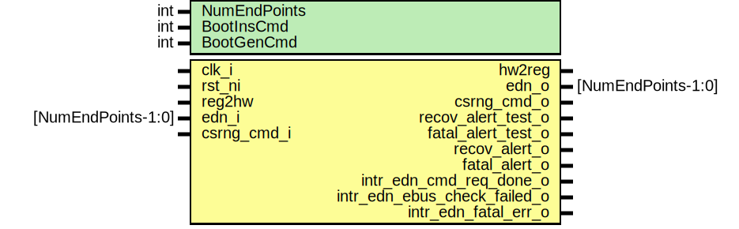

# Entity: edn_core
## Diagram

## Description
Copyright lowRISC contributors.
 Licensed under the Apache License, Version 2.0, see LICENSE for details.
 SPDX-License-Identifier: Apache-2.0
 Description: entropy distrubution network core module
  - this module will make requests to the CSRNG module
    and return the genbits back to up four requesting
    end points.
 
## Generics
| Generic name | Type | Value         | Description |
| ------------ | ---- | ------------- | ----------- |
| NumEndPoints | int  | 4             |             |
| BootInsCmd   | int  | 32'h0000_0001 |             |
| BootGenCmd   | int  | 32'h0000_1003 |             |
## Ports
| Port name               | Direction | Type               | Description                 |
| ----------------------- | --------- | ------------------ | --------------------------- |
| clk_i                   | input     |                    |                             |
| rst_ni                  | input     |                    |                             |
| reg2hw                  | input     |                    |                             |
| hw2reg                  | output    |                    |                             |
| edn_i                   | input     | [NumEndPoints-1:0] | EDN interfaces              |
| edn_o                   | output    | [NumEndPoints-1:0] |                             |
| csrng_cmd_o             | output    |                    | CSRNG Application Interface |
| csrng_cmd_i             | input     |                    |                             |
| alert_test_o            | output    |                    | Alerts                      |
| fatal_alert_o           | output    |                    |                             |
| intr_edn_cmd_req_done_o | output    |                    | Interrupts                  |
| intr_edn_fatal_err_o    | output    |                    |                             |
## Signals
| Name                         | Type                                | Description  |
| ---------------------------- | ----------------------------------- | ------------ |
| event_edn_cmd_req_done       | logic                               | signals      |
| event_edn_fatal_err          | logic                               |              |
| edn_enable                   | logic                               |              |
| cmd_fifo_rst                 | logic                               |              |
| packer_arb_valid             | logic                               |              |
| packer_arb_ready             | logic                               |              |
| packer_arb_req               | logic [NumEndPoints-1:0]            |              |
| packer_arb_gnt               | logic [NumEndPoints-1:0]            |              |
| auto_req_mode                | logic                               |              |
| seq_auto_req_mode            | logic                               |              |
| auto_req_mode_end            | logic                               |              |
| capt_gencmd_fifo_cnt         | logic                               |              |
| capt_rescmd_fifo_cnt         | logic                               |              |
| max_reqs_cnt_zero            | logic                               |              |
| max_reqs_cnt_load            | logic                               |              |
| max_reqs_between_reseed_load | logic                               |              |
| max_reqs_between_reseed_bus  | logic [31:0]                        |              |
| csrng_cmd_ack                | logic                               |              |
| send_rescmd                  | logic                               |              |
| cmd_sent                     | logic                               |              |
| send_gencmd                  | logic                               |              |
| sw_cmd_req_load              | logic                               |              |
| sw_cmd_req_bus               | logic [31:0]                        |              |
| reseed_cmd_load              | logic                               |              |
| reseed_cmd_bus               | logic [31:0]                        |              |
| generate_cmd_load            | logic                               |              |
| generate_cmd_bus             | logic [31:0]                        |              |
| packer_cs_clr                | logic                               |              |
| packer_cs_push               | logic                               |              |
| packer_cs_wdata              | logic [CSGenBitsWidth-1:0]          |              |
| packer_cs_wready             | logic                               |              |
| packer_cs_rvalid             | logic                               |              |
| packer_cs_rready             | logic                               |              |
| packer_cs_rdata              | logic [CSGenBitsWidth-1:0]          |              |
| boot_request                 | logic                               |              |
| boot_wr_cmd_reg              | logic                               |              |
| boot_wr_cmd_genfifo          | logic                               |              |
| boot_auto_req                | logic                               |              |
| packer_ep_clr                | logic [NumEndPoints-1:0]            |              |
| packer_ep_ack                | logic [NumEndPoints-1:0]            |              |
| packer_ep_push               | logic [NumEndPoints-1:0]            |              |
| packer_ep_wdata              | logic [CSGenBitsWidth-1:0]          |              |
| packer_ep_wready             | logic [NumEndPoints-1:0]            |              |
| packer_ep_rvalid             | logic [NumEndPoints-1:0]            |              |
| packer_ep_rready             | logic [NumEndPoints-1:0]            |              |
| edn_ack_sm_err_sum           | logic                               |              |
| edn_ack_sm_err               | logic [NumEndPoints-1:0]            |              |
| packer_ep_rdata              | logic [EndPointBusWidth-1:0]        |              |
| sfifo_rescmd_depth           | logic [RescmdFifoIdxWidth-1:0]      | rescmd fifo  |
| sfifo_rescmd_rdata           | logic [RescmdFifoWidth-1:0]         |              |
| sfifo_rescmd_clr             | logic                               |              |
| sfifo_rescmd_push            | logic                               |              |
| sfifo_rescmd_wdata           | logic [RescmdFifoWidth-1:0]         |              |
| sfifo_rescmd_pop             | logic                               |              |
| sfifo_rescmd_err_sum         | logic                               |              |
| sfifo_rescmd_err             | logic [2:0]                         |              |
| sfifo_rescmd_full            | logic                               |              |
| sfifo_rescmd_not_empty       | logic                               |              |
| sfifo_gencmd_rdata           | logic [GencmdFifoWidth-1:0]         | gencmd fifo  |
| sfifo_gencmd_depth           | logic [$clog2(GencmdFifoDepth)-1:0] |              |
| sfifo_gencmd_clr             | logic                               |              |
| sfifo_gencmd_push            | logic                               |              |
| sfifo_gencmd_wdata           | logic [GencmdFifoWidth-1:0]         |              |
| sfifo_gencmd_pop             | logic                               |              |
| sfifo_gencmd_err_sum         | logic                               |              |
| sfifo_gencmd_err             | logic [2:0]                         |              |
| sfifo_gencmd_full            | logic                               |              |
| sfifo_gencmd_not_empty       | logic                               |              |
| edn_main_sm_err_sum          | logic                               |              |
| edn_main_sm_err              | logic                               |              |
| err_code_test_bit            | logic [30:0]                        |              |
| fifo_write_err_sum           | logic                               |              |
| fifo_read_err_sum            | logic                               |              |
| fifo_status_err_sum          | logic                               |              |
| unused_err_code_test_bit     | logic                               |              |
| unused_reg2hw_regwen         | logic                               |              |
| cs_cmd_req_q                 | logic [31:0]                        | flops        |
| cs_cmd_req_d                 | logic [31:0]                        | flops        |
| cs_cmd_req_vld_q             | logic                               |              |
| cs_cmd_req_vld_d             | logic                               |              |
| cs_cmd_req_out_q             | logic [31:0]                        |              |
| cs_cmd_req_out_d             | logic [31:0]                        |              |
| cs_cmd_req_vld_out_q         | logic                               |              |
| cs_cmd_req_vld_out_d         | logic                               |              |
| cmd_fifo_cnt_q               | logic [RescmdFifoIdxWidth-1:0]      |              |
| cmd_fifo_cnt_d               | logic [RescmdFifoIdxWidth-1:0]      |              |
| send_rescmd_q                | logic                               |              |
| send_rescmd_d                | logic                               |              |
| send_gencmd_q                | logic                               |              |
| send_gencmd_d                | logic                               |              |
| max_reqs_cnt_q               | logic [31:0]                        |              |
| max_reqs_cnt_d               | logic [31:0]                        |              |
| csrng_fips_q                 | logic                               |              |
| csrng_fips_d                 | logic                               |              |
| edn_fips_q                   | logic [NumEndPoints-1:0]            |              |
| edn_fips_d                   | logic [NumEndPoints-1:0]            |              |
| boot_req_q                   | logic [3:0]                         |              |
| boot_req_d                   | logic [3:0]                         |              |
| boot_auto_req_wack_q         | logic                               |              |
| boot_auto_req_wack_d         | logic                               |              |
| boot_auto_req_dly_q          | logic                               |              |
| boot_auto_req_dly_d          | logic                               |              |
## Constants
| Name               | Type | Value                   | Description                            |
| ------------------ | ---- | ----------------------- | -------------------------------------- |
| RescmdFifoWidth    | int  | 32                      | localparam int EndPointBusWidth = 32;  |
| RescmdFifoDepth    | int  | 13                      |                                        |
| GencmdFifoWidth    | int  | 32                      |                                        |
| GencmdFifoDepth    | int  | 13                      |                                        |
| CSGenBitsWidth     | int  | 128                     |                                        |
| EndPointBusWidth   | int  | 32                      |                                        |
| RescmdFifoIdxWidth | int  | $clog2(RescmdFifoDepth) |                                        |
## Processes
- unnamed: _( @(posedge clk_i or negedge rst_ni) )_

## Instantiations
- u_intr_hw_edn_cmd_req_done: prim_intr_hw
- u_intr_hw_edn_fatal_err: prim_intr_hw
- u_prim_fifo_sync_rescmd: prim_fifo_sync
**Description**
rescmd fifo

- u_prim_fifo_sync_gencmd: prim_fifo_sync
**Description**
gencmd fifo

- u_edn_main_sm: edn_main_sm
**Description**
sm to process csrng commands

- u_prim_arbiter_ppc_packer_arb: prim_arbiter_ppc
- u_prim_packer_fifo_cs: prim_packer_fifo
