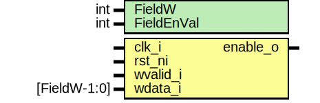

# Entity: edn_field_en

- **File**: edn_field_en.sv
## Diagram

## Description

 Copyright lowRISC contributors.
 Licensed under the Apache License, Version 2.0, see LICENSE for details.
 SPDX-License-Identifier: Apache-2.0

 Supports writing a field that enables
 a function within a module.
 Requirements are that the function will
 only be enabled when the field is written
 the it is the inverse of the current field
 setting. The can only toggle between the
 the on value and the off value.

## Generics

| Generic name | Type | Value | Description |
| ------------ | ---- | ----- | ----------- |
| FieldW       | int  | 4     |             |
| FieldEnVal   | int  | 'ha   |             |
## Ports

| Port name | Direction | Type         | Description |
| --------- | --------- | ------------ | ----------- |
| clk_i     | input     |              |             |
| rst_ni    | input     |              |             |
| wvalid_i  | input     |              |             |
| wdata_i   | input     | [FieldW-1:0] |             |
| enable_o  | output    |              |             |
## Signals

| Name               | Type               | Description |
| ------------------ | ------------------ | ----------- |
| field_update       | logic              |  signal     |
| field_value        | logic [FieldW-1:0] |             |
| field_value_invert | logic [FieldW-1:0] |             |
| field_q            | logic [FieldW-1:0] |  flops      |
| field_d            | logic [FieldW-1:0] |  flops      |
## Processes
- unnamed: ( @(posedge clk_i or negedge rst_ni) )
  - **Type:** always_ff
