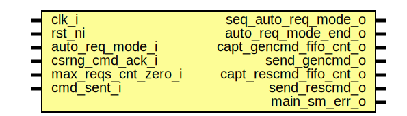

# Entity: edn_main_sm

- **File**: edn_main_sm.sv
## Diagram

## Description

Copyright lowRISC contributors.
 Licensed under the Apache License, Version 2.0, see LICENSE for details.
 SPDX-License-Identifier: Apache-2.0
 Description: edn csrng application request state machine module
   does hardware-based csrng app interface command requests
 
## Ports

| Port name              | Direction | Type | Description |
| ---------------------- | --------- | ---- | ----------- |
| clk_i                  | input     |      |             |
| rst_ni                 | input     |      |             |
| auto_req_mode_i        | input     |      |             |
| seq_auto_req_mode_o    | output    |      |             |
| auto_req_mode_end_o    | output    |      |             |
| csrng_cmd_ack_i        | input     |      |             |
| capt_gencmd_fifo_cnt_o | output    |      |             |
| send_gencmd_o          | output    |      |             |
| max_reqs_cnt_zero_i    | input     |      |             |
| capt_rescmd_fifo_cnt_o | output    |      |             |
| send_rescmd_o          | output    |      |             |
| cmd_sent_i             | input     |      |             |
| main_sm_err_o          | output    |      |             |
## Signals

| Name        | Type                   | Description |
| ----------- | ---------------------- | ----------- |
| state_d     | state_e                |             |
| state_q     | state_e                |             |
| state_raw_q | logic [StateWidth-1:0] |             |
## Constants

| Name       | Type | Value | Description |
| ---------- | ---- | ----- | ----------- |
| StateWidth | int  | 6     |             |
## Types

| Name    | Type                                                                                                                                                                                                                                                                                                                                                                                                                                                                                                                                                                                              | Description |
| ------- | ------------------------------------------------------------------------------------------------------------------------------------------------------------------------------------------------------------------------------------------------------------------------------------------------------------------------------------------------------------------------------------------------------------------------------------------------------------------------------------------------------------------------------------------------------------------------------------------------- | ----------- |
| state_e | enum logic [StateWidth-1:0] {      Idle          = 6'b111011,       AckWait       = 6'b010111,       Dispatch      = 6'b011100,       CaptGenCnt    = 6'b110000,       SendGenCmd    = 6'b001001,       CaptReseedCnt = 6'b101110,       SendReseedCmd = 6'b000010,       Error         = 6'b100101     } |             |
## Processes
- unnamed: (  )
## Instantiations

- u_state_regs: prim_flop
**Description**
This primitive is used to place a size-only constraint on the
flops in order to prevent FSM state encoding optimizations.

