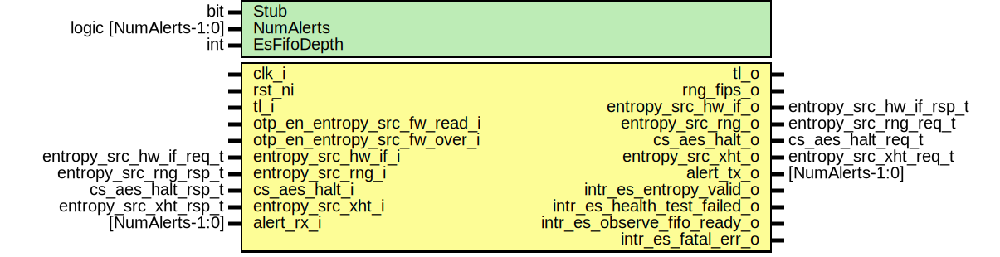

# Entity: entropy_src

- **File**: entropy_src.sv
## Diagram

## Description

 Copyright lowRISC contributors.
 Licensed under the Apache License, Version 2.0, see LICENSE for details.
 SPDX-License-Identifier: Apache-2.0

 Description: entropy_src top level wrapper file

## Generics

| Generic name | Type                  | Value     | Description |
| ------------ | --------------------- | --------- | ----------- |
| Stub         | bit                   | 1'b0      |             |
| NumAlerts    | logic [NumAlerts-1:0] | undefined |             |
| EsFifoDepth  | int                   | 4         |             |
## Ports

| Port name                    | Direction | Type                    | Description                     |
| ---------------------------- | --------- | ----------------------- | ------------------------------- |
| clk_i                        | input     |                         |                                 |
| rst_ni                       | input     |                         |                                 |
| tl_i                         | input     |                         |  Bus Interface                  |
| tl_o                         | output    |                         |                                 |
| otp_en_entropy_src_fw_read_i | input     |                         |  OTP Interface                  |
| otp_en_entropy_src_fw_over_i | input     |                         |                                 |
| rng_fips_o                   | output    |                         |  RNG Interface                  |
| entropy_src_hw_if_i          | input     | entropy_src_hw_if_req_t |  Entropy Interface              |
| entropy_src_hw_if_o          | output    | entropy_src_hw_if_rsp_t |                                 |
| entropy_src_rng_o            | output    | entropy_src_rng_req_t   |  RNG Interface                  |
| entropy_src_rng_i            | input     | entropy_src_rng_rsp_t   |                                 |
| cs_aes_halt_o                | output    | cs_aes_halt_req_t       |  CSRNG Interface                |
| cs_aes_halt_i                | input     | cs_aes_halt_rsp_t       |                                 |
| entropy_src_xht_o            | output    | entropy_src_xht_req_t   |  External Health Test Interface |
| entropy_src_xht_i            | input     | entropy_src_xht_rsp_t   |                                 |
| alert_rx_i                   | input     | [NumAlerts-1:0]         |  Alerts                         |
| alert_tx_o                   | output    | [NumAlerts-1:0]         |                                 |
| intr_es_entropy_valid_o      | output    |                         |  Interrupts                     |
| intr_es_health_test_failed_o | output    |                         |                                 |
| intr_es_observe_fifo_ready_o | output    |                         |                                 |
| intr_es_fatal_err_o          | output    |                         |                                 |
## Signals

| Name                            | Type                      | Description                                                                  |
| ------------------------------- | ------------------------- | ---------------------------------------------------------------------------- |
| hw2reg                          | entropy_src_hw2reg_t      |  common signals                                                              |
| reg2hw                          | entropy_src_reg2hw_t      |                                                                              |
| alert_test                      | logic [NumAlerts-1:0]     |                                                                              |
| alert                           | logic [NumAlerts-1:0]     |                                                                              |
| core_rst_n                      | logic                     |  core signals                                                                |
| core_hw2reg                     | entropy_src_hw2reg_t      |                                                                              |
| core_entropy_hw_if              | entropy_src_hw_if_rsp_t   |                                                                              |
| core_rng                        | entropy_src_rng_req_t     |                                                                              |
| core_aes_halt                   | cs_aes_halt_req_t         |                                                                              |
| core_xht                        | entropy_src_xht_req_t     |                                                                              |
| core_intr_es_entropy_valid      | logic                     |                                                                              |
| core_intr_es_health_test_failed | logic                     |                                                                              |
| core_intr_es_observe_fifo_ready | logic                     |  TODO: add intrp   logic core_intr_es_ebus_check_failed;                     |
| core_intr_es_fatal_err          | logic                     |                                                                              |
| core_alert_test                 | logic [NumAlerts-1:0]     |                                                                              |
| core_alert                      | logic [NumAlerts-1:0]     |                                                                              |
| stub_hw2reg                     | entropy_src_hw2reg_t      |                                                                              |
| stub_entropy_hw_if              | entropy_src_hw_if_rsp_t   |                                                                              |
| stub_es_valid                   | logic                     |                                                                              |
| stub_alert_test                 | logic [NumAlerts-1:0]     |                                                                              |
| stub_alert                      | logic [NumAlerts-1:0]     |                                                                              |
| stub_lfsr_value                 | logic [StubLfsrWidth-1:0] |                                                                              |
| intg_err_alert                  | logic [NumAlerts-1:0]     | /////////////////////////  core entropy operation /////////////////////////  |
| efuse_es_sw_reg_en              | logic                     |                                                                              |
| efuse_es_sw_ov_en               | logic                     |                                                                              |
## Constants

| Name          | Type | Value                           | Description   |
| ------------- | ---- | ------------------------------- | ------------- |
| StubLfsrWidth | int  | 64                              | stub signals  |
| Copies        | int  | CSRNG_BUS_WIDTH / StubLfsrWidth |               |
## Instantiations

- u_reg: entropy_src_reg_top
- u_entropy_src_core: entropy_src_core
