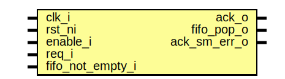

# Entity: entropy_src_ack_sm
## Diagram

## Description
Copyright lowRISC contributors.
 Licensed under the Apache License, Version 2.0, see LICENSE for details.
 SPDX-License-Identifier: Apache-2.0
 Description: interface between a req/ack interface and a fifo
 
## Ports
| Port name        | Direction | Type | Description |
| ---------------- | --------- | ---- | ----------- |
| clk_i            | input     |      |             |
| rst_ni           | input     |      |             |
| enable_i         | input     |      |             |
| req_i            | input     |      |             |
| ack_o            | output    |      |             |
| fifo_not_empty_i | input     |      |             |
| fifo_pop_o       | output    |      |             |
| ack_sm_err_o     | output    |      |             |
## Signals
| Name        | Type                   | Description |
| ----------- | ---------------------- | ----------- |
| state_d     | state_e                |             |
| state_q     | state_e                |             |
| state_raw_q | logic [StateWidth-1:0] |             |
## Constants
| Name       | Type | Value | Description |
| ---------- | ---- | ----- | ----------- |
| StateWidth | int  | 6     |             |
## Types
| Name    | Type                                                                                                                                              | Description |
| ------- | ------------------------------------------------------------------------------------------------------------------------------------------------- | ----------- |
| state_e | enum logic [StateWidth-1:0] {     Idle      = 6'b010100,      AckImmed  = 6'b101100,      AckWait   = 6'b000010,      Error     = 6'b101011     } |             |
## Processes
- unnamed: _(  )_

## Instantiations
- u_state_regs: prim_flop
**Description**
This primitive is used to place a size-only constraint on the
flops in order to prevent FSM state encoding optimizations.

