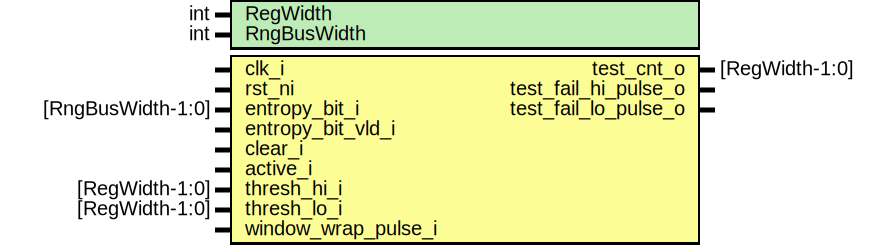

# Entity: entropy_src_adaptp_ht

- **File**: entropy_src_adaptp_ht.sv
## Diagram

## Description

Copyright lowRISC contributors.
 Licensed under the Apache License, Version 2.0, see LICENSE for details.
 SPDX-License-Identifier: Apache-2.0
 Description: entropy_src adaptive proportion health test module
 
## Generics

| Generic name | Type | Value | Description |
| ------------ | ---- | ----- | ----------- |
| RegWidth     | int  | 16    |             |
| RngBusWidth  | int  | 4     |             |
## Ports

| Port name            | Direction | Type              | Description       |
| -------------------- | --------- | ----------------- | ----------------- |
| clk_i                | input     |                   |                   |
| rst_ni               | input     |                   |                   |
| entropy_bit_i        | input     | [RngBusWidth-1:0] | ins req interface |
| entropy_bit_vld_i    | input     |                   |                   |
| clear_i              | input     |                   |                   |
| active_i             | input     |                   |                   |
| thresh_hi_i          | input     | [RegWidth-1:0]    |                   |
| thresh_lo_i          | input     | [RegWidth-1:0]    |                   |
| window_wrap_pulse_i  | input     |                   |                   |
| test_cnt_o           | output    | [RegWidth-1:0]    |                   |
| test_fail_hi_pulse_o | output    |                   |                   |
| test_fail_lo_pulse_o | output    |                   |                   |
## Signals

| Name       | Type                 | Description |
| ---------- | -------------------- | ----------- |
| column_cnt | logic [RegWidth-1:0] | signals     |
| test_cnt_q | logic [RegWidth-1:0] | flops       |
| test_cnt_d | logic [RegWidth-1:0] | flops       |
## Processes
- unnamed: ( @(posedge clk_i or negedge rst_ni) )
