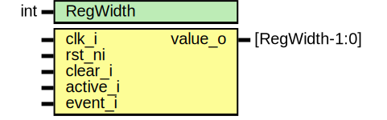

# Entity: entropy_src_cntr_reg

## Diagram

## Description

Copyright lowRISC contributors.
 Licensed under the Apache License, Version 2.0, see LICENSE for details.
 SPDX-License-Identifier: Apache-2.0
 Description: entropy_src counter register module
 
## Generics

| Generic name | Type | Value | Description |
| ------------ | ---- | ----- | ----------- |
| RegWidth     | int  | 16    |             |
## Ports

| Port name | Direction | Type           | Description          |
| --------- | --------- | -------------- | -------------------- |
| clk_i     | input     |                |                      |
| rst_ni    | input     |                |                      |
| clear_i   | input     |                | functional interface |
| active_i  | input     |                |                      |
| event_i   | input     |                |                      |
| value_o   | output    | [RegWidth-1:0] |                      |
## Signals

| Name         | Type                 | Description    |
| ------------ | -------------------- | -------------- |
| event_cntr_q | logic [RegWidth-1:0] | signals flops  |
| event_cntr_d | logic [RegWidth-1:0] | signals flops  |
## Processes
- unnamed: ( @(posedge clk_i or negedge rst_ni) )
