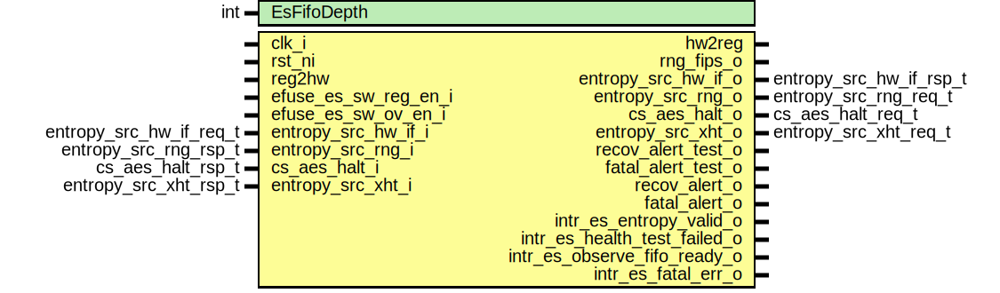

# Entity: entropy_src_core

- **File**: entropy_src_core.sv
## Diagram

## Description

Copyright lowRISC contributors.
 Licensed under the Apache License, Version 2.0, see LICENSE for details.
 SPDX-License-Identifier: Apache-2.0
 Description: entropy_src core module
 
## Generics

| Generic name | Type | Value | Description |
| ------------ | ---- | ----- | ----------- |
| EsFifoDepth  | int  | 4     |             |
## Ports

| Port name                    | Direction | Type                    | Description                    |
| ---------------------------- | --------- | ----------------------- | ------------------------------ |
| clk_i                        | input     |                         |                                |
| rst_ni                       | input     |                         |                                |
| reg2hw                       | input     |                         |                                |
| hw2reg                       | output    |                         |                                |
| efuse_es_sw_reg_en_i         | input     |                         | Efuse Interface                |
| efuse_es_sw_ov_en_i          | input     |                         |                                |
| rng_fips_o                   | output    |                         | RNG Interface                  |
| entropy_src_hw_if_i          | input     | entropy_src_hw_if_req_t | Entropy Interface              |
| entropy_src_hw_if_o          | output    | entropy_src_hw_if_rsp_t |                                |
| entropy_src_rng_o            | output    | entropy_src_rng_req_t   | RNG Interface                  |
| entropy_src_rng_i            | input     | entropy_src_rng_rsp_t   |                                |
| cs_aes_halt_o                | output    | cs_aes_halt_req_t       | CSRNG Interface                |
| cs_aes_halt_i                | input     | cs_aes_halt_rsp_t       |                                |
| entropy_src_xht_o            | output    | entropy_src_xht_req_t   | External Health Test Interface |
| entropy_src_xht_i            | input     | entropy_src_xht_rsp_t   |                                |
| recov_alert_test_o           | output    |                         |                                |
| fatal_alert_test_o           | output    |                         |                                |
| recov_alert_o                | output    |                         |                                |
| fatal_alert_o                | output    |                         |                                |
| intr_es_entropy_valid_o      | output    |                         |                                |
| intr_es_health_test_failed_o | output    |                         |                                |
| intr_es_observe_fifo_ready_o | output    |                         |                                |
| intr_es_fatal_err_o          | output    |                         |                                |
## Signals

| Name                              | Type                            | Description |
| --------------------------------- | ------------------------------- | ----------- |
| seed_value                        | logic [RngBusWidth-1:0]         |             |
| load_seed                         | logic                           |             |
| fw_ov_mode                        | logic                           |             |
| fw_ov_entropy_insert              | logic                           |             |
| fw_ov_wr_data                     | logic [ObserveFifoWidth-1:0]    |             |
| fw_ov_fifo_rd_pulse               | logic                           |             |
| fw_ov_fifo_wr_pulse               | logic                           |             |
| es_enable                         | logic                           |             |
| es_enable_early                   | logic                           |             |
| es_enable_lfsr                    | logic                           |             |
| es_enable_rng                     | logic                           |             |
| es_rng_rdy                        | logic                           |             |
| rng_bit_en                        | logic                           |             |
| rng_bit_sel                       | logic [1:0]                     |             |
| lfsr_incr                         | logic                           |             |
| sw_es_rd_pulse                    | logic                           |             |
| event_es_entropy_valid            | logic                           |             |
| event_es_health_test_failed       | logic                           |             |
| event_es_observe_fifo_ready       | logic                           |             |
| event_es_fatal_err                | logic                           |             |
| es_rate                           | logic [15:0]                    |             |
| es_rate_entropy_pulse             | logic                           |             |
| es_rng_src_valid                  | logic                           |             |
| es_rng_bus                        | logic [RngBusWidth-1:0]         |             |
| sfifo_esrng_wdata                 | logic [RngBusWidth-1:0]         |             |
| sfifo_esrng_rdata                 | logic [RngBusWidth-1:0]         |             |
| sfifo_esrng_push                  | logic                           |             |
| sfifo_esrng_pop                   | logic                           |             |
| sfifo_esrng_clr                   | logic                           |             |
| sfifo_esrng_full                  | logic                           |             |
| sfifo_esrng_not_empty             | logic                           |             |
| sfifo_esrng_err                   | logic [2:0]                     |             |
| sfifo_observe_wdata               | logic [ObserveFifoWidth-1:0]    |             |
| sfifo_observe_rdata               | logic [ObserveFifoWidth-1:0]    |             |
| sfifo_observe_push                | logic                           |             |
| sfifo_observe_pop                 | logic                           |             |
| sfifo_observe_full                | logic                           |             |
| sfifo_observe_clr                 | logic                           |             |
| sfifo_observe_not_empty           | logic                           |             |
| sfifo_observe_depth               | logic [Clog2ObserveFifoDepth:0] |             |
| sfifo_observe_err                 | logic [2:0]                     |             |
| sfifo_esfinal_depth               | logic [Clog2EsFifoDepth:0]      |             |
| sfifo_esfinal_wdata               | logic [(1+SeedLen)-1:0]         |             |
| sfifo_esfinal_rdata               | logic [(1+SeedLen)-1:0]         |             |
| sfifo_esfinal_push                | logic                           |             |
| sfifo_esfinal_pop                 | logic                           |             |
| sfifo_esfinal_clr                 | logic                           |             |
| sfifo_esfinal_not_full            | logic                           |             |
| sfifo_esfinal_full                | logic                           |             |
| sfifo_esfinal_not_empty           | logic                           |             |
| sfifo_esfinal_err                 | logic [2:0]                     |             |
| esfinal_data                      | logic [SeedLen-1:0]             |             |
| esfinal_fips_flag                 | logic                           |             |
| any_active                        | logic                           |             |
| any_fail_pulse                    | logic                           |             |
| main_stage_pop                    | logic                           |             |
| bypass_stage_pop                  | logic                           |             |
| any_fail_count                    | logic [HalfRegWidth-1:0]        |             |
| alert_threshold_fail              | logic                           |             |
| alert_threshold                   | logic [HalfRegWidth-1:0]        |             |
| alert_threshold_inv               | logic [HalfRegWidth-1:0]        |             |
| recov_alert_event                 | logic                           |             |
| observe_fifo_thresh               | logic [Clog2ObserveFifoDepth:0] |             |
| observe_fifo_thresh_met           | logic                           |             |
| repcnt_active                     | logic                           |             |
| repcnts_active                    | logic                           |             |
| adaptp_active                     | logic                           |             |
| bucket_active                     | logic                           |             |
| markov_active                     | logic                           |             |
| extht_active                      | logic                           |             |
| alert_cntrs_clr                   | logic                           |             |
| health_test_clr                   | logic                           |             |
| health_test_done_pulse            | logic                           |             |
| health_test_esbus                 | logic [RngBusWidth-1:0]         |             |
| health_test_esbus_vld             | logic                           |             |
| es_route_to_sw                    | logic                           |             |
| es_bypass_to_sw                   | logic                           |             |
| es_bypass_mode                    | logic                           |             |
| rst_bypass_mode                   | logic                           |             |
| rst_alert_cntr                    | logic                           |             |
| boot_bypass_disable               | logic                           |             |
| fips_compliance                   | logic                           |             |
| health_test_fips_window           | logic [HalfRegWidth-1:0]        |             |
| health_test_bypass_window         | logic [HalfRegWidth-1:0]        |             |
| health_test_window                | logic [HalfRegWidth-1:0]        |             |
| repcnt_fips_threshold             | logic [HalfRegWidth-1:0]        |             |
| repcnt_fips_threshold_oneway      | logic [HalfRegWidth-1:0]        |             |
| repcnt_fips_threshold_wr          | logic                           |             |
| repcnt_bypass_threshold           | logic [HalfRegWidth-1:0]        |             |
| repcnt_bypass_threshold_oneway    | logic [HalfRegWidth-1:0]        |             |
| repcnt_bypass_threshold_wr        | logic                           |             |
| repcnt_threshold                  | logic [HalfRegWidth-1:0]        |             |
| repcnt_event_cnt                  | logic [HalfRegWidth-1:0]        |             |
| repcnt_event_hwm_fips             | logic [HalfRegWidth-1:0]        |             |
| repcnt_event_hwm_bypass           | logic [HalfRegWidth-1:0]        |             |
| repcnt_total_fails                | logic [FullRegWidth-1:0]        |             |
| repcnt_fail_count                 | logic [EighthRegWidth-1:0]      |             |
| repcnt_fail_pulse                 | logic                           |             |
| repcnts_fips_threshold            | logic [HalfRegWidth-1:0]        |             |
| repcnts_fips_threshold_oneway     | logic [HalfRegWidth-1:0]        |             |
| repcnts_fips_threshold_wr         | logic                           |             |
| repcnts_bypass_threshold          | logic [HalfRegWidth-1:0]        |             |
| repcnts_bypass_threshold_oneway   | logic [HalfRegWidth-1:0]        |             |
| repcnts_bypass_threshold_wr       | logic                           |             |
| repcnts_threshold                 | logic [HalfRegWidth-1:0]        |             |
| repcnts_event_cnt                 | logic [HalfRegWidth-1:0]        |             |
| repcnts_event_hwm_fips            | logic [HalfRegWidth-1:0]        |             |
| repcnts_event_hwm_bypass          | logic [HalfRegWidth-1:0]        |             |
| repcnts_total_fails               | logic [FullRegWidth-1:0]        |             |
| repcnts_fail_count                | logic [EighthRegWidth-1:0]      |             |
| repcnts_fail_pulse                | logic                           |             |
| adaptp_hi_fips_threshold          | logic [HalfRegWidth-1:0]        |             |
| adaptp_hi_fips_threshold_oneway   | logic [HalfRegWidth-1:0]        |             |
| adaptp_hi_fips_threshold_wr       | logic                           |             |
| adaptp_hi_bypass_threshold        | logic [HalfRegWidth-1:0]        |             |
| adaptp_hi_bypass_threshold_oneway | logic [HalfRegWidth-1:0]        |             |
| adaptp_hi_bypass_threshold_wr     | logic                           |             |
| adaptp_hi_threshold               | logic [HalfRegWidth-1:0]        |             |
| adaptp_lo_fips_threshold          | logic [HalfRegWidth-1:0]        |             |
| adaptp_lo_fips_threshold_oneway   | logic [HalfRegWidth-1:0]        |             |
| adaptp_lo_fips_threshold_wr       | logic                           |             |
| adaptp_lo_bypass_threshold        | logic [HalfRegWidth-1:0]        |             |
| adaptp_lo_bypass_threshold_oneway | logic [HalfRegWidth-1:0]        |             |
| adaptp_lo_bypass_threshold_wr     | logic                           |             |
| adaptp_lo_threshold               | logic [HalfRegWidth-1:0]        |             |
| adaptp_event_cnt                  | logic [HalfRegWidth-1:0]        |             |
| adaptp_hi_event_hwm_fips          | logic [HalfRegWidth-1:0]        |             |
| adaptp_hi_event_hwm_bypass        | logic [HalfRegWidth-1:0]        |             |
| adaptp_lo_event_hwm_fips          | logic [HalfRegWidth-1:0]        |             |
| adaptp_lo_event_hwm_bypass        | logic [HalfRegWidth-1:0]        |             |
| adaptp_hi_total_fails             | logic [FullRegWidth-1:0]        |             |
| adaptp_lo_total_fails             | logic [FullRegWidth-1:0]        |             |
| adaptp_hi_fail_count              | logic [EighthRegWidth-1:0]      |             |
| adaptp_lo_fail_count              | logic [EighthRegWidth-1:0]      |             |
| adaptp_hi_fail_pulse              | logic                           |             |
| adaptp_lo_fail_pulse              | logic                           |             |
| bucket_fips_threshold             | logic [HalfRegWidth-1:0]        |             |
| bucket_fips_threshold_oneway      | logic [HalfRegWidth-1:0]        |             |
| bucket_fips_threshold_wr          | logic                           |             |
| bucket_bypass_threshold           | logic [HalfRegWidth-1:0]        |             |
| bucket_bypass_threshold_oneway    | logic [HalfRegWidth-1:0]        |             |
| bucket_bypass_threshold_wr        | logic                           |             |
| bucket_threshold                  | logic [HalfRegWidth-1:0]        |             |
| bucket_event_cnt                  | logic [HalfRegWidth-1:0]        |             |
| bucket_event_hwm_fips             | logic [HalfRegWidth-1:0]        |             |
| bucket_event_hwm_bypass           | logic [HalfRegWidth-1:0]        |             |
| bucket_total_fails                | logic [FullRegWidth-1:0]        |             |
| bucket_fail_count                 | logic [EighthRegWidth-1:0]      |             |
| bucket_fail_pulse                 | logic                           |             |
| markov_hi_fips_threshold          | logic [HalfRegWidth-1:0]        |             |
| markov_hi_fips_threshold_oneway   | logic [HalfRegWidth-1:0]        |             |
| markov_hi_fips_threshold_wr       | logic                           |             |
| markov_hi_bypass_threshold        | logic [HalfRegWidth-1:0]        |             |
| markov_hi_bypass_threshold_oneway | logic [HalfRegWidth-1:0]        |             |
| markov_hi_bypass_threshold_wr     | logic                           |             |
| markov_hi_threshold               | logic [HalfRegWidth-1:0]        |             |
| markov_lo_fips_threshold          | logic [HalfRegWidth-1:0]        |             |
| markov_lo_fips_threshold_oneway   | logic [HalfRegWidth-1:0]        |             |
| markov_lo_fips_threshold_wr       | logic                           |             |
| markov_lo_bypass_threshold        | logic [HalfRegWidth-1:0]        |             |
| markov_lo_bypass_threshold_oneway | logic [HalfRegWidth-1:0]        |             |
| markov_lo_bypass_threshold_wr     | logic                           |             |
| markov_lo_threshold               | logic [HalfRegWidth-1:0]        |             |
| markov_hi_event_cnt               | logic [HalfRegWidth-1:0]        |             |
| markov_lo_event_cnt               | logic [HalfRegWidth-1:0]        |             |
| markov_hi_event_hwm_fips          | logic [HalfRegWidth-1:0]        |             |
| markov_hi_event_hwm_bypass        | logic [HalfRegWidth-1:0]        |             |
| markov_lo_event_hwm_fips          | logic [HalfRegWidth-1:0]        |             |
| markov_lo_event_hwm_bypass        | logic [HalfRegWidth-1:0]        |             |
| markov_hi_total_fails             | logic [FullRegWidth-1:0]        |             |
| markov_lo_total_fails             | logic [FullRegWidth-1:0]        |             |
| markov_hi_fail_count              | logic [EighthRegWidth-1:0]      |             |
| markov_lo_fail_count              | logic [EighthRegWidth-1:0]      |             |
| markov_hi_fail_pulse              | logic                           |             |
| markov_lo_fail_pulse              | logic                           |             |
| extht_hi_fips_threshold           | logic [HalfRegWidth-1:0]        |             |
| extht_hi_fips_threshold_oneway    | logic [HalfRegWidth-1:0]        |             |
| extht_hi_fips_threshold_wr        | logic                           |             |
| extht_hi_bypass_threshold         | logic [HalfRegWidth-1:0]        |             |
| extht_hi_bypass_threshold_oneway  | logic [HalfRegWidth-1:0]        |             |
| extht_hi_bypass_threshold_wr      | logic                           |             |
| extht_hi_threshold                | logic [HalfRegWidth-1:0]        |             |
| extht_lo_fips_threshold           | logic [HalfRegWidth-1:0]        |             |
| extht_lo_fips_threshold_oneway    | logic [HalfRegWidth-1:0]        |             |
| extht_lo_fips_threshold_wr        | logic                           |             |
| extht_lo_bypass_threshold         | logic [HalfRegWidth-1:0]        |             |
| extht_lo_bypass_threshold_oneway  | logic [HalfRegWidth-1:0]        |             |
| extht_lo_bypass_threshold_wr      | logic                           |             |
| extht_lo_threshold                | logic [HalfRegWidth-1:0]        |             |
| extht_event_cnt                   | logic [HalfRegWidth-1:0]        |             |
| extht_hi_event_hwm_fips           | logic [HalfRegWidth-1:0]        |             |
| extht_hi_event_hwm_bypass         | logic [HalfRegWidth-1:0]        |             |
| extht_lo_event_hwm_fips           | logic [HalfRegWidth-1:0]        |             |
| extht_lo_event_hwm_bypass         | logic [HalfRegWidth-1:0]        |             |
| extht_hi_total_fails              | logic [FullRegWidth-1:0]        |             |
| extht_lo_total_fails              | logic [FullRegWidth-1:0]        |             |
| extht_hi_fail_count               | logic [EighthRegWidth-1:0]      |             |
| extht_lo_fail_count               | logic [EighthRegWidth-1:0]      |             |
| extht_hi_fail_pulse               | logic                           |             |
| extht_lo_fail_pulse               | logic                           |             |
| pfifo_esbit_wdata                 | logic                           |             |
| pfifo_esbit_rdata                 | logic [RngBusWidth-1:0]         |             |
| pfifo_esbit_not_empty             | logic                           |             |
| pfifo_esbit_push                  | logic                           |             |
| pfifo_esbit_clr                   | logic                           |             |
| pfifo_esbit_pop                   | logic                           |             |
| pfifo_postht_wdata                | logic [RngBusWidth-1:0]         |             |
| pfifo_postht_rdata                | logic [PostHTWidth-1:0]         |             |
| pfifo_postht_not_empty            | logic                           |             |
| pfifo_postht_push                 | logic                           |             |
| pfifo_postht_clr                  | logic                           |             |
| pfifo_postht_pop                  | logic                           |             |
| pfifo_cond_wdata                  | logic [PreCondWidth-1:0]        |             |
| pfifo_cond_rdata                  | logic [SeedLen-1:0]             |             |
| pfifo_cond_not_empty              | logic                           |             |
| pfifo_cond_push                   | logic                           |             |
| pfifo_precon_wdata                | logic [ObserveFifoWidth-1:0]    |             |
| pfifo_precon_rdata                | logic [PreCondWidth-1:0]        |             |
| pfifo_precon_not_empty            | logic                           |             |
| pfifo_precon_push                 | logic                           |             |
| pfifo_precon_clr                  | logic                           |             |
| pfifo_precon_pop                  | logic                           |             |
| pfifo_bypass_wdata                | logic [PreCondWidth-1:0]        |             |
| pfifo_bypass_rdata                | logic [SeedLen-1:0]             |             |
| pfifo_bypass_not_empty            | logic                           |             |
| pfifo_bypass_push                 | logic                           |             |
| pfifo_bypass_clr                  | logic                           |             |
| pfifo_bypass_pop                  | logic                           |             |
| pfifo_swread_wdata                | logic [SeedLen-1:0]             |             |
| pfifo_swread_not_full             | logic                           |             |
| pfifo_swread_rdata                | logic [FullRegWidth-1:0]        |             |
| pfifo_swread_not_empty            | logic                           |             |
| pfifo_swread_push                 | logic                           |             |
| pfifo_swread_clr                  | logic                           |             |
| pfifo_swread_pop                  | logic                           |             |
| final_es_data                     | logic [SeedLen-1:0]             |             |
| es_hw_if_req                      | logic                           |             |
| es_hw_if_ack                      | logic                           |             |
| es_hw_if_fifo_pop                 | logic                           |             |
| sfifo_esrng_err_sum               | logic                           |             |
| sfifo_observe_err_sum             | logic                           |             |
| sfifo_esfinal_err_sum             | logic                           |             |
| es_ack_sm_err_sum                 | logic                           |             |
| es_ack_sm_err                     | logic                           |             |
| es_main_sm_err_sum                | logic                           |             |
| es_main_sm_err                    | logic                           |             |
| es_main_sm_alert                  | logic                           |             |
| es_main_sm_idle                   | logic                           |             |
| es_main_sm_state                  | logic [7:0]                     |             |
| fifo_write_err_sum                | logic                           |             |
| fifo_read_err_sum                 | logic                           |             |
| fifo_status_err_sum               | logic                           |             |
| err_code_test_bit                 | logic [30:0]                    |             |
| sha3_msgfifo_ready                | logic                           |             |
| sha3_state_vld                    | logic                           |             |
| sha3_start                        | logic                           |             |
| sha3_process                      | logic                           |             |
| sha3_block_processed              | logic                           |             |
| sha3_done                         | logic                           |             |
| sha3_absorbed                     | logic                           |             |
| sha3_squeezing                    | logic                           |             |
| sha3_fsm                          | logic [2:0]                     |             |
| sha3_err                          | logic [32:0]                    |             |
| cs_aes_halt_req                   | logic                           |             |
| sha3_msg_rdy                      | logic                           |             |
| sha3_state                        | logic [sha3_pkg::StateW-1:0]    |             |
| msg_data                          | logic [PreCondWidth-1:0]        |             |
| unused_err_code_test_bit          | logic                           |             |
| unused_sha3_state                 | logic                           |             |
| unused_entropy_data               | logic                           |             |
| unused_fw_ov_rd_data              | logic                           |             |
| es_rate_cntr_q                    | logic [15:0]                    | flops       |
| es_rate_cntr_d                    | logic [15:0]                    | flops       |
| lfsr_incr_dly_q                   | logic                           |             |
| lfsr_incr_dly_d                   | logic                           |             |
| ht_esbus_dly_q                    | logic [RngBusWidth-1:0]         |             |
| ht_esbus_dly_d                    | logic [RngBusWidth-1:0]         |             |
| ht_esbus_vld_dly_q                | logic                           |             |
| ht_esbus_vld_dly_d                | logic                           |             |
| ht_esbus_vld_dly2_q               | logic                           |             |
| ht_esbus_vld_dly2_d               | logic                           |             |
| boot_bypass_q                     | logic                           |             |
| boot_bypass_d                     | logic                           |             |
| ht_failed_q                       | logic                           |             |
| ht_failed_d                       | logic                           |             |
| ht_failed_pulse_q                 | logic                           |             |
| ht_failed_pulse_d                 | logic                           |             |
| ht_done_pulse_q                   | logic                           |             |
| ht_done_pulse_d                   | logic                           |             |
| window_cntr_q                     | logic [HalfRegWidth-1:0]        |             |
| window_cntr_d                     | logic [HalfRegWidth-1:0]        |             |
| sha3_msg_rdy_q                    | logic                           |             |
| sha3_msg_rdy_d                    | logic                           |             |
| sha3_err_q                        | logic                           |             |
| sha3_err_d                        | logic                           |             |
| cs_aes_halt_q                     | logic                           |             |
| cs_aes_halt_d                     | logic                           |             |
| es_enable_q                       | logic [1:0]                     |             |
| es_enable_d                       | logic [1:0]                     |             |
| rng_rdy_q                         | logic                           |             |
| rng_rdy_d                         | logic                           |             |
## Constants

| Name                  | Type | Value                    | Description                            |
| --------------------- | ---- | ------------------------ | -------------------------------------- |
| Clog2EsFifoDepth      | int  | $clog2(EsFifoDepth)      |                                        |
| PostHTWidth           | int  | 32                       |                                        |
| RngBusWidth           | int  | 4                        |                                        |
| HalfRegWidth          | int  | 16                       |                                        |
| FullRegWidth          | int  | 32                       |                                        |
| EighthRegWidth        | int  | 4                        |                                        |
| SeedLen               | int  | 384                      |                                        |
| ObserveFifoWidth      | int  | 32                       |                                        |
| ObserveFifoDepth      | int  | 64                       |                                        |
| PreCondWidth          | int  | 64                       |                                        |
| Clog2ObserveFifoDepth | int  | $clog2(ObserveFifoDepth) |                                        |
| Sha3EnMasking         | bit  | 0                        | Do not enable masking                  |
| Sha3ReuseShare        | bit  | 0                        | Needs EnMasking active to take effect  |
| Sha3Share             | int  | logic [RngBusWidth-1:0]  | derived parameter                      |
## Processes
- unnamed: ( @(posedge clk_i or negedge rst_ni) )
## Instantiations

- u_intr_hw_es_entropy_valid: prim_intr_hw
- u_intr_hw_es_health_test_failed: prim_intr_hw
- u_intr_hw_es_observe_fifo_ready: prim_intr_hw
- u_intr_hw_es_fatal_err: prim_intr_hw
- u_prim_lfsr: prim_lfsr
- u_prim_fifo_sync_esrng: prim_fifo_sync
- u_prim_packer_fifo_esbit: prim_packer_fifo
- u_entropy_src_watermark_reg_repcnt_thresh_fips: entropy_src_watermark_reg
- u_entropy_src_watermark_reg_repcnt_thresh_bypass: entropy_src_watermark_reg
- u_entropy_src_watermark_reg_repcnts_thresh_fips: entropy_src_watermark_reg
- u_entropy_src_watermark_reg_repcnts_thresh_bypass: entropy_src_watermark_reg
- u_entropy_src_watermark_reg_adaptp_hi_thresh_fips: entropy_src_watermark_reg
- u_entropy_src_watermark_reg_adaptp_hi_thresh_bypass: entropy_src_watermark_reg
- u_entropy_src_watermark_reg_adaptp_lo_thresh_fips: entropy_src_watermark_reg
- u_entropy_src_watermark_reg_adaptp_lo_thresh_bypass: entropy_src_watermark_reg
- u_entropy_src_watermark_reg_bucket_thresh_fips: entropy_src_watermark_reg
- u_entropy_src_watermark_reg_bucket_thresh_bypass: entropy_src_watermark_reg
- u_entropy_src_watermark_reg_markov_hi_thresh_fips: entropy_src_watermark_reg
- u_entropy_src_watermark_reg_markov_hi_thresh_bypass: entropy_src_watermark_reg
- u_entropy_src_watermark_reg_markov_lo_thresh_fips: entropy_src_watermark_reg
- u_entropy_src_watermark_reg_markov_lo_thresh_bypass: entropy_src_watermark_reg
- u_entropy_src_watermark_reg_extht_hi_thresh_fips: entropy_src_watermark_reg
- u_entropy_src_watermark_reg_extht_hi_thresh_bypass: entropy_src_watermark_reg
- u_entropy_src_watermark_reg_extht_lo_thresh_fips: entropy_src_watermark_reg
- u_entropy_src_watermark_reg_extht_lo_thresh_bypass: entropy_src_watermark_reg
- u_entropy_src_repcnt_ht: entropy_src_repcnt_ht
- u_entropy_src_watermark_reg_repcnt_fips: entropy_src_watermark_reg
- u_entropy_src_watermark_reg_repcnt_bypass: entropy_src_watermark_reg
- u_entropy_src_cntr_reg_repcnt: entropy_src_cntr_reg
- u_entropy_src_repcnts_ht: entropy_src_repcnts_ht
- u_entropy_src_watermark_reg_repcnts_fips: entropy_src_watermark_reg
- u_entropy_src_watermark_reg_repcnts_bypass: entropy_src_watermark_reg
- u_entropy_src_cntr_reg_repcnts: entropy_src_cntr_reg
- u_entropy_src_adaptp_ht: entropy_src_adaptp_ht
- u_entropy_src_watermark_reg_adaptp_hi_fips: entropy_src_watermark_reg
- u_entropy_src_watermark_reg_adaptp_hi_bypass: entropy_src_watermark_reg
- u_entropy_src_cntr_reg_adaptp_hi: entropy_src_cntr_reg
- u_entropy_src_watermark_reg_adaptp_lo_fips: entropy_src_watermark_reg
- u_entropy_src_watermark_reg_adaptp_lo_bypass: entropy_src_watermark_reg
- u_entropy_src_cntr_reg_adaptp_lo: entropy_src_cntr_reg
- u_entropy_src_bucket_ht: entropy_src_bucket_ht
- u_entropy_src_watermark_reg_bucket_fips: entropy_src_watermark_reg
- u_entropy_src_watermark_reg_bucket_bypass: entropy_src_watermark_reg
- u_entropy_src_cntr_reg_bucket: entropy_src_cntr_reg
- u_entropy_src_markov_ht: entropy_src_markov_ht
- u_entropy_src_watermark_reg_markov_hi_fips: entropy_src_watermark_reg
- u_entropy_src_watermark_reg_markov_hi_bypass: entropy_src_watermark_reg
- u_entropy_src_cntr_reg_markov_hi: entropy_src_cntr_reg
- u_entropy_src_watermark_reg_markov_lo_fips: entropy_src_watermark_reg
- u_entropy_src_watermark_reg_markov_lo_bypass: entropy_src_watermark_reg
- u_entropy_src_cntr_reg_markov_lo: entropy_src_cntr_reg
- u_entropy_src_watermark_reg_extht_hi_fips: entropy_src_watermark_reg
- u_entropy_src_watermark_reg_extht_hi_bypass: entropy_src_watermark_reg
- u_entropy_src_cntr_reg_extht_hi: entropy_src_cntr_reg
- u_entropy_src_watermark_reg_extht_lo_fips: entropy_src_watermark_reg
- u_entropy_src_watermark_reg_extht_lo_bypass: entropy_src_watermark_reg
- u_entropy_src_cntr_reg_extht_lo: entropy_src_cntr_reg
- u_entropy_src_cntr_reg_any_alert_fails: entropy_src_cntr_reg
- u_entropy_src_cntr_reg_repcnt_alert_fails: entropy_src_cntr_reg
**Description**
repcnt fail counter

- u_entropy_src_cntr_reg_repcnts_alert_fails: entropy_src_cntr_reg
**Description**
repcnts fail counter

- u_entropy_src_cntr_reg_adaptp_alert_hi_fails: entropy_src_cntr_reg
**Description**
adaptp fail counter hi and lo

- u_entropy_src_cntr_reg_adaptp_alert_lo_fails: entropy_src_cntr_reg
- u_entropy_src_cntr_reg_bucket_alert_fails: entropy_src_cntr_reg
**Description**
bucket fail counter

- u_entropy_src_cntr_reg_markov_alert_hi_fails: entropy_src_cntr_reg
**Description**
markov fail counter hi and lo

- u_entropy_src_cntr_reg_markov_alert_lo_fails: entropy_src_cntr_reg
- u_entropy_src_cntr_reg_extht_alert_hi_fails: entropy_src_cntr_reg
**Description**
extht fail counter hi and lo

- u_entropy_src_cntr_reg_extht_alert_lo_fails: entropy_src_cntr_reg
- u_prim_packer_fifo_postht: prim_packer_fifo
- u_prim_fifo_sync_observe: prim_fifo_sync
- u_prim_packer_fifo_precon: prim_packer_fifo
- u_sha3: sha3
**Description**
SHA3 hashing engine

- u_prim_packer_fifo_bypass: prim_packer_fifo
- u_entropy_src_main_sm: entropy_src_main_sm
- u_prim_fifo_sync_esfinal: prim_fifo_sync
- u_entropy_src_ack_sm: entropy_src_ack_sm
- u_prim_packer_fifo_swread: prim_packer_fifo
