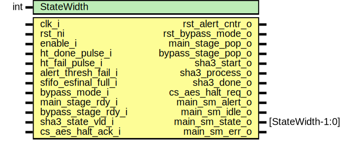

# Entity: entropy_src_main_sm

## Diagram

## Description

Copyright lowRISC contributors.
 Licensed under the Apache License, Version 2.0, see LICENSE for details.
 SPDX-License-Identifier: Apache-2.0
 Description: entropy_src main state machine module
   determines when new entropy is ready to be forwarded
 
## Generics

| Generic name | Type | Value | Description |
| ------------ | ---- | ----- | ----------- |
| StateWidth   | int  | 8     |             |
## Ports

| Port name            | Direction | Type             | Description |
| -------------------- | --------- | ---------------- | ----------- |
| clk_i                | input     |                  |             |
| rst_ni               | input     |                  |             |
| enable_i             | input     |                  |             |
| ht_done_pulse_i      | input     |                  |             |
| ht_fail_pulse_i      | input     |                  |             |
| alert_thresh_fail_i  | input     |                  |             |
| sfifo_esfinal_full_i | input     |                  |             |
| rst_alert_cntr_o     | output    |                  |             |
| bypass_mode_i        | input     |                  |             |
| rst_bypass_mode_o    | output    |                  |             |
| main_stage_rdy_i     | input     |                  |             |
| bypass_stage_rdy_i   | input     |                  |             |
| sha3_state_vld_i     | input     |                  |             |
| main_stage_pop_o     | output    |                  |             |
| bypass_stage_pop_o   | output    |                  |             |
| sha3_start_o         | output    |                  |             |
| sha3_process_o       | output    |                  |             |
| sha3_done_o          | output    |                  |             |
| cs_aes_halt_req_o    | output    |                  |             |
| cs_aes_halt_ack_i    | input     |                  |             |
| main_sm_alert_o      | output    |                  |             |
| main_sm_idle_o       | output    |                  |             |
| main_sm_state_o      | output    | [StateWidth-1:0] |             |
| main_sm_err_o        | output    |                  |             |
## Signals

| Name        | Type                   | Description |
| ----------- | ---------------------- | ----------- |
| state_d     | state_e                |             |
| state_q     | state_e                |             |
| state_raw_q | logic [StateWidth-1:0] |             |
## Constants

| Name       | Type | Value | Description |
| ---------- | ---- | ----- | ----------- |
| StateWidth | int  | 8     |             |
## Types

| Name    | Type                                                                                                                                                                                                                                                                                                                                                                                                                                                                                                                                                                                                                                                                                                                                                                                                                                                                                                                                                                                                                                                                                                                                                                                                                                                              | Description |
| ------- | ----------------------------------------------------------------------------------------------------------------------------------------------------------------------------------------------------------------------------------------------------------------------------------------------------------------------------------------------------------------------------------------------------------------------------------------------------------------------------------------------------------------------------------------------------------------------------------------------------------------------------------------------------------------------------------------------------------------------------------------------------------------------------------------------------------------------------------------------------------------------------------------------------------------------------------------------------------------------------------------------------------------------------------------------------------------------------------------------------------------------------------------------------------------------------------------------------------------------------------------------------------------- | ----------- |
| state_e | enum logic [StateWidth-1:0] {      Idle              = 8'b11000110,       BootHTRunning     = 8'b10111001,       BootPostHTChk     = 8'b10110110,       StartupHTStart    = 8'b10000101,       StartupPhase1     = 8'b01110100,       StartupPass1      = 8'b00101110,       StartupFail1      = 8'b01000011,       ContHTStart       = 8'b01011110,       ContHTRunning     = 8'b11110011,       Sha3Prep          = 8'b10011111,       Sha3Process       = 8'b11101000,       Sha3Valid         = 8'b10001010,       Sha3Done          = 8'b00010000,       Sha3Quiesce       = 8'b01101101,       AlertState        = 8'b01011001,       Error             = 8'b00100001     } |             |
## Processes
- unnamed: (  )
## Instantiations

- u_state_regs: prim_flop
**Description**
This primitive is used to place a size-only constraint on the
flops in order to prevent FSM state encoding optimizations.

