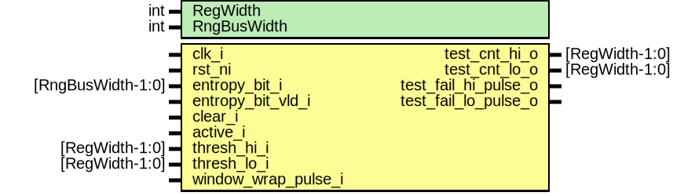

# Entity: entropy_src_markov_ht
## Diagram

## Description
Copyright lowRISC contributors.
 Licensed under the Apache License, Version 2.0, see LICENSE for details.
 SPDX-License-Identifier: Apache-2.0
 Description: entropy_src Markov health test module
 
## Generics
| Generic name | Type | Value | Description |
| ------------ | ---- | ----- | ----------- |
| RegWidth     | int  | 16    |             |
| RngBusWidth  | int  | 4     |             |
## Ports
| Port name            | Direction | Type              | Description       |
| -------------------- | --------- | ----------------- | ----------------- |
| clk_i                | input     |                   |                   |
| rst_ni               | input     |                   |                   |
| entropy_bit_i        | input     | [RngBusWidth-1:0] | ins req interface |
| entropy_bit_vld_i    | input     |                   |                   |
| clear_i              | input     |                   |                   |
| active_i             | input     |                   |                   |
| thresh_hi_i          | input     | [RegWidth-1:0]    |                   |
| thresh_lo_i          | input     | [RegWidth-1:0]    |                   |
| window_wrap_pulse_i  | input     |                   |                   |
| test_cnt_hi_o        | output    | [RegWidth-1:0]    |                   |
| test_cnt_lo_o        | output    | [RegWidth-1:0]    |                   |
| test_fail_hi_pulse_o | output    |                   |                   |
| test_fail_lo_pulse_o | output    |                   |                   |
## Signals
| Name                   | Type                    | Description |
| ---------------------- | ----------------------- | ----------- |
| samples_no_match_pulse | logic [RngBusWidth-1:0] | signals     |
| pair_cntr_gt1          | logic [RegWidth-1:0]    |             |
| pair_cntr_gt2          | logic [RegWidth-1:0]    |             |
| pair_cntr_gt3          | logic [RegWidth-1:0]    |             |
| pair_cntr_lt1          | logic [RegWidth-1:0]    |             |
| pair_cntr_lt2          | logic [RegWidth-1:0]    |             |
| pair_cntr_lt3          | logic [RegWidth-1:0]    |             |
| toggle_q               | logic                   | flops       |
| toggle_d               | logic                   | flops       |
| prev_sample_q          | logic [RngBusWidth-1:0] |             |
| prev_sample_d          | logic [RngBusWidth-1:0] |             |
| pair_cntr_q            | logic [RegWidth-1:0]    |             |
| pair_cntr_d            | logic [RegWidth-1:0]    |             |
## Processes
- unnamed: _( @(posedge clk_i or negedge rst_ni) )_

