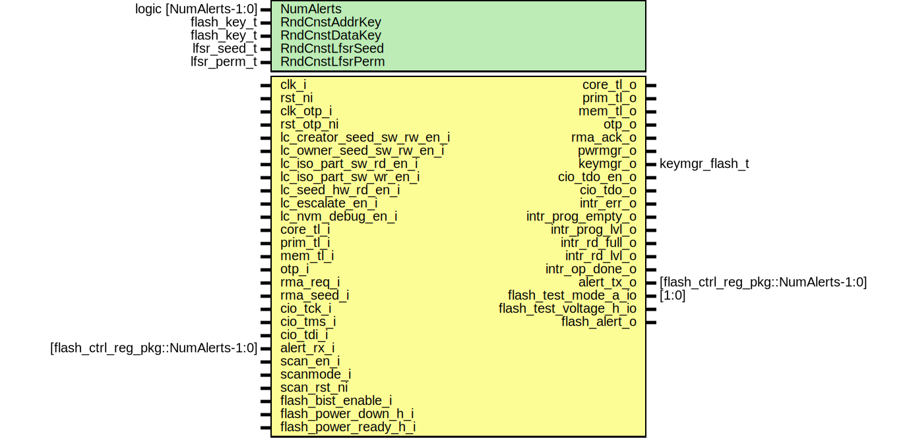

# Entity: flash_ctrl

- **File**: flash_ctrl.sv
## Diagram

## Description

Copyright lowRISC contributors.
 Licensed under the Apache License, Version 2.0, see LICENSE for details.
 SPDX-License-Identifier: Apache-2.0
 Flash Controller Module
 
## Generics

| Generic name    | Type                  | Value                  | Description |
| --------------- | --------------------- | ---------------------- | ----------- |
| NumAlerts       | logic [NumAlerts-1:0] | undefined              |             |
| RndCnstAddrKey  | flash_key_t           | RndCnstAddrKeyDefault  |             |
| RndCnstDataKey  | flash_key_t           | RndCnstDataKeyDefault  |             |
| RndCnstLfsrSeed | lfsr_seed_t           | RndCnstLfsrSeedDefault |             |
| RndCnstLfsrPerm | lfsr_perm_t           | RndCnstLfsrPermDefault |             |
## Ports

| Port name                  | Direction | Type                                | Description                               |
| -------------------------- | --------- | ----------------------------------- | ----------------------------------------- |
| clk_i                      | input     |                                     |                                           |
| rst_ni                     | input     |                                     |                                           |
| clk_otp_i                  | input     |                                     |                                           |
| rst_otp_ni                 | input     |                                     |                                           |
| lc_creator_seed_sw_rw_en_i | input     |                                     | life cycle interface                      |
| lc_owner_seed_sw_rw_en_i   | input     |                                     |                                           |
| lc_iso_part_sw_rd_en_i     | input     |                                     |                                           |
| lc_iso_part_sw_wr_en_i     | input     |                                     |                                           |
| lc_seed_hw_rd_en_i         | input     |                                     |                                           |
| lc_escalate_en_i           | input     |                                     |                                           |
| core_tl_i                  | input     |                                     | Bus Interface                             |
| core_tl_o                  | output    |                                     |                                           |
| prim_tl_i                  | input     |                                     |                                           |
| prim_tl_o                  | output    |                                     |                                           |
| flash_i                    | input     | flash_rsp_t                         | Flash Interface                           |
| flash_o                    | output    | flash_req_t                         |                                           |
| otp_o                      | output    |                                     | otp/lc/pwrmgr/keymgr Interface            |
| otp_i                      | input     |                                     |                                           |
| rma_req_i                  | input     |                                     |                                           |
| rma_seed_i                 | input     |                                     |                                           |
| rma_ack_o                  | output    |                                     |                                           |
| pwrmgr_o                   | output    |                                     |                                           |
| keymgr_o                   | output    | keymgr_flash_t                      |                                           |
| cio_tck_i                  | input     |                                     | IOs                                       |
| cio_tms_i                  | input     |                                     |                                           |
| cio_tdi_i                  | input     |                                     |                                           |
| cio_tdo_en_o               | output    |                                     |                                           |
| cio_tdo_o                  | output    |                                     |                                           |
| intr_err_o                 | output    |                                     | ERR_CODE is non-zero                      |
| intr_prog_empty_o          | output    |                                     | Program fifo is empty                     |
| intr_prog_lvl_o            | output    |                                     | Program fifo is empty                     |
| intr_rd_full_o             | output    |                                     | Read fifo is full                         |
| intr_rd_lvl_o              | output    |                                     | Read fifo is full                         |
| intr_op_done_o             | output    |                                     | Requested flash operation (wr/erase) done |
| alert_rx_i                 | input     | [flash_ctrl_reg_pkg::NumAlerts-1:0] | Alerts                                    |
| alert_tx_o                 | output    | [flash_ctrl_reg_pkg::NumAlerts-1:0] |                                           |
## Signals

| Name                     | Type                                                            | Description                                                                             |
| ------------------------ | --------------------------------------------------------------- | --------------------------------------------------------------------------------------- |
| reg2hw                   | flash_ctrl_core_reg2hw_t                                        |                                                                                         |
| hw2reg                   | flash_ctrl_core_hw2reg_t                                        |                                                                                         |
| tl_win_h2d               | tlul_pkg::tl_h2d_t                                              |                                                                                         |
| tl_win_d2h               | tlul_pkg::tl_d2h_t                                              |                                                                                         |
| intg_err                 | logic                                                           | Register module                                                                         |
| prog_fifo_wvalid         | logic                                                           | FIFO Connections                                                                        |
| prog_fifo_wready         | logic                                                           |                                                                                         |
| prog_fifo_rvalid         | logic                                                           |                                                                                         |
| prog_fifo_ren            | logic                                                           |                                                                                         |
| prog_fifo_wdata          | logic [BusWidth-1:0]                                            |                                                                                         |
| prog_fifo_rdata          | logic [BusWidth-1:0]                                            |                                                                                         |
| prog_fifo_depth          | logic [FifoDepthW-1:0]                                          |                                                                                         |
| rd_fifo_wready           | logic                                                           |                                                                                         |
| rd_fifo_rvalid           | logic                                                           |                                                                                         |
| rd_fifo_rready           | logic                                                           |                                                                                         |
| rd_fifo_wen              | logic                                                           |                                                                                         |
| rd_fifo_ren              | logic                                                           |                                                                                         |
| rd_fifo_wdata            | logic [BusWidth-1:0]                                            |                                                                                         |
| rd_fifo_rdata            | logic [BusWidth-1:0]                                            |                                                                                         |
| rd_fifo_depth            | logic [FifoDepthW-1:0]                                          |                                                                                         |
| rd_fifo_full             | logic                                                           |                                                                                         |
| prog_flash_req           | logic                                                           | Program Control Connections                                                             |
| prog_flash_ovfl          | logic                                                           |                                                                                         |
| prog_flash_addr          | logic [BusAddrW-1:0]                                            |                                                                                         |
| prog_op_valid            | logic                                                           |                                                                                         |
| rd_flash_req             | logic                                                           | Read Control Connections                                                                |
| rd_flash_ovfl            | logic                                                           |                                                                                         |
| rd_flash_addr            | logic [BusAddrW-1:0]                                            |                                                                                         |
| erase_flash_req          | logic                                                           | Erase Control Connections                                                               |
| erase_flash_addr         | logic [BusAddrW-1:0]                                            |                                                                                         |
| erase_flash_type         | flash_erase_e                                                   |                                                                                         |
| prog_done                | logic                                                           | Done / Error signaling from ctrl modules                                                |
| rd_done                  | logic                                                           | Done / Error signaling from ctrl modules                                                |
| erase_done               | logic                                                           | Done / Error signaling from ctrl modules                                                |
| prog_err                 | logic                                                           |                                                                                         |
| rd_err                   | logic                                                           |                                                                                         |
| erase_err                | logic                                                           |                                                                                         |
| flash_addr               | logic [BusAddrW-1:0]                                            | Flash Memory Properties Connections                                                     |
| flash_req                | logic                                                           |                                                                                         |
| flash_rd_done            | logic                                                           |                                                                                         |
| flash_prog_done          | logic                                                           |                                                                                         |
| flash_erase_done         | logic                                                           |                                                                                         |
| flash_mp_error           | logic                                                           |                                                                                         |
| flash_prog_data          | logic [BusWidth-1:0]                                            |                                                                                         |
| flash_prog_last          | logic                                                           |                                                                                         |
| flash_prog_type          | flash_prog_e                                                    |                                                                                         |
| flash_rd_data            | logic [BusWidth-1:0]                                            |                                                                                         |
| flash_rd_err             | logic                                                           |                                                                                         |
| flash_phy_busy           | logic                                                           |                                                                                         |
| rd_op                    | logic                                                           |                                                                                         |
| prog_op                  | logic                                                           |                                                                                         |
| erase_op                 | logic                                                           |                                                                                         |
| err_addr                 | logic [AllPagesW-1:0]                                           |                                                                                         |
| phase                    | flash_lcmgr_phase_e                                             |                                                                                         |
| addr_key                 | flash_key_t                                                     | Flash control arbitration connections to hardware interface                             |
| rand_addr_key            | flash_key_t                                                     |                                                                                         |
| data_key                 | flash_key_t                                                     |                                                                                         |
| rand_data_key            | flash_key_t                                                     |                                                                                         |
| hw_ctrl                  | flash_ctrl_reg2hw_control_reg_t                                 |                                                                                         |
| hw_req                   | logic                                                           |                                                                                         |
| hw_addr                  | logic [top_pkg::TL_AW-1:0]                                      |                                                                                         |
| hw_done                  | logic                                                           |                                                                                         |
| hw_err                   | logic                                                           |                                                                                         |
| hw_rvalid                | logic                                                           |                                                                                         |
| hw_rready                | logic                                                           |                                                                                         |
| hw_wvalid                | logic                                                           |                                                                                         |
| hw_wdata                 | logic [BusWidth-1:0]                                            |                                                                                         |
| hw_wready                | logic                                                           |                                                                                         |
| if_sel                   | flash_sel_e                                                     |                                                                                         |
| sw_sel                   | logic                                                           |                                                                                         |
| hw_phase                 | flash_lcmgr_phase_e                                             |                                                                                         |
| creator_seed_priv        | logic                                                           |                                                                                         |
| owner_seed_priv          | logic                                                           |                                                                                         |
| sw_ctrl_done             | logic                                                           | Flash control arbitration connections to software interface                             |
| sw_ctrl_err              | logic                                                           |                                                                                         |
| muxed_ctrl               | flash_ctrl_reg2hw_control_reg_t                                 | Flash control muxed connections                                                         |
| muxed_addr               | logic [top_pkg::TL_AW-1:0]                                      |                                                                                         |
| op_start                 | logic                                                           |                                                                                         |
| op_num_words             | logic [11:0]                                                    |                                                                                         |
| op_addr                  | logic [BusAddrW-1:0]                                            |                                                                                         |
| op_type                  | flash_op_e                                                      |                                                                                         |
| op_part                  | flash_part_e                                                    |                                                                                         |
| op_info_sel              | logic [InfoTypesWidth-1:0]                                      |                                                                                         |
| op_erase_type            | flash_erase_e                                                   |                                                                                         |
| op_prog_type             | flash_prog_e                                                    |                                                                                         |
| ctrl_init_busy           | logic                                                           |                                                                                         |
| fifo_clr                 | logic                                                           |                                                                                         |
| sw_rvalid                | logic                                                           | software tlul to flash control aribration                                               |
| adapter_rvalid           | logic                                                           |                                                                                         |
| sw_wvalid                | logic                                                           |                                                                                         |
| sw_wdata                 | logic [BusWidth-1:0]                                            |                                                                                         |
| sw_wen                   | logic                                                           |                                                                                         |
| sw_wready                | logic                                                           |                                                                                         |
| rand_val                 | logic [31:0]                                                    | lfsr for local entropy usage                                                            |
| lfsr_en                  | logic                                                           |                                                                                         |
| lfsr_seed_en             | logic                                                           |                                                                                         |
| lc_creator_seed_sw_rw_en | lc_ctrl_pkg::lc_tx_t                                            | life cycle connections                                                                  |
| lc_owner_seed_sw_rw_en   | lc_ctrl_pkg::lc_tx_t                                            |                                                                                         |
| lc_iso_part_sw_rd_en     | lc_ctrl_pkg::lc_tx_t                                            |                                                                                         |
| lc_iso_part_sw_wr_en     | lc_ctrl_pkg::lc_tx_t                                            |                                                                                         |
| lc_seed_hw_rd_en         | lc_ctrl_pkg::lc_tx_t                                            |                                                                                         |
| flash_disable            | lc_ctrl_pkg::lc_tx_t                                            | flash functional disable                                                                |
| prog_type_en             | logic [1:0]                                                     | Program handler is consumer of prog_fifo                                                |
| region_cfgs              | mp_region_cfg_t [MpRegions:0]                                   | extra region is the default region                                                      |
|                          | [MpRegions-1:0]                                                 |                                                                                         |
| reg2hw_info_page_cfgs    | info_page_cfg_t [NumBanks-1:0][InfoTypes-1:0][InfosPerBank-1:0] |                                                                                         |
| info_page_cfgs           | info_page_cfg_t [NumBanks-1:0][InfoTypes-1:0][InfosPerBank-1:0] |                                                                                         |
| flash_part_sel           | flash_part_e                                                    | direct assignment since prog/rd/erase_ctrl do not make use of op_part                   |
| flash_info_sel           | logic [InfoTypesWidth-1:0]                                      |                                                                                         |
| flash_idle_d             | logic                                                           | Interface to pwrmgr flash is not idle as long as there is a stateful operation ongoing  |
| alert_srcs               | logic [NumAlerts-1:0]                                           |                                                                                         |
| alert_tests              | logic [NumAlerts-1:0]                                           |                                                                                         |
| recov_err                | logic                                                           |                                                                                         |
| recov_mp_err             | logic                                                           |                                                                                         |
| recov_ecc_err            | logic                                                           |                                                                                         |
| fatal_intg_err           | logic                                                           |                                                                                         |
| lc_escalate_en           | lc_ctrl_pkg::lc_tx_t                                            |                                                                                         |
| single_err_cnt_d         | logic [7:0]                                                     |                                                                                         |
| multi_err_cnt_d          | logic [7:0]                                                     |                                                                                         |
| err_code_d               | flash_ctrl_reg2hw_err_code_reg_t                                |                                                                                         |
| err_code_q               | flash_ctrl_reg2hw_err_code_reg_t                                |                                                                                         |
| err_code_intr_event      | logic                                                           |                                                                                         |
| intr_src_d               | logic [3:0]                                                     | general interrupt events                                                                |
| intr_src_q               | logic [3:0]                                                     |                                                                                         |
| intr_assert              | logic [4:0]                                                     | interrupt events                                                                        |
| unused_byte_sel          | logic [BusByteWidth-1:0]                                        | Unused bits                                                                             |
| unused_higher_addr_bits  | logic [top_pkg::TL_AW-1-BusAddrW:0]                             |                                                                                         |
| unused_scratch           | logic [top_pkg::TL_AW-1:0]                                      |                                                                                         |
## Constants

| Name     | Type                  | Value                                                                                                                                                                    | Description |
| -------- | --------------------- | ------------------------------------------------------------------------------------------------------------------------------------------------------------------------ | ----------- |
| InfoBits | int                   | $bits(info_page_cfg_t) * InfosPerBank                                                                                                                                    |             |
| IsFatal  | logic [NumAlerts-1:0] | { 1'b1,  1'b0,  1'b0,  1'b0} |             |
## Processes
- unnamed: (  )
**Description**
Final muxing to flash macro module

- unnamed: (  )
- unnamed: ( @(posedge clk_i or negedge rst_ni) )
- unnamed: ( @(posedge clk_i or negedge rst_ni) )
## Instantiations

- u_reg_core: flash_ctrl_core_reg_top
- u_lc_creator_seed_sw_rw_en_sync: prim_lc_sync
**Description**
synchronize enables into local domain

- u_lc_owner_seed_sw_rw_en_sync: prim_lc_sync
- u_lc_iso_part_sw_rd_en_sync: prim_lc_sync
- u_lc_iso_part_sw_wr_en_sync: prim_lc_sync
- u_lc_seed_hw_rd_en_sync: prim_lc_sync
- u_lfsr: prim_lfsr
- u_ctrl_arb: flash_ctrl_arb
**Description**
flash control arbitration between softawre / harware interfaces

- u_flash_hw_if: flash_ctrl_lcmgr
**Description**
hardware interface

- u_to_prog_fifo: tlul_adapter_sram
- u_prog_fifo: prim_fifo_sync
- u_rd_fifo: prim_fifo_sync
- u_flash_ctrl_rd: flash_ctrl_rd
**Description**
Read handler is consumer of rd_fifo

- u_flash_ctrl_erase: flash_ctrl_erase
**Description**
Erase handler does not consume fifo

- u_flash_mp: flash_mp
**Description**
Flash memory Properties
Memory property is page based and thus should use phy addressing
This should move to flash_phy long term

- u_reg_idle: prim_flop
- u_lc_escalation_en_sync: prim_lc_sync
