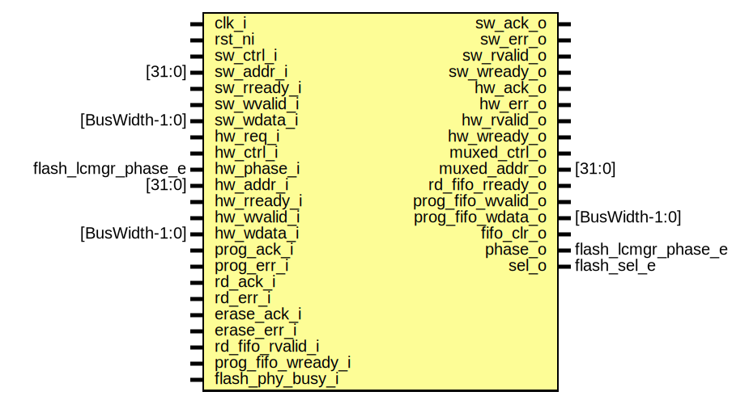

# Entity: flash_ctrl_arb
## Diagram

## Description
Copyright lowRISC contributors.
 Licensed under the Apache License, Version 2.0, see LICENSE for details.
 SPDX-License-Identifier: Apache-2.0
 Flash Controllber Arbiter for read
 flash read and erase functionality is shared betewen the hardware (life cycle
 and key manager) and software interfaces.
 This module arbitrates and muxes the controls between the two interfaces.
 
## Ports
| Port name          | Direction | Type                | Description                                |
| ------------------ | --------- | ------------------- | ------------------------------------------ |
| clk_i              | input     |                     |                                            |
| rst_ni             | input     |                     |                                            |
| sw_ctrl_i          | input     |                     | software interface to rd_ctrl / erase_ctrl |
| sw_addr_i          | input     | [31:0]              |                                            |
| sw_ack_o           | output    |                     |                                            |
| sw_err_o           | output    |                     |                                            |
| sw_rvalid_o        | output    |                     | software interface to rd_fifo              |
| sw_rready_i        | input     |                     |                                            |
| sw_wvalid_i        | input     |                     | software interface to prog_fifo            |
| sw_wready_o        | output    |                     |                                            |
| sw_wdata_i         | input     | [BusWidth-1:0]      |                                            |
| hw_req_i           | input     |                     | hardware interface to rd_ctrl / erase_ctrl |
| hw_ctrl_i          | input     |                     |                                            |
| hw_phase_i         | input     | flash_lcmgr_phase_e |                                            |
| hw_addr_i          | input     | [31:0]              |                                            |
| hw_ack_o           | output    |                     |                                            |
| hw_err_o           | output    |                     |                                            |
| hw_rvalid_o        | output    |                     | hardware interface to rd_fifo              |
| hw_rready_i        | input     |                     |                                            |
| hw_wvalid_i        | input     |                     | hardware interface to prog_fifo            |
| hw_wdata_i         | input     | [BusWidth-1:0]      |                                            |
| hw_wready_o        | output    |                     |                                            |
| muxed_ctrl_o       | output    |                     | muxed interface to rd_ctrl / erase_ctrl    |
| muxed_addr_o       | output    | [31:0]              |                                            |
| prog_ack_i         | input     |                     |                                            |
| prog_err_i         | input     |                     |                                            |
| rd_ack_i           | input     |                     |                                            |
| rd_err_i           | input     |                     |                                            |
| erase_ack_i        | input     |                     |                                            |
| erase_err_i        | input     |                     |                                            |
| rd_fifo_rvalid_i   | input     |                     | muxed interface to rd_fifo                 |
| rd_fifo_rready_o   | output    |                     |                                            |
| prog_fifo_wvalid_o | output    |                     | muxed interface to prog_fifo               |
| prog_fifo_wdata_o  | output    | [BusWidth-1:0]      |                                            |
| prog_fifo_wready_i | input     |                     |                                            |
| flash_phy_busy_i   | input     |                     | flash phy initialization ongoing           |
| fifo_clr_o         | output    |                     | clear fifo contents                        |
| phase_o            | output    | flash_lcmgr_phase_e | output to memory protection                |
| sel_o              | output    | flash_sel_e         | indication that sw has been selected       |
## Signals
| Name     | Type        | Description  |
| -------- | ----------- | ------------ |
| func_sel | flash_sel_e |              |
| state_q  | state_e     |              |
| state_d  | state_e     |              |
| sw_req   | logic       |              |
| ctrl_ack | logic       | always_comb  |
| ctrl_err | logic       | always_comb  |
## Types
| Name    | Type                                                                         | Description      |
| ------- | ---------------------------------------------------------------------------- | ---------------- |
| state_e | enum logic [1:0] {     StReset,       StHw,     StSwActive,     StSwIdle   } | arbitration FSM  |
## Processes
- unnamed: _( @(posedge clk_i or negedge rst_ni) )_

- unnamed: _(  )_

- unnamed: _(  )_

- unnamed: _(  )_
pick appropriate feedback

**Description**
pick appropriate feedback

