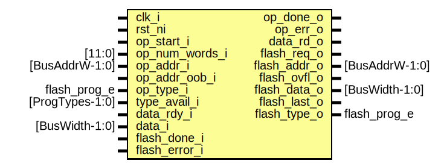

# Entity: flash_ctrl_prog

- **File**: flash_ctrl_prog.sv
## Diagram

## Description

Copyright lowRISC contributors.
 Licensed under the Apache License, Version 2.0, see LICENSE for details.
 SPDX-License-Identifier: Apache-2.0
 Faux Flash Prog Control
 
## Ports

| Port name      | Direction | Type            | Description            |
| -------------- | --------- | --------------- | ---------------------- |
| clk_i          | input     |                 |                        |
| rst_ni         | input     |                 |                        |
| op_start_i     | input     |                 | Control Interface      |
| op_num_words_i | input     | [11:0]          |                        |
| op_done_o      | output    |                 |                        |
| op_err_o       | output    |                 |                        |
| op_addr_i      | input     | [BusAddrW-1:0]  |                        |
| op_type_i      | input     | flash_prog_e    |                        |
| type_avail_i   | input     | [ProgTypes-1:0] |                        |
| data_rdy_i     | input     |                 | FIFO Interface         |
| data_i         | input     | [BusWidth-1:0]  |                        |
| data_rd_o      | output    |                 |                        |
| flash_req_o    | output    |                 | Flash Macro Interface  |
| flash_addr_o   | output    | [BusAddrW-1:0]  |                        |
| flash_ovfl_o   | output    |                 |                        |
| flash_data_o   | output    | [BusWidth-1:0]  |                        |
| flash_last_o   | output    |                 | last beat of prog data |
| flash_type_o   | output    | flash_prog_e    |                        |
| flash_done_i   | input     |                 |                        |
| flash_error_i  | input     |                 |                        |
## Signals

| Name            | Type                       | Description                              |
| --------------- | -------------------------- | ---------------------------------------- |
| st              | state_e                    |                                          |
| st_nxt          | state_e                    |                                          |
| cnt             | logic [11:0]               |                                          |
| cnt_nxt         | logic [11:0]               |                                          |
| cnt_hit         | logic                      |                                          |
| int_addr        | logic [BusAddrW:0]         |                                          |
| txn_done        | logic                      |                                          |
| prog_type_avail | logic                      | if the requested prog type is available  |
| start_window    | logic [WindowWidth-1:0]    |                                          |
| end_window      | logic [WindowWidth-1:0]    |                                          |
| end_addr        | logic [BusAddrW-1:0]       |                                          |
| win_err         | logic                      |                                          |
| unused_end_addr | logic [BusPgmResWidth-1:0] | unused signals                           |
## Constants

| Name        | Type | Value                     | Description                                                                                                                                   |
| ----------- | ---- | ------------------------- | --------------------------------------------------------------------------------------------------------------------------------------------- |
| WindowWidth | int  | BusAddrW - BusPgmResWidth | program resolution check if the incoming beat is larger than the maximum program resolution, error immediately and do not allow it to start.  |
## Types

| Name    | Type                                                                                                                          | Description |
| ------- | ----------------------------------------------------------------------------------------------------------------------------- | ----------- |
| state_e | enum logic {      StNorm  = 'h0,      StErr   = 'h1   } |             |
## Processes
- unnamed: ( @(posedge clk_i or negedge rst_ni) )
- unnamed: (  )
**Description**
when error'd, continue to drain all program fifo contents like normal operation
if this is not done, software may fill up the fifo without anyone
draining the contents, leading to a lockup

