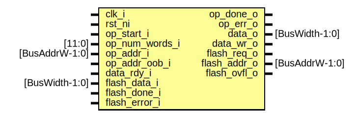

# Entity: flash_ctrl_rd

- **File**: flash_ctrl_rd.sv
## Diagram

## Description

 Copyright lowRISC contributors.
 Licensed under the Apache License, Version 2.0, see LICENSE for details.
 SPDX-License-Identifier: Apache-2.0

 Faux Flash Read Control

## Ports

| Port name      | Direction | Type           | Description            |
| -------------- | --------- | -------------- | ---------------------- |
| clk_i          | input     |                |                        |
| rst_ni         | input     |                |                        |
| op_start_i     | input     |                |  Software Interface    |
| op_num_words_i | input     | [11:0]         |                        |
| op_done_o      | output    |                |                        |
| op_err_o       | output    |                |                        |
| op_addr_i      | input     | [BusAddrW-1:0] |                        |
| op_addr_oob_i  | input     |                |                        |
| data_rdy_i     | input     |                |  FIFO Interface        |
| data_o         | output    | [BusWidth-1:0] |                        |
| data_wr_o      | output    |                |                        |
| flash_req_o    | output    |                |  Flash Macro Interface |
| flash_addr_o   | output    | [BusAddrW-1:0] |                        |
| flash_ovfl_o   | output    |                |                        |
| flash_data_i   | input     | [BusWidth-1:0] |                        |
| flash_done_i   | input     |                |                        |
| flash_error_i  | input     |                |                        |
## Signals

| Name     | Type               | Description                                  |
| -------- | ------------------ | -------------------------------------------- |
| st       | state_e            |                                              |
| st_nxt   | state_e            |                                              |
| cnt      | logic [11:0]       |                                              |
| cnt_nxt  | logic [11:0]       |                                              |
| cnt_hit  | logic              |                                              |
| int_addr | logic [BusAddrW:0] |                                              |
| txn_done | logic              |                                              |
| err_sel  | logic              | 1 selects error data, 0 selects normal data  |
## Types

| Name    | Type                                                                                                                                                                 | Description |
| ------- | -------------------------------------------------------------------------------------------------------------------------------------------------------------------- | ----------- |
| state_e | enum logic [1:0] {      StIdle,      StNorm,      StErr   } |             |
## Processes
- unnamed: ( @(posedge clk_i or negedge rst_ni) )
  - **Type:** always_ff
- unnamed: (  )
  - **Type:** always_comb
 **Description**
 when error'd, continue to complete existing read transaction but fill in with all 1's  if this is not done, software may continue to attempt to read out of the fifo  and eventually cause a bus deadlock as the fifo would be empty  This scheme is similar to burst completion up an error 
