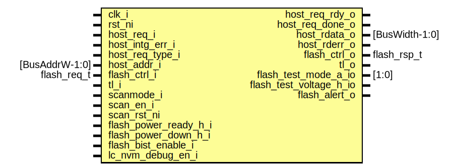

# Entity: flash_phy
## Diagram

## Description
Copyright lowRISC contributors.
 Licensed under the Apache License, Version 2.0, see LICENSE for details.
 SPDX-License-Identifier: Apache-2.0
 Flash Phy Module
 Flash phy represents the top level open source wrapper for a proprietary flash
 module.
 The top level flash_phy is only responsible for dispatching transactions and
 correctly collecting the responses in order.
 
## Ports
| Port name               | Direction | Type           | Description |
| ----------------------- | --------- | -------------- | ----------- |
| clk_i                   | input     |                |             |
| rst_ni                  | input     |                |             |
| host_req_i              | input     |                |             |
| host_intg_err_i         | input     |                |             |
| host_req_type_i         | input     |                |             |
| host_addr_i             | input     | [BusAddrW-1:0] |             |
| host_req_rdy_o          | output    |                |             |
| host_req_done_o         | output    |                |             |
| host_rdata_o            | output    | [BusWidth-1:0] |             |
| host_rderr_o            | output    |                |             |
| flash_ctrl_i            | input     | flash_req_t    |             |
| flash_ctrl_o            | output    | flash_rsp_t    |             |
| scanmode_i              | input     |                |             |
| scan_en_i               | input     |                |             |
| scan_rst_ni             | input     |                |             |
| flash_power_ready_h_i   | input     |                |             |
| flash_power_down_h_i    | input     |                |             |
| flash_test_mode_a_io    | inout     | [1:0]          |             |
| flash_test_voltage_h_io | inout     |                |             |
| flash_bist_enable_i     | input     |                |             |
| lc_nvm_debug_en_i       | input     |                |             |
| flash_alert_o           | output    |                |             |
## Signals
| Name             | Type                                                     | Description                                                                                                                                                                                                                                                                                                                                                                          |
| ---------------- | -------------------------------------------------------- | ------------------------------------------------------------------------------------------------------------------------------------------------------------------------------------------------------------------------------------------------------------------------------------------------------------------------------------------------------------------------------------ |
| host_bank_sel    | logic [BankW-1:0]                                        | The sequence fifo below holds the correct response order, while each flash_phy_core is paired with a small passthrough response FIFO to hold the data if necessary. If one bank finishes "ahead" of schedule, the response FIFO will hold the response, and no new transactions will be issued to that bank until the response is consumed by the host. host to flash_phy interface  |
| rsp_bank_sel     | logic [BankW-1:0]                                        |                                                                                                                                                                                                                                                                                                                                                                                      |
| host_req_rdy     | logic [NumBanks-1:0]                                     |                                                                                                                                                                                                                                                                                                                                                                                      |
| host_req_done    | logic [NumBanks-1:0]                                     |                                                                                                                                                                                                                                                                                                                                                                                      |
| host_rsp_avail   | logic [NumBanks-1:0]                                     |                                                                                                                                                                                                                                                                                                                                                                                      |
| host_rsp_vld     | logic [NumBanks-1:0]                                     |                                                                                                                                                                                                                                                                                                                                                                                      |
| host_rsp_ack     | logic [NumBanks-1:0]                                     |                                                                                                                                                                                                                                                                                                                                                                                      |
| host_rsp_data    | logic [BusWidth-1:0]                                     |                                                                                                                                                                                                                                                                                                                                                                                      |
| host_rsp_err     | logic [NumBanks-1:0]                                     |                                                                                                                                                                                                                                                                                                                                                                                      |
| seq_fifo_rdy     | logic                                                    |                                                                                                                                                                                                                                                                                                                                                                                      |
| seq_fifo_pending | logic                                                    |                                                                                                                                                                                                                                                                                                                                                                                      |
| ctrl_bank_sel    | logic [BankW-1:0]                                        | flash_ctrl to flash_phy interface                                                                                                                                                                                                                                                                                                                                                    |
| rd_done          | logic [NumBanks-1:0]                                     |                                                                                                                                                                                                                                                                                                                                                                                      |
| prog_done        | logic [NumBanks-1:0]                                     |                                                                                                                                                                                                                                                                                                                                                                                      |
| erase_done       | logic [NumBanks-1:0]                                     |                                                                                                                                                                                                                                                                                                                                                                                      |
| init_busy        | logic                                                    |                                                                                                                                                                                                                                                                                                                                                                                      |
| prog_type_avail  | logic [ProgTypes-1:0]                                    |                                                                                                                                                                                                                                                                                                                                                                                      |
| rd_data          | logic [BusWidth-1:0]                                     | common interface                                                                                                                                                                                                                                                                                                                                                                     |
| rd_err           | logic [NumBanks-1:0]                                     |                                                                                                                                                                                                                                                                                                                                                                                      |
| host_scramble_en | logic                                                    |                                                                                                                                                                                                                                                                                                                                                                                      |
| host_ecc_en      | logic                                                    |                                                                                                                                                                                                                                                                                                                                                                                      |
| region_attrs     | data_region_attr_t                                       |                                                                                                                                                                                                                                                                                                                                                                                      |
| region_cfg       | mp_region_cfg_t                                          |                                                                                                                                                                                                                                                                                                                                                                                      |
| unused_cfg       | mp_region_cfg_t                                          |                                                                                                                                                                                                                                                                                                                                                                                      |
| prim_flash_req   | flash_phy_pkg::flash_phy_prim_flash_req_t [NumBanks-1:0] | Prim flash to flash_phy_core connections                                                                                                                                                                                                                                                                                                                                             |
| prim_flash_rsp   | flash_phy_pkg::flash_phy_prim_flash_rsp_t [NumBanks-1:0] |                                                                                                                                                                                                                                                                                                                                                                                      |
| ecc_single_err   | logic [NumBanks-1:0]                                     |                                                                                                                                                                                                                                                                                                                                                                                      |
| ecc_multi_err    | logic [NumBanks-1:0]                                     |                                                                                                                                                                                                                                                                                                                                                                                      |
| ecc_addr         | logic [NumBanks-1:0][BusAddrW-1:0]                       |                                                                                                                                                                                                                                                                                                                                                                                      |
| flash_disable    | lc_ctrl_pkg::lc_tx_t [NumBanks-1:0]                      |                                                                                                                                                                                                                                                                                                                                                                                      |
| tdo              | logic                                                    | block: gen_flash_banks life cycle handling                                                                                                                                                                                                                                                                                                                                           |
| lc_nvm_debug_en  | lc_ctrl_pkg::lc_tx_t [FlashLcDftLast-1:0]                |                                                                                                                                                                                                                                                                                                                                                                                      |
| bist_enable_qual | lc_ctrl_pkg::lc_tx_t                                     |                                                                                                                                                                                                                                                                                                                                                                                      |
| unused_alert     | logic                                                    |                                                                                                                                                                                                                                                                                                                                                                                      |
| unused_trst_n    | logic                                                    |                                                                                                                                                                                                                                                                                                                                                                                      |
## Constants
| Name                 | Type | Value                           | Description                                                                                                                                                                                                                   |
| -------------------- | ---- | ------------------------------- | ----------------------------------------------------------------------------------------------------------------------------------------------------------------------------------------------------------------------------- |
| FlashMacroOustanding | int  | 1                               | Flash macro outstanding refers to how many reads we allow a macro to move ahead of an in order blocking read. Since the data cannot be returned out of order, this simply does the reads in advance and store them in a FIFO  |
| SeqFifoDepth         | int  | FlashMacroOustanding * NumBanks |                                                                                                                                                                                                                               |
| TotalRegions         | int  | MpRegions + 1                   | Generate host scramble_en indication, broadcasted to all banks                                                                                                                                                                |
## Instantiations
- u_bank_sequence_fifo: prim_fifo_sync
**Description**
This fifo holds the expected return order

- u_region_sel: flash_mp_data_region_sel
**Description**
the region decode only accepts page address

- u_flash_disable_sync: prim_lc_sync
- u_lc_nvm_debug_en_sync: prim_lc_sync
- u_flash: prim_flash
