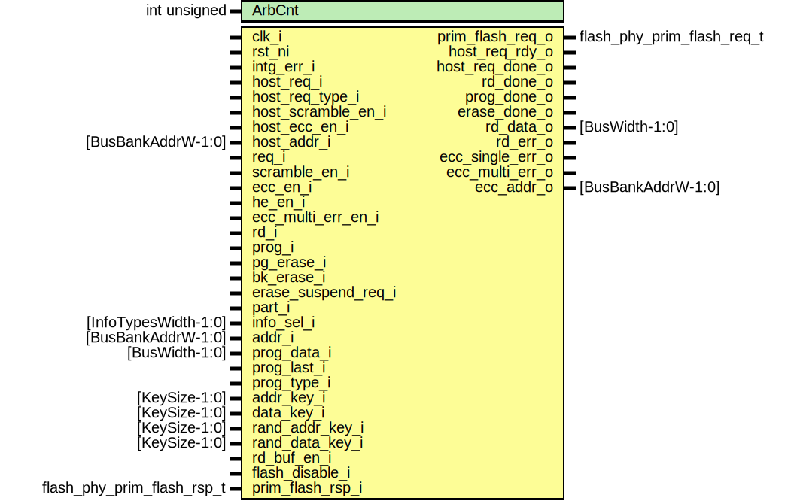

# Entity: flash_phy_core
## Diagram

## Description
Copyright lowRISC contributors.
 Licensed under the Apache License, Version 2.0, see LICENSE for details.
 SPDX-License-Identifier: Apache-2.0
 Flash Phy Core Module
 This module wraps every single flash bank and contains most of the region attribute,
 scramble, ECC, security and arbitration logic.
 Most of the items are TODO, at the moment only arbitration logic exists.
 
## Generics
| Generic name | Type         | Value | Description |
| ------------ | ------------ | ----- | ----------- |
| ArbCnt       | int unsigned | 4     |             |
## Ports
| Port name           | Direction | Type                       | Description              |
| ------------------- | --------- | -------------------------- | ------------------------ |
| clk_i               | input     |                            |                          |
| rst_ni              | input     |                            |                          |
| intg_err_i          | input     |                            |                          |
| host_req_i          | input     |                            | host request - read only |
| host_req_type_i     | input     |                            |                          |
| host_scramble_en_i  | input     |                            |                          |
| host_ecc_en_i       | input     |                            |                          |
| host_addr_i         | input     | [BusBankAddrW-1:0]         |                          |
| req_i               | input     |                            | controller request       |
| scramble_en_i       | input     |                            |                          |
| ecc_en_i            | input     |                            |                          |
| he_en_i             | input     |                            |                          |
| ecc_multi_err_en_i  | input     |                            |                          |
| rd_i                | input     |                            |                          |
| prog_i              | input     |                            |                          |
| pg_erase_i          | input     |                            |                          |
| bk_erase_i          | input     |                            |                          |
| erase_suspend_req_i | input     |                            |                          |
| part_i              | input     |                            |                          |
| info_sel_i          | input     | [InfoTypesWidth-1:0]       |                          |
| addr_i              | input     | [BusBankAddrW-1:0]         |                          |
| prog_data_i         | input     | [BusWidth-1:0]             |                          |
| prog_last_i         | input     |                            |                          |
| prog_type_i         | input     |                            |                          |
| addr_key_i          | input     | [KeySize-1:0]              |                          |
| data_key_i          | input     | [KeySize-1:0]              |                          |
| rand_addr_key_i     | input     | [KeySize-1:0]              |                          |
| rand_data_key_i     | input     | [KeySize-1:0]              |                          |
| rd_buf_en_i         | input     |                            |                          |
| flash_disable_i     | input     |                            |                          |
| prim_flash_rsp_i    | input     | flash_phy_prim_flash_rsp_t |                          |
| prim_flash_req_o    | output    | flash_phy_prim_flash_req_t |                          |
| host_req_rdy_o      | output    |                            |                          |
| host_req_done_o     | output    |                            |                          |
| rd_done_o           | output    |                            |                          |
| prog_done_o         | output    |                            |                          |
| erase_done_o        | output    |                            |                          |
| rd_data_o           | output    | [BusWidth-1:0]             |                          |
| rd_err_o            | output    |                            |                          |
| ecc_single_err_o    | output    |                            |                          |
| ecc_multi_err_o     | output    |                            |                          |
| ecc_addr_o          | output    | [BusBankAddrW-1:0]         |                          |
## Signals
| Name                | Type                         | Description                                                                              |
| ------------------- | ---------------------------- | ---------------------------------------------------------------------------------------- |
| state_q             | arb_state_e                  |                                                                                          |
| state_d             | arb_state_e                  |                                                                                          |
| reqs                | logic [PhyOps-1:0]           | request signals to flash macro                                                           |
| muxed_req_type      | tlul_pkg::tl_type_e          | the type of transaction to flash macro                                                   |
| host_sel            | logic                        | host select for address                                                                  |
| host_rsp            | logic                        | qualifier for host responses                                                             |
| ctrl_rsp_vld        | logic                        | controller response valid                                                                |
| ack                 | logic                        | ack to phy operations from flash macro                                                   |
| done                | logic                        | done to phy operations from flash macro                                                  |
| prog_ack            | logic                        | ack from flash_phy_prog to controller                                                    |
| erase_ack           | logic                        | ack from flash_phy_erase to controller                                                   |
| muxed_addr          | logic [BusBankAddrW-1:0]     | interface with flash macro                                                               |
| muxed_part          | flash_ctrl_pkg::flash_part_e |                                                                                          |
| muxed_scramble_en   | logic                        |                                                                                          |
| muxed_ecc_en        | logic                        |                                                                                          |
| rd_stage_idle       | logic                        | entire read stage is idle, inclusive of all stages                                       |
| rd_stage_rdy        | logic                        | the read stage is ready to accept a new transaction                                      |
| rd_stage_data_valid | logic                        | the read stage has valid response                                                        |
| arb_cnt             | logic [CntWidth-1:0]         | arbitration counter If controller side has lost arbitration ArbCnt times, favor it once  |
| inc_arb_cnt         | logic                        |                                                                                          |
| clr_arb_cnt         | logic                        |                                                                                          |
| host_req_masked     | logic                        |                                                                                          |
| calc_ack            | logic                        | scramble / de-scramble connections                                                       |
| op_ack              | logic                        |                                                                                          |
| scramble_mask       | logic [DataWidth-1:0]        |                                                                                          |
| flash_rd_req        | logic                        |                                                                                          |
| flash_rdata         | logic [FullDataWidth-1:0]    |                                                                                          |
| rd_calc_req         | logic                        |                                                                                          |
| rd_calc_addr        | logic [BankAddrW-1:0]        |                                                                                          |
| rd_op_req           | logic                        |                                                                                          |
| rd_scrambled_data   | logic [DataWidth-1:0]        |                                                                                          |
| rd_descrambled_data | logic [DataWidth-1:0]        |                                                                                          |
| prog_full_data      | logic [FullDataWidth-1:0]    |                                                                                          |
| prog_scrambled_data | logic [DataWidth-1:0]        |                                                                                          |
| prog_data           | logic [DataWidth-1:0]        |                                                                                          |
| prog_last           | logic                        |                                                                                          |
| flash_prog_req      | logic                        |                                                                                          |
| prog_calc_req       | logic                        |                                                                                          |
| prog_op_req         | logic                        |                                                                                          |
| flash_pg_erase_req  | logic                        |                                                                                          |
| flash_bk_erase_req  | logic                        |                                                                                          |
| scramble_muxed_addr | logic [BankAddrW-1:0]        |                                                                                          |
## Constants
| Name     | Type | Value              | Description |
| -------- | ---- | ------------------ | ----------- |
| CntWidth | int  | $clog2(ArbCnt + 1) |             |
## Types
| Name        | Type                                                                                                         | Description |
| ----------- | ------------------------------------------------------------------------------------------------------------ | ----------- |
| arb_state_e | enum logic [2:0] {     StIdle,     StHostRead,     StCtrlRead,     StCtrlProg,     StCtrl,     StDisable   } |             |
## Processes
- unnamed: _( @(posedge clk_i or negedge rst_ni) )_

- unnamed: _( @(posedge clk_i or negedge rst_ni) )_

- unnamed: _(  )_

## Instantiations
- u_rd: flash_phy_rd
- u_erase: flash_phy_erase
- u_scramble: flash_phy_scramble
