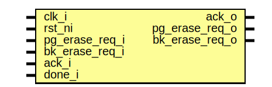

# Entity: flash_phy_erase

- **File**: flash_phy_erase.sv
## Diagram

## Description

Copyright lowRISC contributors.
 Licensed under the Apache License, Version 2.0, see LICENSE for details.
 SPDX-License-Identifier: Apache-2.0
 Flash Phy Erase Module
 Translates the controller's req/ack interface to the interface expected by the flash wrapper
 Longer term the controller protocol can be changed to match.
 
## Ports

| Port name      | Direction | Type | Description               |
| -------------- | --------- | ---- | ------------------------- |
| clk_i          | input     |      |                           |
| rst_ni         | input     |      |                           |
| pg_erase_req_i | input     |      | interface with controller |
| bk_erase_req_i | input     |      |                           |
| ack_o          | output    |      |                           |
| pg_erase_req_o | output    |      | interface with flash      |
| bk_erase_req_o | output    |      |                           |
| ack_i          | input     |      |                           |
| done_i         | input     |      |                           |
## Signals

| Name      | Type          | Description |
| --------- | ------------- | ----------- |
| state_d   | erase_state_e |             |
| state_q   | erase_state_e |             |
| req_valid | logic         |             |
## Types

| Name          | Type                                                                                                                      | Description |
| ------------- | ------------------------------------------------------------------------------------------------------------------------- | ----------- |
| erase_state_e | enum logic {      StEraseIdle,      StEraseBusy   } |             |
## Processes
- unnamed: ( @(posedge clk_i or negedge rst_ni) )
- unnamed: (  )
