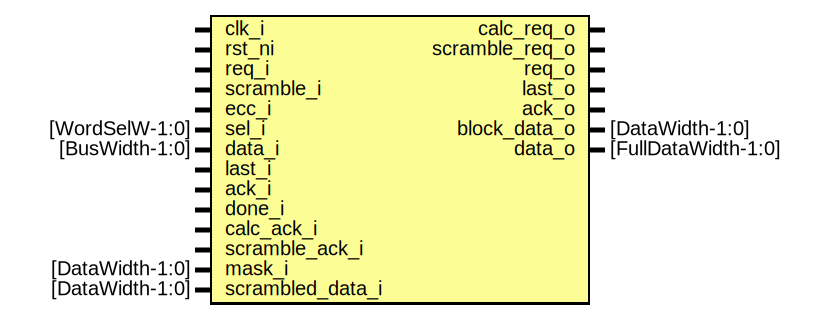

# Entity: flash_phy_prog
## Diagram

## Description
Copyright lowRISC contributors.
 Licensed under the Apache License, Version 2.0, see LICENSE for details.
 SPDX-License-Identifier: Apache-2.0
 Flash Phy Prog Module
 This module implements the flash phy program operation
 The flash phy prog module is mainly responsible for packing incoming data
 transactions into appropriate flash word sizes.
 This is done primarily for two reasons
 - Reduce program stress on the flash
   Flash modules usually have a limit to how many times adjacent words can be programmed.
   If a programming beat is longer than a flash word, it would be best to compact those
   beats into multiples of the flash word size to improve performance and reduce
   unecessary programmings
 - Observe minimum block cipher sizes for scrambling / descrambling and ECC.
   Scrambling algorithms and ECC work on a specific chunk of data.  When these features
   are enabled, the phy controller needs to ensure there is enough data to satisfy that
   request - TBD: This should be checked with software.  Hardware could also always behave
   as it does in the point above and rely on software to correctly compact the data.
 
## Ports
| Port name        | Direction | Type                | Description                                        |
| ---------------- | --------- | ------------------- | -------------------------------------------------- |
| clk_i            | input     |                     |                                                    |
| rst_ni           | input     |                     |                                                    |
| req_i            | input     |                     |                                                    |
| scramble_i       | input     |                     |                                                    |
| ecc_i            | input     |                     |                                                    |
| sel_i            | input     | [WordSelW-1:0]      |                                                    |
| data_i           | input     | [BusWidth-1:0]      |                                                    |
| last_i           | input     |                     |                                                    |
| ack_i            | input     |                     | ack means request has been accepted by flash       |
| done_i           | input     |                     | done means requested transaction has completed     |
| calc_ack_i       | input     |                     |                                                    |
| scramble_ack_i   | input     |                     |                                                    |
| mask_i           | input     | [DataWidth-1:0]     |                                                    |
| scrambled_data_i | input     | [DataWidth-1:0]     |                                                    |
| calc_req_o       | output    |                     |                                                    |
| scramble_req_o   | output    |                     |                                                    |
| req_o            | output    |                     |                                                    |
| last_o           | output    |                     | last beat of an incoming transaction               |
| ack_o            | output    |                     |                                                    |
| block_data_o     | output    | [DataWidth-1:0]     | block data does not contain ecc / metadata portion |
| data_o           | output    | [FullDataWidth-1:0] |                                                    |
## Signals
| Name        | Type                                    | Description                       |
| ----------- | --------------------------------------- | --------------------------------- |
| state_d     | prog_state_e                            |                                   |
| state_q     | prog_state_e                            |                                   |
| idx         | logic [WordSelW-1:0]                    | The currently observed data beat  |
| idx_sub_one | logic [WordSelW-1:0]                    |                                   |
| pack_valid  | logic                                   |                                   |
| pack_data   | logic [BusWidth-1:0]                    |                                   |
| align_next  | logic                                   |                                   |
| data_sel    | data_sel_e                              |                                   |
| packed_data | logic [WidthMultiple-1:0][BusWidth-1:0] |                                   |
| mask_q      | logic [DataWidth-1:0]                   |                                   |
| ecc_data    | logic [ScrDataWidth-1:0]                | ECC handling                      |
| txn_done    | logic                                   |                                   |
| done_cnt    | logic [15:0]                            |                                   |
## Constants
| Name   | Type               | Value     | Description |
| ------ | ------------------ | --------- | ----------- |
| MaxIdx | bit [WordSelW-1:0] | undefined |             |
## Types
| Name         | Type                                                                                                                                                                 | Description |
| ------------ | -------------------------------------------------------------------------------------------------------------------------------------------------------------------- | ----------- |
| prog_state_e | enum logic [3:0] {     StIdle,     StPrePack,     StPackData,     StPostPack,     StReqFlash,     StWaitFlash,     StCalcMask,     StScrambleData,     StCalcEcc   } |             |
| data_sel_e   | enum logic [1:0] {     Filler,     Actual   }                                                                                                                        |             |
## Processes
- unnamed: _( @(posedge clk_i or negedge rst_ni) )_

- unnamed: _( @(posedge clk_i or negedge rst_ni) )_

- unnamed: _(  )_

- unnamed: _( @(posedge clk_i or negedge rst_ni) )_

- unnamed: _( @(posedge clk_i or negedge rst_ni) )_

## Instantiations
- u_enc: prim_secded_hamming_72_64_enc
