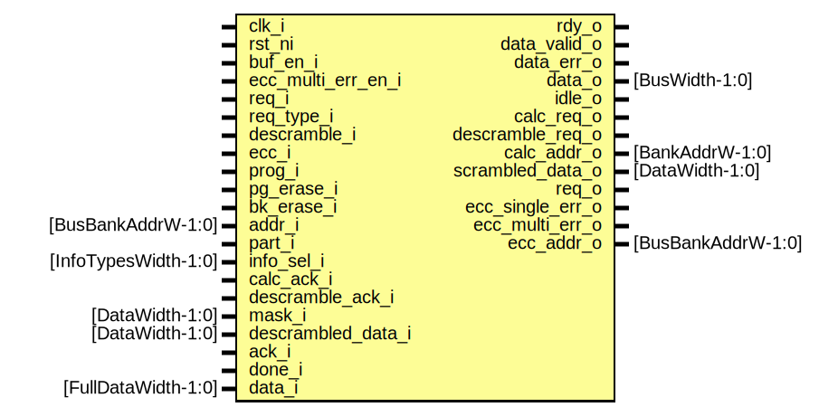

# Entity: flash_phy_rd
## Diagram

## Description
Copyright lowRISC contributors.
 Licensed under the Apache License, Version 2.0, see LICENSE for details.
 SPDX-License-Identifier: Apache-2.0
 Flash Phy Read Module
 This module implements the flash phy read pipeline.
 The read pipeline consists of read buffers, the actual flash read stage, the
 descrambling stage, and finally the response.
 Note this module backpressures the front end, but cannot handle any back end
 back pressuring at the response stage.  It is thus assumed it will tell the
 upstream to stop issuing instructions, however once issued, the upstream will
 always accept the response.
 Support for descramble stage
 The allocate and descramble indication received at read stage are saved.
 When the read completes, depending on the 'descramble' indication saved, the
 data is either stored into FIFO (reg + skid) between read and descramble stage,
 or forwarded directly to the buffer (no de-scramble)
 If the storage element between read and de-scramble stages are completely full
 for any reason, then the read stage cannot start.
 When the read stage begins, the galois multiply portion of the de-scramble is
 also kicked off. When the galois multiply stage AND read stage completes, the
 de-scramble is then kicked off.
 
## Ports
| Port name          | Direction | Type                 | Description                                   |
| ------------------ | --------- | -------------------- | --------------------------------------------- |
| clk_i              | input     |                      |                                               |
| rst_ni             | input     |                      |                                               |
| buf_en_i           | input     |                      | configuration interface from flash controller |
| ecc_multi_err_en_i | input     |                      |                                               |
| req_i              | input     |                      | interface with arbitration unit               |
| req_type_i         | input     |                      |                                               |
| descramble_i       | input     |                      |                                               |
| ecc_i              | input     |                      |                                               |
| prog_i             | input     |                      |                                               |
| pg_erase_i         | input     |                      |                                               |
| bk_erase_i         | input     |                      |                                               |
| addr_i             | input     | [BusBankAddrW-1:0]   |                                               |
| part_i             | input     |                      |                                               |
| info_sel_i         | input     | [InfoTypesWidth-1:0] |                                               |
| rdy_o              | output    |                      |                                               |
| data_valid_o       | output    |                      |                                               |
| data_err_o         | output    |                      |                                               |
| data_o             | output    | [BusWidth-1:0]       |                                               |
| idle_o             | output    |                      | the entire read pipeline is idle              |
| calc_req_o         | output    |                      | interface with scramble unit                  |
| descramble_req_o   | output    |                      |                                               |
| calc_addr_o        | output    | [BankAddrW-1:0]      |                                               |
| scrambled_data_o   | output    | [DataWidth-1:0]      |                                               |
| calc_ack_i         | input     |                      |                                               |
| descramble_ack_i   | input     |                      |                                               |
| mask_i             | input     | [DataWidth-1:0]      |                                               |
| descrambled_data_i | input     | [DataWidth-1:0]      |                                               |
| req_o              | output    |                      | interface to actual flash primitive           |
| ack_i              | input     |                      | request has been accepted                     |
| done_i             | input     |                      | actual data return                            |
| data_i             | input     | [FullDataWidth-1:0]  |                                               |
| ecc_single_err_o   | output    |                      | error status reporting                        |
| ecc_multi_err_o    | output    |                      |                                               |
| ecc_addr_o         | output    | [BusBankAddrW-1:0]   |                                               |
## Signals
| Name                 | Type                  | Description                                                                                                                                                                                                                                                                  |
| -------------------- | --------------------- | ---------------------------------------------------------------------------------------------------------------------------------------------------------------------------------------------------------------------------------------------------------------------------- |
| buf_en_q             | logic                 | internal buffer enable                                                                                                                                                                                                                                                       |
| muxed_data           | logic [DataWidth-1:0] | muxed de-scrambled and plain-data                                                                                                                                                                                                                                            |
| muxed_err            | logic                 |                                                                                                                                                                                                                                                                              |
| data_valid           | logic                 | muxed data valid signal that takes scrambling into consideration                                                                                                                                                                                                             |
| alloc                | logic [NumBuf-1:0]    | A buffer allocate is invoked when a new transaction arrives. Alloc only happens if the new transaction does not match an existing entry.                                                                                                                                     |
| update               | logic [NumBuf-1:0]    | A buffer update is invoked after the completion of the de-scramble stage. This updates the buffer that was allocated when a new transaction was initiated.                                                                                                                   |
| read_buf             | rd_buf_t              |                                                                                                                                                                                                                                                                              |
| buf_invalid          | logic [NumBuf-1:0]    |                                                                                                                                                                                                                                                                              |
| buf_valid            | logic [NumBuf-1:0]    |                                                                                                                                                                                                                                                                              |
| buf_wip              | logic [NumBuf-1:0]    |                                                                                                                                                                                                                                                                              |
| buf_match            | logic [NumBuf-1:0]    | The new transaction matches an already allocated buffer. The buffer may be valid or work in progress.                                                                                                                                                                        |
| no_match             | logic                 |                                                                                                                                                                                                                                                                              |
| data_hazard          | logic [NumBuf-1:0]    | There is a stateful operation aimed at valid buffer, that buffer must be flushed                                                                                                                                                                                             |
| buf_invalid_alloc    | logic [NumBuf-1:0]    | The next buffer allocated is determined in the following way: If there is an invalid buffer, use that lowest one If there are no invalid buffers, pick a valid buffer Work in progress buffer is NEVER replaced. There should only be one work in progress buffer at a time  |
| buf_valid_alloc      | logic [NumBuf-1:0]    |                                                                                                                                                                                                                                                                              |
| buf_alloc            | logic [NumBuf-1:0]    |                                                                                                                                                                                                                                                                              |
| flash_word_addr      | logic [BankAddrW-1:0] | flash word address                                                                                                                                                                                                                                                           |
| dummy_data           | logic [1:0]           | a prim arbiter is used to somewhat fairly select among the valid buffers                                                                                                                                                                                                     |
| rsp_fifo_wdata       | rsp_fifo_entry_t      |                                                                                                                                                                                                                                                                              |
| rsp_fifo_rdata       | rsp_fifo_entry_t      |                                                                                                                                                                                                                                                                              |
| rsp_fifo_rdy         | logic                 |                                                                                                                                                                                                                                                                              |
| rsp_fifo_vld         | logic                 |                                                                                                                                                                                                                                                                              |
| alloc_q              | logic [NumBuf-1:0]    | saved attributes on flash read                                                                                                                                                                                                                                               |
| rd_attrs             | rd_attr_t             |                                                                                                                                                                                                                                                                              |
| rd_busy              | logic                 | read complete since done is broadcast to all the modules, need to know we are actually active                                                                                                                                                                                |
| rd_done              | logic                 |                                                                                                                                                                                                                                                                              |
| scramble_stage_rdy   | logic                 | scramble stage ready                                                                                                                                                                                                                                                         |
| flash_rdy            | logic                 | Consider converting this to a FIFO for better matching The rd_busy flag is effectively a "full" flag anyways of a single entry.                                                                                                                                              |
| rd_stages_rdy        | logic                 | read stages are ready when both the response fifo and the data / mask fifos have space for new entries                                                                                                                                                                       |
| data_err             | logic                 | only uncorrectable errors are passed on to the fabric                                                                                                                                                                                                                        |
| valid_ecc            | logic                 | scrambled data must pass through ECC first                                                                                                                                                                                                                                   |
| ecc_multi_err        | logic                 |                                                                                                                                                                                                                                                                              |
| ecc_single_err       | logic                 |                                                                                                                                                                                                                                                                              |
| data_ecc_chk         | logic [DataWidth-1:0] |                                                                                                                                                                                                                                                                              |
| data_int             | logic [DataWidth-1:0] |                                                                                                                                                                                                                                                                              |
| data_erased          | logic                 |                                                                                                                                                                                                                                                                              |
| fifo_data_ready      | logic                 | Even on ECC error, progress through the stage normally                                                                                                                                                                                                                       |
| fifo_data_valid      | logic                 |                                                                                                                                                                                                                                                                              |
| mask_valid           | logic                 |                                                                                                                                                                                                                                                                              |
| fifo_data            | logic [DataWidth-1:0] |                                                                                                                                                                                                                                                                              |
| mask                 | logic [DataWidth-1:0] |                                                                                                                                                                                                                                                                              |
| data_fifo_rdy        | logic                 |                                                                                                                                                                                                                                                                              |
| mask_fifo_rdy        | logic                 |                                                                                                                                                                                                                                                                              |
| descram              | logic                 |                                                                                                                                                                                                                                                                              |
| forward              | logic                 |                                                                                                                                                                                                                                                                              |
| hint_forward         | logic                 |                                                                                                                                                                                                                                                                              |
| hint_descram         | logic                 |                                                                                                                                                                                                                                                                              |
| data_err_q           | logic                 |                                                                                                                                                                                                                                                                              |
| alloc_q2             | logic [NumBuf-1:0]    |                                                                                                                                                                                                                                                                              |
| fifo_forward_pop     | logic                 | All these problems could be resolved if the timings matched exactly, however the user would need to correctly setup constraints on either flash / gf_mult timing change.                                                                                                     |
| unused_rd_depth      | logic [1:0]           |                                                                                                                                                                                                                                                                              |
| unused_mask_depth    | logic [1:0]           |                                                                                                                                                                                                                                                                              |
| rd_and_mask_fifo_pop | logic                 |                                                                                                                                                                                                                                                                              |
| descram_q            | logic                 |                                                                                                                                                                                                                                                                              |
| forward_q            | logic                 |                                                                                                                                                                                                                                                                              |
| flash_rsp_match      | logic                 |                                                                                                                                                                                                                                                                              |
| buf_rsp_match        | logic [NumBuf-1:0]    |                                                                                                                                                                                                                                                                              |
| buf_rsp_data         | logic [DataWidth-1:0] |                                                                                                                                                                                                                                                                              |
## Processes
- unnamed: _( @(posedge clk_i or negedge rst_ni) )_
buffer enable cannot be changed unless the entire read pipeline is idle

**Description**
buffer enable cannot be changed unless the entire read pipeline is idle

- unnamed: _( @(posedge clk_i or negedge rst_ni) )_

- unnamed: _( @(posedge clk_i or negedge rst_ni) )_
generate the mask calculation request
mask calculation is done in parallel to the read stage

**Description**
generate the mask calculation request
mask calculation is done in parallel to the read stage

- unnamed: _(  )_
select among the buffers

**Description**
select among the buffers

## Instantiations
- i_valid_random: prim_arbiter_tree
- i_rsp_order_fifo: prim_fifo_sync
**Description**
response order FIFO

- u_rd_storage: prim_fifo_sync
- u_mask_storage: prim_fifo_sync
**Description**
storage for mask calculations

