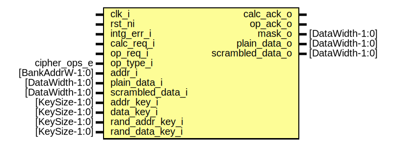

# Entity: flash_phy_scramble
## Diagram

## Description
Copyright lowRISC contributors.
 Licensed under the Apache License, Version 2.0, see LICENSE for details.
 SPDX-License-Identifier: Apache-2.0
 Flash Phy Scramble Module
 This module implements the flash scramble / de-scramble operation
 This operation is actually XEX.  However the components are broken
 in two and separately manipulated by the program and read pipelines.
 
## Ports
| Port name        | Direction | Type            | Description                      |
| ---------------- | --------- | --------------- | -------------------------------- |
| clk_i            | input     |                 |                                  |
| rst_ni           | input     |                 |                                  |
| intg_err_i       | input     |                 |                                  |
| calc_req_i       | input     |                 | calculate galois multiplier mask |
| op_req_i         | input     |                 | request primitive operation      |
| op_type_i        | input     | cipher_ops_e    | sramble or de-scramble           |
| addr_i           | input     | [BankAddrW-1:0] |                                  |
| plain_data_i     | input     | [DataWidth-1:0] |                                  |
| scrambled_data_i | input     | [DataWidth-1:0] |                                  |
| addr_key_i       | input     | [KeySize-1:0]   |                                  |
| data_key_i       | input     | [KeySize-1:0]   |                                  |
| rand_addr_key_i  | input     | [KeySize-1:0]   |                                  |
| rand_data_key_i  | input     | [KeySize-1:0]   |                                  |
| calc_ack_o       | output    |                 |                                  |
| op_ack_o         | output    |                 |                                  |
| mask_o           | output    | [DataWidth-1:0] |                                  |
| plain_data_o     | output    | [DataWidth-1:0] |                                  |
| scrambled_data_o | output    | [DataWidth-1:0] |                                  |
## Signals
| Name           | Type                    | Description                                                                                                                                          |
| -------------- | ----------------------- | ---------------------------------------------------------------------------------------------------------------------------------------------------- |
| muxed_addr_key | logic [KeySize-1:0]     | unused portion of addr_key                                                                                                                           |
| addr_key_sel   | logic                   |                                                                                                                                                      |
| unused_key     | logic [UnusedWidth-1:0] |                                                                                                                                                      |
| dec            | logic                   | Cipher portion                                                                                                                                       |
| data           | logic [DataWidth-1:0]   |                                                                                                                                                      |
| data_key_sel   | logic                   | Do not allow the key to change during a transaction. While this may be desirable for security reasons, it creates timing issues for physical design  |
## Constants
| Name         | Type | Value                  | Description |
| ------------ | ---- | ---------------------- | ----------- |
| AddrPadWidth | int  | DataWidth - BankAddrW  |             |
| UnusedWidth  | int  | KeySize - AddrPadWidth |             |
## Processes
- unnamed: _( @(posedge clk_i or negedge rst_ni) )_

- unnamed: _( @(posedge clk_i or negedge rst_ni) )_

## Instantiations
- u_cipher: prim_prince
