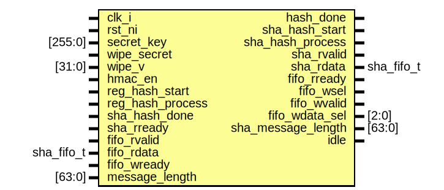

# Entity: hmac_core

- **File**: hmac_core.sv
## Diagram

## Description

 Copyright lowRISC contributors.
 Licensed under the Apache License, Version 2.0, see LICENSE for details.
 SPDX-License-Identifier: Apache-2.0

 HMAC Core implementation

## Ports

| Port name          | Direction | Type       | Description                  |
| ------------------ | --------- | ---------- | ---------------------------- |
| clk_i              | input     |            |                              |
| rst_ni             | input     |            |                              |
| secret_key         | input     | [255:0]    | {word0, word1, ..., word7}   |
| wipe_secret        | input     |            |                              |
| wipe_v             | input     | [31:0]     |                              |
| hmac_en            | input     |            |                              |
| reg_hash_start     | input     |            |                              |
| reg_hash_process   | input     |            |                              |
| hash_done          | output    |            |                              |
| sha_hash_start     | output    |            |                              |
| sha_hash_process   | output    |            |                              |
| sha_hash_done      | input     |            |                              |
| sha_rvalid         | output    |            |  fifo                        |
| sha_rdata          | output    | sha_fifo_t |                              |
| sha_rready         | input     |            |                              |
| fifo_rvalid        | input     |            |                              |
| fifo_rdata         | input     | sha_fifo_t |                              |
| fifo_rready        | output    |            |                              |
| fifo_wsel          | output    |            | 0: from reg, 1: from digest  |
| fifo_wvalid        | output    |            |                              |
| fifo_wdata_sel     | output    | [2:0]      | 0: digest[0] .. 7: digest[7] |
| fifo_wready        | input     |            |                              |
| message_length     | input     | [63:0]     |                              |
| sha_message_length | output    | [63:0]     |                              |
| idle               | output    |            |                              |
## Signals

| Name                  | Type                                   | Description                                            |
| --------------------- | -------------------------------------- | ------------------------------------------------------ |
| hash_start            | logic                                  | generated from internal state machine                  |
| hash_process          | logic                                  | generated from internal state machine to trigger hash  |
| hmac_hash_done        | logic                                  |                                                        |
| i_pad                 | logic [BlockSize-1:0]                  |                                                        |
| o_pad                 | logic [BlockSize-1:0]                  |                                                        |
| txcount               | logic [63:0]                           |                                                        |
| pad_index             | logic [BlockSizeBits-HashWordBits-1:0] |                                                        |
| clr_txcount           | logic                                  |                                                        |
| inc_txcount           | logic                                  |                                                        |
| hmac_sha_rvalid       | logic                                  |                                                        |
| sel_rdata             | sel_rdata_t                            |                                                        |
| sel_msglen            | sel_msglen_t                           |                                                        |
| update_round          | logic                                  |                                                        |
| round_q               | round_t                                |                                                        |
| round_d               | round_t                                |                                                        |
| st_q                  | st_e                                   |                                                        |
| st_d                  | st_e                                   |                                                        |
| clr_fifo_wdata_sel    | logic                                  |                                                        |
| txcnt_eq_blksz        | logic                                  |                                                        |
| reg_hash_process_flag | logic                                  |                                                        |
## Constants

| Name          | Type                  | Value                      | Description |
| ------------- | --------------------- | -------------------------- | ----------- |
| BlockSize     | int unsigned          | 512                        |             |
| BlockSizeBits | int unsigned          | $clog2(BlockSize)          |             |
| HashWordBits  | int unsigned          | $clog2($bits(sha_word_t)   |             |
| BlockSize64   | bit [63:0]            | undefined                  |             |
| BlockSizeBSB  | bit [BlockSizeBits:0] | BlockSize[BlockSizeBits:0] |             |
## Types

| Name         | Type                                                                                                                                                                                                                                                                                                                                                                                                                       | Description |
| ------------ | -------------------------------------------------------------------------------------------------------------------------------------------------------------------------------------------------------------------------------------------------------------------------------------------------------------------------------------------------------------------------------------------------------------------------- | ----------- |
| sel_rdata_t  | enum logic [1:0] {      SelIPad,      SelOPad,      SelFifo   }                                                                                                                                                                                                                                                   |             |
| sel_msglen_t | enum logic {      SelIPadMsg,      SelOPadMsg   }                                                                                                                                                                                                                                                                                                    |             |
| round_t      | enum logic {      Inner,        Outer      }                                                                                                                                                                                                                                                                                                         |             |
| st_e         | enum logic [2:0] {      StIdle,      StIPad,      StMsg,                    StPushToMsgFifo,          StWaitResp,               StOPad,      StDone                 } |             |
## Processes
- unnamed: ( @(posedge clk_i or negedge rst_ni) )
  - **Type:** always_ff
 **Description**
 txcount     Looks like txcount can be removed entirely here in hmac_core     In the first round (InnerPaddedKey), it can just watch process and hash_done     In the second round, it only needs count 256 bits for hash digest to trigger     hash_process to SHA2 
- unnamed: ( @(posedge clk_i or negedge rst_ni) )
  - **Type:** always_ff
 **Description**
 reg_hash_process trigger logic 
- unnamed: ( @(posedge clk_i or negedge rst_ni) )
  - **Type:** always_ff
- unnamed: ( @(posedge clk_i or negedge rst_ni) )
  - **Type:** always_ff
- state_ff: ( @(posedge clk_i or negedge rst_ni) )
  - **Type:** always_ff
- next_state: (  )
  - **Type:** always_comb
