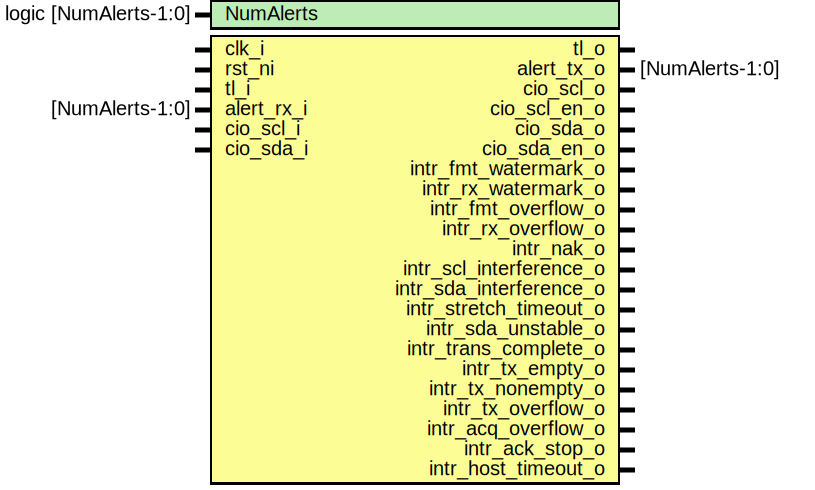

# Entity: i2c

## Diagram

## Description

Copyright lowRISC contributors.
 Licensed under the Apache License, Version 2.0, see LICENSE for details.
 SPDX-License-Identifier: Apache-2.0
 Description: I2C top level wrapper file
 
## Generics

| Generic name | Type                  | Value     | Description |
| ------------ | --------------------- | --------- | ----------- |
| NumAlerts    | logic [NumAlerts-1:0] | undefined |             |
## Ports

| Port name               | Direction | Type            | Description   |
| ----------------------- | --------- | --------------- | ------------- |
| clk_i                   | input     |                 |               |
| rst_ni                  | input     |                 |               |
| tl_i                    | input     |                 | Bus Interface |
| tl_o                    | output    |                 |               |
| alert_rx_i              | input     | [NumAlerts-1:0] | Alerts        |
| alert_tx_o              | output    | [NumAlerts-1:0] |               |
| cio_scl_i               | input     |                 | Generic IO    |
| cio_scl_o               | output    |                 |               |
| cio_scl_en_o            | output    |                 |               |
| cio_sda_i               | input     |                 |               |
| cio_sda_o               | output    |                 |               |
| cio_sda_en_o            | output    |                 |               |
| intr_fmt_watermark_o    | output    |                 | Interrupts    |
| intr_rx_watermark_o     | output    |                 |               |
| intr_fmt_overflow_o     | output    |                 |               |
| intr_rx_overflow_o      | output    |                 |               |
| intr_nak_o              | output    |                 |               |
| intr_scl_interference_o | output    |                 |               |
| intr_sda_interference_o | output    |                 |               |
| intr_stretch_timeout_o  | output    |                 |               |
| intr_sda_unstable_o     | output    |                 |               |
| intr_trans_complete_o   | output    |                 |               |
| intr_tx_empty_o         | output    |                 |               |
| intr_tx_nonempty_o      | output    |                 |               |
| intr_tx_overflow_o      | output    |                 |               |
| intr_acq_overflow_o     | output    |                 |               |
| intr_ack_stop_o         | output    |                 |               |
| intr_host_timeout_o     | output    |                 |               |
## Signals

| Name       | Type                  | Description |
| ---------- | --------------------- | ----------- |
| reg2hw     | i2c_reg2hw_t          |             |
| hw2reg     | i2c_hw2reg_t          |             |
| alert_test | logic [NumAlerts-1:0] |             |
| alerts     | logic [NumAlerts-1:0] |             |
| scl_int    | logic                 |             |
| sda_int    | logic                 |             |
## Instantiations

- u_reg: i2c_reg_top
- i2c_core: i2c_core
