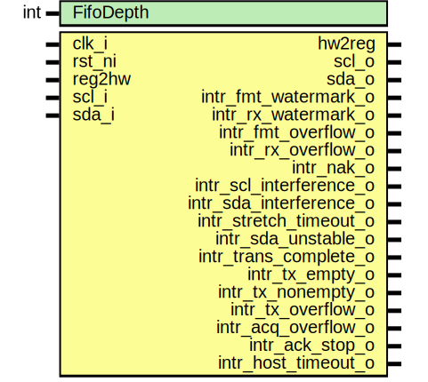

# Entity: i2c_core

- **File**: i2c_core.sv
## Diagram

## Description

 Copyright lowRISC contributors.
 Licensed under the Apache License, Version 2.0, see LICENSE for details.
 SPDX-License-Identifier: Apache-2.0

 Description: I2C core module

## Generics

| Generic name | Type | Value | Description |
| ------------ | ---- | ----- | ----------- |
| FifoDepth    | int  | 64    |             |
## Ports

| Port name               | Direction | Type | Description |
| ----------------------- | --------- | ---- | ----------- |
| clk_i                   | input     |      |             |
| rst_ni                  | input     |      |             |
| reg2hw                  | input     |      |             |
| hw2reg                  | output    |      |             |
| scl_i                   | input     |      |             |
| scl_o                   | output    |      |             |
| sda_i                   | input     |      |             |
| sda_o                   | output    |      |             |
| intr_fmt_watermark_o    | output    |      |             |
| intr_rx_watermark_o     | output    |      |             |
| intr_fmt_overflow_o     | output    |      |             |
| intr_rx_overflow_o      | output    |      |             |
| intr_nak_o              | output    |      |             |
| intr_scl_interference_o | output    |      |             |
| intr_sda_interference_o | output    |      |             |
| intr_stretch_timeout_o  | output    |      |             |
| intr_sda_unstable_o     | output    |      |             |
| intr_trans_complete_o   | output    |      |             |
| intr_tx_empty_o         | output    |      |             |
| intr_tx_nonempty_o      | output    |      |             |
| intr_tx_overflow_o      | output    |      |             |
| intr_acq_overflow_o     | output    |      |             |
| intr_ack_stop_o         | output    |      |             |
| intr_host_timeout_o     | output    |      |             |
## Signals

| Name                        | Type         | Description                    |
| --------------------------- | ------------ | ------------------------------ |
| thigh                       | logic [15:0] |                                |
| tlow                        | logic [15:0] |                                |
| t_r                         | logic [15:0] |                                |
| t_f                         | logic [15:0] |                                |
| thd_sta                     | logic [15:0] |                                |
| tsu_sta                     | logic [15:0] |                                |
| tsu_sto                     | logic [15:0] |                                |
| tsu_dat                     | logic [15:0] |                                |
| thd_dat                     | logic [15:0] |                                |
| t_buf                       | logic [15:0] |                                |
| stretch_timeout             | logic [30:0] |                                |
| timeout_enable              | logic        |                                |
| stretch_en_addr_tx          | logic        |                                |
| stretch_en_addr_acq         | logic        |                                |
| stretch_stop_tx             | logic        |                                |
| stretch_stop_acq            | logic        |                                |
| stretch_stop_tx_clr         | logic        |                                |
| stretch_stop_acq_clr        | logic        |                                |
| host_timeout                | logic [31:0] |                                |
| scl_sync                    | logic        |                                |
| sda_sync                    | logic        |                                |
| scl_out_fsm                 | logic        |                                |
| sda_out_fsm                 | logic        |                                |
| event_fmt_watermark         | logic        |                                |
| event_rx_watermark          | logic        |                                |
| event_fmt_overflow          | logic        |                                |
| event_rx_overflow           | logic        |                                |
| event_nak                   | logic        |                                |
| event_scl_interference      | logic        |                                |
| event_sda_interference      | logic        |                                |
| event_stretch_timeout       | logic        |                                |
| event_sda_unstable          | logic        |                                |
| event_trans_complete        | logic        |                                |
| event_tx_empty              | logic        |                                |
| event_tx_nonempty           | logic        |                                |
| event_tx_overflow           | logic        |                                |
| event_acq_overflow          | logic        |                                |
| event_ack_stop              | logic        |                                |
| event_host_timeout          | logic        |                                |
| scl_rx_val                  | logic [15:0] |                                |
| sda_rx_val                  | logic [15:0] |                                |
| override                    | logic        |                                |
| fmt_fifo_wvalid             | logic        |                                |
| fmt_fifo_wready             | logic        |                                |
| fmt_fifo_wdata              | logic [12:0] |                                |
| fmt_fifo_depth              | logic [6:0]  |                                |
| fmt_fifo_rvalid             | logic        |                                |
| fmt_fifo_rready             | logic        |                                |
| fmt_fifo_rdata              | logic [12:0] |                                |
| fmt_byte                    | logic [7:0]  |                                |
| fmt_flag_start_before       | logic        |                                |
| fmt_flag_stop_after         | logic        |                                |
| fmt_flag_read_bytes         | logic        |                                |
| fmt_flag_read_continue      | logic        |                                |
| fmt_flag_nak_ok             | logic        |                                |
| i2c_fifo_rxrst              | logic        |                                |
| i2c_fifo_fmtrst             | logic        |                                |
| i2c_fifo_rxilvl             | logic [2:0]  |                                |
| i2c_fifo_fmtilvl            | logic [1:0]  |                                |
| rx_fifo_wvalid              | logic        |                                |
| rx_fifo_wready              | logic        |                                |
| rx_fifo_wdata               | logic [7:0]  |                                |
| rx_fifo_depth               | logic [6:0]  |                                |
| rx_fifo_rvalid              | logic        |                                |
| rx_fifo_rready              | logic        |                                |
| rx_fifo_rdata               | logic [7:0]  |                                |
| fmt_watermark_d             | logic        |                                |
| fmt_watermark_q             | logic        |                                |
| rx_watermark_d              | logic        |                                |
| rx_watermark_q              | logic        |                                |
| tx_fifo_wvalid              | logic        |                                |
| tx_fifo_wready              | logic        |                                |
| tx_fifo_wdata               | logic [7:0]  |                                |
| tx_fifo_depth               | logic [6:0]  |                                |
| tx_fifo_rvalid              | logic        |                                |
| tx_fifo_rready              | logic        |                                |
| tx_fifo_rdata               | logic [7:0]  |                                |
| acq_fifo_wvalid             | logic        |                                |
| acq_fifo_wready             | logic        |                                |
| acq_fifo_wdata              | logic [9:0]  |                                |
| acq_fifo_depth              | logic [6:0]  |                                |
| acq_fifo_rvalid             | logic        |                                |
| acq_fifo_rready             | logic        |                                |
| acq_fifo_rdata              | logic [9:0]  |                                |
| i2c_fifo_txrst              | logic        |                                |
| i2c_fifo_acqrst             | logic        |                                |
| host_idle                   | logic        |                                |
| target_idle                 | logic        |                                |
| host_enable                 | logic        |                                |
| target_enable               | logic        |                                |
| line_loopback               | logic        |                                |
| target_address0             | logic [6:0]  |                                |
| target_mask0                | logic [6:0]  |                                |
| target_address1             | logic [6:0]  |                                |
| target_mask1                | logic [6:0]  |                                |
| unused_fifo_ctrl_rxilvl_qe  | logic        |  Unused parts of exposed bits  |
| unused_fifo_ctrl_fmtilvl_qe | logic        |                                |
| unused_rx_fifo_rdata_q      | logic [7:0]  |                                |
| unused_acq_fifo_adata_q     | logic [7:0]  |                                |
| unused_acq_fifo_signal_q    | logic [1:0]  |                                |
| unused_alert_test_qe        | logic        |                                |
| unused_alert_test_q         | logic        |                                |
## Processes
- rx_oversampling: ( @ (posedge clk_i or negedge rst_ni) )
  - **Type:** always_ff
**Description**
 Sample scl_i and sda_i at system clock 
- watermark_transition: ( @ (posedge clk_i or negedge rst_ni) )
  - **Type:** always_ff
- unnamed: (  )
  - **Type:** always_comb
- unnamed: (  )
  - **Type:** always_comb
## Instantiations

- u_i2c_fmtfifo: prim_fifo_sync
- u_i2c_rxfifo: prim_fifo_sync
- u_i2c_txfifo: prim_fifo_sync
- u_i2c_acqfifo: prim_fifo_sync
- u_i2c_sync_scl: prim_flop_2sync
**Description**
 sync the incoming SCL and SDA signals

- u_i2c_sync_sda: prim_flop_2sync
- u_i2c_fsm: i2c_fsm
- intr_hw_fmt_watermark: prim_intr_hw
- intr_hw_rx_watermark: prim_intr_hw
- intr_hw_fmt_overflow: prim_intr_hw
- intr_hw_rx_overflow: prim_intr_hw
- intr_hw_nak: prim_intr_hw
- intr_hw_scl_interference: prim_intr_hw
- intr_hw_sda_interference: prim_intr_hw
- intr_hw_stretch_timeout: prim_intr_hw
- intr_hw_sda_unstable: prim_intr_hw
- intr_hw_trans_complete: prim_intr_hw
- intr_hw_tx_empty: prim_intr_hw
- intr_hw_tx_nonempty: prim_intr_hw
- intr_hw_tx_overflow: prim_intr_hw
- intr_hw_acq_overflow: prim_intr_hw
- intr_hw_ack_stop: prim_intr_hw
- intr_hw_host_timeout: prim_intr_hw
