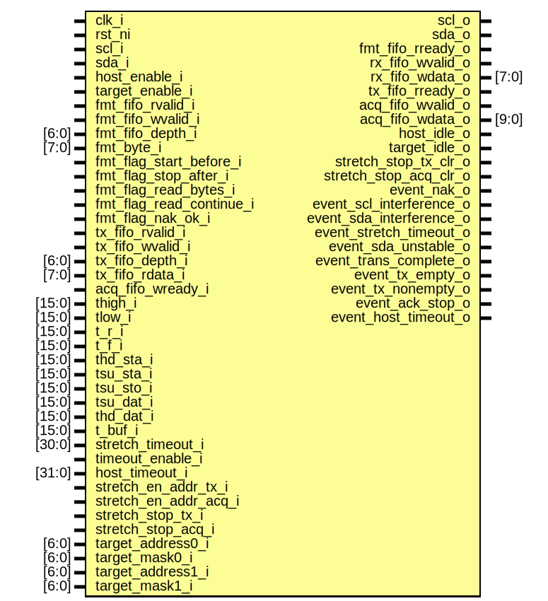

# Entity: i2c_fsm
## Diagram

## Description
Copyright lowRISC contributors.
 Licensed under the Apache License, Version 2.0, see LICENSE for details.
 SPDX-License-Identifier: Apache-2.0
 Description: I2C finite state machine
 
## Ports
| Port name                | Direction | Type   | Description                                                 |
| ------------------------ | --------- | ------ | ----------------------------------------------------------- |
| clk_i                    | input     |        | clock                                                       |
| rst_ni                   | input     |        | active low reset                                            |
| scl_i                    | input     |        | serial clock input from i2c bus                             |
| scl_o                    | output    |        | serial clock output to i2c bus                              |
| sda_i                    | input     |        | serial data input from i2c bus                              |
| sda_o                    | output    |        | serial data output to i2c bus                               |
| host_enable_i            | input     |        | enable host functionality                                   |
| target_enable_i          | input     |        | enable target functionality                                 |
| fmt_fifo_rvalid_i        | input     |        | indicates there is valid data in fmt_fifo                   |
| fmt_fifo_wvalid_i        | input     |        | indicates data is being put into fmt_fifo                   |
| fmt_fifo_depth_i         | input     | [6:0]  | fmt_fifo_depth                                              |
| fmt_fifo_rready_o        | output    |        | populates fmt_fifo                                          |
| fmt_byte_i               | input     | [7:0]  | byte in fmt_fifo to be sent to target                       |
| fmt_flag_start_before_i  | input     |        | issue start before sending byte                             |
| fmt_flag_stop_after_i    | input     |        | issue stop after sending byte                               |
| fmt_flag_read_bytes_i    | input     |        | indicates byte is an number of reads                        |
| fmt_flag_read_continue_i | input     |        | host to send Ack to final byte read                         |
| fmt_flag_nak_ok_i        | input     |        | no Ack is expected                                          |
| rx_fifo_wvalid_o         | output    |        | high if there is valid data in rx_fifo                      |
| rx_fifo_wdata_o          | output    | [7:0]  | byte in rx_fifo read from target                            |
| tx_fifo_rvalid_i         | input     |        | indicates there is valid data in tx_fifo                    |
| tx_fifo_wvalid_i         | input     |        | indicates data is being put into tx_fifo                    |
| tx_fifo_depth_i          | input     | [6:0]  | tx_fifo_depth                                               |
| tx_fifo_rready_o         | output    |        | populates tx_fifo                                           |
| tx_fifo_rdata_i          | input     | [7:0]  | byte in tx_fifo to be sent to host                          |
| acq_fifo_wready_i        | input     |        | low if acq_fifo is full                                     |
| acq_fifo_wvalid_o        | output    |        | high if there is valid data in acq_fifo                     |
| acq_fifo_wdata_o         | output    | [9:0]  | byte and signal in acq_fifo read from target                |
| host_idle_o              | output    |        | indicates the host is idle                                  |
| target_idle_o            | output    |        | indicates the target is idle                                |
| thigh_i                  | input     | [15:0] | high period of the SCL in clock units                       |
| tlow_i                   | input     | [15:0] | low period of the SCL in clock units                        |
| t_r_i                    | input     | [15:0] | rise time of both SDA and SCL in clock units                |
| t_f_i                    | input     | [15:0] | fall time of both SDA and SCL in clock units                |
| thd_sta_i                | input     | [15:0] | hold time for (repeated) START in clock units               |
| tsu_sta_i                | input     | [15:0] | setup time for repeated START in clock units                |
| tsu_sto_i                | input     | [15:0] | setup time for STOP in clock units                          |
| tsu_dat_i                | input     | [15:0] | data setup time in clock units                              |
| thd_dat_i                | input     | [15:0] | data hold time in clock units                               |
| t_buf_i                  | input     | [15:0] | bus free time between STOP and START in clock units         |
| stretch_timeout_i        | input     | [30:0] | max time target may stretch the clock                       |
| timeout_enable_i         | input     |        | assert if target stretches clock past max                   |
| host_timeout_i           | input     | [31:0] | max time target waits for host to pull clock down           |
| stretch_en_addr_tx_i     | input     |        | target stretches clock after address matching for transmit  |
| stretch_en_addr_acq_i    | input     |        | target stretches clock after address matching for acquire   |
| stretch_stop_tx_i        | input     |        | stop stretching clock for transmit, resume normal operation |
| stretch_stop_acq_i       | input     |        | stop stretching clock for acquire, resume normal operation  |
| target_address0_i        | input     | [6:0]  |                                                             |
| target_mask0_i           | input     | [6:0]  |                                                             |
| target_address1_i        | input     | [6:0]  |                                                             |
| target_mask1_i           | input     | [6:0]  |                                                             |
| stretch_stop_tx_clr_o    | output    |        | hardware to deassert stretch_stop_tx bit                    |
| stretch_stop_acq_clr_o   | output    |        | hardware to deassert stretch_stop_acq bit                   |
| event_nak_o              | output    |        | target didn't Ack when expected                             |
| event_scl_interference_o | output    |        | other device forcing SCL low                                |
| event_sda_interference_o | output    |        | other device forcing SDA low                                |
| event_stretch_timeout_o  | output    |        | target stretches clock past max time                        |
| event_sda_unstable_o     | output    |        | SDA is not constant during SCL pulse                        |
| event_trans_complete_o   | output    |        | Transaction is complete                                     |
| event_tx_empty_o         | output    |        | tx_fifo is empty but data is needed                         |
| event_tx_nonempty_o      | output    |        | tx_fifo is nonempty after stop                              |
| event_ack_stop_o         | output    |        | target received stop after ack                              |
| event_host_timeout_o     | output    |        | host ceased sending SCL pulses during ongoing transactn     |
## Signals
| Name                 | Type         | Description                                                      |
| -------------------- | ------------ | ---------------------------------------------------------------- |
| tcount_q             | logic [19:0] | current counter for setting delays                               |
| tcount_d             | logic [19:0] | next counter for setting delays                                  |
| load_tcount          | logic        | indicates counter must be loaded                                 |
| stretch              | logic [30:0] | counter for clock being stretched by target                      |
| bit_index            | logic [2:0]  | bit being transmitted to or read from the bus                    |
| bit_decr             | logic        | indicates bit_index must be decremented by 1                     |
| bit_clr              | logic        | indicates bit_index must be reset to 7                           |
| byte_num             | logic [8:0]  | number of bytes to read                                          |
| byte_index           | logic [8:0]  | byte being read from the bus                                     |
| byte_decr            | logic        | indicates byte_index must be decremented by 1                    |
| byte_clr             | logic        | indicates byte_index must be reset to byte_num                   |
| scl_temp             | logic        | scl internal                                                     |
| sda_temp             | logic        | data internal                                                    |
| scl_i_q              | logic        | scl_i delayed by one clock                                       |
| sda_i_q              | logic        | sda_i delayed by one clock                                       |
| read_byte            | logic [7:0]  | register for reads from target                                   |
| read_byte_clr        | logic        | clear read_byte contents                                         |
| shift_data_en        | logic        | indicates data must be shifted in from the bus                   |
| no_stop              | logic        | indicates no stop has been issued before start                   |
| log_start            | logic        | indicates start is been issued                                   |
| log_stop             | logic        | indicates stop is been issued                                    |
| restart              | logic        | indicates repeated start state is entered into                   |
| start_det            | logic        | indicates start or repeated start is detected on the bus         |
| stop_det             | logic        | indicates stop is detected on the bus                            |
| address0_match       | logic        | indicates target's address0 matches the one sent by host         |
| address1_match       | logic        | indicates target's address1 matches the one sent by host         |
| address_match        | logic        | indicates one of target's addresses matches the one sent by host |
| input_byte           | logic [7:0]  | register for reads from host                                     |
| input_byte_clr       | logic        | clear input_byte contents                                        |
| scl_high_cnt         | logic [31:0] | counter for continuously released scl_i                          |
| addr_stop_tx         | logic        | indicates stretch_stop_tx and stretch_en_addr_tx are asserted    |
| addr_stop_acq        | logic        | indicates stretch_stop_acq and stretch_en_addr_acq are asserted  |
| stretch_stop_tx_clr  | logic        |                                                                  |
| stretch_stop_acq_clr | logic        |                                                                  |
| bit_idx              | logic [3:0]  | bit index including ack/nack                                     |
| bit_ack              | logic        | indicates ACK bit been sent or received                          |
| rw_bit               | logic        | indicates host wants to read (1) or write (0)                    |
| host_ack             | logic        | indicates host acknowledged transmitted byte                     |
| tcount_sel           | tcount_sel_e |                                                                  |
| state_q              | state_e      |                                                                  |
| state_d              | state_e      |                                                                  |
## Types
| Name         | Type                                                                                                                                                                                                                                                                                                                                                                                                                                                                                                                                                                                                                                                                                                                                                                   | Description                   |
| ------------ | ---------------------------------------------------------------------------------------------------------------------------------------------------------------------------------------------------------------------------------------------------------------------------------------------------------------------------------------------------------------------------------------------------------------------------------------------------------------------------------------------------------------------------------------------------------------------------------------------------------------------------------------------------------------------------------------------------------------------------------------------------------------------- | ----------------------------- |
| tcount_sel_e | enum logic [3:0] {     tSetupStart, tHoldStart, tClockLow, tSetupBit, tClockPulse, tHoldBit,         tClockStart, tClockStop, tSetupStop, tHoldStop, tNoDelay   }                                                                                                                                                                                                                                                                                                                                                                                                                                                                                                                                                                                                      | Clock counter implementation  |
| state_e      | enum logic [5:0] {     Idle, PopFmtFifo, SetupStart, HoldStart, SetupStop, HoldStop,         ClockLow, SetupBit, ClockPulse, HoldBit,         ClockLowAck, SetupDevAck, ClockPulseAck, HoldDevAck,         ReadClockLow, ReadSetupBit, ReadClockPulse, ReadHoldBit,         HostClockLowAck, HostSetupBitAck, HostClockPulseAck, HostHoldBitAck,         Active, ClockStart, ClockStop,         AcquireStart, AddrRead, AddrAckWait, AddrAckSetup, AddrAckPulse, AddrAckHold,         TransmitWait, TransmitSetup, TransmitPulse, TransmitHold, TransmitAck,         AcquireByte, AcquireAckWait, AcquireAckSetup, AcquireAckPulse, AcquireAckHold,         PopTxFifo, AcquireSrP, StretchTxEmpty, StretchAcqFull, StretchAddrTransmit,         StretchAddrAcquire   } | State definitions             |
## Processes
- counter_functions: _(  )_

- clk_counter: _( @ (posedge clk_i or negedge rst_ni) )_

- clk_stretch: _( @ (posedge clk_i or negedge rst_ni) )_
Clock stretching detection

**Description**
Clock stretching detection

- bit_counter: _( @ (posedge clk_i or negedge rst_ni) )_
Bit index implementation

**Description**
Bit index implementation

- read_register: _( @ (posedge clk_i or negedge rst_ni) )_
Deserializer for a byte read from the bus

**Description**
Deserializer for a byte read from the bus

- byte_number: _(  )_
Number of bytes to read

**Description**
Number of bytes to read

- byte_counter: _( @ (posedge clk_i or negedge rst_ni) )_
Byte index implementation

**Description**
Byte index implementation

- bus_prev: _( @ (posedge clk_i or negedge rst_ni) )_
SDA and SCL at the previous clock edge

**Description**
SDA and SCL at the previous clock edge

- stop_state: _( @ (posedge clk_i or negedge rst_ni) )_
Stop issued before

**Description**
Stop issued before

- s_detect: _( @ (posedge clk_i or negedge rst_ni) )_
(Repeated) Start condition detection by target

**Description**
(Repeated) Start condition detection by target

- p_detect: _( @ (posedge clk_i or negedge rst_ni) )_
Stop condition detection by target

**Description**
Stop condition detection by target

- tgt_bit_counter: _( @ (posedge clk_i or negedge rst_ni) )_
ack
Increment counter on negative SCL edge

**Description**
ack
Increment counter on negative SCL edge

- scl_high_counter: _( @ (posedge clk_i or negedge rst_ni) )_
Counter for continuously released SCL state

**Description**
Counter for continuously released SCL state

- tgt_input_register: _( @ (posedge clk_i or negedge rst_ni) )_
Shift data in on positive SCL edge

**Description**
Shift data in on positive SCL edge

- host_ack_register: _( @ (posedge clk_i or negedge rst_ni) )_
Detection by the target of ACK bit send by the host

**Description**
Detection by the target of ACK bit send by the host

- stretch_addr_sp_tx: _( @ (posedge clk_i or negedge rst_ni) )_
Deasserting stretch_stop_tx bit after the first target address match for transmit

**Description**
Deasserting stretch_stop_tx bit after the first target address match for transmit

- stretch_addr_sp_acq: _( @ (posedge clk_i or negedge rst_ni) )_
Deasserting stretch_stop_acq bit after the first target address match for acquire

**Description**
Deasserting stretch_stop_acq bit after the first target address match for acquire

- state_outputs: _(  )_
Outputs for each state

**Description**
Outputs for each state

- state_functions: _(  )_
Conditional state transition

**Description**
Conditional state transition

- state_transition: _( @ (posedge clk_i or negedge rst_ni) )_
Synchronous state transition

**Description**
Synchronous state transition

