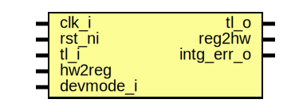

# Entity: i2c_reg_top

## Diagram

## Description

Copyright lowRISC contributors.
 Licensed under the Apache License, Version 2.0, see LICENSE for details.
 SPDX-License-Identifier: Apache-2.0
 Register Top module auto-generated by `reggen`
 
## Ports

| Port name  | Direction | Type | Description                                              |
| ---------- | --------- | ---- | -------------------------------------------------------- |
| clk_i      | input     |      |                                                          |
| rst_ni     | input     |      |                                                          |
| tl_i       | input     |      |                                                          |
| tl_o       | output    |      |                                                          |
| reg2hw     | output    |      | Write                                                    |
| hw2reg     | input     |      | Read                                                     |
| intg_err_o | output    |      | Integrity check errors                                   |
| devmode_i  | input     |      | If 1, explicit error return for unmapped register access |
## Signals

| Name                            | Type               | Description                                                                                                               |
| ------------------------------- | ------------------ | ------------------------------------------------------------------------------------------------------------------------- |
| reg_we                          | logic              | register signals                                                                                                          |
| reg_re                          | logic              |                                                                                                                           |
| reg_addr                        | logic [AW-1:0]     |                                                                                                                           |
| reg_wdata                       | logic [DW-1:0]     |                                                                                                                           |
| reg_be                          | logic [DBW-1:0]    |                                                                                                                           |
| reg_rdata                       | logic [DW-1:0]     |                                                                                                                           |
| reg_error                       | logic              |                                                                                                                           |
| addrmiss                        | logic              |                                                                                                                           |
| wr_err                          | logic              |                                                                                                                           |
| reg_rdata_next                  | logic [DW-1:0]     |                                                                                                                           |
| tl_reg_h2d                      | tlul_pkg::tl_h2d_t |                                                                                                                           |
| tl_reg_d2h                      | tlul_pkg::tl_d2h_t |                                                                                                                           |
| intg_err                        | logic              | incoming payload check                                                                                                    |
| intg_err_q                      | logic              |                                                                                                                           |
| tl_o_pre                        | tlul_pkg::tl_d2h_t | outgoing integrity generation                                                                                             |
| intr_state_we                   | logic              | Define SW related signals Format: <reg>_<field>_{wd|we|qs} or <reg>_{wd|we|qs} if field == 1 or 0                         |
| intr_state_fmt_watermark_qs     | logic              |                                                                                                                           |
| intr_state_fmt_watermark_wd     | logic              |                                                                                                                           |
| intr_state_rx_watermark_qs      | logic              |                                                                                                                           |
| intr_state_rx_watermark_wd      | logic              |                                                                                                                           |
| intr_state_fmt_overflow_qs      | logic              |                                                                                                                           |
| intr_state_fmt_overflow_wd      | logic              |                                                                                                                           |
| intr_state_rx_overflow_qs       | logic              |                                                                                                                           |
| intr_state_rx_overflow_wd       | logic              |                                                                                                                           |
| intr_state_nak_qs               | logic              |                                                                                                                           |
| intr_state_nak_wd               | logic              |                                                                                                                           |
| intr_state_scl_interference_qs  | logic              |                                                                                                                           |
| intr_state_scl_interference_wd  | logic              |                                                                                                                           |
| intr_state_sda_interference_qs  | logic              |                                                                                                                           |
| intr_state_sda_interference_wd  | logic              |                                                                                                                           |
| intr_state_stretch_timeout_qs   | logic              |                                                                                                                           |
| intr_state_stretch_timeout_wd   | logic              |                                                                                                                           |
| intr_state_sda_unstable_qs      | logic              |                                                                                                                           |
| intr_state_sda_unstable_wd      | logic              |                                                                                                                           |
| intr_state_trans_complete_qs    | logic              |                                                                                                                           |
| intr_state_trans_complete_wd    | logic              |                                                                                                                           |
| intr_state_tx_empty_qs          | logic              |                                                                                                                           |
| intr_state_tx_empty_wd          | logic              |                                                                                                                           |
| intr_state_tx_nonempty_qs       | logic              |                                                                                                                           |
| intr_state_tx_nonempty_wd       | logic              |                                                                                                                           |
| intr_state_tx_overflow_qs       | logic              |                                                                                                                           |
| intr_state_tx_overflow_wd       | logic              |                                                                                                                           |
| intr_state_acq_overflow_qs      | logic              |                                                                                                                           |
| intr_state_acq_overflow_wd      | logic              |                                                                                                                           |
| intr_state_ack_stop_qs          | logic              |                                                                                                                           |
| intr_state_ack_stop_wd          | logic              |                                                                                                                           |
| intr_state_host_timeout_qs      | logic              |                                                                                                                           |
| intr_state_host_timeout_wd      | logic              |                                                                                                                           |
| intr_enable_we                  | logic              |                                                                                                                           |
| intr_enable_fmt_watermark_qs    | logic              |                                                                                                                           |
| intr_enable_fmt_watermark_wd    | logic              |                                                                                                                           |
| intr_enable_rx_watermark_qs     | logic              |                                                                                                                           |
| intr_enable_rx_watermark_wd     | logic              |                                                                                                                           |
| intr_enable_fmt_overflow_qs     | logic              |                                                                                                                           |
| intr_enable_fmt_overflow_wd     | logic              |                                                                                                                           |
| intr_enable_rx_overflow_qs      | logic              |                                                                                                                           |
| intr_enable_rx_overflow_wd      | logic              |                                                                                                                           |
| intr_enable_nak_qs              | logic              |                                                                                                                           |
| intr_enable_nak_wd              | logic              |                                                                                                                           |
| intr_enable_scl_interference_qs | logic              |                                                                                                                           |
| intr_enable_scl_interference_wd | logic              |                                                                                                                           |
| intr_enable_sda_interference_qs | logic              |                                                                                                                           |
| intr_enable_sda_interference_wd | logic              |                                                                                                                           |
| intr_enable_stretch_timeout_qs  | logic              |                                                                                                                           |
| intr_enable_stretch_timeout_wd  | logic              |                                                                                                                           |
| intr_enable_sda_unstable_qs     | logic              |                                                                                                                           |
| intr_enable_sda_unstable_wd     | logic              |                                                                                                                           |
| intr_enable_trans_complete_qs   | logic              |                                                                                                                           |
| intr_enable_trans_complete_wd   | logic              |                                                                                                                           |
| intr_enable_tx_empty_qs         | logic              |                                                                                                                           |
| intr_enable_tx_empty_wd         | logic              |                                                                                                                           |
| intr_enable_tx_nonempty_qs      | logic              |                                                                                                                           |
| intr_enable_tx_nonempty_wd      | logic              |                                                                                                                           |
| intr_enable_tx_overflow_qs      | logic              |                                                                                                                           |
| intr_enable_tx_overflow_wd      | logic              |                                                                                                                           |
| intr_enable_acq_overflow_qs     | logic              |                                                                                                                           |
| intr_enable_acq_overflow_wd     | logic              |                                                                                                                           |
| intr_enable_ack_stop_qs         | logic              |                                                                                                                           |
| intr_enable_ack_stop_wd         | logic              |                                                                                                                           |
| intr_enable_host_timeout_qs     | logic              |                                                                                                                           |
| intr_enable_host_timeout_wd     | logic              |                                                                                                                           |
| intr_test_we                    | logic              |                                                                                                                           |
| intr_test_fmt_watermark_wd      | logic              |                                                                                                                           |
| intr_test_rx_watermark_wd       | logic              |                                                                                                                           |
| intr_test_fmt_overflow_wd       | logic              |                                                                                                                           |
| intr_test_rx_overflow_wd        | logic              |                                                                                                                           |
| intr_test_nak_wd                | logic              |                                                                                                                           |
| intr_test_scl_interference_wd   | logic              |                                                                                                                           |
| intr_test_sda_interference_wd   | logic              |                                                                                                                           |
| intr_test_stretch_timeout_wd    | logic              |                                                                                                                           |
| intr_test_sda_unstable_wd       | logic              |                                                                                                                           |
| intr_test_trans_complete_wd     | logic              |                                                                                                                           |
| intr_test_tx_empty_wd           | logic              |                                                                                                                           |
| intr_test_tx_nonempty_wd        | logic              |                                                                                                                           |
| intr_test_tx_overflow_wd        | logic              |                                                                                                                           |
| intr_test_acq_overflow_wd       | logic              |                                                                                                                           |
| intr_test_ack_stop_wd           | logic              |                                                                                                                           |
| intr_test_host_timeout_wd       | logic              |                                                                                                                           |
| alert_test_we                   | logic              |                                                                                                                           |
| alert_test_wd                   | logic              |                                                                                                                           |
| ctrl_we                         | logic              |                                                                                                                           |
| ctrl_enablehost_qs              | logic              |                                                                                                                           |
| ctrl_enablehost_wd              | logic              |                                                                                                                           |
| ctrl_enabletarget_qs            | logic              |                                                                                                                           |
| ctrl_enabletarget_wd            | logic              |                                                                                                                           |
| ctrl_llpbk_qs                   | logic              |                                                                                                                           |
| ctrl_llpbk_wd                   | logic              |                                                                                                                           |
| status_re                       | logic              |                                                                                                                           |
| status_fmtfull_qs               | logic              |                                                                                                                           |
| status_rxfull_qs                | logic              |                                                                                                                           |
| status_fmtempty_qs              | logic              |                                                                                                                           |
| status_hostidle_qs              | logic              |                                                                                                                           |
| status_targetidle_qs            | logic              |                                                                                                                           |
| status_rxempty_qs               | logic              |                                                                                                                           |
| status_txfull_qs                | logic              |                                                                                                                           |
| status_acqfull_qs               | logic              |                                                                                                                           |
| status_txempty_qs               | logic              |                                                                                                                           |
| status_acqempty_qs              | logic              |                                                                                                                           |
| rdata_re                        | logic              |                                                                                                                           |
| rdata_qs                        | logic [7:0]        |                                                                                                                           |
| fdata_we                        | logic              |                                                                                                                           |
| fdata_fbyte_wd                  | logic [7:0]        |                                                                                                                           |
| fdata_start_wd                  | logic              |                                                                                                                           |
| fdata_stop_wd                   | logic              |                                                                                                                           |
| fdata_read_wd                   | logic              |                                                                                                                           |
| fdata_rcont_wd                  | logic              |                                                                                                                           |
| fdata_nakok_wd                  | logic              |                                                                                                                           |
| fifo_ctrl_we                    | logic              |                                                                                                                           |
| fifo_ctrl_rxrst_wd              | logic              |                                                                                                                           |
| fifo_ctrl_fmtrst_wd             | logic              |                                                                                                                           |
| fifo_ctrl_rxilvl_qs             | logic [2:0]        |                                                                                                                           |
| fifo_ctrl_rxilvl_wd             | logic [2:0]        |                                                                                                                           |
| fifo_ctrl_fmtilvl_qs            | logic [1:0]        |                                                                                                                           |
| fifo_ctrl_fmtilvl_wd            | logic [1:0]        |                                                                                                                           |
| fifo_ctrl_acqrst_wd             | logic              |                                                                                                                           |
| fifo_ctrl_txrst_wd              | logic              |                                                                                                                           |
| fifo_status_re                  | logic              |                                                                                                                           |
| fifo_status_fmtlvl_qs           | logic [6:0]        |                                                                                                                           |
| fifo_status_txlvl_qs            | logic [6:0]        |                                                                                                                           |
| fifo_status_rxlvl_qs            | logic [6:0]        |                                                                                                                           |
| fifo_status_acqlvl_qs           | logic [6:0]        |                                                                                                                           |
| ovrd_we                         | logic              |                                                                                                                           |
| ovrd_txovrden_qs                | logic              |                                                                                                                           |
| ovrd_txovrden_wd                | logic              |                                                                                                                           |
| ovrd_sclval_qs                  | logic              |                                                                                                                           |
| ovrd_sclval_wd                  | logic              |                                                                                                                           |
| ovrd_sdaval_qs                  | logic              |                                                                                                                           |
| ovrd_sdaval_wd                  | logic              |                                                                                                                           |
| val_re                          | logic              |                                                                                                                           |
| val_scl_rx_qs                   | logic [15:0]       |                                                                                                                           |
| val_sda_rx_qs                   | logic [15:0]       |                                                                                                                           |
| timing0_we                      | logic              |                                                                                                                           |
| timing0_thigh_qs                | logic [15:0]       |                                                                                                                           |
| timing0_thigh_wd                | logic [15:0]       |                                                                                                                           |
| timing0_tlow_qs                 | logic [15:0]       |                                                                                                                           |
| timing0_tlow_wd                 | logic [15:0]       |                                                                                                                           |
| timing1_we                      | logic              |                                                                                                                           |
| timing1_t_r_qs                  | logic [15:0]       |                                                                                                                           |
| timing1_t_r_wd                  | logic [15:0]       |                                                                                                                           |
| timing1_t_f_qs                  | logic [15:0]       |                                                                                                                           |
| timing1_t_f_wd                  | logic [15:0]       |                                                                                                                           |
| timing2_we                      | logic              |                                                                                                                           |
| timing2_tsu_sta_qs              | logic [15:0]       |                                                                                                                           |
| timing2_tsu_sta_wd              | logic [15:0]       |                                                                                                                           |
| timing2_thd_sta_qs              | logic [15:0]       |                                                                                                                           |
| timing2_thd_sta_wd              | logic [15:0]       |                                                                                                                           |
| timing3_we                      | logic              |                                                                                                                           |
| timing3_tsu_dat_qs              | logic [15:0]       |                                                                                                                           |
| timing3_tsu_dat_wd              | logic [15:0]       |                                                                                                                           |
| timing3_thd_dat_qs              | logic [15:0]       |                                                                                                                           |
| timing3_thd_dat_wd              | logic [15:0]       |                                                                                                                           |
| timing4_we                      | logic              |                                                                                                                           |
| timing4_tsu_sto_qs              | logic [15:0]       |                                                                                                                           |
| timing4_tsu_sto_wd              | logic [15:0]       |                                                                                                                           |
| timing4_t_buf_qs                | logic [15:0]       |                                                                                                                           |
| timing4_t_buf_wd                | logic [15:0]       |                                                                                                                           |
| timeout_ctrl_we                 | logic              |                                                                                                                           |
| timeout_ctrl_val_qs             | logic [30:0]       |                                                                                                                           |
| timeout_ctrl_val_wd             | logic [30:0]       |                                                                                                                           |
| timeout_ctrl_en_qs              | logic              |                                                                                                                           |
| timeout_ctrl_en_wd              | logic              |                                                                                                                           |
| target_id_we                    | logic              |                                                                                                                           |
| target_id_address0_qs           | logic [6:0]        |                                                                                                                           |
| target_id_address0_wd           | logic [6:0]        |                                                                                                                           |
| target_id_mask0_qs              | logic [6:0]        |                                                                                                                           |
| target_id_mask0_wd              | logic [6:0]        |                                                                                                                           |
| target_id_address1_qs           | logic [6:0]        |                                                                                                                           |
| target_id_address1_wd           | logic [6:0]        |                                                                                                                           |
| target_id_mask1_qs              | logic [6:0]        |                                                                                                                           |
| target_id_mask1_wd              | logic [6:0]        |                                                                                                                           |
| acqdata_re                      | logic              |                                                                                                                           |
| acqdata_abyte_qs                | logic [7:0]        |                                                                                                                           |
| acqdata_signal_qs               | logic [1:0]        |                                                                                                                           |
| txdata_we                       | logic              |                                                                                                                           |
| txdata_wd                       | logic [7:0]        |                                                                                                                           |
| stretch_ctrl_we                 | logic              |                                                                                                                           |
| stretch_ctrl_en_addr_tx_qs      | logic              |                                                                                                                           |
| stretch_ctrl_en_addr_tx_wd      | logic              |                                                                                                                           |
| stretch_ctrl_en_addr_acq_qs     | logic              |                                                                                                                           |
| stretch_ctrl_en_addr_acq_wd     | logic              |                                                                                                                           |
| stretch_ctrl_stop_tx_qs         | logic              |                                                                                                                           |
| stretch_ctrl_stop_tx_wd         | logic              |                                                                                                                           |
| stretch_ctrl_stop_acq_qs        | logic              |                                                                                                                           |
| stretch_ctrl_stop_acq_wd        | logic              |                                                                                                                           |
| host_timeout_ctrl_we            | logic              |                                                                                                                           |
| host_timeout_ctrl_qs            | logic [31:0]       |                                                                                                                           |
| host_timeout_ctrl_wd            | logic [31:0]       |                                                                                                                           |
| addr_hit                        | logic [22:0]       |                                                                                                                           |
| unused_wdata                    | logic              | Unused signal tieoff wdata / byte enable are not always fully used add a blanket unused statement to handle lint waivers  |
| unused_be                       | logic              |                                                                                                                           |
## Constants

| Name | Type | Value | Description |
| ---- | ---- | ----- | ----------- |
| AW   | int  | 7     |             |
| DW   | int  | 32    |             |
| DBW  | int  | DW/8  | Byte Width  |
## Processes
- unnamed: ( @(posedge clk_i or negedge rst_ni) )
- unnamed: (  )
- unnamed: (  )
**Description**
Check sub-word write is permitted

- unnamed: (  )
**Description**
Read data return

## Instantiations

- u_chk: tlul_cmd_intg_chk
- u_rsp_intg_gen: tlul_rsp_intg_gen
- u_reg_if: tlul_adapter_reg
- u_intr_state_fmt_watermark: prim_subreg
**Description**
Register instances
R[intr_state]: V(False)
F[fmt_watermark]: 0:0

- u_intr_state_rx_watermark: prim_subreg
**Description**
F[rx_watermark]: 1:1

- u_intr_state_fmt_overflow: prim_subreg
**Description**
F[fmt_overflow]: 2:2

- u_intr_state_rx_overflow: prim_subreg
**Description**
F[rx_overflow]: 3:3

- u_intr_state_nak: prim_subreg
**Description**
F[nak]: 4:4

- u_intr_state_scl_interference: prim_subreg
**Description**
F[scl_interference]: 5:5

- u_intr_state_sda_interference: prim_subreg
**Description**
F[sda_interference]: 6:6

- u_intr_state_stretch_timeout: prim_subreg
**Description**
F[stretch_timeout]: 7:7

- u_intr_state_sda_unstable: prim_subreg
**Description**
F[sda_unstable]: 8:8

- u_intr_state_trans_complete: prim_subreg
**Description**
F[trans_complete]: 9:9

- u_intr_state_tx_empty: prim_subreg
**Description**
F[tx_empty]: 10:10

- u_intr_state_tx_nonempty: prim_subreg
**Description**
F[tx_nonempty]: 11:11

- u_intr_state_tx_overflow: prim_subreg
**Description**
F[tx_overflow]: 12:12

- u_intr_state_acq_overflow: prim_subreg
**Description**
F[acq_overflow]: 13:13

- u_intr_state_ack_stop: prim_subreg
**Description**
F[ack_stop]: 14:14

- u_intr_state_host_timeout: prim_subreg
**Description**
F[host_timeout]: 15:15

- u_intr_enable_fmt_watermark: prim_subreg
**Description**
R[intr_enable]: V(False)
F[fmt_watermark]: 0:0

- u_intr_enable_rx_watermark: prim_subreg
**Description**
F[rx_watermark]: 1:1

- u_intr_enable_fmt_overflow: prim_subreg
**Description**
F[fmt_overflow]: 2:2

- u_intr_enable_rx_overflow: prim_subreg
**Description**
F[rx_overflow]: 3:3

- u_intr_enable_nak: prim_subreg
**Description**
F[nak]: 4:4

- u_intr_enable_scl_interference: prim_subreg
**Description**
F[scl_interference]: 5:5

- u_intr_enable_sda_interference: prim_subreg
**Description**
F[sda_interference]: 6:6

- u_intr_enable_stretch_timeout: prim_subreg
**Description**
F[stretch_timeout]: 7:7

- u_intr_enable_sda_unstable: prim_subreg
**Description**
F[sda_unstable]: 8:8

- u_intr_enable_trans_complete: prim_subreg
**Description**
F[trans_complete]: 9:9

- u_intr_enable_tx_empty: prim_subreg
**Description**
F[tx_empty]: 10:10

- u_intr_enable_tx_nonempty: prim_subreg
**Description**
F[tx_nonempty]: 11:11

- u_intr_enable_tx_overflow: prim_subreg
**Description**
F[tx_overflow]: 12:12

- u_intr_enable_acq_overflow: prim_subreg
**Description**
F[acq_overflow]: 13:13

- u_intr_enable_ack_stop: prim_subreg
**Description**
F[ack_stop]: 14:14

- u_intr_enable_host_timeout: prim_subreg
**Description**
F[host_timeout]: 15:15

- u_intr_test_fmt_watermark: prim_subreg_ext
**Description**
R[intr_test]: V(True)
F[fmt_watermark]: 0:0

- u_intr_test_rx_watermark: prim_subreg_ext
**Description**
F[rx_watermark]: 1:1

- u_intr_test_fmt_overflow: prim_subreg_ext
**Description**
F[fmt_overflow]: 2:2

- u_intr_test_rx_overflow: prim_subreg_ext
**Description**
F[rx_overflow]: 3:3

- u_intr_test_nak: prim_subreg_ext
**Description**
F[nak]: 4:4

- u_intr_test_scl_interference: prim_subreg_ext
**Description**
F[scl_interference]: 5:5

- u_intr_test_sda_interference: prim_subreg_ext
**Description**
F[sda_interference]: 6:6

- u_intr_test_stretch_timeout: prim_subreg_ext
**Description**
F[stretch_timeout]: 7:7

- u_intr_test_sda_unstable: prim_subreg_ext
**Description**
F[sda_unstable]: 8:8

- u_intr_test_trans_complete: prim_subreg_ext
**Description**
F[trans_complete]: 9:9

- u_intr_test_tx_empty: prim_subreg_ext
**Description**
F[tx_empty]: 10:10

- u_intr_test_tx_nonempty: prim_subreg_ext
**Description**
F[tx_nonempty]: 11:11

- u_intr_test_tx_overflow: prim_subreg_ext
**Description**
F[tx_overflow]: 12:12

- u_intr_test_acq_overflow: prim_subreg_ext
**Description**
F[acq_overflow]: 13:13

- u_intr_test_ack_stop: prim_subreg_ext
**Description**
F[ack_stop]: 14:14

- u_intr_test_host_timeout: prim_subreg_ext
**Description**
F[host_timeout]: 15:15

- u_alert_test: prim_subreg_ext
**Description**
R[alert_test]: V(True)

- u_ctrl_enablehost: prim_subreg
**Description**
R[ctrl]: V(False)
F[enablehost]: 0:0

- u_ctrl_enabletarget: prim_subreg
**Description**
F[enabletarget]: 1:1

- u_ctrl_llpbk: prim_subreg
**Description**
F[llpbk]: 2:2

- u_status_fmtfull: prim_subreg_ext
**Description**
R[status]: V(True)
F[fmtfull]: 0:0

- u_status_rxfull: prim_subreg_ext
**Description**
F[rxfull]: 1:1

- u_status_fmtempty: prim_subreg_ext
**Description**
F[fmtempty]: 2:2

- u_status_hostidle: prim_subreg_ext
**Description**
F[hostidle]: 3:3

- u_status_targetidle: prim_subreg_ext
**Description**
F[targetidle]: 4:4

- u_status_rxempty: prim_subreg_ext
**Description**
F[rxempty]: 5:5

- u_status_txfull: prim_subreg_ext
**Description**
F[txfull]: 6:6

- u_status_acqfull: prim_subreg_ext
**Description**
F[acqfull]: 7:7

- u_status_txempty: prim_subreg_ext
**Description**
F[txempty]: 8:8

- u_status_acqempty: prim_subreg_ext
**Description**
F[acqempty]: 9:9

- u_rdata: prim_subreg_ext
**Description**
R[rdata]: V(True)

- u_fdata_fbyte: prim_subreg
**Description**
R[fdata]: V(False)
F[fbyte]: 7:0

- u_fdata_start: prim_subreg
**Description**
F[start]: 8:8

- u_fdata_stop: prim_subreg
**Description**
F[stop]: 9:9

- u_fdata_read: prim_subreg
**Description**
F[read]: 10:10

- u_fdata_rcont: prim_subreg
**Description**
F[rcont]: 11:11

- u_fdata_nakok: prim_subreg
**Description**
F[nakok]: 12:12

- u_fifo_ctrl_rxrst: prim_subreg
**Description**
R[fifo_ctrl]: V(False)
F[rxrst]: 0:0

- u_fifo_ctrl_fmtrst: prim_subreg
**Description**
F[fmtrst]: 1:1

- u_fifo_ctrl_rxilvl: prim_subreg
**Description**
F[rxilvl]: 4:2

- u_fifo_ctrl_fmtilvl: prim_subreg
**Description**
F[fmtilvl]: 6:5

- u_fifo_ctrl_acqrst: prim_subreg
**Description**
F[acqrst]: 7:7

- u_fifo_ctrl_txrst: prim_subreg
**Description**
F[txrst]: 8:8

- u_fifo_status_fmtlvl: prim_subreg_ext
**Description**
R[fifo_status]: V(True)
F[fmtlvl]: 6:0

- u_fifo_status_txlvl: prim_subreg_ext
**Description**
F[txlvl]: 14:8

- u_fifo_status_rxlvl: prim_subreg_ext
**Description**
F[rxlvl]: 22:16

- u_fifo_status_acqlvl: prim_subreg_ext
**Description**
F[acqlvl]: 30:24

- u_ovrd_txovrden: prim_subreg
**Description**
R[ovrd]: V(False)
F[txovrden]: 0:0

- u_ovrd_sclval: prim_subreg
**Description**
F[sclval]: 1:1

- u_ovrd_sdaval: prim_subreg
**Description**
F[sdaval]: 2:2

- u_val_scl_rx: prim_subreg_ext
**Description**
R[val]: V(True)
F[scl_rx]: 15:0

- u_val_sda_rx: prim_subreg_ext
**Description**
F[sda_rx]: 31:16

- u_timing0_thigh: prim_subreg
**Description**
R[timing0]: V(False)
F[thigh]: 15:0

- u_timing0_tlow: prim_subreg
**Description**
F[tlow]: 31:16

- u_timing1_t_r: prim_subreg
**Description**
R[timing1]: V(False)
F[t_r]: 15:0

- u_timing1_t_f: prim_subreg
**Description**
F[t_f]: 31:16

- u_timing2_tsu_sta: prim_subreg
**Description**
R[timing2]: V(False)
F[tsu_sta]: 15:0

- u_timing2_thd_sta: prim_subreg
**Description**
F[thd_sta]: 31:16

- u_timing3_tsu_dat: prim_subreg
**Description**
R[timing3]: V(False)
F[tsu_dat]: 15:0

- u_timing3_thd_dat: prim_subreg
**Description**
F[thd_dat]: 31:16

- u_timing4_tsu_sto: prim_subreg
**Description**
R[timing4]: V(False)
F[tsu_sto]: 15:0

- u_timing4_t_buf: prim_subreg
**Description**
F[t_buf]: 31:16

- u_timeout_ctrl_val: prim_subreg
**Description**
R[timeout_ctrl]: V(False)
F[val]: 30:0

- u_timeout_ctrl_en: prim_subreg
**Description**
F[en]: 31:31

- u_target_id_address0: prim_subreg
**Description**
R[target_id]: V(False)
F[address0]: 6:0

- u_target_id_mask0: prim_subreg
**Description**
F[mask0]: 13:7

- u_target_id_address1: prim_subreg
**Description**
F[address1]: 20:14

- u_target_id_mask1: prim_subreg
**Description**
F[mask1]: 27:21

- u_acqdata_abyte: prim_subreg_ext
**Description**
R[acqdata]: V(True)
F[abyte]: 7:0

- u_acqdata_signal: prim_subreg_ext
**Description**
F[signal]: 9:8

- u_txdata: prim_subreg
**Description**
R[txdata]: V(False)

- u_stretch_ctrl_en_addr_tx: prim_subreg
**Description**
R[stretch_ctrl]: V(False)
F[en_addr_tx]: 0:0

- u_stretch_ctrl_en_addr_acq: prim_subreg
**Description**
F[en_addr_acq]: 1:1

- u_stretch_ctrl_stop_tx: prim_subreg
**Description**
F[stop_tx]: 2:2

- u_stretch_ctrl_stop_acq: prim_subreg
**Description**
F[stop_acq]: 3:3

- u_host_timeout_ctrl: prim_subreg
**Description**
R[host_timeout_ctrl]: V(False)

