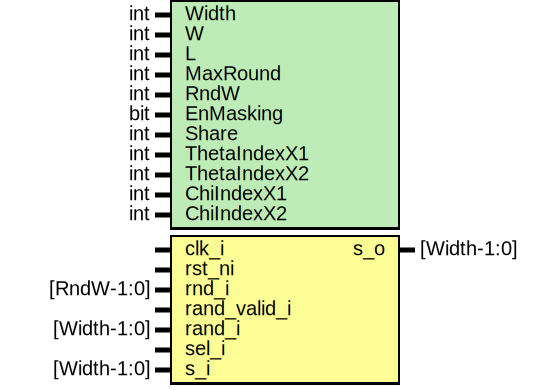

# Entity: keccak_2share

- **File**: keccak_2share.sv
## Diagram

## Description

 Copyright lowRISC contributors.
 Licensed under the Apache License, Version 2.0, see LICENSE for details.
 SPDX-License-Identifier: Apache-2.0

 This module is the single round keccak permutation module
 It supports Keccak with up to 1600b of state
 Only when EnMasking is enabled, rand_i and sel_i are used

## Generics

| Generic name | Type | Value              | Description                             |
| ------------ | ---- | ------------------ | --------------------------------------- |
| Width        | int  | 1600               |  b= {25, 50, 100, 200, 400, 800, 1600}  |
| W            | int  | Width/25           |  Derived                                |
| L            | int  | $clog2(W)          |                                         |
| MaxRound     | int  | 12 + 2*L           |  Keccak-f only                          |
| RndW         | int  | $clog2(MaxRound+1) |  Representing up to MaxRound            |
| EnMasking    | bit  | 0                  |  Enable secure hardening                |
| Share        | int  | EnMasking ? 2 : 1  |                                         |
| ThetaIndexX1 | int  | undefined          |  (x-1)%5                                |
| ThetaIndexX2 | int  | undefined          |  (x+1)%5                                |
| ChiIndexX1   | int  | undefined          |  (x+1)%5                                |
| ChiIndexX2   | int  | undefined          |  (x+2)%5                                |
## Ports

| Port name    | Direction | Type        | Description                                       |
| ------------ | --------- | ----------- | ------------------------------------------------- |
| clk_i        | input     |             |                                                   |
| rst_ni       | input     |             |                                                   |
| rnd_i        | input     | [RndW-1:0]  | Current Round                                     |
| rand_valid_i | input     |             |                                                   |
| rand_i       | input     | [Width-1:0] | Random values. Used when 2Share enabled           |
| sel_i        | input     |             | Select input/output mux. Used when EnMasking := 1 |
| s_i          | input     | [Width-1:0] |                                                   |
| s_o          | output    | [Width-1:0] |                                                   |
## Signals

| Name       | Type        | Description                             |
| ---------- | ----------- | --------------------------------------- |
| state_in   | box_t       | ////////////  Keccak_f // ////////////  |
| state_out  | box_t       |                                         |
| theta_data | box_t       |                                         |
| rho_data   | box_t       |                                         |
| pi_data    | box_t       |                                         |
| chi_data   | box_t       |                                         |
| iota_data  | box_t       |                                         |
| phase1_in  | box_t       |                                         |
| phase1_out | box_t       |                                         |
| phase2_in  | box_t       |                                         |
| phase2_out | box_t       |                                         |
| result     | box_t       |                                         |
| result     | return      |                                         |
| iota       | endfunction |                                         |
## Constants

| Name      | Type         | Value              | Description                                                                                                                                                                                                                                                                                                                                                                                                                                                                                                                                                                                                                                                                                                                                                                                                                                                                                                                                                                                                                                                                                                                                                                                  |
| --------- | ------------ | ------------------ | -------------------------------------------------------------------------------------------------------------------------------------------------------------------------------------------------------------------------------------------------------------------------------------------------------------------------------------------------------------------------------------------------------------------------------------------------------------------------------------------------------------------------------------------------------------------------------------------------------------------------------------------------------------------------------------------------------------------------------------------------------------------------------------------------------------------------------------------------------------------------------------------------------------------------------------------------------------------------------------------------------------------------------------------------------------------------------------------------------------------------------------------------------------------------------------------- |
| W         | int          | Width/25           |  Derived                                                                                                                                                                                                                                                                                                                                                                                                                                                                                                                                                                                                                                                                                                                                                                                                                                                                                                                                                                                                                                                                                                                                                                                     |
| L         | int          | $clog2(W)          |                                                                                                                                                                                                                                                                                                                                                                                                                                                                                                                                                                                                                                                                                                                                                                                                                                                                                                                                                                                                                                                                                                                                                                                              |
| MaxRound  | int          | 12 + 2*L           | Keccak-f only                                                                                                                                                                                                                                                                                                                                                                                                                                                                                                                                                                                                                                                                                                                                                                                                                                                                                                                                                                                                                                                                                                                                                                                |
| RndW      | int          | $clog2(MaxRound+1) | Representing up to MaxRound                                                                                                                                                                                                                                                                                                                                                                                                                                                                                                                                                                                                                                                                                                                                                                                                                                                                                                                                                                                                                                                                                                                                                                  |
| Share     | int          | EnMasking ? 2 : 1  |                                                                                                                                                                                                                                                                                                                                                                                                                                                                                                                                                                                                                                                                                                                                                                                                                                                                                                                                                                                                                                                                                                                                                                                              |
| RhoOffset | int          | undefined          |  Rho ======================================================================  As RhoOffset[x][y] is considered as variable int in VCS,  it is replaced with generate statement.  Revised to meet verilator lint. Now RhoOffset is 1-D array                                                                                                                                                                                                                                                                                                                                                                                                                                                                                                                                                                                                                                                                                                                                                                                                                                                                                                                                                   |
| PiRotate  | int          | undefined          |  rho  Commented out entire rho function due to VCS elaboration error.  (z-RhoOffset[x][y]%W) isn't considered as a constant in VCS.  Even changing it to W-RhoOffset[x][y]%W and assign to ShiftAmt  creates same error.  Offset : Look at Table 2 in FIPS PUB 202 localparam int RhoOffset [5][5]  = '{   //y  0    1    2    3    4     x   '{   0,  36,   3, 105, 210},// 0   '{   1, 300,  10,  45,  66},// 1   '{ 190,   6, 171,  15, 253},// 2   '{  28,  55, 153,  21, 120},// 3   '{  91, 276, 231, 136,  78} // 4 };  rotate bits of each lane by offset  1. rho[0,0,z] = A[0,0,z]  2. Offset swap     a. (x,y) := (1,0)     b. for t [0..23]        i. rho[x,y,z] = A[x,y,z-(t+1)(t+2)/2]        ii. (x,y) = (y, (2x+3y)) function automatic box_t rho(box_t state);   box_t result;   for (int x = 0 ; x < 5 ; x++) begin     for (int y = 0 ; y < 5 ; y++) begin       for (int z = 0 ; z < W ; z++) begin         automatic int index_z;         index_z = (z-RhoOffset[x][y])%W;         result[x][y][z] = state[x][y][(z-RhoOffset[x][y])%W];       end     end   end   return result; endfunction : rho  pi  rearrange the position of lanes  pi[x,y,z] = state[(x+3y),x,z]  |
| RC        | logic [63:0] | undefined          |  iota  XOR (x,y) = (0,0) with Round Constant (RC)  RC parameter: Precomputed by util/keccak_rc.py. Only up-to 0..L-1 is used  RC = '0  RC[2**j-1] = rc(j+7*rnd)  rc(t) =     1. t%255 == 0 -> 1     2. R[0:7] = 'b10000000     3. for i = [1..t%255]       a. R = 0 || R       b. R[0] = R[0] ^ R[8]       c. R[4] = R[4] ^ R[8]       d. R[5] = R[5] ^ R[8]       e. R[6] = R[6] ^ R[8]       f. R = R[0:7]     4. return R[0]  RC has L = [0..6]  for lower L case, only chopping lower part of 64bit RC is sufficient.                                                                                                                                                                                                                                                                                                                                                                                                                                                                                                                                                                                                                                                                    |
## Types

| Name    | Type                    | Description                 |
| ------- | ----------------------- | --------------------------- |
| box_t   | logic [4:0][4:0][W-1:0] | (x,y,z) state               |
| lane_t  | logic           [W-1:0] | (z)                         |
| plane_t | logic [4:0]     [W-1:0] | (x,z)                       |
| slice_t | logic [4:0][4:0]        | (x,y)                       |
| sheet_t | logic      [4:0][W-1:0] | (y,z) identical to plane_t  |
| row_t   | logic [4:0]             | (x)                         |
| col_t   | logic      [4:0]        | (y) identical to row_t      |
## Functions
- bitarray_to_box (logic [Width-1:0]) return (box_t)
 **Description**
/////////////
 Functions //
/////////////
 Convert bitarray to 3D box
 Please take a look at FIPS PUB 202
 https://nvlpubs.nist.gov/nistpubs/FIPS/NIST.FIPS.202.pdf
 > For all triples (x,y,z) such that 0<=x<5, 0<=y<5, and 0<=z<w,
 >    A[x,y,z]=S[w(5y+x)+z]

- box_to_bitarray (box_t) return (logic [Width-1:0])
 **Description**
 Convert 3D cube to bitarray

- theta (box_t) return (box_t)
- pi (box_t) return (box_t)
- chi (box_t) return (box_t)
