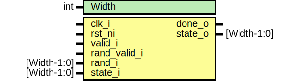

# Entity: keccak_2share_fpv

- **File**: keccak_2share_fpv.sv
## Diagram

## Description

 Copyright lowRISC contributors.
 Licensed under the Apache License, Version 2.0, see LICENSE for details.
 SPDX-License-Identifier: Apache-2.0

 Testbench module for prim_keccak. Intended to be used with a formal tool.

## Generics

| Generic name | Type | Value | Description |
| ------------ | ---- | ----- | ----------- |
| Width        | int  | 1600  |             |
## Ports

| Port name    | Direction | Type        | Description |
| ------------ | --------- | ----------- | ----------- |
| clk_i        | input     |             |             |
| rst_ni       | input     |             |             |
| valid_i      | input     |             |             |
| rand_valid_i | input     |             |             |
| rand_i       | input     | [Width-1:0] |             |
| state_i      | input     | [Width-1:0] |             |
| done_o       | output    |             |             |
| state_o      | output    | [Width-1:0] |             |
## Signals

| Name           | Type              | Description         |
| -------------- | ----------------- | ------------------- |
| round          | logic [RndW-1:0]  |                     |
| state          | logic [Width-1:0] |                     |
| state_d        | logic [Width-1:0] |                     |
| golden_state   | logic [Width-1:0] |                     |
| golden_state_d | logic [Width-1:0] |                     |
| compare_states | logic [Width-1:0] |                     |
| keccak_st      | share_state_e     |                     |
| keccak_st_d    | share_state_e     |                     |
| inc_round      | logic             |                     |
| update_state   | logic             |                     |
| sel_mux        | logic             |                     |
| keccak_in      | logic [Width-1:0] |                     |
| keccak_out     | logic [Width-1:0] |                     |
| data_0         | logic [1599:0]    |  Test with value 0  |
| digest_0       | logic [255:0]     |                     |
## Constants

| Name     | Type | Value              | Description    |
| -------- | ---- | ------------------ | -------------- |
| W        | int  | Width/25           |                |
| L        | int  | $clog2(W)          |                |
| NumRound | int  | 12 + 2*L           | Keccak-f only  |
| RndW     | int  | $clog2(NumRound+1) |                |
## Types

| Name          | Type                                                                                                                                                                                                                        | Description |
| ------------- | --------------------------------------------------------------------------------------------------------------------------------------------------------------------------------------------------------------------------- | ----------- |
| share_state_e | enum logic [1:0] {      StIdle,      StPhase1,      StPhase2,      StPhase3   } |             |
## Processes
- unnamed: ( @(posedge clk_i, negedge rst_ni) )
  - **Type:** always_ff
- unnamed: (  )
  - **Type:** always_comb
- unnamed: ( @(posedge clk_i or negedge rst_ni) )
  - **Type:** always_ff
- unnamed: ( @(posedge clk_i or negedge rst_ni) )
  - **Type:** always_ff
- unnamed: ( @(posedge clk_i, negedge rst_ni) )
  - **Type:** always_ff
**Description**
 Compare with keccak Unmasking 
- unnamed: (  )
  - **Type:** always_comb
## Instantiations

- u_keccak: keccak_2share
- u_golden: keccak_2share
