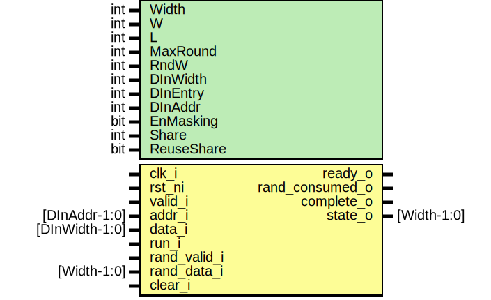

# Entity: keccak_round

- **File**: keccak_round.sv
## Diagram

## Description

 Copyright lowRISC contributors.
 Licensed under the Apache License, Version 2.0, see LICENSE for details.
 SPDX-License-Identifier: Apache-2.0

 Keccak full round logic based on given input `Width`
 e.g. Width 800 requires 22 rounds

## Generics

| Generic name | Type | Value              | Description                             |
| ------------ | ---- | ------------------ | --------------------------------------- |
| Width        | int  | 1600               |  b= {25, 50, 100, 200, 400, 800, 1600}  |
| W            | int  | Width/25           |  Derived                                |
| L            | int  | $clog2(W)          |                                         |
| MaxRound     | int  | 12 + 2*L           |  Keccak-f only                          |
| RndW         | int  | $clog2(MaxRound+1) |  Representing up to MaxRound-1          |
| DInWidth     | int  | 64                 |  currently only 64bit supported         |
| DInEntry     | int  | Width / DInWidth   |                                         |
| DInAddr      | int  | $clog2(DInEntry)   |                                         |
| EnMasking    | bit  | 1'b0               |  Enable secure hardening                |
| Share        | int  | EnMasking ? 2 : 1  |                                         |
| ReuseShare   | bit  | 1'b0               |  Re-use adjacent share for entropy      |
## Ports

| Port name       | Direction | Type           | Description                                 |
| --------------- | --------- | -------------- | ------------------------------------------- |
| clk_i           | input     |                |                                             |
| rst_ni          | input     |                |                                             |
| valid_i         | input     |                |  Message Feed                               |
| addr_i          | input     | [DInAddr-1:0]  |                                             |
| data_i          | input     | [DInWidth-1:0] |                                             |
| ready_o         | output    |                |                                             |
| run_i           | input     |                | Pulse signal to initiates Keccak full round |
| rand_valid_i    | input     |                |                                             |
| rand_data_i     | input     | [Width-1:0]    |                                             |
| rand_consumed_o | output    |                |                                             |
| complete_o      | output    |                | Indicates full round is done                |
| state_o         | output    | [Width-1:0]    |  State out. This can be used as Digest      |
| clear_i         | input     |                | Clear internal state to '0                  |
## Signals

| Name                 | Type              | Description                                                                                                                                                                                                                                                                                                                                                                                                                                                                                                                                                                                                                                                                                                                                                                                                  |
| -------------------- | ----------------- | ------------------------------------------------------------------------------------------------------------------------------------------------------------------------------------------------------------------------------------------------------------------------------------------------------------------------------------------------------------------------------------------------------------------------------------------------------------------------------------------------------------------------------------------------------------------------------------------------------------------------------------------------------------------------------------------------------------------------------------------------------------------------------------------------------------ |
| update_storage       | logic             | ///////////////////  Control signals // ///////////////////  Update storage register                                                                                                                                                                                                                                                                                                                                                                                                                                                                                                                                                                                                                                                                                                                         |
| rst_storage          | logic             |  Reset the storage to 0 to initiate new Hash operation                                                                                                                                                                                                                                                                                                                                                                                                                                                                                                                                                                                                                                                                                                                                                       |
| xor_message          | logic             |  XOR message into storage register  It only does based on the given DInWidth.  If DInWidth < Width, it takes multiple cycles to XOR all message                                                                                                                                                                                                                                                                                                                                                                                                                                                                                                                                                                                                                                                              |
| sel_mux              | logic             |  Select Keccak_p datapath  0: Select Phase1 (Theta -> Rho -> Pi)  1: Select Phase2 (Chi -> Iota)  `sel_mux` need to be asserted until the Chi stage is consumed,  It means sel_mux should be 1 until one cycle after `rand_valid_i` is asserted.                                                                                                                                                                                                                                                                                                                                                                                                                                                                                                                                                             |
| inc_rnd_num          | logic             |  Increase/ Reset Round number                                                                                                                                                                                                                                                                                                                                                                                                                                                                                                                                                                                                                                                                                                                                                                                |
| rst_rnd_num          | logic             |                                                                                                                                                                                                                                                                                                                                                                                                                                                                                                                                                                                                                                                                                                                                                                                                              |
| rnd_eq_end           | logic             |  Round reaches end  This signal indicates the round reaches desired number, which is MaxRound -1.  MaxRound is dependant on the Width. In case of SHA3/SHAKE, MaxRound is 24.                                                                                                                                                                                                                                                                                                                                                                                                                                                                                                                                                                                                                                |
| complete_d           | logic             |  Complete of Keccak_f  State machine asserts `complete_d` when it reaches at the end of round and  operation (Phase3 if Masked). The the stage, the storage still doesn't have  the valid states. So precisely it is not completed yet.  State generated `complete_d` is latched with the clock and creates a pulse  signal one cycle later. The signal is the indication of completion.   Intentionally removed any intermediate step (so called StComplete) in order  to save a clock to proceeds next round.                                                                                                                                                                                                                                                                                           |
| keccak_out           | logic [Width-1:0] | ////////////////////  Datapath Signals // ////////////////////  Single round keccak output data                                                                                                                                                                                                                                                                                                                                                                                                                                                                                                                                                                                                                                                                                                              |
| round                | logic [RndW-1:0]  |  Keccak Round indicator: range from 0 .. MaxRound                                                                                                                                                                                                                                                                                                                                                                                                                                                                                                                                                                                                                                                                                                                                                            |
| keccak_rand_valid    | logic             |  Random value and valid signal used in Keccak_p  There's plan to make random value generation configurable.  1. Tied to 0 in case of random value is not needed. It means the Keccak     doesn't need to be masked and throughput is the most important thing.  2. Receive random value from entropy source. This requires to fill 1600b     of entropy. It takes long time so generally it will have smaller bits     from tru entropy source and expands to 1600b (Width).  3. Reuse Share. This option is to reuse the other part of share. Chi stage     uses 3 sheets to create a sheet. (newX = X ^ (~(X+1) & (X+2))). So the     other two shares (X-1, X-2) can be assumed as random values, and may be     used as entropy source. It is weaker than the use of true entropy, but     much faster.  |
| keccak_rand_consumed | logic             |  Random value and valid signal used in Keccak_p  There's plan to make random value generation configurable.  1. Tied to 0 in case of random value is not needed. It means the Keccak     doesn't need to be masked and throughput is the most important thing.  2. Receive random value from entropy source. This requires to fill 1600b     of entropy. It takes long time so generally it will have smaller bits     from tru entropy source and expands to 1600b (Width).  3. Reuse Share. This option is to reuse the other part of share. Chi stage     uses 3 sheets to create a sheet. (newX = X ^ (~(X+1) & (X+2))). So the     other two shares (X-1, X-2) can be assumed as random values, and may be     used as entropy source. It is weaker than the use of true entropy, but     much faster.  |
| keccak_rand_data     | logic [Width-1:0] |                                                                                                                                                                                                                                                                                                                                                                                                                                                                                                                                                                                                                                                                                                                                                                                                              |
| keccak_st            | keccak_st_e       |                                                                                                                                                                                                                                                                                                                                                                                                                                                                                                                                                                                                                                                                                                                                                                                                              |
| keccak_st_d          | keccak_st_e       |                                                                                                                                                                                                                                                                                                                                                                                                                                                                                                                                                                                                                                                                                                                                                                                                              |
| storage_d            | begin             |                                                                                                                                                                                                                                                                                                                                                                                                                                                                                                                                                                                                                                                                                                                                                                                                              |
| end                  | end               |                                                                                                                                                                                                                                                                                                                                                                                                                                                                                                                                                                                                                                                                                                                                                                                                              |
## Constants

| Name     | Type | Value              | Description                    |
| -------- | ---- | ------------------ | ------------------------------ |
| W        | int  | Width/25           |  Derived                       |
| L        | int  | $clog2(W)          |                                |
| MaxRound | int  | 12 + 2*L           | Keccak-f only                  |
| RndW     | int  | $clog2(MaxRound+1) | Representing up to MaxRound-1  |
| DInEntry | int  | Width / DInWidth   |                                |
| DInAddr  | int  | $clog2(DInEntry)   |                                |
| Share    | int  | EnMasking ? 2 : 1  |                                |
## Types

| Name        | Type                                                                                                                                                                                                                                                                                                                                                                                                                                                            | Description |
| ----------- | --------------------------------------------------------------------------------------------------------------------------------------------------------------------------------------------------------------------------------------------------------------------------------------------------------------------------------------------------------------------------------------------------------------------------------------------------------------- | ----------- |
| keccak_st_e | enum logic [2:0] {        StIdle,                       StActive,                                     StPhase1,                       StPhase2,                                            StPhase3,                              StError   } |             |
## Processes
- unnamed: ( @(posedge clk_i or negedge rst_ni) )
  - **Type:** always_ff
- unnamed: (  )
  - **Type:** always_comb
 **Description**
 Next state logic and output logic 
- unnamed: (  )
  - **Type:** always_comb
 **Description**
 Storage register input  The incoming message is XORed with the existing storage registers.  The logic can accept not a block size incoming message chunk but  the size defined in `DInWidth` parameter with its position. 
- unnamed: ( @(posedge clk_i or negedge rst_ni) )
  - **Type:** always_ff
 **Description**
 Round number 
- unnamed: ( @(posedge clk_i or negedge rst_ni) )
  - **Type:** always_ff
 **Description**
 completion signal 
## Instantiations

- u_keccak_p: keccak_2share
 **Description**
////////////
 Datapath //
////////////

