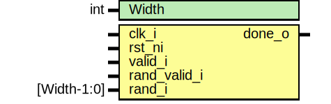

# Entity: keccak_round_fpv

- **File**: keccak_round_fpv.sv
## Diagram

## Description

 Copyright lowRISC contributors.
 Licensed under the Apache License, Version 2.0, see LICENSE for details.
 SPDX-License-Identifier: Apache-2.0

 Testbench module for keccak_f. Intended to be used with a formal tool.

## Generics

| Generic name | Type | Value | Description |
| ------------ | ---- | ----- | ----------- |
| Width        | int  | 1600  |             |
## Ports

| Port name    | Direction | Type        | Description |
| ------------ | --------- | ----------- | ----------- |
| clk_i        | input     |             |             |
| rst_ni       | input     |             |             |
| valid_i      | input     |             |             |
| rand_valid_i | input     |             |             |
| rand_i       | input     | [Width-1:0] |             |
| done_o       | output    |             |             |
## Signals

| Name               | Type                 | Description         |
| ------------------ | -------------------- | ------------------- |
| masked_state       | logic [Width-1:0]    |                     |
| masked_state_d     | logic [Width-1:0]    |                     |
| unmasked_state     | logic [Width-1:0]    |                     |
| unmasked_state_d   | logic [Width-1:0]    |                     |
| msg_valid          | logic                |  Data input         |
| msg_addr           | logic [DInAddr-1:0]  |                     |
| msg_data           | logic [DInWidth-1:0] |                     |
| msg_ready_masked   | logic                |                     |
| msg_ready_unmasked | logic                |                     |
| run                | logic                |                     |
| clear              | logic                |                     |
| masked_complete    | logic                |                     |
| unmasked_complete  | logic                |                     |
| compare_states     | logic [Width-1:0]    |                     |
| data_0             | logic [1599:0]       |  Test with value 0  |
| in_progress        | logic                |                     |
| st                 | st_e                 |                     |
| st_d               | st_e                 |                     |
| digest_0           | logic [255:0]        |                     |
## Constants

| Name     | Type | Value              | Description                     |
| -------- | ---- | ------------------ | ------------------------------- |
| W        | int  | Width/25           |                                 |
| L        | int  | $clog2(W)          |                                 |
| NumRound | int  | 12 + 2*L           | Keccak-f only                   |
| RndW     | int  | $clog2(NumRound+1) |                                 |
| DInWidth | int  | 64                 | currently only 64bit supported  |
| DInEntry | int  | Width / DInWidth   |                                 |
| DInAddr  | int  | $clog2(DInEntry)   |                                 |
## Types

| Name | Type                                                                                                                                                                                                                    | Description |
| ---- | ----------------------------------------------------------------------------------------------------------------------------------------------------------------------------------------------------------------------- | ----------- |
| st_e | enum logic [2:0] {      StIdle,      StMsg,      StRun,      StComplete   } |             |
## Processes
- unnamed: (  )
  - **Type:** always_comb
- unnamed: ( @(posedge clk_i or negedge rst_ni) )
  - **Type:** always_ff
 **Description**
 Data input : SHA3-256 
- unnamed: ( @(posedge clk_i or negedge rst_ni) )
  - **Type:** always_ff
- unnamed: ( @(posedge clk_i or negedge rst_ni) )
  - **Type:** always_ff
- unnamed: (  )
  - **Type:** always_comb
## Instantiations

- u_masked: keccak_round
 **Description**
 Masked Keccak round

- u_unmasked: keccak_round
