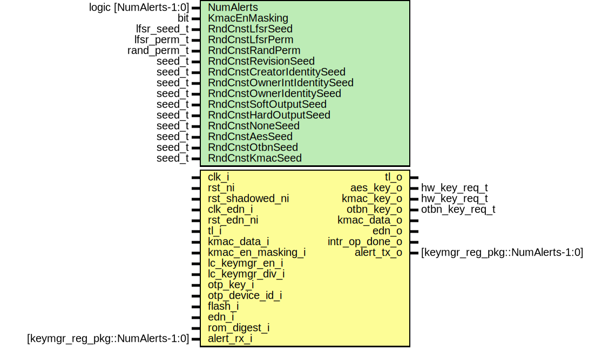

# Entity: keymgr

- **File**: keymgr.sv
## Diagram

## Description

 Copyright lowRISC contributors.
 Licensed under the Apache License, Version 2.0, see LICENSE for details.
 SPDX-License-Identifier: Apache-2.0

 Key manager top level

## Generics

| Generic name                | Type                  | Value                              | Description |
| --------------------------- | --------------------- | ---------------------------------- | ----------- |
| NumAlerts                   | logic [NumAlerts-1:0] | undefined                          |             |
| KmacEnMasking               | bit                   | 1'b1                               |             |
| RndCnstLfsrSeed             | lfsr_seed_t           | RndCnstLfsrSeedDefault             |             |
| RndCnstLfsrPerm             | lfsr_perm_t           | RndCnstLfsrPermDefault             |             |
| RndCnstRandPerm             | rand_perm_t           | RndCnstRandPermDefault             |             |
| RndCnstRevisionSeed         | seed_t                | RndCnstRevisionSeedDefault         |             |
| RndCnstCreatorIdentitySeed  | seed_t                | RndCnstCreatorIdentitySeedDefault  |             |
| RndCnstOwnerIntIdentitySeed | seed_t                | RndCnstOwnerIntIdentitySeedDefault |             |
| RndCnstOwnerIdentitySeed    | seed_t                | RndCnstOwnerIdentitySeedDefault    |             |
| RndCnstSoftOutputSeed       | seed_t                | RndCnstSoftOutputSeedDefault       |             |
| RndCnstHardOutputSeed       | seed_t                | RndCnstHardOutputSeedDefault       |             |
| RndCnstNoneSeed             | seed_t                | RndCnstNoneSeedDefault             |             |
| RndCnstAesSeed              | seed_t                | RndCnstAesSeedDefault              |             |
| RndCnstOtbnSeed             | seed_t                | RndCnstOtbnSeedDefault             |             |
| RndCnstKmacSeed             | seed_t                | RndCnstKmacSeedDefault             |             |
## Ports

| Port name         | Direction | Type                            | Description                                                                                                                                                                                                                                            |
| ----------------- | --------- | ------------------------------- | ------------------------------------------------------------------------------------------------------------------------------------------------------------------------------------------------------------------------------------------------------ |
| clk_i             | input     |                                 |                                                                                                                                                                                                                                                        |
| rst_ni            | input     |                                 |                                                                                                                                                                                                                                                        |
| rst_shadowed_ni   | input     |                                 |                                                                                                                                                                                                                                                        |
| clk_edn_i         | input     |                                 |                                                                                                                                                                                                                                                        |
| rst_edn_ni        | input     |                                 |                                                                                                                                                                                                                                                        |
| tl_i              | input     |                                 |  Bus Interface                                                                                                                                                                                                                                         |
| tl_o              | output    |                                 |                                                                                                                                                                                                                                                        |
| aes_key_o         | output    | hw_key_req_t                    |  key interface to crypto modules                                                                                                                                                                                                                       |
| kmac_key_o        | output    | hw_key_req_t                    |                                                                                                                                                                                                                                                        |
| otbn_key_o        | output    | otbn_key_req_t                  |                                                                                                                                                                                                                                                        |
| kmac_data_o       | output    |                                 |  data interface to/from crypto modules                                                                                                                                                                                                                 |
| kmac_data_i       | input     |                                 |                                                                                                                                                                                                                                                        |
| kmac_en_masking_i | input     |                                 |  whether kmac is masked Note this input is not driving ANY logic directly.  Instead it is only used  as part of assertions.  This is done because if boundary optimization were  ever disabled, it would provide a VERY obvious location for attacks.  |
| lc_keymgr_en_i    | input     |                                 |  the following signals should eventually be wrapped into structs from other modules                                                                                                                                                                    |
| lc_keymgr_div_i   | input     |                                 |                                                                                                                                                                                                                                                        |
| otp_key_i         | input     |                                 |                                                                                                                                                                                                                                                        |
| otp_device_id_i   | input     |                                 |                                                                                                                                                                                                                                                        |
| flash_i           | input     |                                 |                                                                                                                                                                                                                                                        |
| edn_o             | output    |                                 |  connection to edn                                                                                                                                                                                                                                     |
| edn_i             | input     |                                 |                                                                                                                                                                                                                                                        |
| rom_digest_i      | input     |                                 |  connection to rom_ctrl                                                                                                                                                                                                                                |
| intr_op_done_o    | output    |                                 |  interrupts and alerts                                                                                                                                                                                                                                 |
| alert_rx_i        | input     | [keymgr_reg_pkg::NumAlerts-1:0] |                                                                                                                                                                                                                                                        |
| alert_tx_o        | output    | [keymgr_reg_pkg::NumAlerts-1:0] |                                                                                                                                                                                                                                                        |
## Signals

| Name                   | Type                                         | Description                                                                                                                                                                                                                                                                                                                                                                                                                                                                                                         |
| ---------------------- | -------------------------------------------- | ------------------------------------------------------------------------------------------------------------------------------------------------------------------------------------------------------------------------------------------------------------------------------------------------------------------------------------------------------------------------------------------------------------------------------------------------------------------------------------------------------------------- |
| reg2hw                 | keymgr_reg2hw_t                              |  Register module                                                                                                                                                                                                                                                                                                                                                                                                                                                                                                    |
| hw2reg                 | keymgr_hw2reg_t                              |                                                                                                                                                                                                                                                                                                                                                                                                                                                                                                                     |
| regfile_intg_err       | logic                                        |                                                                                                                                                                                                                                                                                                                                                                                                                                                                                                                     |
| shadowed_storage_err   | logic                                        |                                                                                                                                                                                                                                                                                                                                                                                                                                                                                                                     |
| shadowed_update_err    | logic                                        |                                                                                                                                                                                                                                                                                                                                                                                                                                                                                                                     |
| lc_keymgr_en           | lc_ctrl_pkg::lc_tx_t [KeyMgrEnLast-1:0]      | ///////////////////////////////////   Synchronize lc_ctrl control inputs   Data inputs are not synchronized and assumed quasi-static ///////////////////////////////////                                                                                                                                                                                                                                                                                                                                            |
| seed_en                | logic                                        | ///////////////////////////////////   LFSR ///////////////////////////////////  A farily large lfsr is used here as entropy in multiple places.  - populate the default working state  - generate random inputs when a bad input is selected   The first case is sensitive, and thus the working state is constructed  through multiple rounds of the Lfsr  The second case is less sensitive and is applied directly.  If the inputs  have more bits than the lfsr output, the lfsr value is simply replicated  |
| seed                   | logic [LfsrWidth-1:0]                        |                                                                                                                                                                                                                                                                                                                                                                                                                                                                                                                     |
| reseed_req             | logic                                        |                                                                                                                                                                                                                                                                                                                                                                                                                                                                                                                     |
| reseed_ack             | logic                                        |                                                                                                                                                                                                                                                                                                                                                                                                                                                                                                                     |
| lfsr                   | logic [63:0]                                 |                                                                                                                                                                                                                                                                                                                                                                                                                                                                                                                     |
| ctrl_lfsr_en           | logic                                        |                                                                                                                                                                                                                                                                                                                                                                                                                                                                                                                     |
| data_lfsr_en           | logic                                        |                                                                                                                                                                                                                                                                                                                                                                                                                                                                                                                     |
| sideload_lfsr_en       | logic                                        |                                                                                                                                                                                                                                                                                                                                                                                                                                                                                                                     |
| ctrl_rand              | logic [Shares-1:0][RandWidth-1:0]            |                                                                                                                                                                                                                                                                                                                                                                                                                                                                                                                     |
| data_rand              | logic [Shares-1:0][RandWidth-1:0]            |                                                                                                                                                                                                                                                                                                                                                                                                                                                                                                                     |
| stage_sel              | keymgr_stage_e                               | ///////////////////////////////////   Key Manager Control ///////////////////////////////////                                                                                                                                                                                                                                                                                                                                                                                                                       |
| key_sel                | keymgr_gen_out_e                             |                                                                                                                                                                                                                                                                                                                                                                                                                                                                                                                     |
| adv_en                 | logic                                        |                                                                                                                                                                                                                                                                                                                                                                                                                                                                                                                     |
| id_en                  | logic                                        |                                                                                                                                                                                                                                                                                                                                                                                                                                                                                                                     |
| gen_en                 | logic                                        |                                                                                                                                                                                                                                                                                                                                                                                                                                                                                                                     |
| wipe_key               | logic                                        |                                                                                                                                                                                                                                                                                                                                                                                                                                                                                                                     |
| kmac_key               | hw_key_req_t                                 |                                                                                                                                                                                                                                                                                                                                                                                                                                                                                                                     |
| op_done                | logic                                        |                                                                                                                                                                                                                                                                                                                                                                                                                                                                                                                     |
| init                   | logic                                        |                                                                                                                                                                                                                                                                                                                                                                                                                                                                                                                     |
| data_valid             | logic                                        |                                                                                                                                                                                                                                                                                                                                                                                                                                                                                                                     |
| data_en                | logic                                        |                                                                                                                                                                                                                                                                                                                                                                                                                                                                                                                     |
| kmac_done              | logic                                        |                                                                                                                                                                                                                                                                                                                                                                                                                                                                                                                     |
| kmac_input_invalid     | logic                                        |                                                                                                                                                                                                                                                                                                                                                                                                                                                                                                                     |
| kmac_cmd_err           | logic                                        |                                                                                                                                                                                                                                                                                                                                                                                                                                                                                                                     |
| kmac_fsm_err           | logic                                        |                                                                                                                                                                                                                                                                                                                                                                                                                                                                                                                     |
| kmac_op_err            | logic                                        |                                                                                                                                                                                                                                                                                                                                                                                                                                                                                                                     |
| kmac_data              | logic [Shares-1:0][kmac_pkg::AppDigestW-1:0] |                                                                                                                                                                                                                                                                                                                                                                                                                                                                                                                     |
| kmac_data_truncated    | logic [Shares-1:0][KeyWidth-1:0]             |                                                                                                                                                                                                                                                                                                                                                                                                                                                                                                                     |
| err_code               | logic [ErrLastPos-1:0]                       |                                                                                                                                                                                                                                                                                                                                                                                                                                                                                                                     |
| fault_code             | logic [FaultLastPos-1:0]                     |                                                                                                                                                                                                                                                                                                                                                                                                                                                                                                                     |
| sw_binding_unlock      | logic                                        |                                                                                                                                                                                                                                                                                                                                                                                                                                                                                                                     |
| cdi_sel                | logic [CdiWidth-1:0]                         |                                                                                                                                                                                                                                                                                                                                                                                                                                                                                                                     |
| cfg_regwen             | logic                                        |                                                                                                                                                                                                                                                                                                                                                                                                                                                                                                                     |
| sw_binding_set         | logic                                        |                                                                                                                                                                                                                                                                                                                                                                                                                                                                                                                     |
| sw_binding_clr         | logic                                        |                                                                                                                                                                                                                                                                                                                                                                                                                                                                                                                     |
| sw_binding_regwen      | logic                                        |                                                                                                                                                                                                                                                                                                                                                                                                                                                                                                                     |
| rom_digest_vld         | logic                                        | ///////////////////////////////////   Key Manager Input Construction ///////////////////////////////////  The various arrays of inputs for each operation                                                                                                                                                                                                                                                                                                                                                           |
| adv_matrix             | logic [2**StageWidth-1:0][AdvDataWidth-1:0]  |                                                                                                                                                                                                                                                                                                                                                                                                                                                                                                                     |
| adv_dvalid             | logic [2**StageWidth-1:0]                    |                                                                                                                                                                                                                                                                                                                                                                                                                                                                                                                     |
| id_matrix              | logic [2**StageWidth-1:0][IdDataWidth-1:0]   |                                                                                                                                                                                                                                                                                                                                                                                                                                                                                                                     |
| gen_in                 | logic [GenDataWidth-1:0]                     |                                                                                                                                                                                                                                                                                                                                                                                                                                                                                                                     |
| max_key_versions       | logic [2**StageWidth-1:0][31:0]              |  The max key version for each stage                                                                                                                                                                                                                                                                                                                                                                                                                                                                                 |
| creator_seed_vld       | logic                                        |  input checking                                                                                                                                                                                                                                                                                                                                                                                                                                                                                                     |
| owner_seed_vld         | logic                                        |                                                                                                                                                                                                                                                                                                                                                                                                                                                                                                                     |
| devid_vld              | logic                                        |                                                                                                                                                                                                                                                                                                                                                                                                                                                                                                                     |
| health_state_vld       | logic                                        |                                                                                                                                                                                                                                                                                                                                                                                                                                                                                                                     |
| key_version_vld        | logic                                        |                                                                                                                                                                                                                                                                                                                                                                                                                                                                                                                     |
| sw_binding             | logic [SwBindingWidth-1:0]                   |  software binding                                                                                                                                                                                                                                                                                                                                                                                                                                                                                                   |
| creator_seed           | logic [KeyWidth-1:0]                         |  Advance to creator_root_key  The values coming from otp_ctrl / lc_ctrl are treat as quasi-static for CDC purposes                                                                                                                                                                                                                                                                                                                                                                                                  |
| owner_seed             | logic [KeyWidth-1:0]                         |  Advance to owner_intermediate_key                                                                                                                                                                                                                                                                                                                                                                                                                                                                                  |
| output_key             | logic [KeyWidth-1:0]                         |  Generate output operation input construction                                                                                                                                                                                                                                                                                                                                                                                                                                                                       |
| cipher_sel             | keymgr_key_dest_e                            |                                                                                                                                                                                                                                                                                                                                                                                                                                                                                                                     |
| cipher_seed            | logic [KeyWidth-1:0]                         |                                                                                                                                                                                                                                                                                                                                                                                                                                                                                                                     |
| key_vld                | logic                                        |  General module for checking inputs                                                                                                                                                                                                                                                                                                                                                                                                                                                                                 |
| invalid_data           | logic [3:0]                                  | ///////////////////////////////////   KMAC Control ///////////////////////////////////                                                                                                                                                                                                                                                                                                                                                                                                                              |
| fault_errs             | logic                                        |  There are two types of alerts  - alerts for hardware errors, these could not have been generated by software.  - alerts for errors that may have been generated by software.                                                                                                                                                                                                                                                                                                                                       |
| fault_err_req_q        | logic                                        |  There are two types of alerts  - alerts for hardware errors, these could not have been generated by software.  - alerts for errors that may have been generated by software.                                                                                                                                                                                                                                                                                                                                       |
| fault_err_req_d        | logic                                        |  There are two types of alerts  - alerts for hardware errors, these could not have been generated by software.  - alerts for errors that may have been generated by software.                                                                                                                                                                                                                                                                                                                                       |
| fault_err_ack          | logic                                        |  There are two types of alerts  - alerts for hardware errors, these could not have been generated by software.  - alerts for errors that may have been generated by software.                                                                                                                                                                                                                                                                                                                                       |
| op_errs                | logic                                        |                                                                                                                                                                                                                                                                                                                                                                                                                                                                                                                     |
| op_err_req_q           | logic                                        |                                                                                                                                                                                                                                                                                                                                                                                                                                                                                                                     |
| op_err_req_d           | logic                                        |                                                                                                                                                                                                                                                                                                                                                                                                                                                                                                                     |
| op_err_ack             | logic                                        |                                                                                                                                                                                                                                                                                                                                                                                                                                                                                                                     |
| fault_alert_test       | logic                                        |                                                                                                                                                                                                                                                                                                                                                                                                                                                                                                                     |
| op_err_alert_test      | logic                                        |                                                                                                                                                                                                                                                                                                                                                                                                                                                                                                                     |
| unused_kmac_en_masking | logic                                        |  kmac parameter consistency  Both modules must be consistent with regards to masking assumptions                                                                                                                                                                                                                                                                                                                                                                                                                    |
## Constants

| Name          | Type | Value             | Description                                            |
| ------------- | ---- | ----------------- | ------------------------------------------------------ |
| AdvLfsrCopies | int  | AdvDataWidth / 32 |  Number of times the lfsr output fits into the inputs  |
| IdLfsrCopies  | int  | IdDataWidth / 32  |                                                        |
| GenLfsrCopies | int  | GenDataWidth / 32 |                                                        |
## Processes
- unnamed: ( @(posedge clk_i or negedge rst_ni) )
  - **Type:** always_ff
## Instantiations

- u_reg: keymgr_reg_top
- u_lc_keymgr_en_sync: prim_lc_sync
- u_reseed_ctrl: keymgr_reseed_ctrl
- u_lfsr: prim_lfsr
- u_ctrl: keymgr_ctrl
- u_cfgen: keymgr_cfg_en
**Description**
 key manager registers cannot be changed once an operation starts

- u_sw_binding_regwen: keymgr_cfg_en
**Description**
 software clears the enable
 hardware restores it upon successful advance

- u_checks: keymgr_input_checks
- u_kmac_if: keymgr_kmac_if
- u_sideload_ctrl: keymgr_sideload_key_ctrl
**Description**
///////////////////////////////////
  Side load key storage
///////////////////////////////////

- u_intr_op_done: prim_intr_hw
**Description**
///////////////////////////////////
  Alerts and Interrupts
///////////////////////////////////

- u_fault_alert: prim_alert_sender
- u_op_err_alert: prim_alert_sender
