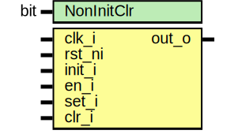

# Entity: keymgr_cfg_en

- **File**: keymgr_cfg_en.sv
## Diagram

## Description

 Copyright lowRISC contributors.
 Licensed under the Apache License, Version 2.0, see LICENSE for details.
 SPDX-License-Identifier: Apache-2.0

 Key manager CFGEN
 TBD This should be enhanced in the future to contain a shadow copy

## Generics

| Generic name | Type | Value | Description                                                            |
| ------------ | ---- | ----- | ---------------------------------------------------------------------- |
| NonInitClr   | bit  | 1'b1  |  controls whether clear has an effect on output value during non-init  |
## Ports

| Port name | Direction | Type | Description |
| --------- | --------- | ---- | ----------- |
| clk_i     | input     |      |             |
| rst_ni    | input     |      |             |
| init_i    | input     |      |             |
| en_i      | input     |      |             |
| set_i     | input     |      |             |
| clr_i     | input     |      |             |
| out_o     | output    |      |             |
## Signals

| Name    | Type  | Description                                                                         |
| ------- | ----- | ----------------------------------------------------------------------------------- |
| out_q   | logic |                                                                                     |
| init_q  | logic |                                                                                     |
| vld_clr | logic |                                                                                     |
| vld_set | logic |                                                                                     |
| vld_dis | logic |                                                                                     |
| out_clr | logic |  the same cycle where clear is asserted should already block future  configuration  |
## Processes
- unnamed: ( @(posedge clk_i or negedge rst_ni) )
  - **Type:** always_ff
- unnamed: ( @(posedge clk_i or negedge rst_ni) )
  - **Type:** always_ff
 **Description**
 clearing the configure enable always has higher priority than setting 
