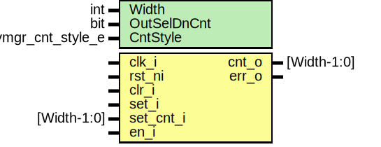

# Entity: keymgr_cnt

- **File**: keymgr_cnt.sv
## Diagram

## Description

 Copyright lowRISC contributors.
 Licensed under the Apache License, Version 2.0, see LICENSE for details.
 SPDX-License-Identifier: Apache-2.0

 Key manager interface to kmac

## Generics

| Generic name | Type               | Value    | Description          |
| ------------ | ------------------ | -------- | -------------------- |
| Width        | int                | 2        |                      |
| OutSelDnCnt  | bit                | 1        |  0 selects up count  |
| CntStyle     | keymgr_cnt_style_e | CrossCnt |                      |
## Ports

| Port name | Direction | Type        | Description |
| --------- | --------- | ----------- | ----------- |
| clk_i     | input     |             |             |
| rst_ni    | input     |             |             |
| clr_i     | input     |             |             |
| set_i     | input     |             |             |
| set_cnt_i | input     | [Width-1:0] |             |
| en_i      | input     |             |             |
| cnt_o     | output    | [Width-1:0] |             |
| err_o     | output    |             |             |
## Signals

| Name         | Type                             | Description |
| ------------ | -------------------------------- | ----------- |
| cmp_valid    | cmp_valid_e                      |             |
| up_cnt_d     | logic [CntCopies-1:0][Width-1:0] |             |
| up_cnt_d_buf | logic [CntCopies-1:0][Width-1:0] |             |
| up_cnt_q     | logic [CntCopies-1:0][Width-1:0] |             |
| max_val      | logic [Width-1:0]                |             |
| err          | logic                            |             |
## Constants

| Name      | Type | Value     | Description |
| --------- | ---- | --------- | ----------- |
| CntCopies | int  | undefined |             |
## Types

| Name        | Type                                                                                                                                          | Description |
| ----------- | --------------------------------------------------------------------------------------------------------------------------------------------- | ----------- |
| cmp_valid_e | enum logic [1:0] {      CmpInvalid = 2'b01,      CmpValid   = 2'b10   } |             |
## Processes
- unnamed: ( @(posedge clk_i or negedge rst_ni) )
  - **Type:** always_ff
