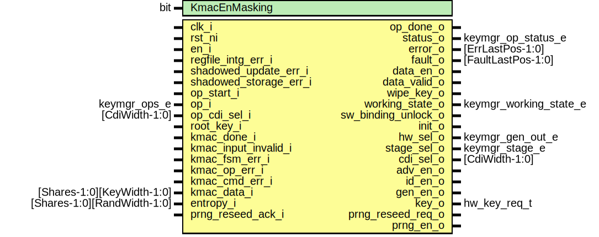

# Entity: keymgr_ctrl
## Diagram

## Description
Copyright lowRISC contributors.
 Licensed under the Apache License, Version 2.0, see LICENSE for details.
 SPDX-License-Identifier: Apache-2.0
 Key manager top level
 
## Ports
| Port name            | Direction | Type                        | Description                                       |
| -------------------- | --------- | --------------------------- | ------------------------------------------------- |
| clk_i                | input     |                             |                                                   |
| rst_ni               | input     |                             |                                                   |
| en_i                 | input     |                             | lifecycle enforcement                             |
| op_start_i           | input     |                             | Software interface                                |
| op_i                 | input     | keymgr_ops_e                |                                                   |
| op_done_o            | output    |                             |                                                   |
| status_o             | output    | keymgr_op_status_e          |                                                   |
| error_o              | output    | [ErrLastPos-1:0]            |                                                   |
| data_en_o            | output    |                             |                                                   |
| data_valid_o         | output    |                             |                                                   |
| wipe_key_o           | output    |                             |                                                   |
| working_state_o      | output    | keymgr_working_state_e      |                                                   |
| sw_binding_unlock_o  | output    |                             |                                                   |
| init_o               | output    |                             |                                                   |
| root_key_i           | input     |                             | Data input                                        |
| hw_sel_o             | output    | keymgr_gen_out_e            |                                                   |
| stage_sel_o          | output    | keymgr_stage_e              |                                                   |
| adv_en_o             | output    |                             | KMAC ctrl interface                               |
| id_en_o              | output    |                             |                                                   |
| gen_en_o             | output    |                             |                                                   |
| key_o                | output    | hw_key_req_t                |                                                   |
| load_key_o           | output    |                             |                                                   |
| kmac_done_i          | input     |                             |                                                   |
| kmac_input_invalid_i | input     |                             | asserted when selected data fails criteria check  |
| kmac_fsm_err_i       | input     |                             | asserted when kmac fsm reaches unexpected state   |
| kmac_op_err_i        | input     |                             | asserted when kmac itself reports an error        |
| kmac_cmd_err_i       | input     |                             | asserted when more than one command given to kmac |
| kmac_data_i          | input     | [Shares-1:0][KeyWidth-1:0]  |                                                   |
| entropy_i            | input     | [Shares-1:0][RandWidth-1:0] | prng control interface                            |
| prng_reseed_ack_i    | input     |                             |                                                   |
| prng_reseed_req_o    | output    |                             |                                                   |
| prng_en_o            | output    |                             |                                                   |
## Signals
| Name             | Type                                                    | Description                               |
| ---------------- | ------------------------------------------------------- | ----------------------------------------- |
| state_q          | keymgr_ctrl_state_e                                     |                                           |
| state_d          | keymgr_ctrl_state_e                                     |                                           |
| key_state_q      | logic [Shares-1:0][EntropyRounds-1:0][EntropyWidth-1:0] |                                           |
| key_state_d      | logic [Shares-1:0][EntropyRounds-1:0][EntropyWidth-1:0] |                                           |
| cnt              | logic [CntWidth-1:0]                                    |                                           |
| cnt_en           | logic                                                   |                                           |
| cnt_clr          | logic                                                   |                                           |
| key_update       | logic                                                   |                                           |
| data_update      | logic                                                   |                                           |
| kmac_out_valid   | logic                                                   |                                           |
| op_accept        | logic                                                   |                                           |
| invalid_op       | logic                                                   |                                           |
| advance_sel      | logic                                                   | disable is treated like an advanced call  |
| disable_sel      | logic                                                   |                                           |
| gen_id_sel       | logic                                                   |                                           |
| gen_out_sw_sel   | logic                                                   |                                           |
| gen_out_hw_sel   | logic                                                   |                                           |
| gen_out_sel      | logic                                                   |                                           |
| gen_sel          | logic                                                   |                                           |
| op_err           | logic                                                   | error types                               |
| fault_err        | logic                                                   |                                           |
| op_ack           | logic                                                   |                                           |
| root_key_valid_q | logic                                                   | root key valid sync                       |
| update_sel       | keymgr_key_update_e                                     |                                           |
| key_update_vld   | logic                                                   |                                           |
| in_disabled      | logic                                                   |                                           |
| next_state       | logic                                                   |                                           |
| invalid_state    | logic                                                   |                                           |
| data_st_d        | keymgr_ctrl_data_state_e                                |                                           |
| data_st_q        | keymgr_ctrl_data_state_e                                |                                           |
## Constants
| Name          | Type | Value                   | Description |
| ------------- | ---- | ----------------------- | ----------- |
| EntropyWidth  | int  | LfsrWidth / 2           |             |
| EntropyRounds | int  | KeyWidth / EntropyWidth |             |
| CntWidth      | int  | $clog2(EntropyRounds)   |             |
## Types
| Name                     | Type                                                                                                                                                                                                                                             | Description                                                                     |
| ------------------------ | ------------------------------------------------------------------------------------------------------------------------------------------------------------------------------------------------------------------------------------------------ | ------------------------------------------------------------------------------- |
| keymgr_ctrl_state_e      | enum logic [3:0] {     StCtrlReset,     StCtrlEntropyReseed,     StCtrlRandom,     StCtrlRootKey,     StCtrlInit,     StCtrlCreatorRootKey,     StCtrlOwnerIntKey,     StCtrlOwnerKey,     StCtrlDisabled,     StCtrlWipe,     StCtrlInvalid   } | Enumeration for working state                                                   |
| keymgr_ctrl_data_state_e | enum logic [1:0] {     StCtrlDataIdle,     StCtrlDataEn,     StCtrlDataDis,     StCtrlDataWait   }                                                                                                                                               | This is a separate data path from the FSM used to control the data_en_o output  |
## Processes
- unnamed: _( @(posedge clk_i or negedge rst_ni) )_
Unlike the key state, the working state can be safely reset.

**Description**
Unlike the key state, the working state can be safely reset.

- unnamed: _( @(posedge clk_i) )_
key state is intentionally not reset

**Description**
key state is intentionally not reset

- unnamed: _(  )_

- unnamed: _( @(posedge clk_i or negedge rst_ni) )_

- unnamed: _(  )_

- unnamed: _(  )_
always_comb
Current working state provided for software read
Certain states are collapsed for simplicity

**Description**
always_comb
Current working state provided for software read
Certain states are collapsed for simplicity

- unnamed: _(  )_

- unnamed: _( @(posedge clk_i or negedge rst_ni) )_

- unnamed: _(  )_
The below control path is used for modulating the datapath to sideload and sw keys.
This path is separate from the data_valid_o path, thus creating two separate attack points.
The data is only enabled when a non-advance operation is invoked.
When an advance operation is called, the data is disabled. It will stay disabled until an
entire completion sequence is seen (op_done_o assert -> start_i de-assertion).
When a generate operation is called, the data is enabled.  However, any indication of this
supposedly being an advance call will force the path to disable again.

**Description**
The below control path is used for modulating the datapath to sideload and sw keys.
This path is separate from the data_valid_o path, thus creating two separate attack points.
The data is only enabled when a non-advance operation is invoked.
When an advance operation is called, the data is disabled. It will stay disabled until an
entire completion sequence is seen (op_done_o assert -> start_i de-assertion).
When a generate operation is called, the data is enabled.  However, any indication of this
supposedly being an advance call will force the path to disable again.

## Instantiations
- u_key_valid_sync: prim_flop_2sync
