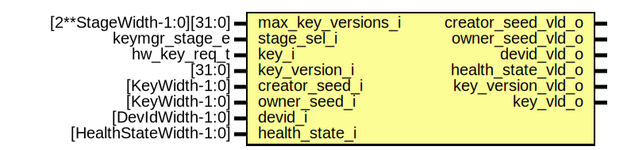

# Entity: keymgr_input_checks

## Diagram

## Description

Copyright lowRISC contributors.
 Licensed under the Apache License, Version 2.0, see LICENSE for details.
 SPDX-License-Identifier: Apache-2.0
 Key manager input checks
 Checks input data for errors
 We should also check for input validity
 
## Ports

| Port name          | Direction | Type                      | Description |
| ------------------ | --------- | ------------------------- | ----------- |
| max_key_versions_i | input     | [2**StageWidth-1:0][31:0] |             |
| stage_sel_i        | input     | keymgr_stage_e            |             |
| key_i              | input     | hw_key_req_t              |             |
| key_version_i      | input     | [31:0]                    |             |
| creator_seed_i     | input     | [KeyWidth-1:0]            |             |
| owner_seed_i       | input     | [KeyWidth-1:0]            |             |
| devid_i            | input     | [DevIdWidth-1:0]          |             |
| health_state_i     | input     | [HealthStateWidth-1:0]    |             |
| creator_seed_vld_o | output    |                           |             |
| owner_seed_vld_o   | output    |                           |             |
| devid_vld_o        | output    |                           |             |
| health_state_vld_o | output    |                           |             |
| key_version_vld_o  | output    |                           |             |
| key_vld_o          | output    |                           |             |
## Signals

| Name                | Type                 | Description         |
| ------------------- | -------------------- | ------------------- |
| cur_max_key_version | logic [31:0]         |                     |
| creator_seed_padded | logic [MaxWidth-1:0] | general data check  |
| owner_seed_padded   | logic [MaxWidth-1:0] | general data check  |
| devid_padded        | logic [MaxWidth-1:0] | general data check  |
| health_state_padded | logic [MaxWidth-1:0] | general data check  |
| unused_key_vld      | logic                | key check           |
| key_share0_padded   | logic [MaxWidth-1:0] |                     |
| key_share1_padded   | logic [MaxWidth-1:0] |                     |
## Instantiations

- u_creator_seed: prim_msb_extend
- u_owner_seed: prim_msb_extend
- u_devid: prim_msb_extend
- u_health_state: prim_msb_extend
- u_key_share0: prim_msb_extend
- u_key_share1: prim_msb_extend
